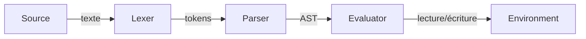
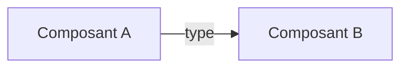

# Spec Driven Development (SDD) — Rédaction de spécifications

## Déclenchement

### Déclenchement primaire (active le skill directement)

- L'utilisateur demande explicitement une spec SDD, un SPEC.md, ou mentionne
  "Spec Driven Development" / "SDD" comme méthodologie.
- L'utilisateur demande de rédiger ou créer une spécification logicielle destinée
  à être implémentée par un agent IA.
- L'utilisateur demande de produire des exigences avec critères d'acceptation
  au format Soit/Quand/Alors (ou Given/When/Then dans un contexte de spec).
- L'utilisateur fournit des notes informelles et demande de les transformer
  en spécification structurée pour implémentation.

### Déclenchement secondaire (demande confirmation avant d'activer)

- L'utilisateur veut "formaliser" ou "structurer" un cahier des charges sans
  mentionner SDD → Demande : "Tu veux un cahier des charges classique ou une
  spec SDD exploitable par un agent IA ?"
- L'utilisateur veut documenter des règles métier sans contexte d'implémentation
  → Demande : "Ces règles doivent-elles aboutir à une implémentation logicielle ?"
- L'utilisateur mentionne "spécifier un comportement" ou "documenter des cas limites"
  sans contexte clair → Demande : "Tu veux intégrer ça dans une spec SDD complète
  ou juste documenter ce point isolément ?"

### Ne pas déclencher (anti-triggers)

- L'utilisateur demande de lire, analyser ou résumer une spec existante (qu'elle
  soit SDD ou non) sans intention de produire ou modifier un SPEC.md.
- L'utilisateur rédige de la documentation utilisateur, un README, ou un guide
  d'utilisation.
- L'utilisateur écrit des tests, même s'il mentionne des critères d'acceptation
  (les tests consomment la spec, ils ne la produisent pas).
- L'utilisateur pose une question technique sur une API ou un format sans vouloir
  produire de spécification.
- L'utilisateur demande une revue de code ou un audit technique.
- L'utilisateur décrit une grammaire BNF dans un contexte académique ou théorique
  sans projet d'implémentation logicielle.

## Philosophie

Une spec SDD n'est pas un cahier des charges classique destiné à être interprété par des humains.
C'est un **document de référence exécutable** : suffisamment précis pour qu'un agent IA produise
une implémentation conforme sans poser de questions, et suffisamment clair pour qu'un décideur
non technique comprenne ce qui sera livré.

Chaque phrase de la spec doit répondre à cette question : **"Un agent IA qui lit uniquement ce
document peut-il implémenter correctement ce comportement, sans deviner ?"** Si la réponse est
non, la spec est incomplète.

La spec est le contrat entre celui qui spécifie et celui qui implémente — qu'il soit humain ou IA.
Elle est le point de vérité unique du projet. Le code en découle et doit être traçable
jusqu'à la spec.

Les critères d'acceptation sont conçus pour être directement convertibles en tests automatisés.
Un agent IA peut générer une suite de tests à partir de la seule lecture des CA et CL, sans
information supplémentaire. Cette propriété est intentionnelle : si un critère d'acceptation
n'est pas transformable en test, il est trop vague — reformule-le.

## Identification du skill dans les réponses

Chaque réponse produite sous ce skill commence par une barre de progression
indiquant le skill actif, l'étape en cours et l'avancement. Cette ligne est
obligatoire, sans exception.

**Format :**

```
🏗️ skill:sdd-spec-write vX.Y.Z · [Étape] [barre] sous-étape N/T — [Nom]
```

où `vX.Y.Z` est la version indiquée dans l'en-tête du skill.

**Règles de la barre de progression :**

- Caractère plein : `█` — Caractère vide : `░`
- Largeur fixe : 3 caractères pour Cadrage (3 sous-étapes), variable pour
  Exigences (1 caractère par domaine fonctionnel), 3 caractères pour Limites.
- La barre reflète la sous-étape en cours (incluse).

**Découpage en sous-étapes :**

| Étape | Sous-étapes | Total |
|-------|-------------|-------|
| Cadrage | 1. Questions obligatoires · 2. Questions conditionnelles · 3. Rédaction & validation sections 1-5 | 3 |
| Exigences | 1 sous-étape par domaine fonctionnel identifié (nombre variable, noté N/M où M = nombre de domaines) | M |
| Limites | 1. Niveaux de support · 2. Hors périmètre · 3. Rédaction finale & passage de relais | 3 |

**Exemples :**

```
🏗️ skill:sdd-spec-write v1.0.0 · Cadrage [█░░] 1/3 — Questions obligatoires
🏗️ skill:sdd-spec-write v1.0.0 · Cadrage [██░] 2/3 — Questions conditionnelles
🏗️ skill:sdd-spec-write v1.0.0 · Cadrage [███] 3/3 — Rédaction & validation
🏗️ skill:sdd-spec-write v1.0.0 · Exigences [██░░░] domaine 2/5 — Authentification
🏗️ skill:sdd-spec-write v1.0.0 · Exigences [████░] domaine 4/5 — Export
🏗️ skill:sdd-spec-write v1.0.0 · Limites [█░░] 1/3 — Niveaux de support
🏗️ skill:sdd-spec-write v1.0.0 · Limites [██░] 2/3 — Hors périmètre
🏗️ skill:sdd-spec-write v1.0.0 · Limites [███] 3/3 — Rédaction finale & passage de relais
```

**Cas particulier — Mise à jour d'une spec existante :**

```
🏗️ skill:sdd-spec-write v1.0.0 · Mise à jour [██░] 2/3 — Application des modifications
```

Sous-étapes de mise à jour : 1. Lecture & périmètre · 2. Application ·
3. Changelog & impacts.

Si plusieurs messages se succèdent au sein de la même sous-étape (ex :
clarifications, allers-retours), la barre reste identique. Elle avance
uniquement au passage à la sous-étape suivante.

## Processus de rédaction

La rédaction d'une spec SDD est un dialogue, pas une génération en un coup. Claude guide
l'utilisateur à travers trois étapes successives, en posant des questions ciblées pour
collecter l'information nécessaire avant de rédiger chaque section. L'objectif est
d'extraire la connaissance métier que l'utilisateur possède et que Claude ne peut pas
deviner.

### Étape 1 — Cadrage

Avant de rédiger quoi que ce soit, pose ces questions pour remplir les sections
Contexte, Phases, Architecture et Documents de référence. Pose-les par petits groupes
(3 à 5 questions maximum à la fois) pour ne pas submerger l'utilisateur.

**Questions obligatoires :**

1. Que fait le logiciel en une phrase ?
2. Quel problème résout-il, et pour qui ?
3. Y a-t-il des contraintes techniques imposées (langage, plateforme, dépendances) ?
4. Y a-t-il des contraintes réglementaires ou normatives (RGPD, HDS, certification) ?
5. Le projet se découpe-t-il naturellement en phases ou étapes de livraison ?

**Questions conditionnelles** (pose-les si le contexte le suggère) :

- Le logiciel interagit-il avec un système existant, du hardware, ou un environnement
  non contrôlé ? → Déclenche la section Niveaux de support.
- Le projet implique-t-il un langage, une syntaxe, un protocole ou un format de données
  à parser ? → Déclenche la production d'un GRAMMAR.md.
- Y a-t-il un cadre réglementaire dont certaines obligations se traduisent en comportements
  implémentables ? → Déclenche des exigences spécifiques.
- Le projet a-t-il plusieurs composants distincts qui interagissent entre eux
  (ex : un parser et un évaluateur, un frontend et un backend, un CLI et une
  bibliothèque) ? → Déclenche le tableau de composants et le schéma d'interactions
  dans la section Architecture.
- Y a-t-il des contraintes de performance, de sécurité, de fiabilité ou de
  portabilité ? → Déclenche la section Exigences non-fonctionnelles.

Quand les réponses sont suffisantes, rédige les sections 1 à 5 du SPEC.md et présente-les
à l'utilisateur pour validation avant de poursuivre.

### Étape 2 — Exigences

À partir du cadrage validé, identifie les domaines fonctionnels du projet et propose-les
à l'utilisateur : "Je vois N domaines fonctionnels : [liste]. On commence par lequel ?"

Pour chaque domaine, procède ainsi :

1. **Propose** un lot d'exigences (3 à 5) avec leurs critères d'acceptation et cas limites.
2. **Demande validation** : "Tu valides, tu corriges, tu complètes ?"
3. **Intègre** les retours et passe au lot suivant.

Ne cherche pas l'exhaustivité dès le premier passage. Il vaut mieux couvrir les exigences
principales de chaque domaine, puis revenir affiner, plutôt que de s'enliser sur un seul
domaine.

Si l'utilisateur fournit des informations détaillées ou techniques que tu ne maîtrises pas
entièrement, demande des précisions plutôt que de deviner. Une exigence fausse est pire
qu'une exigence absente.

### Étape 3 — Limites et périmètre

Une fois les exigences principales posées, aborde explicitement :

1. **Niveaux de support** (si applicable) : "Ce système interagit avec [X]. Pour chaque
   fonctionnalité de l'original, on doit décider : supporté, ignoré ou erreur. Passons-les
   en revue."
2. **Hors périmètre** : "Qu'est-ce que le logiciel ne fait explicitement pas ? Quelles
   demandes prévisibles des utilisateurs doivent être refusées ?"

### Format de livraison

Produis chaque document comme un fichier téléchargeable, pas comme du texte dans
le chat. Le chat sert au dialogue (questions, validations, arbitrages). Les fichiers
portent le contenu livrable.

**Création initiale :**
1. Rédige le SPEC.md au fil des étapes. À chaque validation de section par
   l'utilisateur, mets à jour le fichier.
2. Si un GRAMMAR.md est nécessaire, ne le produis qu'après validation de la
   section Exigences du SPEC.md — les exigences révèlent souvent des besoins
   grammaticaux non anticipés au cadrage.
3. Livre chaque document séparément. Ne fusionne pas GRAMMAR.md ou DATA-MODEL.md
   dans le SPEC.md.

**Mise à jour :**
1. Produis le SPEC.md modifié complet, pas un diff. Un agent IA qui reçoit la spec
   doit pouvoir l'utiliser sans reconstituer les pièces.
2. Si la modification impacte un document de référence (GRAMMAR.md, DATA-MODEL.md),
   livre la version mise à jour de ce document dans le même échange.

**Nommage :**
- Document principal : `SPEC.md`
- Grammaire formelle : `GRAMMAR.md`
- Schéma de données : `DATA-MODEL.md`
- Tout document complémentaire : référencé dans la section Documents de référence
  avec son nom exact.

Ne préfixe pas les noms de fichiers avec le nom du projet ou une date — le
versioning est porté par le champ Version de l'en-tête et le changelog, pas par
le nom de fichier.

### Passage de relais

Quand les trois étapes sont terminées et que le SPEC.md contient un cadrage validé,
des exigences couvrant les domaines principaux, et des limites documentées, informe
l'utilisateur que le document est suffisamment structuré pour qu'il puisse le compléter
et l'enrichir lui-même.

Dis-le explicitement, par exemple : "Le SPEC.md a maintenant une structure solide avec
[N] exigences couvrant [domaines]. Tu peux désormais le compléter directement — ajouter
des exigences, affiner les critères d'acceptation, préciser les cas limites — en suivant
le format et les conventions établis. Le glossaire et la structure des identifiants
(EXG/ENF/CA/CL) te guident."

L'objectif du skill n'est pas de rédiger 100% de la spec. C'est d'amorcer le document
avec suffisamment de structure, de rigueur et d'exemples concrets pour que l'utilisateur
soit autonome pour la suite. La spec est un document vivant qui s'enrichit au fil du
projet.

Avant de remettre la spec à l'utilisateur, vérifie chaque point de la checklist et signale les manques.

### Mise à jour d'une spec existante

Quand l'utilisateur fournit un SPEC.md existant et demande une modification, Claude
ne repart pas de zéro. Il opère en mode chirurgical : modifier ce qui doit l'être,
préserver tout le reste.

#### Identifier le type de modification

Avant toute modification, identifie et confirme avec l'utilisateur le type d'opération :

| Type | Exemples | Impact |
|---|---|---|
| **Ajout** | Nouvelle exigence, nouveau domaine fonctionnel, nouvelle phase | Insertion sans modifier l'existant |
| **Modification** | Reformulation d'un CA, ajout d'un cas limite, changement de comportement | Mise à jour ciblée d'éléments existants |
| **Dépréciation** | Une exigence n'est plus pertinente mais doit rester traçable | Marquage, pas suppression |
| **Restructuration** | Découpage d'une exigence en deux, fusion de domaines, réorganisation des phases | Modification structurelle avec renumérotation potentielle |

#### Règles de gestion des identifiants

Les identifiants sont le squelette de la traçabilité. Les corrompre, c'est casser
le lien entre spec et code.

**Ajout d'exigences :**
- Numérote à la suite du dernier identifiant existant, jamais dans les trous.
- Si la dernière exigence est EXG-047, la suivante est EXG-048, même si EXG-012
  a été dépréciée.

**Dépréciation d'exigences :**
- Ne supprime jamais une exigence du document. Marque-la comme dépréciée :
```
#### ~~EXG-012 : Validation synchrone des entrées~~ [DÉPRÉCIÉE v2.1]

**Remplacée par :** EXG-048, EXG-049
**Raison :** Découpage en validation syntaxique (EXG-048) et validation sémantique
(EXG-049) suite à [justification métier].
```

- Les critères d'acceptation et cas limites associés sont conservés barrés,
  pour historique.
- Le code qui référençait EXG-012 doit être mis à jour vers les nouveaux
  identifiants — mentionne-le à l'utilisateur.

**Modification de critères d'acceptation :**
- Si un CA est reformulé sans changer le comportement testé : modifie en place,
  note le changement dans le changelog.
- Si un CA change le comportement attendu : déprécie l'ancien, crée un nouveau CA
  avec le numéro suivant disponible.

**Ajout de cas limites a posteriori :**
- Numérote à la suite : si CL-007-03 existe, le suivant est CL-007-04.
- Signale à l'utilisateur que l'implémentation existante de EXG-007 doit être
  revue pour couvrir ce nouveau cas.

#### Changelog

Toute mise à jour de la spec incrémente la version et ajoute une entrée au changelog,
inséré entre l'en-tête (section 1) et le contexte (section 2) :
```markdown
## Changelog

| Version | Date | Auteur | Modifications |
|---|---|---|---|
| 2.1 | 2025-07-15 | [Auteur] | Ajout EXG-048, EXG-049. Dépréciation EXG-012. Ajout CL-007-04. |
| 2.0 | 2025-06-01 | [Auteur] | Ajout Phase 3. Restructuration domaine "Export". |
| 1.0 | 2025-04-10 | [Auteur] | Version initiale. |
```

**Convention de versioning :**
- **Majeure (X.0)** : ajout ou retrait d'une phase, restructuration significative
  du périmètre.
- **Mineure (X.Y)** : ajout, modification ou dépréciation d'exigences à l'intérieur
  du périmètre existant.

L'objectif n'est pas de reproduire git — c'est de donner à un agent IA qui reçoit
la spec v2.1 une vision claire de ce qui a changé depuis la version qu'il a peut-être
déjà implémentée.

#### Workflow de mise à jour

Quand l'utilisateur demande de modifier une spec existante, suis ce processus :

1. **Lis la spec entière** avant de toucher quoi que ce soit. Identifie la version
   actuelle, le dernier identifiant utilisé, et la structure existante.
2. **Confirme le périmètre** : "Tu veux [résumé de la modification]. Ça impacte
   [exigences/sections concernées]. Je confirme avant de modifier."
3. **Applique les modifications** en respectant les règles d'identifiants ci-dessus.
4. **Mets à jour le changelog** et incrémente la version.
5. **Signale les impacts** : toute exigence modifiée ou dépréciée implique une revue
   de l'implémentation correspondante. Liste-les explicitement :
   "Exigences impactées côté code : EXG-012 (dépréciée → retirer), EXG-048/049
   (nouvelles → implémenter), CL-007-04 (nouveau cas limite → tester)."

## Glossaire SDD

Reproduis ce glossaire en dernière section de chaque SPEC.md produite.
Ces termes sont imposés par la méthodologie SDD. Ils constituent le vocabulaire commun
entre profils techniques et décideurs. Ne les remplace pas par des synonymes.

| Terme | Définition |
|---|---|
| **Spec** | Document qui décrit exactement ce que le logiciel doit faire. Point de vérité unique du projet. |
| **Exigence** | Comportement précis que le logiciel doit respecter. Une exigence est atomique, vérifiable et non ambiguë. |
| **Critère d'acceptation** | Condition vérifiable prouvant qu'une exigence est satisfaite. Formulé en Soit/Quand/Alors. |
| **Cas limite** | Situation extrême ou inattendue dont le comportement doit être explicitement défini dans la spec. |
| **Hors périmètre** | Ce que le logiciel ne fait explicitement pas. Aussi important que ce qu'il fait. |
| **Niveau de support** | Degré de prise en charge d'une fonctionnalité : **Supporté** (implémenté), **Ignoré** (no-op silencieux), **Erreur** (rejeté avec message explicite). |
| **Grammaire** | Description formelle de la syntaxe acceptée, en notation BNF quand le domaine s'y prête. |
| **Traçabilité** | Lien vérifiable entre une exigence et son implémentation. Chaque exigence a un identifiant unique référencé dans le code. |
| **Reproductibilité** | Capacité à obtenir le même résultat à partir de la même spec, quel que soit l'agent qui implémente. |
| **Phase** | Étape du projet avec un périmètre et un livrable définis. |
| **Critique** | Priorité d'exigence : le logiciel ne fonctionne pas sans. Bloque la livraison. |
| **Important** | Priorité d'exigence : nécessaire en production, mais non bloquant pour un premier livrable. |
| **Souhaité** | Priorité d'exigence : amélioration reportable sans compromettre la viabilité. |

## Structure d'une SPEC.md

Produis le document SPEC.md en respectant cet ordre de sections.

### 1. En-tête

```markdown
# [Nom du projet] — Spécification SDD

Version : [X.Y]
Date : [YYYY-MM-DD]
Auteur : [Nom]
Statut : [Brouillon | En revue | Validée]
```

### 2. Changelog (à partir de la v1.1)

Le changelog est inséré entre l'en-tête et le contexte. Il n'est pas nécessaire en v1.0
mais son emplacement doit être réservé. Dès la première mise à jour, il apparaît ici.
Voir la section "Mise à jour d'une spec existante" pour le format et les conventions.

### 3. Contexte et objectifs

Décris en quelques paragraphes :
- **Ce que le projet fait** — en une phrase.
- **Pourquoi il existe** — le problème résolu ou le besoin couvert.
- **Pour qui** — l'utilisateur cible.
- **Contraintes structurantes** — techniques, réglementaires, de performance.

Cette section donne à l'agent IA le cadre mental pour prendre les bonnes décisions
quand la spec est silencieuse sur un détail.

### 4. Phases du projet

Découpe le projet en phases séquentielles. Chaque phase a :
- Un nom court.
- Un périmètre (ce qui est inclus).
- Un livrable vérifiable.
- Des dépendances vers les phases précédentes.

Les phases servent à prioriser le travail et à limiter le périmètre de chaque cycle
d'implémentation. Un agent IA qui reçoit "implémente la Phase 1" doit savoir exactement
quoi faire et quoi ne pas faire.

### 5. Architecture

Décris les composants principaux du système à un niveau suffisant pour qu'un agent IA
comprenne la topologie du projet sans que ce soit un dictât d'implémentation.

Pour chaque composant, documente :

- **Nom** — identifiant court utilisé dans le reste de la spec.
- **Responsabilité** — ce qu'il fait, en une à deux phrases. Applique le même test
  que pour les exigences : si tu utilises "et" pour relier deux responsabilités
  distinctes, c'est probablement deux composants.
- **Interfaces exposées** — ce que les autres composants peuvent appeler ou consommer
  (API, événements, fichiers, flux). Pas besoin de signatures détaillées, mais les
  noms et le type d'échange (synchrone/asynchrone, lecture/écriture) doivent être clairs.
- **Dépendances** — quels autres composants ou services externes il consomme.

Présente les composants sous forme de tableau, puis illustre leurs interactions
avec un schéma textuel (Mermaid recommandé, ASCII accepté).

Exemple pour un interpréteur de langage :

| Composant | Responsabilité | Interfaces exposées | Dépendances |
|---|---|---|---|
| Parser | Transforme le code source en AST | `parse(source) → AST` | Lexer |
| Lexer | Découpe le code source en tokens | `tokenize(source) → Token[]` | — |
| Evaluator | Exécute un AST et produit un résultat | `eval(ast, env) → Value` | Parser, Environment |
| Environment | Stocke les variables et leur portée | `get(name)`, `set(name, value)` | — |


Ce que cette section est : un guide de découpage qui aide l'agent IA à organiser
le code en modules cohérents et à comprendre les flux de données entre eux.

Ce que cette section n'est pas : une architecture technique imposée. L'agent reste
libre de l'organisation interne de chaque composant (classes, fonctions, modules,
fichiers) tant qu'il respecte les responsabilités décrites et les exigences
fonctionnelles.

Quand le projet est simple (un seul script, un CLI linéaire), cette section peut
se réduire à un paragraphe décrivant le flux de traitement. Ne force pas un
découpage en composants quand il n'y en a pas.

### 6. Documents de référence (si applicable)

Quand le projet nécessite des documents complémentaires (grammaire formelle, schémas
de données, spécifications de protocole), référence-les ici avec leur chemin relatif
et une description de leur contenu.

```markdown
| Document | Description |
|---|---|
| GRAMMAR.md | Grammaire formelle BNF du langage / format / protocole. |
| DATA-MODEL.md | Schéma des structures de données. |
```

Ces documents font partie intégrante de la spec mais sont maintenus séparément
pour ne pas alourdir le SPEC.md. L'agent IA doit les consulter quand une exigence
y fait référence.

### 7. Exigences fonctionnelles

C'est le cœur de la spec. Chaque exigence suit ce format :

```markdown
#### EXG-XXX : [Titre court]

**Priorité :** [Critique | Important | Souhaité]

**Description :** [Ce que le logiciel doit faire, en une à trois phrases.]

**Critères d'acceptation :**

- **CA-XXX-01 :** Soit [contexte initial], Quand [action], Alors [résultat attendu].
- **CA-XXX-02 :** Soit [contexte initial], Quand [action], Alors [résultat attendu].

**Cas limites :**

- **CL-XXX-01 :** [Description de la situation extrême] → [Comportement attendu].
```

Règles de rédaction des exigences :

- **Atomicité.** Une exigence = un comportement. Si tu utilises "et" pour relier deux
  comportements distincts, sépare en deux exigences. Un agent IA implémente
  une exigence à la fois.

- **Vérifiabilité.** Chaque exigence doit avoir au moins un critère d'acceptation.
  Si tu ne peux pas écrire le critère, l'exigence est trop vague — reformule-la.

- **Précision des valeurs.** Ne dis pas "le système doit répondre rapidement".
  Dis "le système répond en moins de 200ms pour une entrée de 1000 caractères".
  Un agent IA ne sait pas interpréter "rapidement".

- **Comportement, pas implémentation.** Décris ce qui doit se passer, pas comment
  le coder. "L'expression `2 + 3 * 4` retourne `14`" est une exigence.
  "Utilise un arbre syntaxique abstrait" est un choix d'implémentation.

- **Identifiants uniques.** Chaque exigence (EXG), critère (CA) et cas limite (CL)
  a un identifiant unique. Ces identifiants sont référencés dans le code
  pour assurer la traçabilité.

- **Priorisation.** Chaque exigence porte une priorité qui guide l'ordre
  d'implémentation :
  - **Critique** — Le logiciel ne fonctionne pas sans. Bloque la livraison
    de la phase concernée.
  - **Important** — Nécessaire pour une utilisation normale. Peut être livré
    dans un second temps si les contraintes l'imposent, mais doit être présent
    avant mise en production.
  - **Souhaité** — Améliore l'expérience ou couvre un cas d'usage secondaire.
    Peut être reporté sans compromettre la viabilité du livrable.

  En cas de doute entre deux niveaux, choisis le plus élevé et demande
  confirmation à l'utilisateur. Une exigence sous-priorisée qui s'avère
  critique coûte plus cher qu'une exigence sur-priorisée qu'on redescend.

  Un agent IA qui reçoit "implémente la Phase 1" traite les exigences Critiques
  en premier, puis les Importantes, puis les Souhaitées. Si une contrainte de
  temps force un arbitrage, seules les Souhaitées peuvent être reportées
  sans validation explicite.

- **Référencement de la grammaire.** Quand une exigence dépend d'une production
  définie dans le GRAMMAR.md, référence-la explicitement dans la description :
  "Voir GRAMMAR.md § `<production>`". Un agent IA ne doit pas avoir à deviner
  quelles règles grammaticales sous-tendent un comportement.

### 8. Exigences non-fonctionnelles

Les exigences non-fonctionnelles décrivent comment le logiciel se comporte, pas ce
qu'il fait. Elles s'appliquent transversalement à l'ensemble du système ou à un
composant spécifique.

Chaque exigence non-fonctionnelle suit le même format que les exigences fonctionnelles
(identifiant, priorité, description, critères d'acceptation, cas limites) et obéit aux
mêmes règles de rédaction — notamment la précision des valeurs. "Le système doit être
performant" n'est pas une exigence. "Le système répond en moins de 200ms au 95e
percentile pour une entrée de 1000 caractères" en est une.

Les domaines à explorer avec l'utilisateur :

- **Performance** — temps de réponse, débit, consommation mémoire, taille des entrées
  supportées. Précise les conditions de mesure (volume de données, charge concurrente,
  matériel cible).
- **Sécurité** — authentification, autorisation, chiffrement, validation des entrées,
  gestion des secrets. Inclut les obligations réglementaires identifiées au cadrage
  (RGPD, HDS, etc.).
- **Fiabilité** — comportement en cas de panne, stratégie de reprise, tolérance aux
  erreurs, intégrité des données.
- **Scalabilité** — limites de dimensionnement connues, comportement au-delà de ces
  limites.
- **Observabilité** — logs, métriques, traces. Ce qui doit être observable pour
  diagnostiquer un problème en production.
- **Accessibilité** — si applicable, conformité WCAG ou équivalent.
- **Portabilité** — systèmes d'exploitation, versions de runtime, environnements
  cibles.

Ne traite pas ces domaines comme une checklist exhaustive à remplir pour chaque projet.
Certains projets n'ont aucune exigence de scalabilité. D'autres n'ont pas d'interface
utilisateur et l'accessibilité est sans objet. Documente ce qui est pertinent, marque
explicitement en Hors périmètre ce qui ne l'est pas.

Les identifiants suivent la même convention, avec un préfixe distinct :

```
ENF-001      Exigence non-fonctionnelle numéro 1
CA-NF-001-01 Premier critère d'acceptation de ENF-001
CL-NF-001-01 Premier cas limite de ENF-001
```

Exemple :

```markdown
#### ENF-001 : Temps de réponse du parser

**Priorité :** Critique

**Description :** Le parser produit un AST en temps proportionnel à la taille
de l'entrée, sans dépassement de seuil pour les entrées typiques.

**Critères d'acceptation :**

- **CA-NF-001-01 :** Soit un fichier source de 1000 lignes, Quand le parser
  est invoqué, Alors l'AST est produit en moins de 100ms sur le matériel cible.
- **CA-NF-001-02 :** Soit un fichier source de 10 000 lignes, Quand le parser
  est invoqué, Alors l'AST est produit en moins de 2s sur le matériel cible.

**Cas limites :**

- **CL-NF-001-01 :** Fichier source vide (0 lignes) → Le parser retourne un AST
  vide en moins de 1ms sans erreur.
- **CL-NF-001-02 :** Fichier source dépassant 100 000 lignes → Le parser retourne
  une erreur explicite plutôt que de consommer la mémoire disponible.
```

### 9. Niveaux de support

Quand le projet interagit avec un environnement externe (hardware, API, système existant),
certaines fonctionnalités ne peuvent pas être entièrement reproduites. Documente
explicitement trois catégories :

```markdown
#### Supporté
| Fonctionnalité | Comportement | Exigence liée |
|---|---|---|
| [Fonction X] | [Comportement fidèle à l'original] | EXG-XXX |

#### Ignoré (no-op silencieux)
| Fonctionnalité | Raison |
|---|---|
| [Fonction Y] | [Pourquoi elle est ignorée sans erreur] |

#### Erreur explicite
| Fonctionnalité | Message d'erreur | Raison |
|---|---|---|
| [Fonction Z] | "[Message exact]" | [Pourquoi elle est rejetée] |
```

Cette section est critique pour la reproductibilité. Sans elle, chaque agent IA
inventerait son propre comportement face à une fonctionnalité non supportée.

### 10. Hors périmètre

Liste explicitement ce que le projet ne fait pas. Chaque exclusion en une phrase.

Cette section empêche un agent IA de sur-interpréter la spec et d'implémenter
des fonctionnalités non demandées. Elle est aussi utile pour les décideurs :
elle fixe les limites de l'engagement.

### 11. Glossaire projet

Définis ici les termes spécifiques au domaine du projet. Chaque terme métier, technique ou
acronyme utilisé dans la spec doit avoir une entrée. Un agent IA ne doit jamais avoir à
deviner le sens d'un terme.

Exemple :
```markdown
| Terme | Définition |
|---|---|
| Mode immédiat | Exécution d'une instruction sans numéro de ligne, directement au prompt. |
| Mode programme | Stockage d'une instruction précédée d'un numéro de ligne pour exécution ultérieure via RUN. |
```

### 12. Glossaire SDD

Reproduis le glossaire SDD défini plus haut dans ce skill, tel quel. Il est commun à tous
les projets SDD et constitue le vocabulaire de référence de la méthodologie.

## Directives de rédaction

### Langue et registre

Rédige dans la langue de l'utilisateur. Utilise un registre professionnel accessible :
compréhensible par un directeur métier, exploitable par un développeur ou un agent IA.
Évite le jargon technique non défini dans le glossaire projet.

### Critères d'acceptation — format Soit/Quand/Alors

Chaque critère d'acceptation utilise strictement le format Soit/Quand/Alors :

- **Soit** décrit l'état initial du système (contexte, données en place).
- **Quand** décrit l'action unique déclenchée.
- **Alors** décrit le résultat observable et vérifiable.

Exemple concret :
```
Soit un programme contenant "10 PRINT 42",
Quand l'utilisateur exécute RUN,
Alors la sortie affiche "42" suivi d'un retour à la ligne.
```

Chaque clause doit être suffisamment précise pour être vérifiable
sans interprétation. Si le "Alors" contient "devrait fonctionner correctement", le critère
est inutile — reformule avec une valeur observable.

### Cas limites — les trouver systématiquement

Pour chaque exigence, explore ces axes pour identifier les cas limites :

- **Valeurs frontières** : zéro, un, maximum, juste au-dessus du maximum.
- **Types inattendus** : chaîne vide, null, type incorrect.
- **Séquences** : premier appel, appels répétés, ordre inversé.
- **Concurrence** : si applicable, accès simultanés.
- **Environnement** : ressources manquantes, permissions insuffisantes.

Un cas limite non documenté est un cas limite que chaque agent implémentera différemment.
C'est la source principale d'écarts entre implémentations.

### Grammaire formelle — document externe

Quand le projet implique un langage, un protocole, un format de données ou toute syntaxe
structurée, produis un document `GRAMMAR.md` séparé et référence-le dans la section
"Documents de référence" du SPEC.md.

Le GRAMMAR.md contient la grammaire en notation BNF avec ces conventions :
```
Production     ::= Terme { Terme }
Terme          ::= 'littéral' | NonTerminal | Terme '|' Terme
Optionnel      ::= '[' Production ']'
Répétition     ::= '{' Production '}'
Groupement     ::= '(' Production ')'
```

Documente chaque production avec un commentaire si son intention n'est pas évidente.
Un agent IA doit pouvoir implémenter un parser directement à partir de cette grammaire.

Produis un GRAMMAR.md quand le projet implique :
- Un langage de programmation ou un DSL.
- Un format de données structuré (au-delà de JSON/XML standard).
- Un protocole de communication avec une syntaxe définie.
- Des expressions utilisateur à parser (formules, requêtes, commandes).

Ne force pas une grammaire BNF quand le projet est purement CRUD ou API REST —
dans ce cas, les exigences fonctionnelles et les schémas de données suffisent.

### Niveaux de support — quand les utiliser

Utilise la section Niveaux de support quand le projet :
- Émule ou reproduit un système existant (interpréteur, émulateur, migration).
- Interagit avec du hardware ou un environnement non contrôlé.
- Implémente un sous-ensemble d'un standard ou d'un protocole.

Chaque fonctionnalité de l'original doit apparaître dans exactement une des trois
catégories. Aucune ne doit rester implicite.

### Identifiants — convention de nommage

```
EXG-001       Exigence fonctionnelle numéro 1
CA-001-01     Premier critère d'acceptation de l'exigence 1
CL-001-01     Premier cas limite de l'exigence 1
ENF-001       Exigence non-fonctionnelle numéro 1
CA-NF-001-01  Premier critère d'acceptation de ENF-001
CL-NF-001-01  Premier cas limite de ENF-001
```

Numérote séquentiellement. Ne réutilise jamais un identifiant supprimé.
Les identifiants sont référencés dans le code (commentaires) pour assurer la traçabilité.

### Complétude — checklist avant livraison

Avant de considérer la spec comme terminée, vérifie :

- [ ] Le glossaire SDD est présent et intact.
- [ ] Le glossaire projet couvre tous les termes spécifiques utilisés.
- [ ] Chaque exigence (EXG et ENF) a au moins un critère d'acceptation.
- [ ] Chaque critère d'acceptation est au format Soit/Quand/Alors.
- [ ] Les cas limites sont documentés pour chaque exigence.
- [ ] Les exigences qui dépendent de la grammaire référencent les productions concernées.
- [ ] La section Hors périmètre est renseignée.
- [ ] Les niveaux de support sont documentés (si applicable).
- [ ] Les exigences non-fonctionnelles pertinentes sont documentées.
- [ ] Un agent IA pourrait implémenter chaque exigence sans poser de question.

**Utilisation du template :**

Utilise le template SPEC.md défini en annexe de ce skill comme point de départ.
Ne génère jamais la structure du SPEC.md de mémoire — le template est la référence.
Remplis les sections au fil du dialogue, supprime les sections marquées comme
optionnelles si elles ne s'appliquent pas, et retire les commentaires HTML
avant livraison.

## Annexe — Template SPEC.md
````markdown
# [Nom du projet] — Spécification SDD

Version : 1.0
Date : [YYYY-MM-DD]
Auteur : [Nom]
Statut : Brouillon

<!-- CHANGELOG — Ne pas inclure en v1.0. Décommenter à partir de la v1.1.
## Changelog

| Version | Date | Auteur | Modifications |
|---|---|---|---|
| 1.1 | YYYY-MM-DD | [Auteur] | [Description des modifications] |
| 1.0 | YYYY-MM-DD | [Auteur] | Version initiale. |
-->

## Contexte et objectifs

**Ce que le projet fait :** [Une phrase.]

**Pourquoi il existe :** [Le problème résolu ou le besoin couvert.]

**Pour qui :** [L'utilisateur cible.]

**Contraintes structurantes :** [Techniques, réglementaires, de performance. Supprimer si aucune.]

## Phases du projet

### Phase 1 — [Nom court]

- **Périmètre :** [Ce qui est inclus.]
- **Livrable :** [Livrable vérifiable.]
- **Dépendances :** Aucune.

<!-- Ajouter des phases supplémentaires au besoin. Chaque phase a un nom, un périmètre,
un livrable vérifiable et des dépendances vers les phases précédentes. -->

## Architecture

<!-- PROJET SIMPLE : remplacer le tableau et le schéma par un paragraphe décrivant
le flux de traitement. Ne pas forcer un découpage en composants quand il n'y en a pas. -->

| Composant | Responsabilité | Interfaces exposées | Dépendances |
|---|---|---|---|
| [Nom] | [Une à deux phrases. Si "et" relie deux responsabilités distinctes, séparer en deux composants.] | [Noms et type d'échange : synchrone/asynchrone, lecture/écriture.] | [Composants ou services externes consommés, ou —] |


## Documents de référence

<!-- Supprimer cette section si le projet ne nécessite aucun document complémentaire. -->

| Document | Description |
|---|---|
| GRAMMAR.md | [Description du contenu.] |
| DATA-MODEL.md | [Description du contenu.] |

## Exigences fonctionnelles

<!-- Chaque exigence suit ce format exact. Ne pas modifier la structure.
     Numéroter séquentiellement. Ne jamais réutiliser un identifiant supprimé.
     Référencer la grammaire si applicable : "Voir GRAMMAR.md § <production>". -->

#### EXG-001 : [Titre court]

**Priorité :** [Critique | Important | Souhaité]

**Description :** [Ce que le logiciel doit faire, en une à trois phrases.]

**Critères d'acceptation :**

- **CA-001-01 :** Soit [contexte initial], Quand [action], Alors [résultat attendu].

**Cas limites :**

- **CL-001-01 :** [Description de la situation extrême] → [Comportement attendu].

## Exigences non-fonctionnelles

<!-- Mêmes règles que les exigences fonctionnelles. Préfixe ENF.
     Domaines à considérer : Performance, Sécurité, Fiabilité, Scalabilité,
     Observabilité, Accessibilité, Portabilité.
     Ne documenter que ce qui est pertinent. Marquer le reste en Hors périmètre.
     Supprimer cette section si aucune ENF n'est identifiée. -->

#### ENF-001 : [Titre court]

**Priorité :** [Critique | Important | Souhaité]

**Description :** [Comment le logiciel se comporte, avec des valeurs mesurables.]

**Critères d'acceptation :**

- **CA-NF-001-01 :** Soit [contexte initial], Quand [action], Alors [résultat attendu avec valeur mesurable].

**Cas limites :**

- **CL-NF-001-01 :** [Description de la situation extrême] → [Comportement attendu].

## Niveaux de support

<!-- Supprimer cette section si le projet n'interagit pas avec un système existant,
     du hardware, ou un environnement non contrôlé. Chaque fonctionnalité de l'original
     doit apparaître dans exactement une des trois catégories. -->

### Supporté

| Fonctionnalité | Comportement | Exigence liée |
|---|---|---|
| [Fonction X] | [Comportement fidèle à l'original] | EXG-XXX |

### Ignoré (no-op silencieux)

| Fonctionnalité | Raison |
|---|---|
| [Fonction Y] | [Pourquoi elle est ignorée sans erreur] |

### Erreur explicite

| Fonctionnalité | Message d'erreur | Raison |
|---|---|---|
| [Fonction Z] | "[Message exact]" | [Pourquoi elle est rejetée] |

## Hors périmètre

<!-- Chaque exclusion en une phrase. Pour chaque domaine fonctionnel couvert,
     lister les extensions prévisibles qui ne seront pas traitées. -->

- [Ce que le logiciel ne fait explicitement pas.]

## Glossaire projet

<!-- Chaque terme métier, technique ou acronyme utilisé dans la spec.
     Un agent IA ne doit jamais avoir à deviner le sens d'un terme.
     Alimenter au fil de la rédaction des exigences. -->

| Terme | Définition |
|---|---|
| [Terme] | [Définition.] |

## Glossaire SDD

| Terme | Définition |
|---|---|
| **Spec** | Document qui décrit exactement ce que le logiciel doit faire. Point de vérité unique du projet. |
| **Exigence** | Comportement précis que le logiciel doit respecter. Une exigence est atomique, vérifiable et non ambiguë. |
| **Critère d'acceptation** | Condition vérifiable prouvant qu'une exigence est satisfaite. Formulé en Soit/Quand/Alors. |
| **Cas limite** | Situation extrême ou inattendue dont le comportement doit être explicitement défini dans la spec. |
| **Hors périmètre** | Ce que le logiciel ne fait explicitement pas. Aussi important que ce qu'il fait. |
| **Niveau de support** | Degré de prise en charge d'une fonctionnalité : **Supporté** (implémenté), **Ignoré** (no-op silencieux), **Erreur** (rejeté avec message explicite). |
| **Grammaire** | Description formelle de la syntaxe acceptée, en notation BNF quand le domaine s'y prête. |
| **Traçabilité** | Lien vérifiable entre une exigence et son implémentation. Chaque exigence a un identifiant unique référencé dans le code. |
| **Reproductibilité** | Capacité à obtenir le même résultat à partir de la même spec, quel que soit l'agent qui implémente. |
| **Phase** | Étape du projet avec un périmètre et un livrable définis. |
| **Critique** | Priorité d'exigence : le logiciel ne fonctionne pas sans. Bloque la livraison. |
| **Important** | Priorité d'exigence : nécessaire en production, mais non bloquant pour un premier livrable. |
| **Souhaité** | Priorité d'exigence : amélioration reportable sans compromettre la viabilité. |
````

## Changelog du skill

| Version | Date | Modifications |
|---------|------|---------------|
| 1.0.0 | 2026-02-18 | Version initiale. |
