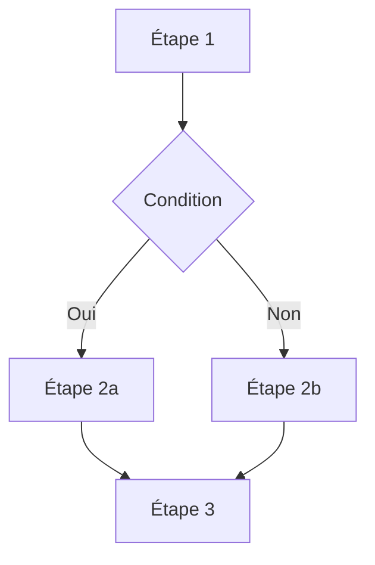
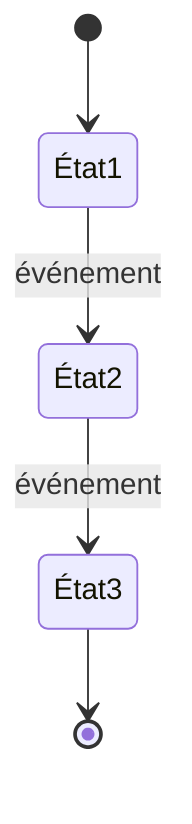
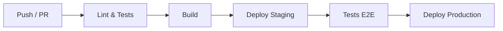

# SDD System Design — Conception technique

Version : 1.0.0
Date : 2026-02-18

## Déclenchement

### Déclenchement primaire (active le skill directement)

- L'utilisateur demande de produire l'architecture, le déploiement, la sécurité
  ou la conformité d'un projet à partir d'un SPEC.md.
- L'utilisateur mentionne la « phase de conception » ou « phase 1 » du flux
  SDD et fournit (ou référence) un SPEC.md.
- L'utilisateur demande explicitement un ARCHITECTURE.md, DEPLOYMENT.md,
  SECURITY.md ou COMPLIANCE_MATRIX.md.
- L'utilisateur demande de produire « les documents de conception » ou
  « les livrables de conception technique ».

### Déclenchement secondaire (demande confirmation avant d'activer)

- L'utilisateur mentionne « concevoir le système » sans référence SDD →
  Demande : « Tu veux des documents de conception SDD à partir d'un SPEC.md,
  ou une conception libre ? »
- L'utilisateur fournit un SPEC.md sans préciser ce qu'il veut → Demande :
  « Tu veux lancer la phase de conception (architecture, déploiement, sécurité,
  conformité) ? »

### Ne pas déclencher (anti-triggers)

- L'utilisateur veut rédiger ou modifier un SPEC.md → Utiliser sdd-spec-write.
- L'utilisateur demande de planifier des EPICs ou des User Stories → Phase 2.
- L'utilisateur demande d'implémenter du code → Phase 3.
- L'utilisateur demande une revue de code → Phase 4.
- L'utilisateur pose une question technique ponctuelle sans contexte de projet.

## Philosophie

Les documents de conception sont le pont entre la spécification (ce que le
système doit faire) et l'implémentation (comment il le fait). Ils constituent
le cadre de référence pour tout agent IA ou ingénieur qui implémentera le
projet.

Chaque document répond à une question précise :

| Document | Question |
|---|---|
| ARCHITECTURE.md | **Comment** le système est-il construit ? |
| DEPLOYMENT.md | **Comment** le système est-il déployé et opéré ? |
| SECURITY.md | **Comment** le système est-il sécurisé ? |
| COMPLIANCE_MATRIX.md | **Comment** le système est-il conforme à son cadre réglementaire ? |

Ces documents sont produits itérativement par un dialogue entre Claude et
l'ingénieur/PO. Claude pose des questions, propose des choix, et rédige
progressivement. L'ingénieur valide, corrige, complète.

### Principes directeurs

1. **Traçabilité** : chaque décision d'architecture doit être rattachable à
   une exigence du SPEC.md (EXG-xxx ou ENF-xxx).
2. **Détail sans redondance** : être exhaustif mais ne jamais répéter la même
   information dans deux documents. Utiliser des renvois croisés.
3. **Spécificité** : pas de généralités vagues. Si on choisit PostgreSQL,
   expliquer pourquoi et dans quelle version.
4. **Autonomie du lecteur** : un agent IA lisant ces documents avec le SPEC.md
   doit pouvoir implémenter sans poser de questions d'architecture.

## Entrées requises

- **SPEC.md** (obligatoire) : le fichier de spécification SDD du projet.
- **Fichiers référencés par le SPEC.md** (si présents) : GRAMMAR.md,
  DATA-MODEL.md, ou tout document listé dans la section « Documents de
  référence » du SPEC.md.
- **Contexte organisationnel** (collecté par Q&A) : contraintes d'infrastructure,
  politiques de sécurité internes, cadre réglementaire applicable.

## Sorties produites

| Fichier | Quand le produire |
|---|---|
| `docs/ARCHITECTURE.md` | Toujours |
| `docs/DEPLOYMENT.md` | Toujours |
| `docs/SECURITY.md` | Toujours |
| `docs/COMPLIANCE_MATRIX.md` | Seulement si un cadre réglementaire est identifié |

## Identification du skill dans les réponses

Chaque réponse produite sous ce skill commence par une barre de progression
indiquant le skill actif, la phase en cours et l'avancement. Cette ligne est
obligatoire, sans exception.

**Format :**

```
🏗️ skill:sdd-system-design vX.Y.Z · [Phase] [barre] étape N/T — [Nom de l'étape]
```

où `vX.Y.Z` est la version indiquée dans l'en-tête de ce skill.

**Règles de la barre de progression :**

- Caractère plein : `█` — Caractère vide : `░`
- Largeur fixe : 7 caractères pour les phases A (7 étapes + rédaction),
  5 caractères pour les phases B/C/D.
- La barre reflète l'étape en cours (incluse).

**Exemples par phase :**

```
🏗️ skill:sdd-system-design v1.0.0 · Architecture [█░░░░░░] étape 1/7 — Cadrage macro
🏗️ skill:sdd-system-design v1.0.0 · Architecture [███░░░░] étape 3/7 — Modèle de données
🏗️ skill:sdd-system-design v1.0.0 · Architecture [███████] étape 7/7 — Synthèse et arbitrages
🏗️ skill:sdd-system-design v1.0.0 · Architecture [████████] rédaction
🏗️ skill:sdd-system-design v1.0.0 · Déploiement [██░░░] étape 2/5 — Questions
🏗️ skill:sdd-system-design v1.0.0 · Sécurité [███░░] étape 3/5 — Stack technique
🏗️ skill:sdd-system-design v1.0.0 · Conformité [█████] étape 5/5 — Rédaction
```

Si plusieurs messages se succèdent au sein de la même étape (ex : questions
de clarification, réponses intermédiaires), la barre reste identique. Elle
avance uniquement au passage à l'étape suivante.

## Processus de conception

La conception suit un processus en 4 phases séquentielles. Chaque phase
produit un document. Claude guide l'utilisateur par des questions ciblées
(3 à 5 maximum à la fois) avant de rédiger chaque section.

### Phase A — Architecture (ARCHITECTURE.md)

La conception de l'architecture est la phase la plus critique. Elle conditionne
tous les documents suivants. La réflexion doit être **exhaustive et profonde**
avant toute rédaction. Claude ne rédige RIEN tant que la réflexion n'est pas
terminée et validée.

#### A.0 — Activation du mode plan

Dès l'entrée en Phase A, Claude active le **mode plan** : il présente à
l'utilisateur la feuille de route complète de la réflexion architecturale
avant de poser la moindre question. L'objectif est que l'utilisateur sache
exactement où il va et combien d'étapes l'attendent.

**Annonce obligatoire (à adapter au contexte) :**

> La conception de l'architecture va se dérouler en 7 étapes de réflexion
> avant que je ne rédige quoi que ce soit. Chaque étape approfondit un axe
> différent. Je te poserai des questions par petits groupes (3-5 max) et je
> synthétiserai ma compréhension entre chaque étape pour que tu puisses
> corriger le tir.
>
> **Étapes de réflexion :**
>
> 1. **Cadrage macro** — Type de solution, contraintes imposées, écosystème
> 2. **Analyse du SPEC.md** — Extraction des implications architecturales
> 3. **Modèle de données** — Entités, relations, volumes, sensibilité
> 4. **Flux et interactions** — Flux métier, intégrations, événements
> 5. **Choix technologiques** — Stack, justifications, alternatives écartées
> 6. **Propriétés non-fonctionnelles** — Performance, résilience, observabilité
> 7. **Synthèse et arbitrages** — Consolidation, trade-offs, décisions ouvertes
>
> Après l'étape 7, je te présenterai une **synthèse architecturale complète**
> pour validation avant de rédiger le document.
>
> On commence ?

Si l'utilisateur souhaite sauter ou fusionner des étapes, Claude s'adapte
mais l'informe des risques (ex : « Si on ne creuse pas le modèle de données
maintenant, l'inventaire des données dans l'ARCHITECTURE.md sera incomplet
et devra être repris plus tard. »).

#### A.1 — Cadrage macro

**Objectif :** Comprendre la nature du système et ses contraintes structurantes
avant toute réflexion technique.

**Questions obligatoires :**

1. Quel type de solution développez-vous ? (SaaS, client lourd, driver,
   bibliothèque, CLI, API, microservices, monolithe, autre)
2. Le système est-il autonome ou s'insère-t-il dans un écosystème existant ?
   Si oui, lequel ? (décrire les systèmes adjacents)
3. Quelles sont les contraintes **imposées** et non négociables ? (langage,
   plateforme, fournisseur cloud, protocoles, normes)
4. Qui sont les parties prenantes techniques ? (équipe de dev, ops, intégrateurs,
   utilisateurs finaux techniques)
5. Y a-t-il un existant technique à prendre en compte ? (code legacy, base de
   données existante, infrastructure en place)

**Questions conditionnelles :**

- Si SaaS ou microservices → Quel fournisseur cloud ? Multi-cloud ?
  Quelles régions ? Budget infrastructure mensuel ?
- Si driver ou client lourd → Quels OS cibles ? Quelles versions ?
  Architecture processeur ? Privilèges requis (kernel, admin) ?
- Si intégration hardware → Quels protocoles matériels ? Quels équipements ?
  Firmwares à supporter ?
- Si système distribué → Combien de nœuds ? Réseau fiable ou intermittent ?
  Tolérance à la partition ?

**Livrable intermédiaire :** Claude synthétise le cadrage en 5-10 lignes et
le présente pour validation : « Voici ce que je comprends du contexte. Tu
confirmes / tu corriges ? »

#### A.2 — Analyse du SPEC.md

**Objectif :** Extraire du SPEC.md toutes les implications architecturales
que l'utilisateur n'a pas nécessairement identifiées. C'est une phase
d'analyse autonome par Claude, suivie de questions de clarification.

**Travail d'analyse (Claude, en autonomie) :**

Claude lit le SPEC.md complet et les documents référencés, puis produit :

1. **Inventaire des exigences à impact architectural** — Pour chaque EXG-xxx
   et ENF-xxx, Claude évalue si l'exigence contraint l'architecture (choix
   de composant, pattern, protocole, stockage). Il liste les exigences
   concernées avec une note sur l'implication.
2. **Détection des exigences implicites** — Claude identifie les besoins
   architecturaux qui ne sont pas explicitement formulés dans le SPEC.md
   mais qui en découlent logiquement (ex : une exigence de « recherche
   full-text » implique un moteur d'indexation ; une exigence de « notification
   en temps réel » implique du push/websocket).
3. **Identification des tensions** — Claude repère les exigences qui pourraient
   être en tension (ex : « temps de réponse < 200ms » + « calcul complexe
   côté serveur » → besoin de cache ou de pré-calcul).

**Présentation à l'utilisateur :**

Claude présente cette analyse sous forme structurée :

> **Analyse du SPEC.md — Implications architecturales**
>
> J'ai identifié **N exigences à impact architectural**, **M besoins
> implicites** non formulés dans la spec, et **P tensions** à arbitrer.
>
> [Tableau ou liste des éléments identifiés]
>
> Questions de clarification :

**Questions de clarification (3-5 max) :**

Les questions portent sur les zones d'ombre révélées par l'analyse. Elles ne
sont pas pré-définies — elles émergent de la lecture du SPEC.md. Exemples
typiques :

- « EXG-012 mentionne [X] mais ne précise pas [Y]. Quel est le comportement
  attendu ? »
- « J'ai détecté un besoin implicite de [composant/pattern]. Tu confirmes ? »
- « EXG-005 et ENF-002 semblent en tension sur [point]. Quel compromis
  privilégier ? »

#### A.3 — Modèle de données

**Objectif :** Cartographier exhaustivement les données du système avant de
choisir comment les stocker et les transporter.

**Travail d'analyse (Claude, en autonomie) :**

À partir du SPEC.md, du DATA-MODEL.md (si existant), et des réponses
précédentes, Claude produit un brouillon de l'inventaire des données :

- Liste des entités métier avec leurs attributs principaux
- Relations entre entités (cardinalités)
- Classification de sensibilité par entité (public, interne, confidentiel, secret)
- Estimation des volumes (nombre d'enregistrements, taille, croissance)
- Cycle de vie des données (création, modification, archivage, suppression)

**Questions obligatoires :**

1. Le brouillon d'inventaire est-il complet ? Manque-t-il des entités ?
2. Quelles sont les données les plus sensibles ? Y a-t-il des données
   soumises à des réglementations spécifiques ?
3. Quels sont les volumes réalistes ? (nombre d'utilisateurs, de transactions
   par jour/mois, de fichiers, taille des fichiers)
4. Y a-t-il des données qui doivent être purgées ou archivées après un délai ?

**Questions conditionnelles :**

- Si données de santé → Classification spécifique ? Pseudonymisation ?
  Séparation des données directement identifiantes ?
- Si données en temps réel → Fréquence d'arrivée ? Taille des événements ?
  Fenêtre de rétention en mémoire ?
- Si multi-tenant → Isolation des données par tenant ? Données partagées
  entre tenants ?
- Si système distribué → Données répliquées ? Stratégie de cohérence ?
  (CAP theorem)

**Livrable intermédiaire :** Inventaire des données validé par l'utilisateur.

#### A.4 — Flux et interactions

**Objectif :** Identifier tous les flux de données et d'interactions entre
composants, systèmes externes, et utilisateurs. C'est la matière première
des diagrammes flowchart et state diagram.

**Travail d'analyse (Claude, en autonomie) :**

À partir du SPEC.md et des étapes précédentes, Claude identifie :

1. **Flux métier principaux** — Les parcours utilisateur de bout en bout
   (ex : inscription → commande → paiement → livraison).
2. **Flux d'intégration** — Les échanges avec les systèmes externes (APIs
   tierces, bases existantes, fichiers importés/exportés).
3. **Flux d'événements** — Les événements asynchrones (notifications, webhooks,
   jobs planifiés, files d'attente).
4. **Flux d'erreur** — Les chemins d'erreur et de rattrapage (retry, dead
   letter queue, alertes).

Pour chaque flux, Claude note : déclencheur, étapes, composants impliqués,
données transportées, cas d'erreur.

**Présentation à l'utilisateur :**

> J'ai identifié **N flux métier**, **M intégrations** et **P flux
> d'événements**. Voici la liste. Je vais te poser des questions sur les
> flux les plus complexes.

**Questions obligatoires :**

1. La liste des flux est-elle complète ?
2. Pour chaque intégration externe : quel protocole ? Quelle authentification ?
   Quel SLA du système tiers ?
3. Y a-t-il des flux qui doivent être transactionnels (tout ou rien) ?
4. Y a-t-il des flux asynchrones nécessitant une garantie de livraison
   (at-least-once, exactly-once) ?

**Questions conditionnelles :**

- Si événements → Message broker dédié ou queues simples ? Ordre garanti ?
- Si fichiers échangés → Formats ? Taille max ? Fréquence ? Validation ?
- Si temps réel → WebSocket, SSE, polling ? Latence acceptable ?

**Livrable intermédiaire :** Cartographie des flux validée.

#### A.5 — Choix technologiques

**Objectif :** Sélectionner et justifier chaque brique de la stack technique.
Pas de technologie sans raison documentée. Pour chaque choix, au moins une
alternative écartée doit être mentionnée.

**Travail d'analyse (Claude, en autonomie) :**

À partir des contraintes (A.1), des données (A.3) et des flux (A.4), Claude
propose une stack technique en respectant ces principes :

1. **Contraintes d'abord** — Les technologies imposées par le SPEC.md ou
   l'utilisateur sont non négociables.
2. **Cohérence de l'écosystème** — Préférer des technologies qui fonctionnent
   bien ensemble (ex : ne pas mixer 4 langages sans raison).
3. **Maturité et support** — Préférer des technologies stables, bien
   documentées, avec une communauté active.
4. **Coût total** — Inclure les coûts de licence, d'hébergement, de formation,
   de maintenance.

**Présentation à l'utilisateur :**

Pour chaque brique, Claude présente :

> | Besoin | Proposition | Pourquoi | Alternative écartée | Pourquoi écartée |
> |--------|-------------|----------|---------------------|------------------|
> | [ex: API REST] | [ex: FastAPI] | [ex: Async, typage natif, perf] | [ex: Django REST] | [ex: Plus lourd, sync par défaut] |

**Questions obligatoires :**

1. Valides-tu ces choix ? Y a-t-il des technologies que tu veux imposer ou
   exclure ?
2. Y a-t-il des contraintes de licence ? (open source uniquement, licence
   commerciale interdite, etc.)
3. L'équipe maîtrise-t-elle ces technologies ou faut-il prévoir une montée
   en compétence ?

**Livrable intermédiaire :** Stack technique validée avec justifications.

#### A.6 — Propriétés non-fonctionnelles

**Objectif :** Traduire les exigences non-fonctionnelles du SPEC.md (ENF-xxx)
en décisions architecturales concrètes. Couvrir aussi les propriétés non
explicitement demandées mais nécessaires.

**Axes d'analyse systématique :**

Claude passe en revue chaque axe et évalue sa pertinence pour le projet :

| Axe | Questions clés | Impact architectural |
|-----|---------------|---------------------|
| **Performance** | Temps de réponse cible ? Débit max ? Latence max ? | Cache, CDN, index, pré-calcul |
| **Scalabilité** | Croissance attendue ? Pics de charge ? | Horizontal vs vertical, stateless, sharding |
| **Disponibilité** | SLA cible ? Tolérance aux pannes ? | Réplication, failover, multi-AZ |
| **Résilience** | Que se passe-t-il si un composant tombe ? | Circuit breaker, retry, DLQ, graceful degradation |
| **Observabilité** | Comment savoir que le système fonctionne ? | Métriques, logs structurés, traces, alertes |
| **Maintenabilité** | Facilité à modifier, corriger, étendre ? | Modularité, tests, documentation, DX |
| **Portabilité** | Dépendance à un fournisseur ? Migration possible ? | Abstraction, standards, IaC |
| **Coût** | Budget contraint ? Optimisation nécessaire ? | Sizing, auto-scaling, reserved instances |

Pour chaque axe pertinent, Claude pose 1-2 questions ciblées à l'utilisateur
pour préciser les attentes et les seuils.

**Livrable intermédiaire :** Tableau des propriétés non-fonctionnelles avec
seuils chiffrés et décisions architecturales associées.

#### A.7 — Synthèse et arbitrages

**Objectif :** Consolider toute la réflexion en une vision architecturale
cohérente. Identifier les trade-offs et les décisions ouvertes. C'est la
dernière étape avant la rédaction.

**Travail de synthèse (Claude, en autonomie) :**

Claude produit un document de synthèse structuré :

1. **Vision architecturale** — Description en 5-10 phrases du système tel
   qu'il sera construit.
2. **Composants identifiés** — Liste des composants avec leurs responsabilités.
3. **Trade-offs explicites** — Pour chaque compromis fait, documenter ce qui
   a été sacrifié et pourquoi (ex : « On choisit la cohérence éventuelle
   plutôt que la cohérence forte pour gagner en disponibilité »).
4. **Décisions ouvertes** — Points qui restent à trancher, avec les options
   et leurs conséquences.
5. **Risques architecturaux** — Points de fragilité identifiés, avec des
   pistes de mitigation.

**Présentation à l'utilisateur :**

> **Synthèse architecturale — Validation avant rédaction**
>
> [Synthèse complète]
>
> **Décisions ouvertes (à trancher maintenant) :**
> 1. [Décision 1] — Option A vs Option B
> 2. [Décision 2] — ...
>
> **Risques identifiés :**
> 1. [Risque 1] — Mitigation proposée : [...]
>
> Tu valides cette vision ? Une fois validée, je rédige le ARCHITECTURE.md.

Claude ne passe à la rédaction que lorsque l'utilisateur valide explicitement
la synthèse. Si l'utilisateur demande des modifications, Claude revient à
l'étape concernée.

#### A.8 — Rédaction

**Prérequis :** La synthèse A.7 est validée par l'utilisateur.

Rédige le ARCHITECTURE.md section par section en suivant le template en
annexe. La rédaction s'appuie intégralement sur les livrables intermédiaires
validés aux étapes A.1 à A.7 :

- § 1 (Vue d'ensemble) ← A.1 cadrage + A.7 vision
- § 2 (Principes) ← A.7 trade-offs + A.6 propriétés
- § 3 (Stack technique) ← A.5 choix technologiques
- § 4.1 (Composants) ← A.7 composants identifiés
- § 4.2 (Flowcharts) ← A.4 flux métier
- § 4.3 (State diagrams) ← A.4 cycles de vie identifiés
- § 4.4 (Inventaire données) ← A.3 modèle de données
- § 4.5 (Initialisation) ← A.3 données initiales
- § 5 (Structure répertoire) ← A.7 composants + A.5 stack
- § 6 (Glossaire) ← termes accumulés pendant les étapes
- § 7 (Documents de référence) ← documents utilisés et produits

Présente chaque section majeure à l'utilisateur pour validation avant de
passer à la suivante. Les diagrammes Mermaid doivent être syntaxiquement
corrects et refléter fidèlement les flux validés en A.4.

### Phase B — Déploiement (DEPLOYMENT.md)

#### Questions obligatoires

1. Comment le logiciel est-il distribué aujourd'hui (ou comment doit-il
   l'être) ? (conteneurs, packages, installeur, téléchargement, store)
2. Quels sont les environnements cibles ? (dev, staging, production, on-premise)
3. Y a-t-il un pipeline CI/CD existant ? (outils, plateforme)
4. Qui opère le système en production ? (équipe interne, client, managé)
5. Quelle est la stratégie de mise à jour ? (rolling, blue-green, canary,
   manuelle)

#### Questions conditionnelles

- Si SaaS → Multi-tenant ? Isolation des données ? CDN ?
- Si client lourd → Mécanisme de mise à jour automatique ? Signature du code ?
- Si driver → Processus de certification ? Signature noyau ?
- Si on-premise → Prérequis réseau ? Proxy ? Pare-feu ?

#### Rédaction

Le chapitrage du DEPLOYMENT.md s'adapte au type de solution. Utilise le
template en annexe et sélectionne les sections appropriées.

### Phase C — Sécurité (SECURITY.md)

#### Questions obligatoires

1. Quels sont les actifs à protéger ? (données, accès, disponibilité)
2. Qui sont les utilisateurs et quels rôles ont-ils ?
3. Y a-t-il des politiques de sécurité internes à respecter ?
4. Le système est-il exposé sur Internet ?
5. Quels référentiels de sécurité appliquer ? (ANSSI, OWASP, CIS, ISO 27001,
   interne)

#### Questions conditionnelles

- Si données de santé → Exigences HDS ? Pseudonymisation ?
- Si données personnelles → Traitements RGPD identifiés ?
- Si API publique → Rate limiting ? Authentification ? CORS ?
- Si driver/client lourd → Signature du binaire ? Analyse statique ?
  Protection mémoire ?

#### Rédaction

Le SECURITY.md comporte trois niveaux d'exigences :
1. **Organisationnelles** : politiques de l'organisation de développement.
2. **Bonnes pratiques** : issues de référentiels reconnus (ANSSI, OWASP, etc.).
3. **Technologiques** : spécifiques aux technologies de la stack.

Chaque exigence est numérotée selon la convention définie dans le template.

### Phase D — Conformité (COMPLIANCE_MATRIX.md)

#### Évaluation préalable

Avant de rédiger, Claude évalue si un fichier de conformité est pertinent :

- Si le SPEC.md ne mentionne aucun cadre réglementaire → Informer
  l'utilisateur que le fichier n'est pas nécessaire et proposer de passer.
- Si le SPEC.md mentionne un cadre réglementaire (HDS, RGPD, PGSSI-S,
  PCI-DSS, SOC2, etc.) → Identifier les référentiels applicables et
  confirmer avec l'utilisateur.

#### Questions obligatoires (si applicable)

1. Quels référentiels réglementaires s'appliquent au projet ?
2. Y a-t-il des exigences du SPEC.md qui déclenchent ces obligations ?
   (identifier les EXG-xxx « mères »)
3. Qui est responsable de la conformité ? (rôle, équipe)
4. Y a-t-il des certifications à obtenir ?

#### Rédaction

Les exigences de conformité sont numérotées avec un préfixe propre au
référentiel (HDS-xx, RGPD-xx, PGSSI-xx, etc.) et rattachées à leur
exigence « mère » dans le SPEC.md. Elles ne réutilisent jamais la
numérotation EXG-xxx du SPEC.md.

## Format de livraison

Produis chaque document comme un fichier téléchargeable, pas comme du texte
dans le chat. Le chat sert au dialogue (questions, validations, arbitrages).

**Création initiale :**
1. Rédige chaque document au fil des phases. À chaque validation de section
   par l'utilisateur, mets à jour le fichier.
2. Commence toujours par ARCHITECTURE.md — les autres documents en dépendent.
3. Livre chaque document séparément dans `docs/`.

**Mise à jour :**
1. Produis le document modifié complet, pas un diff.
2. Si une modification d'architecture impacte le déploiement ou la sécurité,
   signale-le et propose de mettre à jour les documents concernés.
3. Mets à jour le changelog en fin de fichier.

**Convention de versioning :**
- **Majeure (X.0)** : changement structurel d'architecture, ajout ou retrait
  d'un composant majeur, changement de stack.
- **Mineure (X.Y)** : ajout de détail, précision, correction, ajout d'une
  exigence de sécurité.

## Renvois croisés entre documents

Les documents de conception forment un tout cohérent. Utilise des renvois
croisés pour éviter la redondance :

- ARCHITECTURE.md → référence les exigences SPEC.md (EXG-xxx, ENF-xxx)
- DEPLOYMENT.md → référence les composants de ARCHITECTURE.md
- SECURITY.md → référence les composants de ARCHITECTURE.md et les exigences
  du SPEC.md
- COMPLIANCE_MATRIX.md → référence les exigences « mères » du SPEC.md et les
  exigences de SECURITY.md quand elles se recoupent

Format de renvoi : `Voir ARCHITECTURE.md § 4.1` ou `Réf. EXG-007`.

## Checklist de validation

Avant de remettre chaque document à l'utilisateur, vérifie :

### ARCHITECTURE.md
- [ ] Chaque composant a une responsabilité unique et claire.
- [ ] Les diagrammes Mermaid sont syntaxiquement corrects.
- [ ] La stack technique est justifiée (pas de technologie sans raison).
- [ ] L'inventaire des données couvre toutes les entités du SPEC.md.
- [ ] La structure du répertoire est cohérente avec l'architecture.
- [ ] Le glossaire technique couvre tous les termes spécifiques.
- [ ] Les coûts de fonctionnement sont estimés.

### DEPLOYMENT.md
- [ ] Les prérequis sont listés exhaustivement.
- [ ] La procédure de déploiement est reproductible par un agent IA.
- [ ] La stratégie de rollback est documentée.
- [ ] Le monitoring est défini.
- [ ] Les sections spécifiques au type de solution sont pertinentes.

### SECURITY.md
- [ ] Les trois niveaux d'exigences sont couverts (org, bonnes pratiques, tech).
- [ ] Chaque exigence a un ID unique, une description et un statut.
- [ ] Les exigences ANSSI/OWASP pertinentes sont présentes.
- [ ] Les exigences spécifiques à la stack sont documentées.

### COMPLIANCE_MATRIX.md
- [ ] Chaque exigence est rattachée à son référentiel source.
- [ ] Les exigences « mères » du SPEC.md sont identifiées.
- [ ] La numérotation est indépendante du SPEC.md.
- [ ] La légende des statuts est présente.

## Utilisation des templates

Utilise les templates définis en annexe comme point de départ. Ne génère
jamais la structure d'un document de mémoire — les templates sont la
référence. Remplis les sections au fil du dialogue, supprime les sections
marquées comme optionnelles si elles ne s'appliquent pas, et retire les
commentaires HTML avant livraison.

---

## Annexe A — Template ARCHITECTURE.md

````markdown
# [Nom du projet] — Architecture

Version : 1.0
Date : [YYYY-MM-DD]
Auteur : [Nom]
Statut : Brouillon
Spec de référence : SPEC.md v[X.Y]

## 1. Vue d'ensemble

<!-- Résumé en 3-5 phrases : ce que le système fait, son type (SaaS, client
lourd, driver, etc.), ses caractéristiques architecturales principales
(monolithe, microservices, event-driven, etc.) et ses contraintes structurantes.
Ce paragraphe doit permettre à un lecteur de comprendre le système en 30 secondes. -->

[Description]

## 2. Principes d'architecture

<!-- Lister les principes directeurs qui gouvernent les choix techniques.
Chaque principe est nommé, décrit en une phrase, et justifié par une contrainte
du SPEC.md ou un besoin métier. 5 à 10 principes maximum.
Exemples : séparation des responsabilités, immutabilité des données,
fail-fast, idempotence, etc. -->

| # | Principe | Description | Justification |
|---|----------|-------------|---------------|
| 1 | [Nom du principe] | [Description en une phrase] | [Réf. SPEC.md ou raison métier] |

## 3. Stack technique

### 3.1 Synthèse

<!-- Tableau récapitulatif de toutes les technologies utilisées.
Chaque ligne doit justifier le choix (pourquoi cette techno et pas une autre).
Inclure les versions ciblées. -->

| Catégorie | Technologie | Version | Rôle | Justification | Fournisseur / Licence |
|-----------|-------------|---------|------|---------------|-----------------------|
| Langage | [ex: Python] | [ex: 3.12+] | [ex: Langage principal] | [ex: Imposé par SPEC.md, écosystème data science] | [ex: PSF / MIT] |
| Framework | [ex: FastAPI] | [ex: 0.110+] | [ex: API REST] | [ex: Performance async, typage natif] | [ex: Tiangolo / MIT] |
| Base de données | [ex: PostgreSQL] | [ex: 16+] | [ex: Stockage principal] | [ex: ACID, JSON natif, extensibilité] | [ex: PostgreSQL GDG / PostgreSQL License] |
| <!-- Ajouter : cache, message broker, monitoring, CI/CD, IaC, etc. --> | | | | | |

### 3.2 Coût de fonctionnement induit

<!-- Estimer les coûts récurrents mensuels de la stack en production.
Distinguer les coûts fixes (licences, instances réservées) des coûts
variables (compute, stockage, bande passante).
Si l'estimation est impossible à ce stade, noter les métriques à surveiller. -->

| Poste | Service | Estimation mensuelle | Type | Hypothèses |
|-------|---------|---------------------|------|------------|
| Compute | [ex: Azure App Service P1v3] | [ex: ~120€] | Fixe | [ex: 1 instance, région France Central] |
| Base de données | [ex: Azure PostgreSQL Flexible] | [ex: ~80€] | Fixe | [ex: 2 vCores, 32 Go stockage] |
| Stockage | [ex: Azure Blob Storage] | [ex: ~5-20€] | Variable | [ex: 50-200 Go, LRS, accès occasionnel] |
| <!-- Ajouter : CDN, DNS, monitoring, secrets, backup, etc. --> | | | | |

**Coût total estimé :** [fourchette mensuelle]

**Remarques :**
<!-- Préciser les hypothèses de dimensionnement, les seuils de passage au
palier supérieur, les offres gratuites utilisées (free tier), etc. -->

## 4. Architecture détaillée

### 4.1 Composants

<!-- Chaque composant est un module autonome avec une responsabilité unique.
Si un composant a deux responsabilités reliées par "et", le découper en deux.
Référencer les exigences du SPEC.md que chaque composant adresse. -->

| Composant | Responsabilité | Interfaces exposées | Dépendances | Exigences couvertes |
|-----------|---------------|---------------------|-------------|---------------------|
| [Nom] | [Responsabilité en 1-2 phrases] | [Noms et type : REST, gRPC, événement, fichier] | [Composants ou services externes] | [EXG-xxx, ENF-xxx] |

### 4.2 Diagrammes de flux (flowchart)

<!-- Un diagramme par flux métier principal identifié dans le SPEC.md.
Utiliser la syntaxe Mermaid. Chaque nœud correspond à un composant ou
une action. Nommer le flux et référencer les exigences couvertes. -->

#### Flux : [Nom du flux] (réf. EXG-xxx)



**Description :** [Explication textuelle du flux, cas nominaux et cas d'erreur]

### 4.3 Diagrammes de transition d'état

<!-- Un diagramme par entité ayant un cycle de vie (statuts, états).
Utiliser la syntaxe Mermaid stateDiagram-v2. -->

#### Entité : [Nom de l'entité]



**Description :** [Explication des transitions, conditions de garde, actions déclenchées]

### 4.4 Inventaire des données

<!-- Lister toutes les entités de données du système. Pour chaque entité,
décrire les attributs principaux, le volume attendu, la sensibilité
(public, interne, confidentiel, secret), et la durée de rétention.
Référencer le DATA-MODEL.md si existant. -->

| Entité | Description | Attributs clés | Volume estimé | Sensibilité | Rétention | Stockage |
|--------|-------------|---------------|---------------|-------------|-----------|----------|
| [Nom] | [Description] | [Liste des attributs principaux] | [ex: ~10k enregistrements/an] | [Public / Interne / Confidentiel / Secret] | [ex: 5 ans] | [ex: PostgreSQL, table `xxx`] |

### 4.5 Initialisation des données

<!-- Décrire les données nécessaires avant le premier démarrage du système :
données de référence, configuration initiale, migrations, seeds.
Préciser la source, le format, et la procédure de chargement. -->

| Donnée | Source | Format | Procédure de chargement | Fréquence de mise à jour |
|--------|--------|--------|------------------------|-------------------------|
| [ex: Référentiel codes postaux] | [ex: data.gouv.fr] | [ex: CSV] | [ex: Script `scripts/seed_postal_codes.py`] | [ex: Annuelle] |

## 5. Structure du répertoire projet

<!-- Arborescence du projet reflétant l'architecture.
Chaque répertoire de premier niveau a un commentaire expliquant son rôle.
Cette structure est la référence pour l'implémentation. -->

```
project-root/
├── docs/                    # Documents de conception (ce fichier, DEPLOYMENT.md, etc.)
│   ├── ARCHITECTURE.md
│   ├── DEPLOYMENT.md
│   ├── SECURITY.md
│   └── COMPLIANCE_MATRIX.md
├── src/                     # Code source
│   ├── [composant_1]/       # [Responsabilité du composant 1]
│   ├── [composant_2]/       # [Responsabilité du composant 2]
│   └── ...
├── tests/                   # Tests automatisés
│   ├── unit/
│   ├── integration/
│   └── e2e/
├── scripts/                 # Scripts utilitaires (seed, migration, etc.)
├── config/                  # Configuration par environnement
├── infra/                   # Infrastructure as Code (Terraform, Docker, etc.)
├── SPEC.md                  # Spécification SDD
├── README.md                # Guide de démarrage rapide
└── ...
```

## 6. Glossaire technique

<!-- Termes techniques spécifiques au projet et à son architecture.
Ne pas répéter le glossaire du SPEC.md — y renvoyer si besoin.
Couvrir : acronymes, noms de composants, termes d'architecture. -->

| Terme | Définition |
|-------|-----------|
| [Terme] | [Définition] |

## 7. Documents de référence

<!-- Lister tous les documents liés à l'architecture.
Inclure les documents du SPEC.md et les documents produits par ce skill. -->

| Document | Description | Relation |
|----------|-------------|----------|
| SPEC.md | Spécification fonctionnelle SDD | Source des exigences |
| DEPLOYMENT.md | Procédures de déploiement | Consomme l'architecture |
| SECURITY.md | Exigences de sécurité | Contraint l'architecture |
| COMPLIANCE_MATRIX.md | Matrice de conformité | Contraint l'architecture (si applicable) |

---

## Changelog

<!-- Ne pas inclure en v1.0. Décommenter à partir de la v1.1.

| Version | Date | Auteur | Modifications |
|---------|------|--------|---------------|
| 1.1 | YYYY-MM-DD | [Auteur] | [Description des modifications] |
| 1.0 | YYYY-MM-DD | [Auteur] | Version initiale |
-->
````

---

## Annexe B — Template DEPLOYMENT.md

````markdown
# [Nom du projet] — Déploiement

Version : 1.0
Date : [YYYY-MM-DD]
Auteur : [Nom]
Statut : Brouillon
Spec de référence : SPEC.md v[X.Y]
Architecture de référence : ARCHITECTURE.md v[X.Y]

## 1. Vue d'ensemble du déploiement

<!-- Résumé en 3-5 phrases : type de déploiement, environnements cibles,
fréquence de déploiement visée, responsabilités. -->

[Description]

**Type de solution :** [SaaS | Client lourd | Driver | Bibliothèque | CLI | Autre]

## 2. Prérequis

### 2.1 Prérequis infrastructure

<!-- Matériel, réseau, OS, services cloud nécessaires.
Être exhaustif : un ingénieur doit pouvoir partir de zéro. -->

| Prérequis | Spécification | Obligatoire | Notes |
|-----------|--------------|-------------|-------|
| [ex: Serveur Linux] | [ex: Ubuntu 22.04+, 4 vCPU, 8 Go RAM] | Oui | [ex: Production uniquement] |

### 2.2 Prérequis logiciels

| Logiciel | Version minimale | Rôle | Installation |
|----------|-----------------|------|-------------|
| [ex: Docker] | [ex: 24.0+] | [ex: Conteneurisation] | [ex: `apt install docker-ce`] |

### 2.3 Prérequis réseau

<!-- Ports, protocoles, domaines, certificats nécessaires. -->

| Port / Protocole | Direction | Usage | Obligatoire |
|-----------------|-----------|-------|-------------|
| [ex: 443/TCP] | [ex: Entrant] | [ex: HTTPS API] | [ex: Oui] |

### 2.4 Prérequis secrets et credentials

<!-- Lister tous les secrets nécessaires au déploiement SANS révéler de valeurs.
Indiquer où et comment les provisionner. -->

| Secret | Usage | Source | Rotation |
|--------|-------|--------|----------|
| [ex: DATABASE_URL] | [ex: Connexion PostgreSQL] | [ex: Vault / Variable d'env] | [ex: 90 jours] |

## 3. Environnements

<!-- Décrire chaque environnement, ses spécificités et ses différences
avec la production. -->

| Environnement | Usage | Infra | Données | Accès |
|--------------|-------|-------|---------|-------|
| dev | Développement local | [ex: Docker Compose] | [ex: Seeds, données fictives] | [ex: Développeurs] |
| staging | Pré-production | [ex: Identique prod, taille réduite] | [ex: Copie anonymisée] | [ex: Équipe QA] |
| production | Production | [ex: Voir ARCHITECTURE.md § 3] | [ex: Données réelles] | [ex: Ops uniquement] |

## 4. Procédure de build

<!-- Étapes pour construire les artefacts déployables.
Reproductible par un agent IA ou un pipeline CI/CD. -->

### 4.1 Build applicatif

```bash
# Commandes de build
```

### 4.2 Artefacts produits

| Artefact | Type | Destination | Taille estimée |
|----------|------|-------------|---------------|
| [ex: app:latest] | [ex: Image Docker] | [ex: Container Registry] | [ex: ~200 Mo] |

## 5. Procédure de déploiement

### 5.1 Premier déploiement (installation initiale)

<!-- Procédure pas à pas pour un déploiement from scratch.
Inclure l'initialisation des données (voir ARCHITECTURE.md § 4.5). -->

1. [Étape 1]
2. [Étape 2]
3. ...

### 5.2 Mise à jour (déploiement courant)

<!-- Procédure pour une mise à jour standard. -->

**Stratégie :** [Rolling | Blue-Green | Canary | Manuelle]

1. [Étape 1]
2. [Étape 2]
3. ...

### 5.3 Rollback

<!-- Procédure pour revenir à la version précédente.
Doit être testée et documentée. -->

1. [Étape 1]
2. [Étape 2]
3. ...

**Temps estimé de rollback :** [durée]

## 6. Pipeline CI/CD

<!-- Décrire le pipeline d'intégration et de déploiement continu.
Outil, étapes, déclencheurs, environnements cibles. -->



| Étape | Outil | Déclencheur | Actions | Durée estimée |
|-------|-------|-------------|---------|---------------|
| [ex: Lint & Tests] | [ex: GitHub Actions] | [ex: Push sur main] | [ex: ruff, pytest] | [ex: ~3 min] |

## 7. Monitoring et observabilité

### 7.1 Métriques

| Métrique | Source | Seuil d'alerte | Action |
|----------|--------|---------------|--------|
| [ex: CPU %] | [ex: Azure Monitor] | [ex: > 80% pendant 5 min] | [ex: Scale-up automatique] |

### 7.2 Logs

| Source | Destination | Rétention | Format |
|--------|-------------|-----------|--------|
| [ex: Application] | [ex: Azure Log Analytics] | [ex: 30 jours] | [ex: JSON structuré] |

### 7.3 Alertes

| Alerte | Condition | Canal | Destinataire |
|--------|-----------|-------|-------------|
| [ex: Service down] | [ex: Health check KO > 2 min] | [ex: Slack #ops] | [ex: Équipe ops] |

## 8. Sauvegarde et restauration

| Donnée | Méthode | Fréquence | Rétention | Test de restauration |
|--------|---------|-----------|-----------|---------------------|
| [ex: Base PostgreSQL] | [ex: pg_dump automatisé] | [ex: Quotidien] | [ex: 30 jours] | [ex: Mensuel] |

**Procédure de restauration :**

1. [Étape 1]
2. [Étape 2]
3. ...

<!-- ================================================================
     SECTIONS SPÉCIFIQUES PAR TYPE DE SOLUTION
     Inclure uniquement les sections pertinentes pour le type de solution.
     Supprimer les sections non applicables et retirer ce commentaire.
     ================================================================ -->

## 9. Spécificités SaaS

<!-- Inclure cette section UNIQUEMENT pour les solutions SaaS. -->

### 9.1 Multi-tenancy

<!-- Stratégie d'isolation : base partagée, schéma par tenant, base par tenant.
Impact sur les performances, la sécurité, les migrations. -->

| Aspect | Stratégie | Détails |
|--------|-----------|---------|
| Isolation données | [ex: Schéma par tenant] | [ex: Colonne `tenant_id` sur chaque table] |
| Isolation compute | [ex: Partagé] | [ex: Rate limiting par tenant] |

### 9.2 Scalabilité

<!-- Stratégie de scaling horizontal/vertical.
Auto-scaling rules, limites, coûts associés. -->

### 9.3 Haute disponibilité

<!-- SLA cible, répartition géographique, failover. -->

| Métrique | Cible | Mécanisme |
|----------|-------|-----------|
| Disponibilité | [ex: 99.9%] | [ex: Multi-AZ, load balancer] |
| RPO | [ex: 1 heure] | [ex: Réplication async] |
| RTO | [ex: 15 minutes] | [ex: Failover automatique] |

### 9.4 CDN et assets statiques

<!-- Si applicable : CDN, cache, compression, invalidation. -->

## 10. Spécificités Client lourd

<!-- Inclure cette section UNIQUEMENT pour les clients lourds / desktop. -->

### 10.1 Distribution

<!-- Canaux de distribution : site web, store, entreprise (MSI/GPO).
Installeurs, formats de package. -->

| Plateforme | Format | Canal | Signature |
|-----------|--------|-------|-----------|
| [ex: Windows] | [ex: MSI / MSIX] | [ex: Site web + entreprise] | [ex: Certificat EV] |

### 10.2 Mise à jour automatique

<!-- Mécanisme de vérification et d'application des mises à jour.
Fréquence de vérification, téléchargement en arrière-plan,
mises à jour obligatoires vs optionnelles. -->

### 10.3 Compatibilité

<!-- Matrice de compatibilité OS / versions.
Gestion de la rétrocompatibilité des données locales. -->

| OS | Versions supportées | Fin de support prévue |
|-----|---------------------|----------------------|
| [ex: Windows] | [ex: 10 22H2+, 11] | [ex: Aligné sur Microsoft] |

### 10.4 Mode hors-ligne

<!-- Si applicable : fonctionnalités disponibles hors-ligne,
synchronisation au retour en ligne, gestion des conflits. -->

## 11. Spécificités Driver

<!-- Inclure cette section UNIQUEMENT pour les drivers / firmware. -->

### 11.1 Certification

<!-- Processus de certification par les vendeurs OS.
WHQL (Windows), kext signing (macOS), etc. -->

| OS | Certification | Processus | Délai estimé |
|-----|--------------|-----------|-------------|
| [ex: Windows] | [ex: WHQL] | [ex: Soumission Microsoft Hardware Lab] | [ex: 2-4 semaines] |

### 11.2 Installation silencieuse

<!-- Procédure d'installation sans interaction utilisateur.
Paramètres de ligne de commande, codes de retour. -->

### 11.3 Gestion des versions du matériel

<!-- Comment gérer plusieurs révisions hardware avec un seul driver.
Détection du matériel, fonctionnalités conditionnelles. -->

### 11.4 Cohabitation

<!-- Comportement en présence d'autres drivers concurrents ou de
versions antérieures. Désinstallation propre. -->

---

## Changelog

<!-- Ne pas inclure en v1.0. Décommenter à partir de la v1.1.

| Version | Date | Auteur | Modifications |
|---------|------|--------|---------------|
| 1.1 | YYYY-MM-DD | [Auteur] | [Description des modifications] |
| 1.0 | YYYY-MM-DD | [Auteur] | Version initiale |
-->
````

---

## Annexe C — Template SECURITY.md

````markdown
# [Nom du projet] — Sécurité

Version : 1.0
Date : [YYYY-MM-DD]
Auteur : [Nom]
Statut : Brouillon
Spec de référence : SPEC.md v[X.Y]
Architecture de référence : ARCHITECTURE.md v[X.Y]

## 1. Vue d'ensemble sécurité

<!-- Résumé en 3-5 phrases : périmètre de sécurité, niveau de sensibilité
des données traitées, principaux vecteurs de menace identifiés,
référentiels applicables. -->

[Description]

**Classification des données :** [Public | Interne | Confidentiel | Secret]
**Exposition réseau :** [Internet | Réseau interne | Isolé]
**Référentiels appliqués :** [ex: ANSSI (Guide d'hygiène), OWASP Top 10, CIS Benchmarks]

## 2. Exigences de sécurité organisationnelles

<!-- Exigences issues des politiques internes de l'organisation de
développement. Couvrir : gestion des accès développeurs, revue de code,
gestion des secrets, politique de branches, formation sécurité. -->

| ID | Exigence | Description | Implémentation | Preuve de conformité | Statut |
|----|----------|-------------|----------------|----------------------|--------|
| SEC-ORG-01 | [ex: Gestion des secrets] | [ex: Aucun secret dans le code source] | [ex: Vault + variables d'environnement] | [ex: Scan pre-commit, audit git history] | ⏳ |
| SEC-ORG-02 | [ex: Revue de code obligatoire] | [ex: Toute PR requiert une approbation] | [ex: Branch protection rules GitHub] | [ex: Paramètres du dépôt, historique PR] | ⏳ |
| SEC-ORG-03 | [ex: Principe du moindre privilège] | [ex: Accès limités au strict nécessaire] | [ex: RBAC, comptes de service dédiés] | [ex: Matrice des droits, audit IAM] | ⏳ |

## 3. Exigences de sécurité — Bonnes pratiques

<!-- Exigences issues de référentiels reconnus : ANSSI Guide d'hygiène
informatique, OWASP Top 10, CIS Benchmarks, NIST, etc.
Sélectionner les exigences pertinentes pour le type de solution.
Citer la source (référentiel, numéro de recommandation). -->

### 3.1 Authentification et contrôle d'accès

| ID | Exigence | Description | Implémentation | Preuve de conformité | Statut |
|----|----------|-------------|----------------|----------------------|--------|
| SEC-BP-01 | [ex: Authentification forte] | [ex: MFA pour les accès administratifs (ANSSI R28)] | [ex: TOTP via authenticator] | [ex: Configuration IAM, tests d'accès] | ⏳ |
| SEC-BP-02 | [ex: Politique de mots de passe] | [ex: Longueur min. 12 car., complexité (ANSSI R19)] | [ex: Validation côté API] | [ex: Tests unitaires, configuration] | ⏳ |

### 3.2 Protection des données

| ID | Exigence | Description | Implémentation | Preuve de conformité | Statut |
|----|----------|-------------|----------------|----------------------|--------|
| SEC-BP-10 | [ex: Chiffrement en transit] | [ex: TLS 1.2+ pour toutes les communications (ANSSI R1)] | [ex: Certificats Let's Encrypt, HSTS] | [ex: Scan SSL Labs, config nginx] | ⏳ |
| SEC-BP-11 | [ex: Chiffrement au repos] | [ex: AES-256 pour les données sensibles] | [ex: Chiffrement natif PostgreSQL/Azure] | [ex: Configuration stockage, audit] | ⏳ |

### 3.3 Protection applicative

| ID | Exigence | Description | Implémentation | Preuve de conformité | Statut |
|----|----------|-------------|----------------|----------------------|--------|
| SEC-BP-20 | [ex: Injection SQL] | [ex: Prévention des injections (OWASP A03)] | [ex: ORM, requêtes paramétrées] | [ex: Revue de code, SAST] | ⏳ |
| SEC-BP-21 | [ex: Validation des entrées] | [ex: Validation et sanitisation côté serveur] | [ex: Pydantic, schémas de validation] | [ex: Tests unitaires, fuzzing] | ⏳ |

### 3.4 Journalisation et détection

| ID | Exigence | Description | Implémentation | Preuve de conformité | Statut |
|----|----------|-------------|----------------|----------------------|--------|
| SEC-BP-30 | [ex: Journalisation des accès] | [ex: Traçabilité des actions sensibles (ANSSI R33)] | [ex: Middleware d'audit, table audit_logs] | [ex: Requêtes de vérification, dashboards] | ⏳ |

### 3.5 Continuité et résilience

| ID | Exigence | Description | Implémentation | Preuve de conformité | Statut |
|----|----------|-------------|----------------|----------------------|--------|
| SEC-BP-40 | [ex: Plan de sauvegarde] | [ex: Sauvegardes testées et restaurables] | [ex: Voir DEPLOYMENT.md § 8] | [ex: Rapports de test de restauration] | ⏳ |

## 4. Exigences de sécurité — Stack technique

<!-- Exigences spécifiques aux technologies choisies dans ARCHITECTURE.md § 3.
Pour chaque composant de la stack, identifier les risques et les
contre-mesures propres à cette technologie. -->

### 4.1 [Technologie 1 — ex: Python / FastAPI]

| ID | Exigence | Description | Implémentation | Preuve de conformité | Statut |
|----|----------|-------------|----------------|----------------------|--------|
| SEC-TECH-01 | [ex: Dépendances sécurisées] | [ex: Audit régulier des dépendances Python] | [ex: pip-audit en CI, Dependabot] | [ex: Rapport pip-audit, alertes GitHub] | ⏳ |
| SEC-TECH-02 | [ex: Sérialisation sûre] | [ex: Pas de pickle/eval sur des données non fiables] | [ex: JSON uniquement, Pydantic] | [ex: Règle ruff, revue de code] | ⏳ |

### 4.2 [Technologie 2 — ex: PostgreSQL]

| ID | Exigence | Description | Implémentation | Preuve de conformité | Statut |
|----|----------|-------------|----------------|----------------------|--------|
| SEC-TECH-10 | [ex: Accès restreint] | [ex: Connexion via SSL, utilisateurs dédiés] | [ex: pg_hba.conf, rôles PostgreSQL] | [ex: Configuration serveur, audit] | ⏳ |

### 4.3 [Technologie N]

<!-- Ajouter une sous-section par technologie significative de la stack.
Supprimer les sous-sections vides. -->

## 5. Spécificités de sécurité

<!-- Section réservée aux exigences de sécurité propres au contexte
spécifique du projet, qui ne rentrent dans aucune des catégories
précédentes. Exemples : contraintes client, exigences contractuelles,
environnement d'exécution particulier, hardware dédié.

Si le projet est de type Driver ou Client lourd, inclure ici les
exigences spécifiques :
- Driver : signature du binaire, protection mémoire kernel, surface
  d'attaque réduite, isolation des privilèges.
- Client lourd : stockage local sécurisé, communication sécurisée
  avec le serveur, protection contre le reverse engineering,
  mise à jour sécurisée.

Supprimer cette section si elle est vide. -->

| ID | Exigence | Description | Implémentation | Preuve de conformité | Statut |
|----|----------|-------------|----------------|----------------------|--------|
| SEC-SPE-01 | [Titre] | [Description] | [Implémentation] | [Preuve] | ⏳ |

## 6. Légende des statuts

| Statut | Signification |
|--------|---------------|
| ✅ | Implémenté et vérifié |
| 🔄 | En cours d'implémentation |
| ⏳ | Planifié (non démarré) |
| ❌ | Non applicable |

---

## Changelog

<!-- Ne pas inclure en v1.0. Décommenter à partir de la v1.1.

| Version | Date | Auteur | Modifications |
|---------|------|--------|---------------|
| 1.1 | YYYY-MM-DD | [Auteur] | [Description des modifications] |
| 1.0 | YYYY-MM-DD | [Auteur] | Version initiale |
-->
````

---

## Annexe D — Template COMPLIANCE_MATRIX.md

````markdown
# [Nom du projet] — Matrice de conformité

Version : 1.0
Date : [YYYY-MM-DD]
Auteur : [Nom]
Statut : Brouillon
Spec de référence : SPEC.md v[X.Y]
Architecture de référence : ARCHITECTURE.md v[X.Y]
Sécurité de référence : SECURITY.md v[X.Y]

## 1. Contexte réglementaire

<!-- Identifier le secteur d'activité, les réglementations applicables,
et les exigences du SPEC.md qui déclenchent des obligations de conformité.
Chaque référentiel doit être justifié par une exigence « mère » du SPEC.md. -->

| Référentiel | Secteur | Exigence mère (SPEC.md) | Obligation |
|-------------|---------|------------------------|------------|
| [ex: HDS] | [ex: Santé] | [ex: EXG-007] | [ex: Hébergement certifié pour données de santé] |
| [ex: RGPD] | [ex: Transversal] | [ex: EXG-003] | [ex: Protection des données personnelles] |

## 2. Périmètre de conformité

<!-- Décrire ce qui est couvert et ce qui ne l'est pas.
Si certains référentiels ne s'appliquent que partiellement, le préciser. -->

[Description du périmètre]

## 3. Légende des statuts

| Statut | Signification |
|--------|---------------|
| ✅ | Implémenté et vérifié |
| 🔄 | En cours d'implémentation |
| ⏳ | Planifié (non démarré) |
| ❌ | Non applicable |

<!-- ================================================================
     SECTIONS PAR RÉFÉRENTIEL
     Ajouter une section par référentiel réglementaire identifié.
     Les exemples ci-dessous (HDS, RGPD, PGSSI-S) sont fournis à titre
     indicatif pour le secteur de la santé. Les remplacer par les
     référentiels effectivement applicables au projet.

     Convention de numérotation :
     - Préfixe = acronyme du référentiel (HDS, RGPD, PGSSI, PCI, SOC, etc.)
     - Numéro séquentiel à deux chiffres : HDS-01, HDS-02, ...
     - Cette numérotation est INDÉPENDANTE de celle du SPEC.md (EXG-xxx).
     - Le lien vers le SPEC.md est assuré par la colonne "Exigence mère"
       dans le tableau § 1.
     ================================================================ -->

## 4. [Référentiel 1 — ex: HDS (Hébergement de Données de Santé)]

Référentiel : [ex: Décret n°2018-137, Article L.1111-8 du Code de la santé publique]

| ID | Exigence | Description | Implémentation | Preuve de conformité | Statut |
|----|----------|-------------|----------------|----------------------|--------|
| [ex: HDS-01] | [ex: Hébergeur certifié] | [ex: Hébergement chez un prestataire certifié HDS] | [ex: Azure France Central] | [ex: Certificat HDS Microsoft Azure] | ⏳ |
| [ex: HDS-02] | [ex: Localisation France] | [ex: Données stockées exclusivement en France] | [ex: Région `francecentral`] | [ex: `terraform/main.tf` - `location = "francecentral"`] | ⏳ |

---

## 5. [Référentiel 2 — ex: RGPD]

Référentiel : [ex: Règlement (UE) 2016/679]

| ID | Exigence | Description | Implémentation | Preuve de conformité | Statut |
|----|----------|-------------|----------------|----------------------|--------|
| [ex: RGPD-01] | [ex: Base légale] | [ex: Chaque traitement a une base légale identifiée] | [ex: Registre des traitements] | [ex: Document DPO] | ⏳ |

---

## 6. [Référentiel N]

<!-- Ajouter une section par référentiel supplémentaire.
Supprimer les sections non applicables. -->

Référentiel : [Source normative]

| ID | Exigence | Description | Implémentation | Preuve de conformité | Statut |
|----|----------|-------------|----------------|----------------------|--------|
| [PREFIXE-01] | [Titre] | [Description] | [Implémentation] | [Preuve] | ⏳ |

---

## 7. Synthèse de conformité

<!-- Tableau de synthèse avec le taux de couverture par référentiel.
Mis à jour à chaque changement de statut. -->

| Référentiel | Total exigences | ✅ | 🔄 | ⏳ | ❌ | Couverture |
|-------------|----------------|----|----|----|----|------------|
| [ex: HDS] | [ex: 10] | [0] | [0] | [10] | [0] | [0%] |
| [ex: RGPD] | [ex: 8] | [0] | [0] | [8] | [0] | [0%] |

---

## Changelog

<!-- Ne pas inclure en v1.0. Décommenter à partir de la v1.1.

| Version | Date | Auteur | Modifications |
|---------|------|--------|---------------|
| 1.1 | YYYY-MM-DD | [Auteur] | [Description des modifications] |
| 1.0 | YYYY-MM-DD | [Auteur] | Version initiale |
-->
````

---

## Changelog du skill

| Version | Date | Modifications |
|---------|------|---------------|
| 1.0.0 | 2026-02-18 | Version initiale. Architecture, déploiement, sécurité, conformité. Phase A avec réflexion profonde en 7 étapes et mode plan. Barre de progression avec versioning. |
