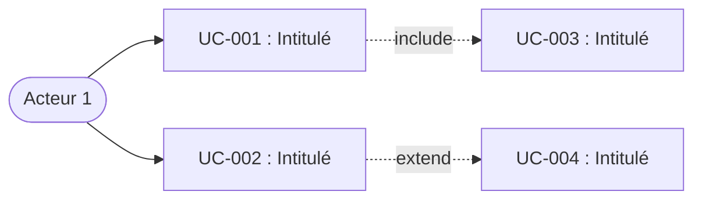

# Spec Driven Development (SDD) — Rédaction par cas d'utilisation

Version : 1.0.0
Date : 2026-02-25

## Message d'accueil

Quand le skill est activé, Claude commence par rappeler les objectifs et le mode
d'utilisation avant toute autre action :

**Rédaction initiale :**
```
Ce skill produit des spécifications logicielles structurées par cas d'utilisation (UC),
selon la méthodologie Spec Driven Development (SDD). L'objectif est de produire un
document suffisamment précis pour qu'un agent IA implémente le logiciel sans ambiguïté,
et suffisamment clair pour qu'un décideur non technique comprenne ce qui sera livré.

Je vais te guider en trois étapes :
1. Cadrage — produire un cahier des charges introductif (contexte, acteurs, contraintes, périmètre).
2. Cas d'utilisation — détailler chaque UC avec ses étapes, exceptions, règles de gestion.
3. Compléments — objets participants, exigences non fonctionnelles, périmètre.

On commence par le cadrage.
```

**Modification d'un SPEC.md existant :**
```
Ce skill permet de modifier une spécification SDD existante structurée par cas
d'utilisation. Je peux intervenir sur :
- Les cas d'utilisation (ajout, modification, dépréciation)
- Le glossaire
- Les exigences non fonctionnelles
- Les niveaux de support et le hors périmètre
- L'arborescence et les diagrammes
- Toute autre section du SPEC.md

Quelle section veux-tu modifier ?
```

## Philosophie

Une spec SDD n'est pas un cahier des charges classique destiné à être interprété uniquement
par des humains. C'est un **document de référence exécutable**, construit pour une lecture
humaine mais aussi par un agent IA : suffisamment précis pour qu'un agent IA produise
une implémentation conforme sans poser de questions, et suffisamment clair pour qu'un décideur
non technique comprenne ce qui sera livré.

Une fois le SPEC.md produit, un autre agent (ou skill) l'utilise comme entrée pour construire
l'architecture technique, les consignes de sécurité et les plans de développement, en vue de
commencer l'implémentation. Le SPEC.md est donc le point d'entrée de toute la chaîne de
production logicielle.

Chaque phrase de la spec doit répondre à cette question : **"Un agent IA qui lit uniquement ce
document peut-il implémenter correctement ce comportement, sans deviner ?"** Si la réponse est
non, la spec est incomplète.

La spec est le contrat entre celui qui spécifie et celui qui implémente — qu'il soit humain ou IA.
Elle est le point de vérité unique du projet. Le code en découle et doit être traçable
jusqu'à la spec.

Les critères d'acceptation sont conçus pour être directement convertibles en tests automatisés.
Un agent IA peut générer une suite de tests à partir de la seule lecture des CA, sans
information supplémentaire. Cette propriété est intentionnelle : si un critère d'acceptation
n'est pas transformable en test, il est trop vague — reformule-le.

## Concepts clés

### Acteurs

Un acteur est un type d'utilisateur (un profil) qui **modifie l'état interne du système**.
Un acteur peut être :
- **Humain** : Client, Administrateur, Gestionnaire, Caissière, etc.
- **Système** : Cron, service externe, batch planifié, etc.

**Ne sont PAS des acteurs :**
- Les destinataires d'une action (ex : Imprimante, service de notification).
- Le système qu'on modélise lui-même.

### Relations entre cas d'utilisation

Trois types de relations peuvent exister entre UC :

| Relation | Description | Fréquence |
|---|---|---|
| **Include** | Un UC inclut obligatoirement un autre UC. Le UC inclus est toujours exécuté. | Courante |
| **Extend** | Un UC étend un autre UC de manière optionnelle, sous certaines conditions. | Courante |
| **Généralisation / Spécialisation** | Un UC hérite du comportement d'un UC parent et le spécialise. | Rare |

Chaque UC documente ses relations dans un champ dédié. Les diagrammes Mermaid
sont régénérés à chaque livraison pour refléter ces relations.

### Packages et arborescence

Les cas d'utilisation sont organisés en une arborescence à deux niveaux de packages :

| Niveau | Rôle | Équivalent Agile |
|---|---|---|
| **Package niveau 2** | Regroupement de haut niveau | Epic |
| **Package niveau 1** | Sous-regroupement fonctionnel | Feature |
| **UC** | Cas d'utilisation unitaire | ≈ User Story |

Un diagramme de cas d'utilisation ne doit pas dépasser **15 à 20 UC**. Au-delà,
découper en packages ou sous-diagrammes.

L'arborescence sert de cartographie du système et sera réutilisable pour le
lotissement et la priorisation du développement.

### Diagramme de contexte

Le diagramme de contexte est un **schéma informel** (pas de formalisme UML) dont
l'objectif est de permettre à une personne extérieure de comprendre le périmètre
du système **en 10 secondes**. C'est un objet de communication.

Caractéristiques :
- Schéma non formel, statique (aucun élément dynamique).
- Éléments qui doivent y apparaître :
  - Les acteurs.
  - Les structures organisationnelles (entreprise, fournisseur, etc.).
  - Les principaux objets (voiture, colis, livre, etc.).
  - Les éléments géographiques (usine, restaurant, bibliothèque, agence, etc.).
  - Les postes clients, les terminaux de consultation.
  - Les applications informatiques ou sites Web (placés dans les structures
    organisationnelles ou géographiques).

L'utilisateur peut fournir ce schéma sous forme d'image que Claude interprète.

## Identification du skill dans les réponses

Chaque réponse produite sous ce skill commence par une barre de progression
indiquant le skill actif, l'étape en cours et l'avancement. Cette ligne est
obligatoire, sans exception.

**Format :**

```
🏗️ skill:sdd-uc-spec-write vX.Y.Z · [Étape] [barre] sous-étape N/T — [Nom]
```

où `vX.Y.Z` est la version indiquée dans l'en-tête du skill.

**Règles de la barre de progression :**

- Caractère plein : `█` — Caractère vide : `░`
- Largeur fixe : 4 caractères pour Cadrage (4 sous-étapes), variable pour
  Cas d'utilisation (1 caractère par package de niveau 1), 3 caractères pour Compléments.
- La barre reflète la sous-étape en cours (incluse).

**Découpage en sous-étapes :**

| Étape | Sous-étapes | Total |
|-------|-------------|-------|
| Cadrage | 1. Questions obligatoires · 2. Questions conditionnelles · 3. Diagramme de contexte · 4. Rédaction & validation sections initiales | 4 |
| Cas d'utilisation | 1. Arborescence & diagramme global · puis 1 sous-étape par package de niveau 1 (nombre variable, noté N/M) | 1+M |
| Compléments | 1. Objets participants · 2. Exigences non fonctionnelles · 3. Rédaction finale & passage de relais | 3 |

**Exemples :**

```
🏗️ skill:sdd-uc-spec-write v1.0.0 · Cadrage [█░░░] 1/4 — Questions obligatoires
🏗️ skill:sdd-uc-spec-write v1.0.0 · Cadrage [██░░] 2/4 — Questions conditionnelles
🏗️ skill:sdd-uc-spec-write v1.0.0 · Cadrage [███░] 3/4 — Diagramme de contexte
🏗️ skill:sdd-uc-spec-write v1.0.0 · Cadrage [████] 4/4 — Rédaction & validation
🏗️ skill:sdd-uc-spec-write v1.0.0 · Cas d'utilisation [█░░░░] arborescence — Structure des packages
🏗️ skill:sdd-uc-spec-write v1.0.0 · Cas d'utilisation [██░░░] package 1/4 — Gestion clients
🏗️ skill:sdd-uc-spec-write v1.0.0 · Cas d'utilisation [████░] package 3/4 — Export
🏗️ skill:sdd-uc-spec-write v1.0.0 · Compléments [█░░] 1/3 — Objets participants
🏗️ skill:sdd-uc-spec-write v1.0.0 · Compléments [██░] 2/3 — Exigences non fonctionnelles
🏗️ skill:sdd-uc-spec-write v1.0.0 · Compléments [███] 3/3 — Rédaction finale & passage de relais
```

**Cas particulier — Mise à jour d'une spec existante :**

```
🏗️ skill:sdd-uc-spec-write v1.0.0 · Mise à jour [██░] 2/3 — Application des modifications
```

Sous-étapes de mise à jour : 1. Lecture & périmètre · 2. Application ·
3. Changelog & impacts.

Si plusieurs messages se succèdent au sein de la même sous-étape (ex :
clarifications, allers-retours), la barre reste identique. Elle avance
uniquement au passage à la sous-étape suivante.

## Processus de rédaction

La rédaction d'une spec SDD par cas d'utilisation est un dialogue, pas une génération
en un coup. Claude guide l'utilisateur à travers trois étapes successives, en posant
des questions ciblées pour collecter l'information nécessaire avant de rédiger chaque
section. L'objectif est d'extraire la connaissance métier que l'utilisateur possède
et que Claude ne peut pas deviner.

### Étape 1 — Cadrage

Avant de rédiger quoi que ce soit, pose ces questions pour remplir les sections
Contexte, Architecture et périmètre. Pose-les par petits groupes
(3 à 5 questions maximum à la fois) pour ne pas submerger l'utilisateur.

**Questions obligatoires :**

1. Que fait le logiciel en une phrase ?
2. Quel problème résout-il, et pour qui ?
3. Y a-t-il des contraintes techniques imposées (langage, plateforme, dépendances) ?
4. Y a-t-il des contraintes réglementaires ou normatives (RGPD, HDS, certification) ?
5. Qui sont les acteurs du système ? (rappel : un acteur est un profil qui modifie
   l'état interne du système — pas un destinataire d'action)

**Questions conditionnelles** (pose-les si le contexte le suggère) :

- Le logiciel interagit-il avec un système existant, du hardware, ou un environnement
  non contrôlé ? → Déclenche la section Niveaux de support.
- Y a-t-il un cadre réglementaire dont certaines obligations se traduisent en
  comportements implémentables ? → Déclenche des cas d'utilisation spécifiques.
- Y a-t-il des contraintes d'architecture technique à respecter (composants imposés,
  intégrations, flux de données) ? → Déclenche la section Architecture.
- Y a-t-il des contraintes de performance, de sécurité, de fiabilité ou de
  portabilité ? → Déclenche la section Exigences non-fonctionnelles.
- Qu'est-ce que le logiciel ne fait explicitement pas ? Quelles demandes prévisibles
  des utilisateurs doivent être refusées ? → Alimente la section Hors périmètre.
- As-tu un **diagramme de contexte** à fournir pour expliquer le périmètre du système ?
  (schéma informel montrant les acteurs, les structures, les objets et les systèmes
  qui gravitent autour du logiciel) Si tu n'en as pas, je peux en produire un à partir
  des informations du cadrage.

Quand les réponses sont suffisantes, rédige les sections initiales du SPEC.md
(en-tête, contexte, diagramme de contexte si fourni, architecture si applicable,
niveaux de support si applicable, hors périmètre) et présente-les à l'utilisateur
pour validation avant de poursuivre.

### Étape 2 — Cas d'utilisation

Avant de commencer la rédaction des UC, demande à l'utilisateur :

1. **"As-tu un diagramme des cas d'utilisation à fournir ?"** — Si oui, interprète
   le schéma fourni (image) pour identifier les UC, les acteurs et les relations.
   Ce diagramme sera inséré dans le SPEC.md avant la liste détaillée des UC.

2. **Propose l'arborescence des packages :** "Je vois N packages de niveau 2
   regroupant M packages de niveau 1. Voici la structure que je propose :
   [arborescence]. Tu valides, tu corriges, tu complètes ?"

L'arborescence est présentée sous forme de tableau hiérarchique :

```markdown
| Package (niveau 2) | Package (niveau 1) | UC | Intitulé |
|---|---|---|---|
| Gestion des clients | Cycle de vie client | UC-001 | Créer un nouveau client |
| | | UC-002 | Modifier un client |
| | | UC-003 | Archiver un client |
| | Consultation | UC-004 | Rechercher un client |
| | | UC-005 | Afficher une fiche client |
```

Pour chaque package de niveau 1, procède ainsi :

1. **Propose** un lot de cas d'utilisation (2 à 4) avec leur structure complète.
2. **Pose les questions** nécessaires pour renseigner chaque champ du UC — force
   l'utilisateur à communiquer les données manquantes (acteurs, état initial,
   étapes, exceptions, règles de gestion, IHM, fréquence).
3. **Demande validation** : "Tu valides, tu corriges, tu complètes ?"
4. **Intègre** les retours et passe au lot suivant.

L'utilisateur peut fournir des schémas (diagrammes, maquettes IHM) que Claude
interprète pour alimenter les UC.

Ne cherche pas l'exhaustivité dès le premier passage. Il vaut mieux couvrir les UC
principaux de chaque package, puis revenir affiner, plutôt que de s'enliser sur un
seul package.

Si l'utilisateur fournit des informations détaillées ou techniques que tu ne maîtrises
pas entièrement, demande des précisions plutôt que de deviner. Un UC faux est pire
qu'un UC absent.

**Régénération des diagrammes :** À chaque livraison du SPEC.md (création ou mise à
jour), régénère les diagrammes Mermaid des relations entre UC (include, extend,
généralisation). Si le nombre de UC dépasse 15-20 dans un diagramme, découpe par
package.

### Étape 3 — Compléments

Une fois les UC principaux posés, aborde successivement :

1. **Objets participants** : "Veux-tu documenter une liste d'objets métier identifiés
   (entités, agrégats) ? Tu peux aussi fournir des diagrammes d'objets."
   Si oui, collecte la liste et les éventuels diagrammes. Cette liste peut être
   suivie de **diagrammes d'interaction** entre objets.

2. **Exigences non fonctionnelles** : "Y a-t-il des contraintes non fonctionnelles
   à documenter (performance, sécurité, fiabilité, portabilité, etc.) ?"

3. **Passage de relais** — Voir section dédiée.

### Format de livraison

Produis chaque document comme un fichier téléchargeable, pas comme du texte dans
le chat. Le chat sert au dialogue (questions, validations, arbitrages). Les fichiers
portent le contenu livrable.

**Création initiale :**
1. Rédige le SPEC.md au fil des étapes. À chaque validation de section par
   l'utilisateur, mets à jour le fichier.
2. Livre chaque document séparément si des documents complémentaires sont produits
   (DATA-MODEL.md, etc.). Ne les fusionne pas dans le SPEC.md.

**Mise à jour :**
1. Produis le SPEC.md modifié complet, pas un diff. Un agent IA qui reçoit la spec
   doit pouvoir l'utiliser sans reconstituer les pièces.
2. Régénère systématiquement les diagrammes Mermaid (relations entre UC, diagrammes
   par package) à chaque mise à jour.
3. Si la modification impacte un document de référence, livre la version mise à jour
   de ce document dans le même échange.

**Nommage :**
- Document principal : `SPEC.md`
- Schéma de données : `DATA-MODEL.md`
- Tout document complémentaire : référencé dans la section Documents de référence
  avec son nom exact.

Ne préfixe pas les noms de fichiers avec le nom du projet ou une date — le
versioning est porté par le champ Version de l'en-tête et le changelog, pas par
le nom de fichier.

### Passage de relais

Quand les trois étapes sont terminées et que le SPEC.md contient un cadrage validé,
des cas d'utilisation couvrant les packages principaux, et des compléments documentés,
informe l'utilisateur que le document est suffisamment structuré pour qu'il puisse le
compléter et l'enrichir lui-même.

Dis-le explicitement, par exemple : "Le SPEC.md a maintenant une structure solide avec
[N] cas d'utilisation répartis en [packages]. Tu peux désormais le compléter directement
— ajouter des UC, affiner les étapes et exceptions, préciser les règles de gestion —
en suivant le format et les conventions établis. Le glossaire et la structure des
identifiants (UC/RG/IHM/ENF/CA) te guident."

L'objectif du skill n'est pas de rédiger 100% de la spec. C'est d'amorcer le document
avec suffisamment de structure, de rigueur et d'exemples concrets pour que l'utilisateur
soit autonome pour la suite. La spec est un document vivant qui s'enrichit au fil du
projet.

Avant de remettre la spec à l'utilisateur, vérifie chaque point de la checklist et
signale les manques.

### Mise à jour d'une spec existante

Quand l'utilisateur fournit un SPEC.md existant et demande une modification, Claude
ne repart pas de zéro. Il opère en mode chirurgical : modifier ce qui doit l'être,
préserver tout le reste.

#### Déclenchement de la mise à jour

Quand l'utilisateur fournit un SPEC.md et demande une modification, Claude :
1. Affiche le message d'accueil en mode modification (voir section Message d'accueil).
2. Demande quelle(s) section(s) modifier : UC, glossaire, ENF, niveaux de support,
   hors périmètre, arborescence, objets participants, etc.
3. Procède à la modification ciblée.

#### Identifier le type de modification

Avant toute modification, identifie et confirme avec l'utilisateur le type d'opération :

| Type | Exemples | Impact |
|---|---|---|
| **Ajout** | Nouveau UC, nouveau package, nouvelle ENF | Insertion sans modifier l'existant |
| **Modification** | Reformulation d'une étape, ajout d'une exception, changement de règle de gestion | Mise à jour ciblée d'éléments existants |
| **Dépréciation** | Un UC n'est plus pertinent mais doit rester traçable | Marquage, pas suppression |
| **Restructuration** | Découpage d'un UC en deux, fusion de packages, réorganisation de l'arborescence | Modification structurelle avec renumérotation potentielle |

#### Règles de gestion des identifiants

Les identifiants sont le squelette de la traçabilité. Les corrompre, c'est casser
le lien entre spec et code.

**Ajout de UC :**
- Numérote à la suite du dernier identifiant existant, jamais dans les trous.
- Si le dernier UC est UC-047, le suivant est UC-048, même si UC-012 a été déprécié.

**Dépréciation de UC :**
- Ne supprime jamais un UC du document. Marque-le comme déprécié :
```
#### ~~UC-012 : Validation synchrone des entrées~~ [DÉPRÉCIÉ v2.1]

**Remplacé par :** UC-048, UC-049
**Raison :** Découpage en validation syntaxique (UC-048) et validation sémantique
(UC-049) suite à [justification métier].
```

- Les étapes, exceptions, règles de gestion et critères d'acceptation associés
  sont conservés barrés, pour historique.
- Le code qui référençait UC-012 doit être mis à jour vers les nouveaux
  identifiants — mentionne-le à l'utilisateur.

**Modification de critères d'acceptation :**
- Si un CA est reformulé sans changer le comportement testé : modifie en place,
  note le changement dans le changelog.
- Si un CA change le comportement attendu : déprécie l'ancien, crée un nouveau CA
  avec le numéro suivant disponible.

**Ajout d'exceptions ou règles de gestion a posteriori :**
- Signale à l'utilisateur que l'implémentation existante du UC concerné doit être
  revue pour couvrir ce nouvel élément.

#### Changelog

Toute mise à jour de la spec incrémente la version et ajoute une entrée au changelog,
inséré entre l'en-tête (section 1) et le contexte (section 2) :
```markdown
## Changelog

| Version | Date | Auteur | Modifications |
|---|---|---|---|
| 2.1 | 2025-07-15 | [Auteur] | Ajout UC-048, UC-049. Dépréciation UC-012. Ajout RG-0025. |
| 2.0 | 2025-06-01 | [Auteur] | Restructuration package "Export". Ajout ENF-003. |
| 1.0 | 2025-04-10 | [Auteur] | Version initiale. |
```

**Convention de versioning :**
- **Majeure (X.0)** : restructuration significative du périmètre, ajout ou retrait
  de packages de niveau 2.
- **Mineure (X.Y)** : ajout, modification ou dépréciation de UC ou ENF à l'intérieur
  du périmètre existant.

L'objectif n'est pas de reproduire git — c'est de donner à un agent IA qui reçoit
la spec v2.1 une vision claire de ce qui a changé depuis la version qu'il a peut-être
déjà implémentée.

#### Workflow de mise à jour

Quand l'utilisateur demande de modifier une spec existante, suis ce processus :

1. **Lis la spec entière** avant de toucher quoi que ce soit. Identifie la version
   actuelle, le dernier identifiant utilisé, et la structure existante.
2. **Confirme le périmètre** : "Tu veux [résumé de la modification]. Ça impacte
   [UC/sections concernés]. Je confirme avant de modifier."
3. **Applique les modifications** en respectant les règles d'identifiants ci-dessus.
4. **Régénère les diagrammes Mermaid** des relations entre UC.
5. **Mets à jour le changelog** et incrémente la version.
6. **Signale les impacts** : tout UC modifié ou déprécié implique une revue
   de l'implémentation correspondante. Liste-les explicitement :
   "UC impactés côté code : UC-012 (déprécié → retirer), UC-048/049
   (nouveaux → implémenter), RG-0025 (nouvelle règle → implémenter)."

## Structure d'un cas d'utilisation

Chaque cas d'utilisation suit ce format exact :

```markdown
#### UC-XXX : [Intitulé]

**Résumé :** [Description en une à trois phrases de ce que fait ce cas d'utilisation.]

**Acteurs :** [Liste des acteurs impliqués.]

**Fréquence d'utilisation :** [Estimation : ex. "3 fois par jour", "mensuel", "à la demande".]

**État initial :** [Condition de départ obligatoire. Ex : "Session utilisateur ouverte",
"UC-003 déjà exécuté", "Mode nominal".]

**État final :** [Condition atteinte en fin d'exécution. Ex : "La commande est enregistrée,
elle peut être traitée par le service logistique."]

**Relations :**
- Include : [UC-XXX — raison] (ou "Aucune")
- Extend : [UC-XXX — condition] (ou "Aucune")
- Généralisation : [UC-XXX — spécialisation] (ou "Aucune")

**Étapes (cas nominal) :**

| # | Direction | Description |
|---|---|---|
| 1a | → Acteur | [L'acteur fait quelque chose.] |
| 1b | ← Système | [Le système réagit. (IHM-XXX si applicable)] |
| 2a | → Acteur | [L'acteur fait quelque chose.] |
| 2b | ← Système | [Le système réagit.] |

**Exceptions :**

| Id étape | Condition | Réaction du système |
|---|---|---|
| 2b | Si [condition] | [Réaction. Suite à l'étape X / Dérouler UC-XXX] |

**Règles de gestion :**

| n° RG | Id étape | Énoncé |
|---|---|---|
| RG-XXXX | [Nb] | [Énoncé de la règle de gestion.] |

**IHM :**

| Id IHM | Description |
|---|---|
| IHM-XXX | [Description de l'écran ou copie d'écran fournie par l'utilisateur.] |

**Objets participants :** [Liste des entités métier impliquées dans ce UC.]

**Contraintes non fonctionnelles :** [Contraintes spécifiques à ce UC, ou "Voir ENF-XXX".]

**Critères d'acceptation / Cas de tests :**

- **CA-UC-XXX-01 :** Soit [contexte initial], Quand [action], Alors [résultat attendu].
- **CA-UC-XXX-02 :** Soit [contexte initial], Quand [action], Alors [résultat attendu].
```

### Règles de rédaction des UC

- **Cas nominal uniquement dans les étapes.** Les étapes décrivent le scénario où
  tout se passe bien. Les problèmes et variations vont dans les exceptions.

- **Convention de numérotation des étapes.** Chaque étape porte un numéro suivi
  d'un suffixe :
  - `a` = action de l'acteur (→ vers le système)
  - `b` = réaction du système (← vers l'acteur)

- **Exceptions : un seul "Si...Alors" par ligne.** Chaque exception est rattachée
  à un id d'étape précis. Une exception mène soit à un traitement local (affichage
  d'un message d'erreur, popup), soit à un renvoi vers une autre étape, soit à un
  renvoi vers un autre UC.

- **Règles de gestion : rattachées à une étape.** Chaque RG est identifiée par un
  numéro unique (RG-XXXX) et rattachée à l'étape où elle s'applique.

- **Références IHM.** Quand une étape système affiche un écran, référence l'IHM
  entre parenthèses dans la description de l'étape : `(IHM-XXX)`.

- **Atomicité.** Un UC = un objectif utilisateur. Si un UC poursuit deux objectifs
  distincts, sépare-le en deux UC.

- **Vérifiabilité.** Chaque UC doit avoir au moins un critère d'acceptation.
  Si tu ne peux pas écrire le critère, le UC est trop vague — reformule-le.

- **Identifiants uniques.** Chaque UC, RG, IHM, CA a un identifiant unique. Ces
  identifiants sont référencés dans le code pour assurer la traçabilité.

### Critères d'acceptation — format Soit/Quand/Alors

Chaque critère d'acceptation utilise strictement le format Soit/Quand/Alors :

- **Soit** décrit l'état initial du système (contexte, données en place).
- **Quand** décrit l'action unique déclenchée.
- **Alors** décrit le résultat observable et vérifiable.

Chaque clause doit être suffisamment précise pour être vérifiable
sans interprétation. Si le "Alors" contient "devrait fonctionner correctement", le critère
est inutile — reformule avec une valeur observable.

### Comment renseigner un UC — questions à poser

Pour chaque UC, pose les questions suivantes à l'utilisateur pour l'aider à fournir
les données requises. Ne laisse pas de champ vide par défaut — force la réponse :

1. **Qui déclenche ce cas d'utilisation ?** → Acteurs
2. **Quelle est la condition de départ ?** → État initial
3. **Qu'est-ce qui est vrai à la fin de l'exécution ?** → État final
4. **Décris-moi les étapes quand tout se passe bien.** → Étapes (cas nominal)
5. **À quelle fréquence ce cas se produit-il ?** → Fréquence
6. **Que se passe-t-il si [situation anormale] ?** → Exceptions
7. **Y a-t-il des règles métier qui s'appliquent à certaines étapes ?** → Règles de gestion
8. **Y a-t-il des écrans ou des maquettes associés ?** → IHM
9. **Quels objets métier sont impliqués ?** → Objets participants
10. **Ce UC dépend-il d'un autre UC ou en inclut-il un ?** → Relations

L'utilisateur peut fournir un **schéma** (diagramme, maquette, capture d'écran) que
Claude interprète pour alimenter les champs du UC.

## Glossaire SDD

Reproduis ce glossaire en dernière section de chaque SPEC.md produite.
Ces termes sont imposés par la méthodologie SDD. Ils constituent le vocabulaire commun
entre profils techniques et décideurs. Ne les remplace pas par des synonymes.

| Terme | Définition |
|---|---|
| **Spec** | Document qui décrit exactement ce que le logiciel doit faire. Point de vérité unique du projet. |
| **Cas d'utilisation (UC)** | Scénario complet décrivant l'interaction entre un acteur et le système pour atteindre un objectif. Granularité principale de la spec. |
| **Acteur** | Type d'utilisateur (profil) qui modifie l'état interne du système. Peut être humain ou système. |
| **Cas nominal** | Scénario principal d'un UC où tout se passe bien, sans erreur ni exception. |
| **Exception** | Situation anormale survenant à une étape d'un UC. Mène à un traitement local, un branchement ou un renvoi vers un autre UC. |
| **Règle de gestion (RG)** | Contrainte métier rattachée à une étape d'un UC. Identifiée par RG-XXXX. |
| **Critère d'acceptation** | Condition vérifiable prouvant qu'un UC est satisfait. Formulé en Soit/Quand/Alors. |
| **Hors périmètre** | Ce que le logiciel ne fait explicitement pas. Aussi important que ce qu'il fait. |
| **Niveau de support** | Degré de prise en charge d'une fonctionnalité : **Supporté** (implémenté), **Ignoré** (no-op silencieux), **Erreur** (rejeté avec message explicite). |
| **Package** | Regroupement de cas d'utilisation. Deux niveaux : niveau 2 (≈ Epic), niveau 1 (≈ Feature). |
| **Include** | Relation entre UC : un UC inclut obligatoirement un autre UC. |
| **Extend** | Relation entre UC : un UC étend optionnellement un autre UC sous condition. |
| **Généralisation** | Relation entre UC : un UC hérite d'un UC parent et le spécialise. Peu fréquent. |
| **Traçabilité** | Lien vérifiable entre un UC et son implémentation. Chaque UC a un identifiant unique référencé dans le code. |
| **Reproductibilité** | Capacité à obtenir le même résultat à partir de la même spec, quel que soit l'agent qui implémente. |
| **Critique** | Priorité : le logiciel ne fonctionne pas sans. Bloque la livraison. |
| **Important** | Priorité : nécessaire en production, mais non bloquant pour un premier livrable. |
| **Souhaité** | Priorité : amélioration reportable sans compromettre la viabilité. |

## Structure d'une SPEC.md

Produis le document SPEC.md en respectant cet ordre de sections.

### 1. En-tête

```markdown
# [Nom du projet] — Spécification SDD (Cas d'utilisation)

Version : [X.Y]
Date : [YYYY-MM-DD]
Auteur : [Nom]
Statut : [Brouillon | En revue | Validée]
```

### 2. Changelog (à partir de la v1.1)

Le changelog est inséré entre l'en-tête et le contexte. Il n'est pas nécessaire en v1.0
mais son emplacement doit être réservé. Dès la première mise à jour, il apparaît ici.
Voir la section "Mise à jour d'une spec existante" pour le format et les conventions.

### 3. Contexte et objectifs

Décris en quelques paragraphes :
- **Ce que le projet fait** — en une phrase.
- **Pourquoi il existe** — le problème résolu ou le besoin couvert.
- **Pour qui** — l'utilisateur cible.
- **Contraintes structurantes** — techniques, réglementaires, de performance.
- **Acteurs identifiés** — liste des acteurs du système avec leur rôle.

Cette section donne à l'agent IA le cadre mental pour prendre les bonnes décisions
quand la spec est silencieuse sur un détail.

### 4. Diagramme de contexte (si fourni)

Schéma informel fourni par l'utilisateur ou décrit textuellement. Permet de comprendre
le périmètre du système en un coup d'œil : acteurs, structures organisationnelles,
objets principaux, éléments géographiques, postes clients, applications.

Si l'utilisateur fournit une image, la référencer. Si le diagramme est décrit
textuellement, le reproduire en Mermaid ou ASCII.

### 5. Architecture (si applicable)

Section simplifiée par rapport au skill sdd-spec-write. Elle traduit les contraintes
techniques exprimées dans le contexte — composants imposés, intégrations, flux de
données de haut niveau. Ne documente que ce qui est contraint, pas un découpage
technique détaillé.

Quand le projet est simple, cette section peut se réduire à un paragraphe. Ne force
pas un découpage en composants quand il n'y en a pas.

### 6. Documents de référence (si applicable)

```markdown
| Document | Description |
|---|---|
| DATA-MODEL.md | [Description du contenu.] |
```

### 7. Niveaux de support (si applicable)

Quand le projet interagit avec un environnement externe (hardware, API, système existant),
certaines fonctionnalités ne peuvent pas être entièrement reproduites. Documente
explicitement trois catégories :

```markdown
#### Supporté
| Fonctionnalité | Comportement | UC lié |
|---|---|---|
| [Fonction X] | [Comportement fidèle à l'original] | UC-XXX |

#### Ignoré (no-op silencieux)
| Fonctionnalité | Raison |
|---|---|
| [Fonction Y] | [Pourquoi elle est ignorée sans erreur] |

#### Erreur explicite
| Fonctionnalité | Message d'erreur | Raison |
|---|---|---|
| [Fonction Z] | "[Message exact]" | [Pourquoi elle est rejetée] |
```

### 8. Hors périmètre

Liste explicitement ce que le projet ne fait pas. Chaque exclusion en une phrase.

Cette section empêche un agent IA de sur-interpréter la spec et d'implémenter
des fonctionnalités non demandées.

### 9. Arborescence des cas d'utilisation

Tableau hiérarchique présentant l'ensemble des UC organisés par packages.
C'est la cartographie du système.

```markdown
| Package (niveau 2) | Package (niveau 1) | UC | Intitulé |
|---|---|---|---|
| [Epic] | [Feature] | UC-XXX | [Intitulé du UC] |
```

### 10. Diagramme global des cas d'utilisation (si fourni)

Si l'utilisateur a fourni un diagramme des cas d'utilisation, il est inséré ici
avant la liste détaillée. Sinon, un diagramme Mermaid est généré à partir de
l'arborescence et des relations entre UC.

Si le nombre de UC dépasse 15-20, produire un diagramme par package de niveau 2.

### 11. Cas d'utilisation détaillés

Chaque UC suit le format défini dans la section "Structure d'un cas d'utilisation"
de ce skill. Les UC sont regroupés par package de niveau 1, eux-mêmes regroupés
par package de niveau 2.

### 12. Objets participants (si applicable)

Liste des entités métier identifiées à travers les cas d'utilisation. Pour chaque
objet, une brève description de sa responsabilité dans le domaine.

```markdown
| Objet | Description |
|---|---|
| Commande | Représente une demande d'achat passée par un client. |
| Utilisateur | Personne authentifiée ayant un profil dans le système. |
```

Cette section peut inclure des **diagrammes d'objets** (structure statique) et des
**diagrammes d'interaction** (échanges dynamiques entre objets) si l'utilisateur
les fournit ou si le contexte le justifie.

### 13. Exigences non fonctionnelles

Les exigences non fonctionnelles décrivent comment le logiciel se comporte, pas ce
qu'il fait. Elles s'appliquent transversalement à l'ensemble du système ou à un
composant spécifique.

Chaque exigence non fonctionnelle suit ce format :

```markdown
#### ENF-XXX : [Titre court]

**Priorité :** [Critique | Important | Souhaité]

**Description :** [Comment le logiciel se comporte, avec des valeurs mesurables.]

**Critères d'acceptation :**

- **CA-ENF-XXX-01 :** Soit [contexte initial], Quand [action], Alors [résultat attendu avec valeur mesurable].
```

Les domaines à explorer avec l'utilisateur :

- **Performance** — temps de réponse, débit, consommation mémoire.
- **Sécurité** — authentification, autorisation, chiffrement, validation des entrées.
- **Fiabilité** — comportement en cas de panne, stratégie de reprise.
- **Scalabilité** — limites de dimensionnement connues.
- **Observabilité** — logs, métriques, traces.
- **Accessibilité** — si applicable, conformité WCAG ou équivalent.
- **Portabilité** — systèmes d'exploitation, versions de runtime.

Ne traite pas ces domaines comme une checklist exhaustive. Documente ce qui est
pertinent, marque explicitement en Hors périmètre ce qui ne l'est pas.

### 14. Glossaire projet

Définis ici les termes spécifiques au domaine du projet. Le glossaire sert à
**partager la connaissance métier** et à **résoudre les ambiguïtés de vocabulaire**.

Chaque terme métier, technique ou acronyme utilisé dans la spec doit avoir une entrée.
Un agent IA ne doit jamais avoir à deviner le sens d'un terme.

Exemple :
```markdown
| Terme | Définition |
|---|---|
| Livre | Ouvrage référencé dans le catalogue. |
| Exemplaire | Version physique ("papier") d'un livre. La bibliothèque peut posséder plusieurs exemplaires d'un même livre. |
```

### 15. Glossaire SDD

Reproduis le glossaire SDD défini plus haut dans ce skill, tel quel. Il est commun à tous
les projets SDD et constitue le vocabulaire de référence de la méthodologie.

## Directives de rédaction

### Langue et registre

Rédige dans la langue de l'utilisateur. Utilise un registre professionnel accessible :
compréhensible par un directeur métier, exploitable par un développeur ou un agent IA.
Évite le jargon technique non défini dans le glossaire projet.

### Identifiants — convention de nommage

```
UC-001        Cas d'utilisation numéro 1
CA-UC-001-01  Premier critère d'acceptation du UC-001
RG-0001       Règle de gestion numéro 1
IHM-001       Écran / maquette numéro 1
ENF-001       Exigence non-fonctionnelle numéro 1
CA-ENF-001-01  Premier critère d'acceptation de ENF-001
```

Numérote séquentiellement. Ne réutilise jamais un identifiant supprimé.
Les identifiants sont référencés dans le code (commentaires) pour assurer la traçabilité.

### Complétude — checklist avant livraison

Avant de considérer la spec comme terminée, vérifie :

- [ ] Le glossaire SDD est présent et intact.
- [ ] Le glossaire projet couvre tous les termes spécifiques utilisés.
- [ ] L'arborescence des UC est complète et cohérente.
- [ ] Chaque UC a au moins un critère d'acceptation.
- [ ] Chaque critère d'acceptation est au format Soit/Quand/Alors.
- [ ] Les étapes de chaque UC suivent la convention Na/Nb (acteur/système).
- [ ] Les exceptions sont rattachées à un id d'étape précis.
- [ ] Les règles de gestion sont identifiées (RG-XXXX) et rattachées à une étape.
- [ ] Les relations entre UC (include, extend) sont documentées.
- [ ] Les diagrammes Mermaid des relations sont à jour.
- [ ] La section Hors périmètre est renseignée.
- [ ] Les niveaux de support sont documentés (si applicable).
- [ ] Les exigences non fonctionnelles pertinentes sont documentées.
- [ ] Un agent IA pourrait implémenter chaque UC sans poser de question.

**Utilisation du template :**

Utilise le template SPEC.md défini en annexe de ce skill comme point de départ.
Ne génère jamais la structure du SPEC.md de mémoire — le template est la référence.
Remplis les sections au fil du dialogue, supprime les sections marquées comme
optionnelles si elles ne s'appliquent pas, et retire les commentaires HTML
avant livraison.

## Annexe — Template SPEC.md
````markdown
# [Nom du projet] — Spécification SDD (Cas d'utilisation)

Version : 1.0
Date : [YYYY-MM-DD]
Auteur : [Nom]
Statut : Brouillon

<!-- CHANGELOG — Ne pas inclure en v1.0. Décommenter à partir de la v1.1.
## Changelog

| Version | Date | Auteur | Modifications |
|---|---|---|---|
| 1.1 | YYYY-MM-DD | [Auteur] | [Description des modifications] |
| 1.0 | YYYY-MM-DD | [Auteur] | Version initiale. |
-->

## Contexte et objectifs

**Ce que le projet fait :** [Une phrase.]

**Pourquoi il existe :** [Le problème résolu ou le besoin couvert.]

**Pour qui :** [L'utilisateur cible.]

**Contraintes structurantes :** [Techniques, réglementaires, de performance. Supprimer si aucune.]

**Acteurs identifiés :**

| Acteur | Rôle |
|---|---|
| [Nom] | [Description du profil et de son interaction avec le système.] |

## Diagramme de contexte

<!-- Supprimer cette section si aucun diagramme de contexte n'est fourni.
     Schéma informel (pas UML) montrant le périmètre du système : acteurs,
     structures organisationnelles, objets principaux, éléments géographiques,
     postes clients, applications. -->

[Diagramme fourni par l'utilisateur ou reproduit en Mermaid/ASCII.]

## Architecture

<!-- Section simplifiée. Traduit les contraintes techniques du contexte.
     Supprimer si aucune contrainte d'architecture n'est identifiée.
     Pour un projet simple, un paragraphe suffit. -->

[Description des contraintes d'architecture technique.]

## Documents de référence

<!-- Supprimer cette section si le projet ne nécessite aucun document complémentaire. -->

| Document | Description |
|---|---|
| DATA-MODEL.md | [Description du contenu.] |

## Niveaux de support

<!-- Supprimer cette section si le projet n'interagit pas avec un système existant,
     du hardware, ou un environnement non contrôlé. Chaque fonctionnalité de l'original
     doit apparaître dans exactement une des trois catégories. -->

### Supporté

| Fonctionnalité | Comportement | UC lié |
|---|---|---|
| [Fonction X] | [Comportement fidèle à l'original] | UC-XXX |

### Ignoré (no-op silencieux)

| Fonctionnalité | Raison |
|---|---|
| [Fonction Y] | [Pourquoi elle est ignorée sans erreur] |

### Erreur explicite

| Fonctionnalité | Message d'erreur | Raison |
|---|---|---|
| [Fonction Z] | "[Message exact]" | [Pourquoi elle est rejetée] |

## Hors périmètre

<!-- Chaque exclusion en une phrase. -->

- [Ce que le logiciel ne fait explicitement pas.]

## Arborescence des cas d'utilisation

| Package (niveau 2) | Package (niveau 1) | UC | Intitulé |
|---|---|---|---|
| [Epic] | [Feature] | UC-XXX | [Intitulé du UC] |

## Diagramme des cas d'utilisation

<!-- Diagramme global fourni par l'utilisateur ou généré en Mermaid.
     Si > 15-20 UC, découper en un diagramme par package de niveau 2. -->



## Cas d'utilisation détaillés

<!-- Regrouper par package de niveau 2, puis par package de niveau 1.
     Chaque UC suit le format exact ci-dessous. Ne pas modifier la structure.
     Numéroter séquentiellement. Ne jamais réutiliser un identifiant supprimé. -->

### [Package niveau 2 : Nom]

#### [Package niveau 1 : Nom]

##### UC-001 : [Intitulé]

**Résumé :** [Description en une à trois phrases.]

**Acteurs :** [Liste des acteurs impliqués.]

**Fréquence d'utilisation :** [Estimation.]

**État initial :** [Condition de départ obligatoire.]

**État final :** [Condition atteinte en fin d'exécution.]

**Relations :**
- Include : [UC-XXX — raison] (ou "Aucune")
- Extend : [UC-XXX — condition] (ou "Aucune")
- Généralisation : [UC-XXX — spécialisation] (ou "Aucune")

**Étapes (cas nominal) :**

| # | Direction | Description |
|---|---|---|
| 1a | → Acteur | [L'acteur fait quelque chose.] |
| 1b | ← Système | [Le système réagit. (IHM-XXX si applicable)] |

**Exceptions :**

| Id étape | Condition | Réaction du système |
|---|---|---|
| [Nb] | Si [condition] | [Réaction. Suite à l'étape X / Dérouler UC-XXX] |

**Règles de gestion :**

| n° RG | Id étape | Énoncé |
|---|---|---|
| RG-XXXX | [Nb] | [Énoncé de la règle de gestion.] |

**IHM :**

| Id IHM | Description |
|---|---|
| IHM-XXX | [Description de l'écran.] |

**Objets participants :** [Liste des entités métier impliquées.]

**Contraintes non fonctionnelles :** [Contraintes spécifiques ou "Voir ENF-XXX".]

**Critères d'acceptation / Cas de tests :**

- **CA-UC-001-01 :** Soit [contexte initial], Quand [action], Alors [résultat attendu].

## Objets participants

<!-- Supprimer cette section si aucun objet participant n'est identifié globalement.
     Peut inclure des diagrammes d'objets et des diagrammes d'interaction. -->

| Objet | Description |
|---|---|
| [Nom] | [Description de l'entité métier.] |

<!-- Diagrammes d'objets (si fournis) -->

<!-- Diagrammes d'interaction (si fournis) -->

## Exigences non fonctionnelles

<!-- Domaines à considérer : Performance, Sécurité, Fiabilité, Scalabilité,
     Observabilité, Accessibilité, Portabilité.
     Ne documenter que ce qui est pertinent. Marquer le reste en Hors périmètre.
     Supprimer cette section si aucune ENF n'est identifiée. -->

#### ENF-001 : [Titre court]

**Priorité :** [Critique | Important | Souhaité]

**Description :** [Comment le logiciel se comporte, avec des valeurs mesurables.]

**Critères d'acceptation :**

- **CA-ENF-001-01 :** Soit [contexte initial], Quand [action], Alors [résultat attendu avec valeur mesurable].

## Glossaire projet

<!-- Partage de la connaissance métier et résolution des ambiguïtés de vocabulaire.
     Chaque terme métier, technique ou acronyme utilisé dans la spec.
     Un agent IA ne doit jamais avoir à deviner le sens d'un terme.
     Alimenter au fil de la rédaction des cas d'utilisation. -->

| Terme | Définition |
|---|---|
| [Terme] | [Définition.] |

## Glossaire SDD

| Terme | Définition |
|---|---|
| **Spec** | Document qui décrit exactement ce que le logiciel doit faire. Point de vérité unique du projet. |
| **Cas d'utilisation (UC)** | Scénario complet décrivant l'interaction entre un acteur et le système pour atteindre un objectif. Granularité principale de la spec. |
| **Acteur** | Type d'utilisateur (profil) qui modifie l'état interne du système. Peut être humain ou système. |
| **Cas nominal** | Scénario principal d'un UC où tout se passe bien, sans erreur ni exception. |
| **Exception** | Situation anormale survenant à une étape d'un UC. Mène à un traitement local, un branchement ou un renvoi vers un autre UC. |
| **Règle de gestion (RG)** | Contrainte métier rattachée à une étape d'un UC. Identifiée par RG-XXXX. |
| **Critère d'acceptation** | Condition vérifiable prouvant qu'un UC est satisfait. Formulé en Soit/Quand/Alors. |
| **Hors périmètre** | Ce que le logiciel ne fait explicitement pas. Aussi important que ce qu'il fait. |
| **Niveau de support** | Degré de prise en charge d'une fonctionnalité : **Supporté** (implémenté), **Ignoré** (no-op silencieux), **Erreur** (rejeté avec message explicite). |
| **Package** | Regroupement de cas d'utilisation. Deux niveaux : niveau 2 (≈ Epic), niveau 1 (≈ Feature). |
| **Include** | Relation entre UC : un UC inclut obligatoirement un autre UC. |
| **Extend** | Relation entre UC : un UC étend optionnellement un autre UC sous condition. |
| **Généralisation** | Relation entre UC : un UC hérite d'un UC parent et le spécialise. Peu fréquent. |
| **Traçabilité** | Lien vérifiable entre un UC et son implémentation. Chaque UC a un identifiant unique référencé dans le code. |
| **Reproductibilité** | Capacité à obtenir le même résultat à partir de la même spec, quel que soit l'agent qui implémente. |
| **Critique** | Priorité : le logiciel ne fonctionne pas sans. Bloque la livraison. |
| **Important** | Priorité : nécessaire en production, mais non bloquant pour un premier livrable. |
| **Souhaité** | Priorité : amélioration reportable sans compromettre la viabilité. |
````

## Changelog du skill

| Version | Date | Modifications |
|---------|------|---------------|
| 1.0.0 | 2026-02-25 | Version initiale. Rédaction par cas d'utilisation (UC). Arborescence à deux niveaux de packages. Relations include/extend/généralisation. Diagramme de contexte. Régénération automatique des diagrammes Mermaid. |

