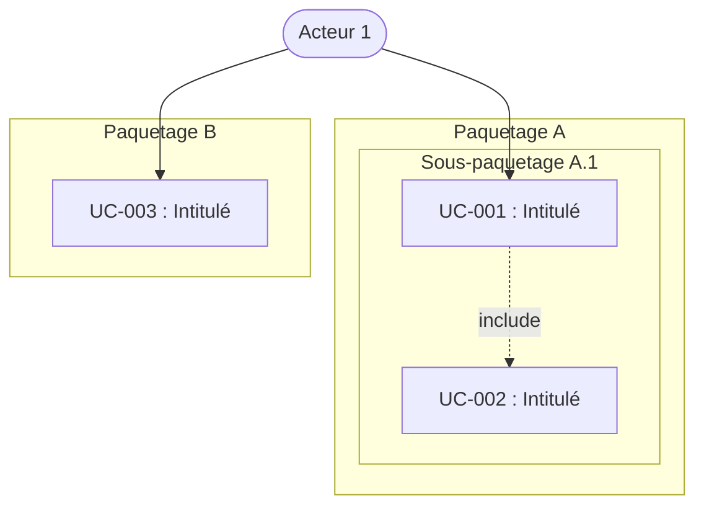
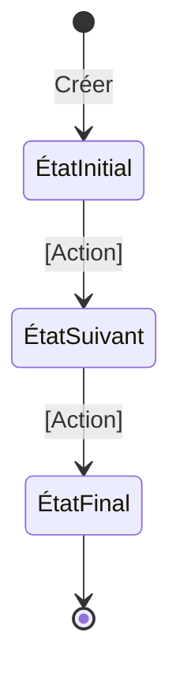

# Template SPEC-racine — Cas d'utilisation (UC)

Ce fichier est le template de référence pour la génération d'une spec racine
(`SPEC-racine-<NomProjet>.md`) structurée par cas d'utilisation. Ne génère jamais
la structure de la spec de mémoire — ce template est la référence. Remplis les
sections au fil du dialogue, supprime les sections marquées comme optionnelles
si elles ne s'appliquent pas, et retire les commentaires HTML avant livraison.

````markdown
# [Nom du projet] — Spécification SDD par cas d'utilisation

> | | |
> |---|---|
> | **Document** | SPEC-racine-[NomProjet].md |
> | **UUID** | `[UUID v4 généré à la création]` |
> | **Version** | 1.0 |
> | **Date** | [YYYY-MM-DD] |
> | **Auteur** | [Nom] |
> | **Statut** | Brouillon |
> | **Type** | Document racine |
> | **Généré par** | sdd-uc-spec-write v2.5.0 |

<!-- CHANGELOG — Ne pas inclure en v1.0. Décommenter à partir de la v1.1.
## Changelog

| Version | Date | Auteur | Modifications |
|---|---|---|---|
| 1.1 | YYYY-MM-DD | [Auteur] | [Description des modifications] |
| 1.0 | YYYY-MM-DD | [Auteur] | Version initiale. |
-->

## Contexte et objectifs

**Ce que le projet fait :** [Une phrase.]

**Pourquoi il existe :** [Le problème résolu ou le besoin couvert.]

**Pour qui :** [L'utilisateur cible.]

**Contraintes structurantes :** [Techniques, réglementaires, de performance. Supprimer si aucune.]

**Acteurs identifiés :**

| Acteur | Rôle |
|---|---|
| [Nom] | [Description du profil et de son interaction avec le système.] |

## Diagramme de contexte

<!-- Supprimer cette section si aucun diagramme de contexte n'est fourni.
     Schéma informel (pas UML) montrant le périmètre du système : acteurs,
     structures organisationnelles, objets principaux, éléments géographiques,
     postes clients, applications. -->

[Diagramme fourni par l'utilisateur ou reproduit en Mermaid/ASCII.]

## Architecture

<!-- Section simplifiée. Traduit les contraintes techniques du contexte.
     Supprimer si aucune contrainte d'architecture n'est identifiée.
     Pour un projet simple, un paragraphe suffit. -->

[Description des contraintes d'architecture technique.]

## Documents de référence

<!-- Supprimer cette section si le projet ne nécessite aucun document complémentaire. -->

| Document | Description |
|---|---|
| DATA-MODEL.md | [Description du contenu.] |

## Niveaux de support

<!-- Supprimer cette section si le projet n'interagit pas avec un système existant,
     du hardware, ou un environnement non contrôlé. Chaque fonctionnalité de l'original
     doit apparaître dans exactement une des trois catégories. -->

### Supporté

| Fonctionnalité | Comportement | UC lié |
|---|---|---|
| [Fonction X] | [Comportement fidèle à l'original] | UC-XXX |

### Ignoré (no-op silencieux)

| Fonctionnalité | Raison |
|---|---|
| [Fonction Y] | [Pourquoi elle est ignorée sans erreur] |

### Erreur explicite

| Fonctionnalité | Message d'erreur | Raison |
|---|---|---|
| [Fonction Z] | "[Message exact]" | [Pourquoi elle est rejetée] |

## Hors périmètre

<!-- Chaque exclusion en une phrase. -->

- [Ce que le logiciel ne fait explicitement pas.]

## Arborescence des cas d'utilisation

<!-- Trois vues complémentaires. Règles structurelles : un paquetage peut
     contenir à la fois des paquetages et des UCs (enfants mixtes) ; max
     7 sous-paquetages par parent, max 10 UCs par paquetage feuille.
     Profondeur recommandée 3, plafond pratique 4, avertissement au-delà. -->

### Carte d'ensemble

<!-- Liste imbriquée Markdown. Paquetages en gras avec count d'UCs entre
     parenthèses ; UCs listés sous leur parent direct (identifiants
     individuels ou plage compacte UC-XXX → UC-YYY). -->

- **[Paquetage A]** ([N] UC)
  - **[Sous-paquetage A.1]** ([N] UC) — UC-XXX, UC-YYY
  - **[Sous-paquetage A.2]** ([N] UC)
    - **[Sous-sous-paquetage A.2.1]** ([N] UC) — UC-ZZZ → UC-WWW
- **[Paquetage B]** ([N] UC) — UC-AAA, UC-BBB

### Fiches paquetage

<!-- Une fiche par paquetage non-feuille, dans l'ordre de la carte d'ensemble.
     Format constant quelle que soit la profondeur. -->

#### Paquetage : [Nom]

**Objectif** — [En une phrase, ce que regroupe le paquetage.]

**Contient :**

| Type | Élément |
|---|---|
| Paquetage | [Nom du sous-paquetage] ([N] UC) |
| UC | UC-XXX — [Intitulé du UC] |

## Diagramme des cas d'utilisation

<!-- Mermaid avec un subgraph par paquetage. Si ≤ 20 UC : un seul diagramme
     global. Si > 20 UC : un diagramme par paquetage racine, plus un
     diagramme « 30 000 pieds » qui ne montre que les paquetages (sans UCs). -->



## Cas d'utilisation détaillés

<!-- Regrouper par paquetage en suivant la profondeur de l'arborescence.
     Chaque UC suit le format exact défini dans references/UC-FORMAT.md.
     Ne pas modifier la structure. Numéroter séquentiellement.
     Ne jamais réutiliser un identifiant supprimé. -->

---

**📦 [Paquetage racine : Nom]**

<!-- Si le paquetage contient des sous-paquetages, ajouter un sous-titre
     pour chaque sous-paquetage avant ses UCs (et ainsi de suite récursivement
     selon la profondeur). -->

**[Sous-paquetage : Nom]**

<!-- Pour chaque UC, reproduire la structure exacte définie dans references/UC-FORMAT.md. -->

## Machines à états

<!-- Supprimer cette section si aucun objet métier n'a un cycle de vie significatif.
     Pour chaque objet à cycle de vie : un diagramme Mermaid des états et un tableau
     des transitions autorisées. La colonne « RG / UC » trace chaque transition vers
     la règle de gestion et le UC qui la pilote, garantissant la cohérence avec
     les UCs détaillés ci-dessus. Une transition non rattachée à au moins un UC est
     un signal d'incomplétude. -->

### Machine à états : [Nom de l'objet]



**Transitions autorisées :**

| De | Vers | Déclencheur | Condition | RG / UC |
|---|---|---|---|---|
| ÉtatInitial | ÉtatSuivant | [Acteur fait quoi] | [Précondition vérifiable] | RG-XXXX (UC-XXX) |

**Invariants :**

- [Énoncé d'un invariant respecté par toutes les transitions.]

## Objets participants

<!-- Supprimer cette section si aucun objet participant n'est identifié globalement.
     Peut inclure des diagrammes d'objets et des diagrammes d'interaction. -->

| Objet | Description |
|---|---|
| [Nom] | [Description de l'entité métier.] |

<!-- Diagrammes d'objets (si fournis) -->

<!-- Diagrammes d'interaction (si fournis) -->

## Exigences non fonctionnelles

<!-- Domaines à considérer : Performance, Sécurité, Fiabilité, Scalabilité,
     Observabilité, Accessibilité, Portabilité.
     Ne documenter que ce qui est pertinent. Marquer le reste en Hors périmètre.
     Supprimer cette section si aucune ENF n'est identifiée. -->

#### ENF-001 : [Titre court]

**Priorité :** [Critique | Important | Souhaité]

**Description :** [Comment le logiciel se comporte, avec des valeurs mesurables.]

**Critères d'acceptation :**

- **CA-ENF-001-01 :** Soit [contexte initial], Quand [action], Alors [résultat attendu avec valeur mesurable].

## Glossaire projet

<!-- Partage de la connaissance métier et résolution des ambiguïtés de vocabulaire.
     Chaque terme métier, technique ou acronyme utilisé dans la spec.
     Un agent IA ne doit jamais avoir à deviner le sens d'un terme.
     Alimenter au fil de la rédaction des cas d'utilisation. -->

| Terme | Définition |
|---|---|
| [Terme] | [Définition.] |

## Glossaire SDD

<!-- Reproduire ici le contenu intégral de references/GLOSSARY-SDD.md (tableau uniquement). -->
````
