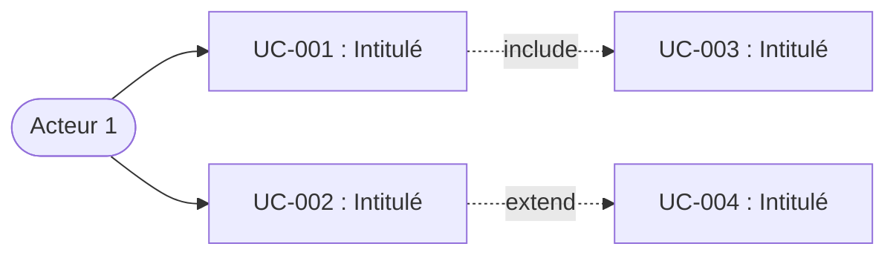

# Template SPEC.md — Cas d'utilisation (UC)

Ce fichier est le template de référence pour la génération d'un SPEC.md structuré
par cas d'utilisation. Ne génère jamais la structure du SPEC.md de mémoire — ce
template est la référence. Remplis les sections au fil du dialogue, supprime les
sections marquées comme optionnelles si elles ne s'appliquent pas, et retire les
commentaires HTML avant livraison.

````markdown
# [Nom du projet] — Spécification SDD (Cas d'utilisation)

Version : 1.0
Date : [YYYY-MM-DD]
Auteur : [Nom]
Statut : Brouillon

<!-- CHANGELOG — Ne pas inclure en v1.0. Décommenter à partir de la v1.1.
## Changelog

| Version | Date | Auteur | Modifications |
|---|---|---|---|
| 1.1 | YYYY-MM-DD | [Auteur] | [Description des modifications] |
| 1.0 | YYYY-MM-DD | [Auteur] | Version initiale. |
-->

## Contexte et objectifs

**Ce que le projet fait :** [Une phrase.]

**Pourquoi il existe :** [Le problème résolu ou le besoin couvert.]

**Pour qui :** [L'utilisateur cible.]

**Contraintes structurantes :** [Techniques, réglementaires, de performance. Supprimer si aucune.]

**Acteurs identifiés :**

| Acteur | Rôle |
|---|---|
| [Nom] | [Description du profil et de son interaction avec le système.] |

## Diagramme de contexte

<!-- Supprimer cette section si aucun diagramme de contexte n'est fourni.
     Schéma informel (pas UML) montrant le périmètre du système : acteurs,
     structures organisationnelles, objets principaux, éléments géographiques,
     postes clients, applications. -->

[Diagramme fourni par l'utilisateur ou reproduit en Mermaid/ASCII.]

## Architecture

<!-- Section simplifiée. Traduit les contraintes techniques du contexte.
     Supprimer si aucune contrainte d'architecture n'est identifiée.
     Pour un projet simple, un paragraphe suffit. -->

[Description des contraintes d'architecture technique.]

## Documents de référence

<!-- Supprimer cette section si le projet ne nécessite aucun document complémentaire. -->

| Document | Description |
|---|---|
| DATA-MODEL.md | [Description du contenu.] |

## Niveaux de support

<!-- Supprimer cette section si le projet n'interagit pas avec un système existant,
     du hardware, ou un environnement non contrôlé. Chaque fonctionnalité de l'original
     doit apparaître dans exactement une des trois catégories. -->

### Supporté

| Fonctionnalité | Comportement | UC lié |
|---|---|---|
| [Fonction X] | [Comportement fidèle à l'original] | UC-XXX |

### Ignoré (no-op silencieux)

| Fonctionnalité | Raison |
|---|---|
| [Fonction Y] | [Pourquoi elle est ignorée sans erreur] |

### Erreur explicite

| Fonctionnalité | Message d'erreur | Raison |
|---|---|---|
| [Fonction Z] | "[Message exact]" | [Pourquoi elle est rejetée] |

## Hors périmètre

<!-- Chaque exclusion en une phrase. -->

- [Ce que le logiciel ne fait explicitement pas.]

## Arborescence des cas d'utilisation

| Package (niveau 2) | Package (niveau 1) | UC | Intitulé |
|---|---|---|---|
| [Epic] | [Feature] | UC-XXX | [Intitulé du UC] |

## Diagramme des cas d'utilisation

<!-- Diagramme global fourni par l'utilisateur ou généré en Mermaid.
     Si > 15-20 UC, découper en un diagramme par package de niveau 2. -->



## Cas d'utilisation détaillés

<!-- Regrouper par package de niveau 2, puis par package de niveau 1.
     Chaque UC suit le format exact ci-dessous. Ne pas modifier la structure.
     Numéroter séquentiellement. Ne jamais réutiliser un identifiant supprimé. -->

---

**📦 [Package niveau 2 : Nom]**

**[Package niveau 1 : Nom]**

<!-- Pour chaque UC, reproduire la structure exacte définie dans references/UC-FORMAT.md. -->

## Objets participants

<!-- Supprimer cette section si aucun objet participant n'est identifié globalement.
     Peut inclure des diagrammes d'objets et des diagrammes d'interaction. -->

| Objet | Description |
|---|---|
| [Nom] | [Description de l'entité métier.] |

<!-- Diagrammes d'objets (si fournis) -->

<!-- Diagrammes d'interaction (si fournis) -->

## Exigences non fonctionnelles

<!-- Domaines à considérer : Performance, Sécurité, Fiabilité, Scalabilité,
     Observabilité, Accessibilité, Portabilité.
     Ne documenter que ce qui est pertinent. Marquer le reste en Hors périmètre.
     Supprimer cette section si aucune ENF n'est identifiée. -->

#### ENF-001 : [Titre court]

**Priorité :** [Critique | Important | Souhaité]

**Description :** [Comment le logiciel se comporte, avec des valeurs mesurables.]

**Critères d'acceptation :**

- **CA-ENF-001-01 :** Soit [contexte initial], Quand [action], Alors [résultat attendu avec valeur mesurable].

## Glossaire projet

<!-- Partage de la connaissance métier et résolution des ambiguïtés de vocabulaire.
     Chaque terme métier, technique ou acronyme utilisé dans la spec.
     Un agent IA ne doit jamais avoir à deviner le sens d'un terme.
     Alimenter au fil de la rédaction des cas d'utilisation. -->

| Terme | Définition |
|---|---|
| [Terme] | [Définition.] |

## Glossaire SDD

<!-- Reproduire ici le contenu intégral de references/GLOSSARY-SDD.md (tableau uniquement). -->
````
