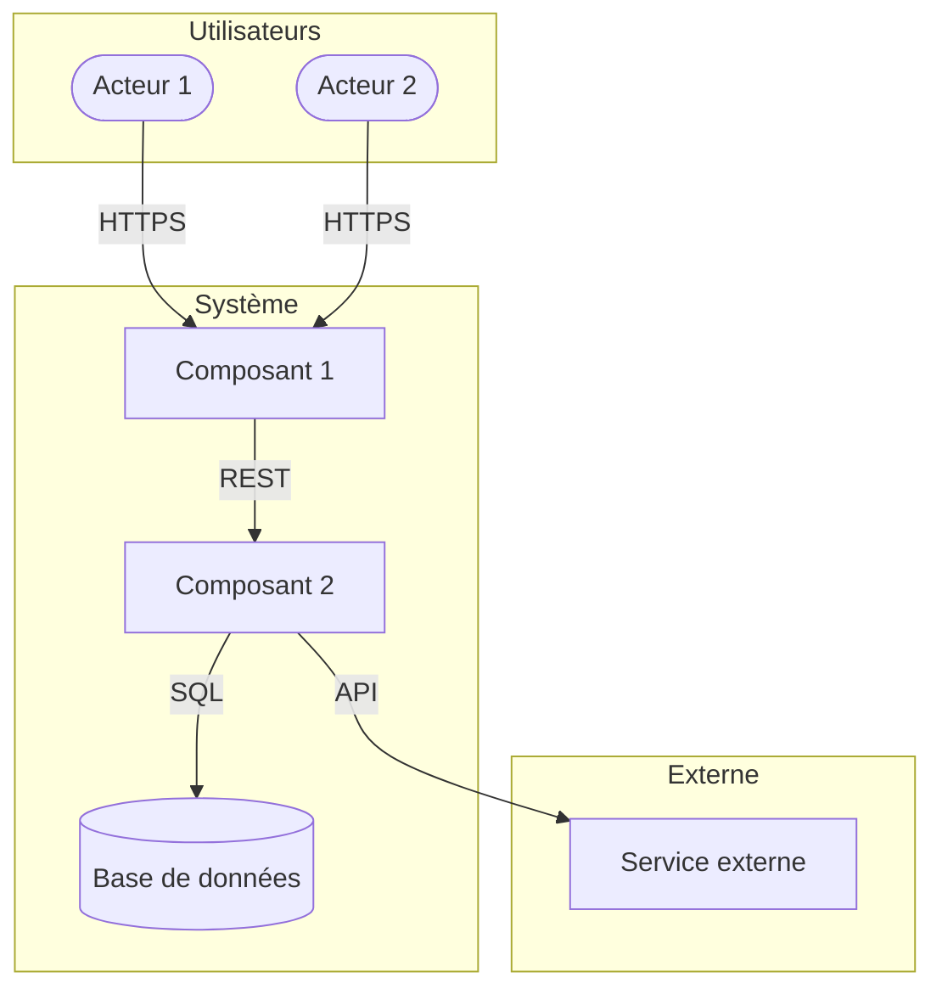
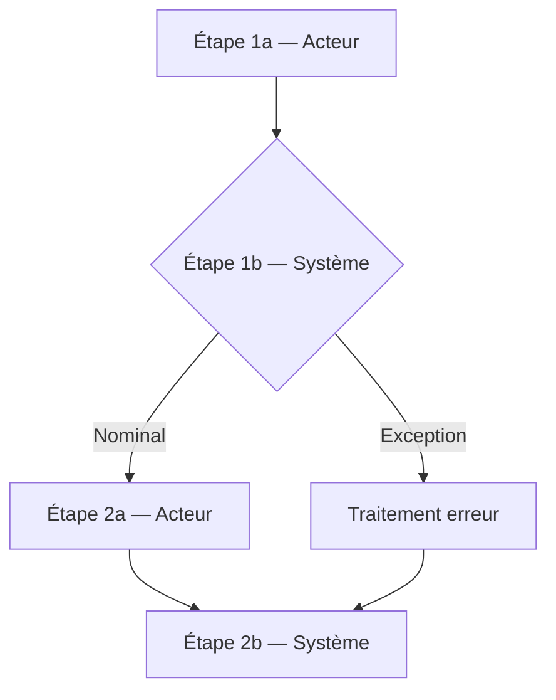
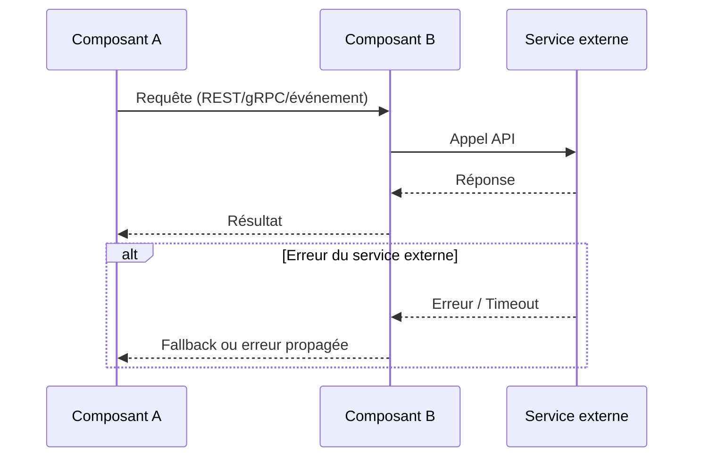
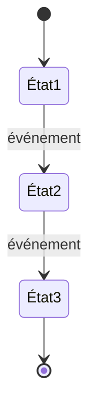

# [Nom du projet] — Architecture

> | | |
> |---|---|
> | **Document** | ARCHITECTURE.md |
> | **Version** | 1.0 |
> | **Date** | [YYYY-MM-DD] |
> | **Auteur** | [Nom] |
> | **Spec de référence** | [nom du fichier SPEC] v[X.Y] |
> | **Généré par** | sdd-uc-system-design v3.3.0 |

## 1. Vue d'ensemble

<!-- Résumé en 3-5 phrases : ce que le système fait, son type (SaaS, client
lourd, driver, etc.), ses caractéristiques architecturales principales
(monolithe, microservices, event-driven, etc.) et ses contraintes structurantes.
Ce paragraphe doit permettre à un lecteur de comprendre le système en 30 secondes.

S'appuyer sur le diagramme de contexte du SPEC.md (si présent) pour situer
le système dans son environnement : acteurs, systèmes adjacents, éléments
géographiques et organisationnels.

Mentionner explicitement ce qui est hors périmètre (section Hors périmètre
du SPEC.md) pour délimiter ce que l'architecture ne couvre PAS. -->

[Description]

**Hors périmètre architectural :** [Résumé des exclusions issues du SPEC.md
qui impactent l'architecture — fonctionnalités non couvertes, intégrations
non prévues, etc.]

## 2. Principes d'architecture

<!-- Lister les principes directeurs qui gouvernent les choix techniques.
Chaque principe est nommé, décrit en une phrase, et justifié par un UC, une RG,
une ENF du SPEC.md ou un besoin métier. 5 à 10 principes maximum.
Exemples : séparation des responsabilités, immutabilité des données,
fail-fast, idempotence, etc. -->

| # | Principe | Description | Justification |
|---|----------|-------------|---------------|
| 1 | [Nom du principe] | [Description en une phrase] | [Réf. UC-xxx / RG-xxxx / ENF-xxx ou raison métier] |

## 3. Stack technique

### 3.1 Choix technologiques

<!-- Chaque choix technique doit être démontré : pas de technologie sans
raison documentée. Pour chaque brique, justifier pourquoi elle a été
retenue ET mentionner au moins une alternative écartée avec la raison
de l'exclusion. Une technologie imposée par le SPEC.md (section Architecture
ou contraintes) est marquée « Imposé » — elle n'a pas besoin d'alternative
mais la contrainte source doit être référencée. -->

| Catégorie | Technologie | Version | Rôle | Justification | Alternative écartée | Raison de l'exclusion | Licence |
|-----------|-------------|---------|------|---------------|--------------------|-----------------------|---------|
| Langage | [ex: Python] | [ex: 3.12+] | [ex: Langage principal] | [ex: Imposé par SPEC.md § Architecture] | — | Imposé | [ex: PSF / MIT] |
| Framework | [ex: FastAPI] | [ex: 0.110+] | [ex: API REST] | [ex: Async natif, typage, performance] | [ex: Django REST Framework] | [ex: Synchrone par défaut, plus lourd pour une API pure] | [ex: MIT] |
| Base de données | [ex: PostgreSQL] | [ex: 16+] | [ex: Stockage principal] | [ex: ACID, JSON natif, extensibilité] | [ex: MySQL 8] | [ex: Types JSON moins riches, pas de types composites] | [ex: PostgreSQL License] |
| <!-- Ajouter : cache, message broker, monitoring, CI/CD, IaC, etc. --> | | | | | | | |

### 3.2 Pérennité des choix technologiques

<!-- Pour chaque technologie retenue en § 3.1, évaluer le risque d'obsolescence.
L'objectif est d'identifier les dépendances fragiles AVANT qu'elles ne
deviennent un problème. Un composant à risque élevé nécessite un plan B
documenté (migration, fork, remplacement). -->

| Technologie | Mainteneur | Dernière release | Fréquence releases | Communauté / Adoption | Risque d'obsolescence | Plan de mitigation |
|-------------|-----------|-----------------|-------------------|----------------------|----------------------|-------------------|
| [ex: Python] | [ex: PSF — fondation, gouvernance ouverte] | [ex: 3.13, oct. 2024] | [ex: Annuelle (majeure), mensuelle (patch)] | [ex: Top 3 mondial, écosystème massif] | [ex: Très faible] | — |
| [ex: FastAPI] | [ex: Sebastián Ramírez — mainteneur unique + contributeurs] | [ex: 0.115, mars 2025] | [ex: ~mensuelle] | [ex: 75k+ GitHub stars, forte adoption] | [ex: Modéré — dépendance à un mainteneur principal] | [ex: Starlette (sous-jacent) est indépendant ; migration vers Litestar si abandon] |
| [ex: Bibliothèque X] | [ex: Développeur individuel] | [ex: v2.1, janv. 2023] | [ex: Dernière release > 2 ans] | [ex: ~500 GitHub stars, peu d'activité] | [ex: Élevé — potentiellement abandonné] | [ex: Évaluer fork ou remplacement par Y avant mise en production] |

<!-- Critères d'évaluation du risque :
- **Très faible** : fondation ou entreprise majeure, gouvernance ouverte, releases régulières, adoption massive.
- **Faible** : équipe active, releases régulières, bonne adoption.
- **Modéré** : mainteneur unique ou petit groupe, releases moins fréquentes, dépendance à surveiller.
- **Élevé** : dernière release > 1 an, peu d'activité, mainteneur inactif, pas de fork actif connu.
- **Critique** : EOL annoncé, vulnérabilités non corrigées, migration nécessaire. -->

### 3.3 Coût de fonctionnement induit

<!-- Estimer les coûts récurrents mensuels de la stack en production.
Distinguer les coûts fixes (licences, instances réservées) des coûts
variables (compute, stockage, bande passante).
Si l'estimation est impossible à ce stade, noter les métriques à surveiller. -->

| Poste | Service | Estimation mensuelle | Type | Hypothèses |
|-------|---------|---------------------|------|------------|
| Compute | [ex: Azure App Service P1v3] | [ex: ~120€] | Fixe | [ex: 1 instance, région France Central] |
| Base de données | [ex: Azure PostgreSQL Flexible] | [ex: ~80€] | Fixe | [ex: 2 vCores, 32 Go stockage] |
| Stockage | [ex: Azure Blob Storage] | [ex: ~5-20€] | Variable | [ex: 50-200 Go, LRS, accès occasionnel] |
| <!-- Ajouter : CDN, DNS, monitoring, secrets, backup, etc. --> | | | | |

**Coût total estimé :** [fourchette mensuelle]

**Remarques :**
<!-- Préciser les hypothèses de dimensionnement, les seuils de passage au
palier supérieur, les offres gratuites utilisées (free tier), etc. -->

## 4. Architecture détaillée

### 4.1 Diagramme d'architecture

<!-- Diagramme haut niveau montrant tous les composants du système et leurs
interactions. C'est le schéma principal du document : un lecteur doit pouvoir
comprendre l'architecture en le lisant seul. Utiliser Mermaid (flowchart ou
C4-style). Inclure :
- Les composants internes (backend, frontend, workers, etc.)
- Les systèmes externes (APIs tierces, services cloud managés)
- Les acteurs (issus du SPEC.md)
- Les flux principaux entre composants (protocole, direction)
- Les frontières de déploiement (réseau, cloud, on-premise) si pertinent -->



**Description :** [Explication textuelle des grands blocs, de leurs rôles et
de leurs interactions. Référencer les composants détaillés en § 4.2.]

### 4.2 Composants

<!-- Chaque composant est un module autonome avec une responsabilité unique.
Si un composant a deux responsabilités reliées par "et", le découper en deux.
Référencer les UC et RG du SPEC.md que chaque composant adresse. -->

| Composant | Responsabilité | Interfaces exposées | Dépendances | UC couverts | RG implémentées |
|-----------|---------------|---------------------|-------------|-------------|-----------------|
| [Nom] | [Responsabilité en 1-2 phrases] | [Noms et type : REST, gRPC, événement, fichier] | [Composants ou services externes] | [UC-xxx, UC-yyy] | [RG-xxxx] |

#### Matrice de traçabilité UC → Composants

<!-- Matrice montrant quel composant implémente quel UC.
Garantit la couverture complète de la spec.
La colonne Priorité (issue du SPEC.md) guide les arbitrages :
un UC Critique impose des choix architecturaux non négociables,
un UC Souhaité peut accepter des compromis. -->

| UC | Intitulé | Priorité | Composant(s) |
|---|---|---|---|
| UC-001 | [Intitulé] | [Critique / Important / Souhaité] | [Composant principal + composants impliqués] |

### 4.3 Diagrammes de flux (flowchart)

<!-- Un diagramme par flux métier principal, issu des étapes Na/Nb des UC.
Utiliser la syntaxe Mermaid. Chaque nœud correspond à un composant ou
une action. Nommer le flux et référencer les UC couverts. -->

#### Flux : [Nom du flux] (réf. UC-xxx, UC-yyy)



**Description :** [Explication textuelle du flux, cas nominaux et exceptions]

### 4.4 Diagrammes de séquence (intégrations)

<!-- Un diagramme par intégration inter-composants ou avec un système externe.
Montrer l'enchaînement des appels entre composants, les protocoles utilisés,
les données échangées et les cas d'erreur. Issus des flux d'intégration et
d'événements identifiés en phase A.4. -->

#### Intégration : [Nom] (réf. UC-xxx)



**Description :** [Protocole, authentification, SLA du tiers, garantie de
livraison (at-least-once, exactly-once), comportement en cas d'indisponibilité]

### 4.5 Diagrammes de transition d'état

<!-- Un diagramme par entité ayant un cycle de vie (statuts, états).
Utiliser la syntaxe Mermaid stateDiagram-v2.
Source : les champs État initial et État final de chaque UC du SPEC.md
révèlent les transitions. En chaînant les UC qui partagent les mêmes
entités, on reconstitue le cycle de vie complet. -->

#### Entité : [Nom de l'entité]



**Description :** [Explication des transitions, conditions de garde, actions déclenchées]

### 4.6 Inventaire des données

<!-- Basé sur les objets participants du SPEC.md, enrichi lors de l'étape A.3.
Pour chaque entité, décrire les attributs principaux, le volume attendu,
la sensibilité et la durée de rétention. -->

| Entité | Description | Attributs clés | Volume estimé | Sensibilité | Rétention | Stockage |
|--------|-------------|---------------|---------------|-------------|-----------|----------|
| [Nom — issu des objets participants] | [Description] | [Liste des attributs principaux] | [ex: ~10k enregistrements/an] | [Public / Interne / Confidentiel / Secret] | [ex: 5 ans] | [ex: PostgreSQL, table `xxx`] |

### 4.7 Initialisation des données

<!-- Décrire les données nécessaires avant le premier démarrage du système :
données de référence, configuration initiale, migrations, seeds.
Préciser la source, le format, et la procédure de chargement. -->

| Donnée | Source | Format | Procédure de chargement | Fréquence de mise à jour |
|--------|--------|--------|------------------------|-------------------------|
| [ex: Référentiel codes postaux] | [ex: data.gouv.fr] | [ex: CSV] | [ex: Script `scripts/seed_postal_codes.py`] | [ex: Annuelle] |

## 5. Propriétés non-fonctionnelles

<!-- Traduire les ENF du SPEC.md et les contraintes non-fonctionnelles
rattachées aux UC en décisions architecturales concrètes. Pour chaque
propriété, indiquer le seuil chiffré, la décision architecturale prise
pour l'atteindre, et la référence SPEC.md. Les propriétés non couvertes
par le SPEC.md mais nécessaires architecturalement sont aussi documentées. -->

| Propriété | Seuil / Objectif | Décision architecturale | Référence SPEC.md |
|-----------|-----------------|------------------------|-------------------|
| [ex: Temps de réponse API] | [ex: < 200ms au P95] | [ex: Cache Redis sur les endpoints de lecture, index composites PostgreSQL] | [ex: ENF-001, CA-ENF-001-01] |
| [ex: Disponibilité] | [ex: 99.9% (8h45 d'indisponibilité/an)] | [ex: Multi-AZ, health checks, failover automatique] | [ex: ENF-003] |
| [ex: Scalabilité] | [ex: Jusqu'à 10k utilisateurs simultanés] | [ex: Stateless, auto-scaling horizontal] | [ex: Fréquence UC-002 × volume acteurs] |
| [ex: Observabilité] | [ex: Détection d'anomalie < 5 min] | [ex: Métriques Prometheus, alertes Grafana, logs structurés JSON] | [ex: Besoin implicite — pas d'ENF explicite] |
| <!-- Axes à couvrir : Performance, Scalabilité, Disponibilité, Résilience,
     Observabilité, Maintenabilité, Portabilité, Coût. Supprimer les lignes
     non pertinentes pour le projet. --> | | | |

## 6. Décisions d'architecture

<!-- Consigner les décisions structurantes prises pendant la conception.
Chaque décision documente le contexte, les options évaluées, le choix
retenu et ce qui a été sacrifié. Ces décisions sont la mémoire du projet :
elles expliquent pourquoi l'architecture est ce qu'elle est, et évitent
de reouvrir les mêmes débats plus tard. -->

### ADR-001 : [Titre de la décision]

**Contexte :** [Quel problème ou quelle tension a mené à cette décision ?
Référencer les UC/ENF/RG concernés.]

**Options évaluées :**

| Option | Avantages | Inconvénients |
|--------|-----------|---------------|
| [Option A] | [Avantages] | [Inconvénients] |
| [Option B] | [Avantages] | [Inconvénients] |

**Décision :** [Option retenue et pourquoi.]

**Conséquences :** [Ce qui est gagné et ce qui est sacrifié. Impact sur les
autres composants, les performances, la maintenabilité, les coûts.]

**Statut :** [Décidé | En discussion | Remplacé par ADR-xxx]

<!-- Ajouter un ADR par décision structurante. Exemples de décisions
typiques : monolithe vs microservices, choix du message broker, stratégie
de cache, modèle de données (SQL vs NoSQL), stratégie d'authentification,
découpage des composants. -->

## 7. Structure du répertoire projet

<!-- Arborescence du projet reflétant l'architecture.
Chaque répertoire de premier niveau a un commentaire expliquant son rôle.
Cette structure est la référence pour l'implémentation. -->

```
project-root/
├── docs/                    # Documents de conception (ce fichier, DEPLOYMENT.md, etc.)
│   ├── ARCHITECTURE.md
│   ├── DEPLOYMENT.md
│   ├── SECURITY.md
│   └── COMPLIANCE_MATRIX.md
├── src/                     # Code source
│   ├── [composant_1]/       # [Responsabilité du composant 1]
│   ├── [composant_2]/       # [Responsabilité du composant 2]
│   └── ...
├── tests/                   # Tests automatisés
│   ├── unit/
│   ├── integration/
│   └── e2e/
├── scripts/                 # Scripts utilitaires (seed, migration, etc.)
├── config/                  # Configuration par environnement
├── infra/                   # Infrastructure as Code (Terraform, Docker, etc.)
├── SPEC.md                  # Spécification SDD (cas d'utilisation)
├── README.md                # Guide de démarrage rapide
└── ...
```

## 8. Glossaire technique

<!-- Termes techniques spécifiques au projet et à son architecture.
Le glossaire projet du SPEC.md est la base : ne pas dupliquer les termes
métier qui y sont déjà définis, y renvoyer (« Voir SPEC.md § Glossaire
projet »). Ici, ne documenter que les termes architecturaux et techniques
absents du glossaire projet : acronymes techniques, noms de composants,
patterns d'architecture, termes d'infrastructure. -->

| Terme | Définition |
|-------|-----------|
| [Terme] | [Définition] |

## 9. Documents de référence

<!-- Lister tous les documents liés à l'architecture.
Inclure les documents du SPEC.md et les documents produits par ce skill. -->

| Document | Description | Relation |
|----------|-------------|----------|
| SPEC.md | Spécification fonctionnelle SDD (cas d'utilisation) | Source des exigences |
| DEPLOYMENT.md | Procédures de déploiement | Consomme l'architecture |
| SECURITY.md | Exigences de sécurité | Contraint l'architecture |
| COMPLIANCE_MATRIX.md | Matrice de conformité | Contraint l'architecture (si applicable) |

---

## Changelog

<!-- Ne pas inclure en v1.0. Décommenter à partir de la v1.1.

| Version | Date | Auteur | Modifications |
|---------|------|--------|---------------|
| 1.1 | YYYY-MM-DD | [Auteur] | [Description des modifications] |
| 1.0 | YYYY-MM-DD | [Auteur] | Version initiale |
-->
