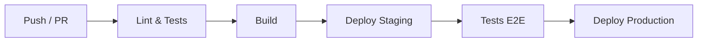

# [Nom du projet] — Déploiement

> | | |
> |---|---|
> | **Document** | DEPLOYMENT.md |
> | **Version** | 1.0 |
> | **Date** | [YYYY-MM-DD] |
> | **Auteur** | [Nom] |
> | **Spec de référence** | [nom du fichier SPEC] v[X.Y] |
> | **Architecture de référence** | ARCHITECTURE.md v[X.Y] |
> | **Généré par** | sdd-uc-system-design v3.3.0 |

## 1. Vue d'ensemble du déploiement

<!-- Résumé en 3-5 phrases : type de déploiement, environnements cibles,
fréquence de déploiement visée, responsabilités. -->

[Description]

**Type de solution :** [SaaS | Client lourd | Driver | Bibliothèque | CLI | Autre]

## 2. Prérequis

### 2.1 Prérequis infrastructure

<!-- Matériel, réseau, OS, services cloud nécessaires.
Être exhaustif : un ingénieur doit pouvoir partir de zéro. -->

| Prérequis | Spécification | Obligatoire | Notes |
|-----------|--------------|-------------|-------|
| [ex: Serveur Linux] | [ex: Ubuntu 22.04+, 4 vCPU, 8 Go RAM] | Oui | [ex: Production uniquement] |

### 2.2 Prérequis logiciels

| Logiciel | Version minimale | Rôle | Installation |
|----------|-----------------|------|-------------|
| [ex: Docker] | [ex: 24.0+] | [ex: Conteneurisation] | [ex: `apt install docker-ce`] |

### 2.3 Prérequis réseau

<!-- Ports, protocoles, domaines, certificats nécessaires. -->

| Port / Protocole | Direction | Usage | Obligatoire |
|-----------------|-----------|-------|-------------|
| [ex: 443/TCP] | [ex: Entrant] | [ex: HTTPS API] | [ex: Oui] |

### 2.4 Prérequis secrets et credentials

<!-- Lister tous les secrets nécessaires au déploiement SANS révéler de valeurs.
Indiquer où et comment les provisionner. -->

| Secret | Usage | Source | Rotation |
|--------|-------|--------|----------|
| [ex: DATABASE_URL] | [ex: Connexion PostgreSQL] | [ex: Vault / Variable d'env] | [ex: 90 jours] |

## 3. Environnements

<!-- Décrire chaque environnement, ses spécificités et ses différences
avec la production. -->

| Environnement | Usage | Infra | Données | Accès |
|--------------|-------|-------|---------|-------|
| dev | Développement local | [ex: Docker Compose] | [ex: Seeds, données fictives] | [ex: Développeurs] |
| staging | Pré-production | [ex: Identique prod, taille réduite] | [ex: Copie anonymisée] | [ex: Équipe QA] |
| production | Production | [ex: Voir ARCHITECTURE.md § 3] | [ex: Données réelles] | [ex: Ops uniquement] |

## 4. Configuration par environnement

<!-- Lister toutes les variables de configuration qui changent entre
environnements. Distinguer les variables obligatoires des optionnelles.
Ne JAMAIS documenter les valeurs des secrets ici — indiquer seulement
le nom et le type. -->

| Variable | Description | Dev | Staging | Production | Obligatoire |
|----------|-------------|-----|---------|-----------|-------------|
| [ex: DATABASE_URL] | [ex: Connexion PostgreSQL] | [ex: `postgres://localhost/dev`] | [ex: Via Vault] | [ex: Via Vault] | Oui |
| [ex: LOG_LEVEL] | [ex: Niveau de journalisation] | [ex: `DEBUG`] | [ex: `INFO`] | [ex: `WARNING`] | Non (défaut: `INFO`) |
| [ex: FEATURE_NEW_UI] | [ex: Feature flag nouvelle interface] | [ex: `true`] | [ex: `true`] | [ex: `false`] | Non (défaut: `false`) |

## 5. Procédure de build

<!-- Étapes pour construire les artefacts déployables.
Reproductible par un agent IA ou un pipeline CI/CD. -->

### 5.1 Build applicatif

```bash
# Commandes de build
```

### 5.2 Artefacts produits

| Artefact | Type | Destination | Taille estimée |
|----------|------|-------------|---------------|
| [ex: app:latest] | [ex: Image Docker] | [ex: Container Registry] | [ex: ~200 Mo] |

## 6. Procédure de déploiement

### 6.1 Premier déploiement (installation initiale)

<!-- Procédure pas à pas pour un déploiement from scratch.
Inclure l'initialisation des données (voir ARCHITECTURE.md § 4.7). -->

1. [Étape 1 — Provisioning infrastructure]
2. [Étape 2 — Configuration des secrets]
3. [Étape 3 — Déploiement des composants]
4. [Étape 4 — Initialisation des données (voir ARCHITECTURE.md § 4.7)]
5. [Étape 5 — Vérification des health checks (voir § 8)]
6. ...

### 6.2 Mise à jour (déploiement courant)

<!-- Procédure pour une mise à jour standard. -->

**Stratégie :** [Rolling | Blue-Green | Canary | Manuelle]

1. [Étape 1]
2. [Étape 2]
3. ...

### 6.3 Rollback

<!-- Procédure pour revenir à la version précédente.
Doit être testée et documentée. -->

1. [Étape 1]
2. [Étape 2]
3. ...

**Temps estimé de rollback :** [durée]

## 7. Pipeline CI/CD

<!-- Décrire le pipeline d'intégration et de déploiement continu.
Outil, étapes, déclencheurs, environnements cibles. -->



| Étape | Outil | Déclencheur | Actions | Durée estimée |
|-------|-------|-------------|---------|---------------|
| [ex: Lint & Tests] | [ex: GitHub Actions] | [ex: Push sur main] | [ex: ruff, pytest] | [ex: ~3 min] |

## 8. Health checks et readiness

<!-- Définir comment le système signale qu'il est opérationnel. Ces endpoints
sont utilisés par les orchestrateurs (Kubernetes, load balancers) et le
monitoring. Applicables à tout type de solution (SaaS, CLI, client lourd
avec composant serveur). -->

| Endpoint / Mécanisme | Type | Vérifications | Réponse OK | Réponse KO | Fréquence |
|----------------------|------|---------------|-----------|-----------|-----------|
| [ex: `GET /health`] | [ex: Liveness] | [ex: Le processus répond] | [ex: 200 `{"status": "ok"}`] | [ex: 503 ou timeout] | [ex: 10s] |
| [ex: `GET /ready`] | [ex: Readiness] | [ex: DB accessible, cache chaud, migrations OK] | [ex: 200 `{"status": "ready"}`] | [ex: 503 `{"status": "not_ready", "checks": {...}}`] | [ex: 10s] |

**Critères de readiness pour le premier déploiement :**
<!-- Quelles conditions doivent être remplies avant de considérer le système
comme opérationnel après un déploiement initial ? -->

- [ ] [ex: Migrations de base de données exécutées]
- [ ] [ex: Données de référence chargées (voir ARCHITECTURE.md § 4.7)]
- [ ] [ex: Health check liveness OK]
- [ ] [ex: Health check readiness OK]

## 9. Monitoring et observabilité

### 9.1 Métriques

| Métrique | Source | Seuil d'alerte | Action |
|----------|--------|---------------|--------|
| [ex: CPU %] | [ex: Azure Monitor] | [ex: > 80% pendant 5 min] | [ex: Scale-up automatique] |

### 9.2 Logs

| Source | Destination | Rétention | Format |
|--------|-------------|-----------|--------|
| [ex: Application] | [ex: Azure Log Analytics] | [ex: 30 jours] | [ex: JSON structuré] |

### 9.3 Alertes

| Alerte | Condition | Canal | Destinataire |
|--------|-----------|-------|-------------|
| [ex: Service down] | [ex: Health check KO > 2 min] | [ex: Slack #ops] | [ex: Équipe ops] |

## 10. Sauvegarde et restauration

| Donnée | Méthode | Fréquence | Rétention | Test de restauration |
|--------|---------|-----------|-----------|---------------------|
| [ex: Base PostgreSQL] | [ex: pg_dump automatisé] | [ex: Quotidien] | [ex: 30 jours] | [ex: Mensuel] |

**Procédure de restauration :**

1. [Étape 1]
2. [Étape 2]
3. ...

## 11. Disaster recovery

<!-- Plan de reprise d'activité en cas de perte majeure (panne cloud,
corruption de données, incident de sécurité). S'applique à tout type de
solution. Les objectifs RPO/RTO sont issus des ENF de la spec ou des
arbitrages de la phase A.6. -->

| Métrique | Objectif | Mécanisme | Test |
|----------|---------|-----------|------|
| **RPO** (perte de données max) | [ex: 1 heure] | [ex: Réplication async, backups horaires] | [ex: Simulation trimestrielle] |
| **RTO** (temps de reprise max) | [ex: 4 heures] | [ex: Procédure de restauration documentée, infra as code] | [ex: Exercice semestriel] |

**Scénarios de sinistre et procédures :**

| Scénario | Impact | Procédure de reprise | Responsable |
|----------|--------|---------------------|-------------|
| [ex: Perte de la région cloud principale] | [ex: Service totalement indisponible] | [ex: Basculement sur région secondaire, restauration backup] | [ex: Ops] |
| [ex: Corruption de la base de données] | [ex: Données incohérentes] | [ex: Restauration du dernier backup vérifié, rejeu des événements] | [ex: DBA + Ops] |
| [ex: Compromission d'un secret] | [ex: Accès non autorisé potentiel] | [ex: Rotation immédiate, audit des accès, voir SECURITY.md § 9] | [ex: SecOps] |

<!-- ================================================================
     SECTIONS SPÉCIFIQUES PAR TYPE DE SOLUTION
     Selon le type identifié en § 1, inclure les sections du sous-template
     correspondant dans references/ :
     - SaaS → references/TEMPLATE-DEPLOYMENT-SAAS.md
     - Client lourd → references/TEMPLATE-DEPLOYMENT-DESKTOP.md
     - Driver → references/TEMPLATE-DEPLOYMENT-DRIVER.md
     - Logiciel embarqué (mobile, TPE, terminal pro, dev board) → references/TEMPLATE-DEPLOYMENT-EMBEDDED.md
     Supprimer ce commentaire et les sections non applicables.
     ================================================================ -->

---

## Changelog

<!-- Ne pas inclure en v1.0. Décommenter à partir de la v1.1.

| Version | Date | Auteur | Modifications |
|---------|------|--------|---------------|
| 1.1 | YYYY-MM-DD | [Auteur] | [Description des modifications] |
| 1.0 | YYYY-MM-DD | [Auteur] | Version initiale |
-->
