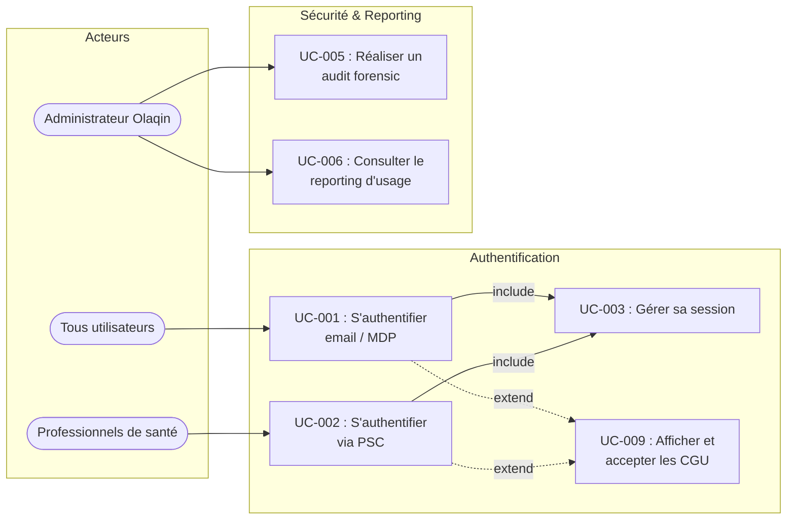
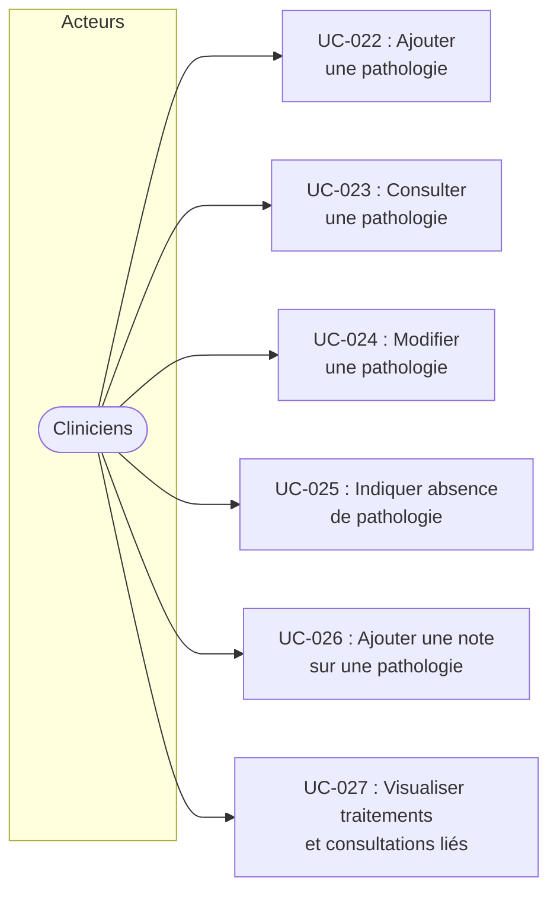
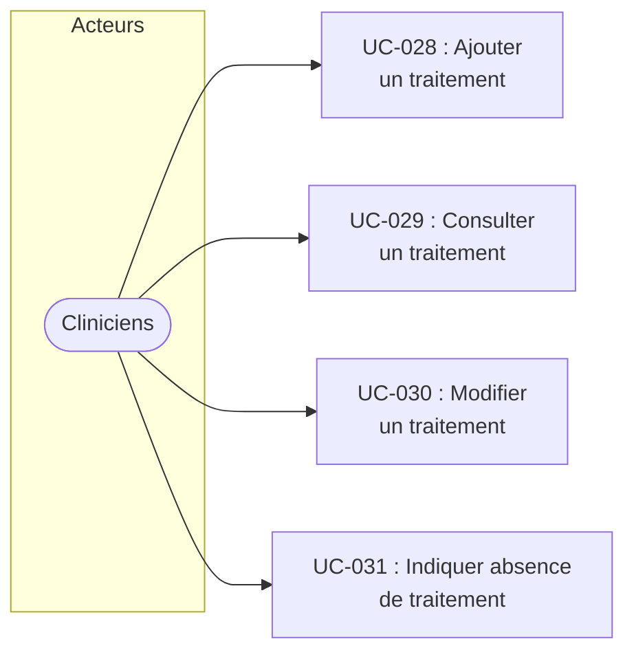
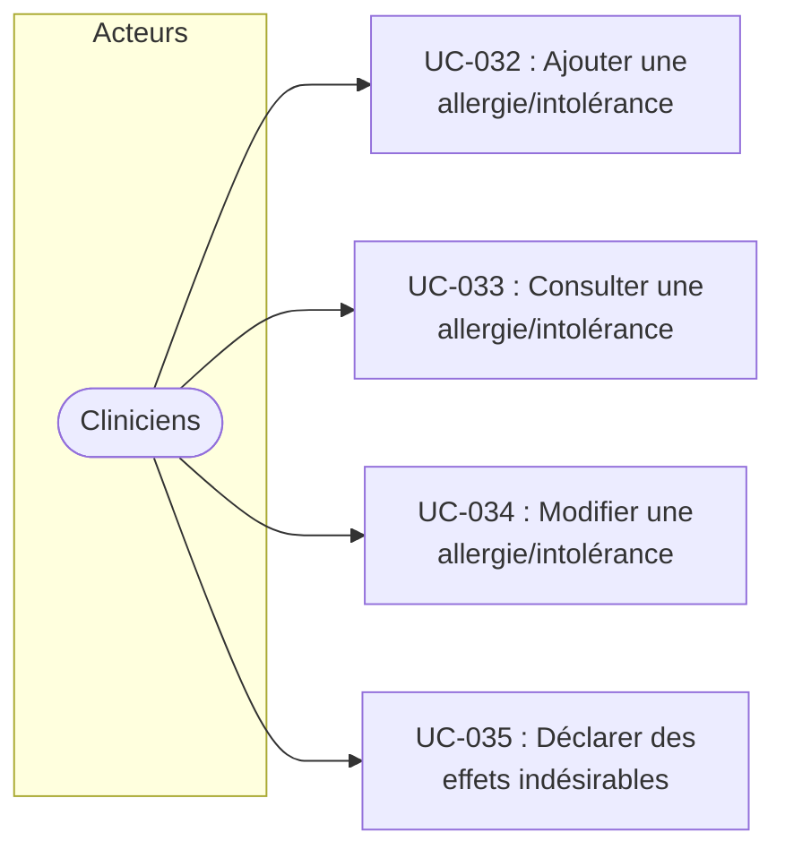
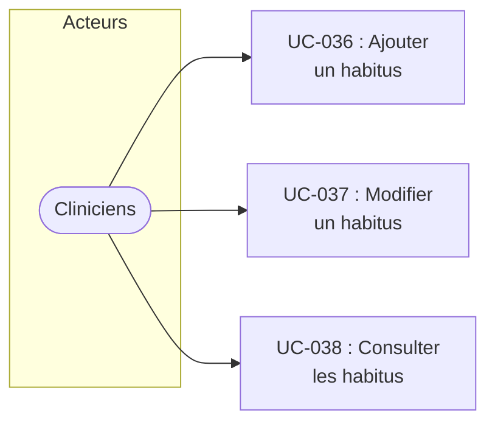
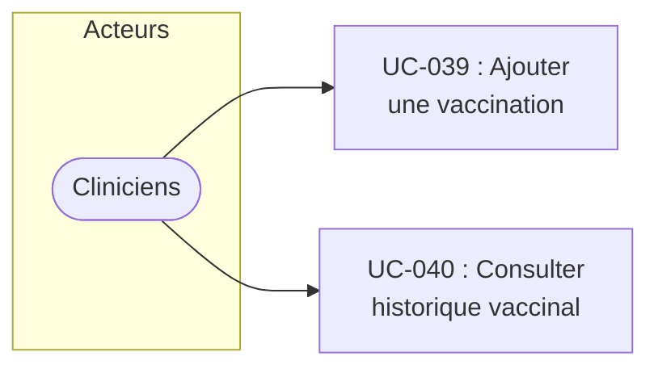
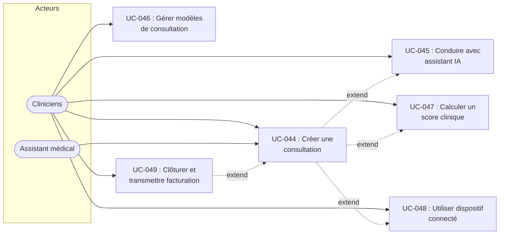

# Stellair LGC — Spécification SDD (Cas d'utilisation)

Version : 1.0
Date : 2026-02-25
Auteur : Équipe produit Olaqin
Statut : Brouillon

<!-- CHANGELOG — Ne pas inclure en v1.0. Décommenter à partir de la v1.1.
## Changelog

| Version | Date | Auteur | Modifications |
|---|---|---|---|
| 1.1 | YYYY-MM-DD | Équipe produit Olaqin | [Description des modifications] |
| 1.0 | 2026-02-25 | Équipe produit Olaqin | Version initiale. |
-->

## Contexte et objectifs

**Ce que le projet fait :** Stellair LGC est un logiciel de gestion de cabinet (LGC) en mode SaaS destiné aux médecins libéraux, couvrant le dossier médical patient, la prescription, la communication inter-professionnelle, l'agenda et l'aide à la décision médicale.

**Pourquoi il existe :** Les médecins libéraux ont besoin d'une solution moderne, accessible depuis n'importe quel poste connecté, intégrant les exigences du Ségur du numérique en santé (INS, DMP, MSSanté, ordonnance numérique, PSC) et s'interfaçant avec la solution de facturation/télétransmission Stellair Intégral déjà éditée par Olaqin.

**Pour qui :** Médecins libéraux exerçant seul ou à plusieurs en cabinet — avec une cible progressive : V0 (psychiatres), V1 (généralistes et spécialistes de ville), V2 (MSP et centres de santé).

**Contraintes structurantes :**

- **SaaS obligatoire** — Application hébergée dans le cloud, accessible via navigateur web, sans installation locale.
- **Architecture 3-tiers** — Séparation stricte frontend / backend / base de données.
- **HDS** — Hébergement des données de santé confié à un hébergeur certifié HDS (Claranet ou Cloud). Olaqin assure l'activité 5 (administration et exploitation du système d'information de santé).
- **RGPD** — Conformité au règlement général sur la protection des données.
- **SEGUR** — Référencement Ségur du numérique en santé (INS, DMP, MSSanté, ordonnance numérique, e-prescription).
- **PSC** — Authentification des professionnels de santé via Pro Santé Connect, au travers d'un composant proxy e-santé.

**Acteurs identifiés :**

| Acteur | Rôle |
|---|---|
| Médecin titulaire | Praticien libéral exerçant en cabinet, utilisateur principal du système. Accès complet à toutes les fonctions cliniques, prescriptions et administration de son activité. |
| Médecin remplaçant | Praticien assurant le remplacement d'un titulaire. Accès aux fonctions cliniques et de prescription dans le cadre du remplacement. |
| Interne / Docteur junior | Praticien en formation exerçant sous la responsabilité d'un titulaire. Prescription encadrée. |
| Professionnel de santé non médecin | Professionnel de santé habilité à prescrire dans son domaine de compétence (sage-femme, infirmier, etc.). Prescription limitée. |
| Assistant médical | Personnel assurant des tâches d'assistance au praticien. Accès en consultation aux dossiers et prescriptions, pas de droit de prescription. |
| Employé administratif | Personnel en charge de l'accueil, de la gestion administrative et de la planification. Accès limité aux données administratives. |
| Patient | Personne prise en charge. Interaction limitée : prise de rendez-vous en ligne. |
| Cron / services système | Tâches automatisées : rappels, synchronisations, purges, alertes. |
| Administrateur Olaqin | Personnel Olaqin en charge du support éditeur, de l'administration technique, des audits de sécurité et du reporting d'usage. |

## Diagramme de contexte

Le diagramme ci-dessous présente le périmètre de Stellair LGC et les systèmes avec lesquels il interagit.

## Architecture

Architecture imposée de haut niveau :

- **SaaS / Web** — Application accessible via navigateur, aucune installation locale.
- **3-tiers** — Frontend (interface utilisateur web), Backend (API et logique métier), Base de données (données patients et configuration).
- **Proxy e-santé** — Composant intermédiaire gérant l'authentification PSC et l'accès aux téléservices de santé (INSi, DMP, MSSanté, ordonnance numérique).
- **Interface Stellair Intégral** — Communication inter-applications avec le logiciel de facturation/télétransmission d'Olaqin.
- **Hébergement HDS** — Données de santé hébergées chez un hébergeur certifié HDS. Olaqin assure l'activité 5.

## Niveaux de support

### Systèmes externes — Niveau de support

| Système externe | Niveau | Commentaire |
|---|---|---|
| **INSi** (Identité Nationale de Santé) | À qualifier | Appel réel à planifier. Simulation implémentée. |
| **Annuaire Santé** (RPPS, ADELI, FINESS) | À qualifier | Simulation implémentée. Intégration API réelle à planifier. |
| **MSSanté** (Messagerie Sécurisée de Santé) | À qualifier | Structure prête. Envoi/réception réelle à implémenter. |
| **DMP / Mon Espace Santé** | À qualifier | Alimentation réelle à planifier. |
| **Pro Santé Connect** (PSC) | À qualifier | Via proxy e-santé. À implémenter. |
| **Synapse Medicine** (LAP) | À qualifier | Intégration à planifier. |
| **Ordonnance numérique** | À qualifier | À planifier. |
| **Stellair Intégral** (Facturation) | À qualifier | Interface inter-applications à définir. |
| **Nomenclatures** (CIM-10, LOINC, CIP13, SNOMED CT, ATC) | À qualifier | Champs prêts, API non intégrées. |

Les niveaux de support détaillés (Supporté / Ignoré / Erreur) seront qualifiés au fil de la rédaction des cas d'utilisation, pour chaque fonctionnalité de chaque système externe.

## Hors périmètre

- Facturation et télétransmission des actes — assurées par Stellair Intégral (logiciel séparé d'Olaqin). Seule l'interface de communication inter-applications est dans le périmètre.
- Application mobile native — Stellair LGC est une application web uniquement, accessible via navigateur.
- MSP et centres de santé — Cible V2, pas dans le périmètre V0/V1.
- Infrastructure et hébergement — Gestion serveurs, sauvegardes, monitoring infrastructure. L'hébergement HDS est confié à un tiers certifié.

## Arborescence des cas d'utilisation

| Package (niveau 2) | Package (niveau 1) | UC | Intitulé |
|---|---|---|---|
| **Authentification & Sécurité** | Authentification | UC-001 | S'authentifier par email / mot de passe |
| | | UC-002 | S'authentifier via Pro Santé Connect |
| | | UC-003 | Gérer sa session (JWT, refresh, déconnexion) |
| | Sécurité SEGUR | *(Reclassé en ENF)* | *(Exigences de sécurité SEGUR traitées en ENF)* |
| | | UC-005 | Réaliser un audit forensic |
| | Reporting | UC-006 | Consulter le reporting d'usage en temps réel |
| **Administration structure** | Gestion de la structure | UC-007 | Configurer la structure médicale |
| | Gestion des utilisateurs | UC-008 | Créer et gérer un compte utilisateur |
| | | UC-009 | Afficher et accepter les CGU |
| | | UC-010 | Renseigner les informations complémentaires du praticien |
| | Préférences | UC-011 | Configurer les préférences utilisateur |
| **Dossier patient** | Identité & fiche administrative | UC-012 | Rechercher un patient (header) |
| | | UC-013 | Rechercher un patient (recherche avancée) |
| | | UC-014 | Créer la fiche administrative d'un patient manuellement |
| | | UC-015 | Créer la fiche administrative via lecture carte Vitale |
| | | UC-016 | Appeler le téléservice INSi |
| | | UC-017 | Renouveler un appel INSi |
| | | UC-018 | Restituer et qualifier l'INS d'un patient |
| | | UC-019 | Consulter la fiche administrative d'un patient |
| | | UC-020 | Modifier la fiche administrative d'un patient |
| | | UC-021 | Gérer la file active des patients |
| | Pathologies | UC-022 | Ajouter une pathologie (codification CIM-10) |
| | | UC-023 | Consulter les informations d'une pathologie |
| | | UC-024 | Modifier une pathologie existante |
| | | UC-025 | Indiquer une absence de pathologie |
| | | UC-026 | Ajouter une note sur une pathologie |
| | | UC-027 | Visualiser traitements et consultations liés à une pathologie |
| | Traitements | UC-028 | Ajouter un traitement (codification CIP13/ATC) |
| | | UC-029 | Consulter les informations d'un traitement |
| | | UC-030 | Modifier un traitement existant |
| | | UC-031 | Indiquer une absence de traitement |
| | Allergies | UC-032 | Ajouter une allergie ou une intolérance |
| | | UC-033 | Consulter une allergie ou une intolérance |
| | | UC-034 | Modifier une allergie ou une intolérance |
| | | UC-035 | Déclarer des effets indésirables |
| | Habitus & modes de vie | UC-036 | Ajouter un habitus |
| | | UC-037 | Modifier un habitus |
| | | UC-038 | Consulter la liste des habitus d'un patient |
| | Vaccinations | UC-039 | Ajouter une vaccination avec gestion des rappels |
| | | UC-040 | Consulter l'historique vaccinal d'un patient |
| | Biométries | UC-041 | Saisir des biométries |
| | Antécédents familiaux | UC-042 | Ajouter un antécédent familial |
| | Épisodes de soins | UC-043 | Consulter les épisodes de soins d'un patient |
| | Consultation | UC-044 | Créer une consultation |
| | | UC-045 | Conduire une consultation avec assistant IA |
| | | UC-046 | Gérer les modèles de consultation |
| | | UC-047 | Calculer un score clinique |
| | | UC-048 | Utiliser un dispositif connecté en consultation |
| | | UC-049 | Clôturer et facturer une consultation |
| | Prescription PPS | UC-050 | Créer une prescription de produits de santé |
| | | UC-051 | Rechercher et prescrire un médicament |
| | | UC-052 | Construire la posologie d'un médicament |
| | | UC-053 | Gérer les paramètres réglementaires d'une prescription |
| | | UC-054 | Déclarer un médicament comme traitement de fond |
| | | UC-055 | Enregistrer un traitement prescrit à l'extérieur |
| | | UC-056 | Prescrire un accessoire ou dispositif médical |
| | | UC-057 | Prescrire une préparation magistrale |
| | | UC-058 | Renouveler le traitement de fond du patient |
| | | UC-059 | Prescrire depuis un modèle |
| | | UC-060 | Prescrire à partir d'une ancienne ordonnance |
| | | UC-061 | Gérer les alertes de prescription |
| | | UC-062 | Valider une prescription de produits de santé |
| | | UC-063 | Générer le PDF de l'ordonnance |
| | | UC-064 | Modifier une prescription existante |
| | | UC-065 | Consulter l'historique des ordonnances PPS |
| | | UC-066 | Transmettre une PPS par MSSanté |
| | Prescription biologie | UC-067 | Créer une prescription de biologie |
| | | UC-068 | Prescrire une biologie depuis un modèle |
| | | UC-069 | Prescrire une biologie à partir d'une ancienne ordonnance |
| | Autres prescriptions | UC-070 | Prescrire une ordonnance de soins infirmiers |
| | | UC-071 | Prescrire une ordonnance d'imagerie |
| | | UC-072 | Prescrire une ordonnance de kinésithérapie |
| | | UC-073 | Prescrire une ordonnance d'orthoptie |
| | | UC-074 | Prescrire une ordonnance d'orthophonie |
| | | UC-075 | Prescrire une ordonnance de pédicure-podologie |
| | | UC-076 | Prescrire une ordonnance "Autre" |
| | Ordonnance numérique | UC-077 | Construire une ordonnance numérique |
| | | UC-078 | Gérer les versions d'une ordonnance numérique |
| | | UC-079 | Envoyer une ordonnance numérique |
| | | UC-080 | Rechercher une ordonnance numérique |
| | | UC-081 | Consulter la délivrance d'une ordonnance numérique |
| | Documents & courriers | UC-082 | Rédiger un courrier |
| | | UC-083 | Gérer les modèles de courriers |
| | | UC-084 | Recevoir un document manuellement |
| | | UC-085 | Recevoir un document par MSSanté |
| | | UC-086 | Récupérer un document depuis le DMP |
| | | UC-087 | Envoyer un courrier ou document par MSSanté |
| | | UC-088 | Déposer un courrier ou document sur le DMP |
| | | UC-089 | Accéder aux téléservices documents (DMTi, AATi) |
| | | UC-090 | Produire le volet de synthèse médicale |
| | | UC-091 | Produire le carnet de santé de l'enfant |
| | Rappels | UC-092 | Créer et gérer les rappels d'un patient |
| | Timeline & historique | UC-093 | Consulter la timeline d'un patient |
| | Profil médical agrégé | UC-094 | Consulter le profil médical agrégé d'un patient |
| | Actions pluripro. | UC-095 | Actions pluriprofessionnelles, ETP, RCP |
| **Communication** | Annuaire Santé & contacts | UC-096 | Rechercher un PS dans l'annuaire santé |
| | | UC-097 | Enregistrer un PS ou une structure comme contact |
| | | UC-098 | Consulter et gérer la liste des contacts |
| | | UC-099 | Mettre à jour un contact depuis l'annuaire santé |
| | | UC-100 | Fusionner des contacts |
| | | UC-101 | Ajouter un contact hors annuaire santé |
| | MSSanté | UC-102 | Paramétrer les boîtes MSSanté |
| | | UC-103 | Envoyer un message MSSanté à un ou plusieurs PS |
| | | UC-104 | Envoyer un message avec pièces jointes (dont IHE-XDM) |
| | | UC-105 | Recevoir et afficher un message MSSanté |
| | | UC-106 | Enregistrer un message ou PJ dans le dossier patient |
| | DMP / Mon Espace Santé | UC-107 | Alimenter le DMP d'un patient |
| | | UC-108 | Consulter le DMP d'un patient |
| | Messagerie instantanée | UC-109 | Envoyer et recevoir des messages instantanés |
| | | UC-110 | Gérer des tâches inter-professionnelles |
| **Agenda** | Agenda praticien | UC-111 | Gérer l'agenda d'un praticien |
| | Prise de RDV patient | UC-112 | Prendre un rendez-vous en ligne (patient) |
| | Agenda pluri-professionnel | UC-113 | Consulter et gérer l'agenda pluri-professionnel |
| **Statistiques** | Statistiques d'activité | UC-114 | Consulter les statistiques d'usage des téléservices |
| | | UC-115 | Consulter les statistiques "forfait structure" |
| | | UC-116 | Consulter les indicateurs MSP |
| | Recherche patientèle | UC-117 | Rechercher dans l'historique des prescriptions |
| | | UC-118 | Effectuer une recherche multicritères |
| **Téléconsultation / Téléexpertise** | Téléconsultation | UC-119 | Réaliser une téléconsultation |
| | Téléexpertise | UC-120 | Demander ou fournir une téléexpertise |
| **Import données** | Import XMED | UC-121 | Restaurer un backup XMED |
| | | UC-122 | Migrer les patients depuis XMED |
| **Export données** | Export données LGC | UC-123 | Exporter les données du LGC |
| **Mode hors ligne** | Consultation hors ligne | UC-124 | Consulter la synthèse patient hors ligne |
| | | UC-125 | Prendre des notes hors ligne |
| | Réintégration | UC-126 | Réintégrer les notes à la reconnexion |

*Note : UC-004 (Exigences de sécurité SEGUR) a été reclassé en exigences non fonctionnelles (ENF). Les nomenclatures (ex-UC-127 à UC-130) et normes (ex-UC-131 à UC-138) seront également traitées en ENF.*

## Diagramme des cas d'utilisation

### Authentification & Sécurité

*Les diagrammes des autres packages seront générés au fil de la rédaction des UC.*

## Cas d'utilisation détaillés

### Authentification & Sécurité

#### Authentification

##### UC-001 : S'authentifier par email / mot de passe

**Résumé :** Le praticien ou le personnel du cabinet s'identifie avec ses identifiants email et mot de passe pour accéder au LGC.

**Acteurs :** Médecin titulaire, Médecin remplaçant, Interne / Docteur junior, Professionnel de santé non médecin, Assistant médical, Employé administratif.

**Fréquence d'utilisation :** Plusieurs fois par jour par utilisateur.

**État initial :** L'utilisateur n'est pas authentifié. La page de login est affichée.

**État final :** L'utilisateur est authentifié. Un JWT et un refresh token sont générés. L'utilisateur accède au tableau de bord.

**Relations :**
- Include : UC-003 — Gestion de la session après authentification réussie.
- Extend : UC-009 — Affichage des CGU si première connexion ou mise à jour des CGU.
- Généralisation : Aucune.

**Étapes (cas nominal) :**

| # | Direction | Description |
|---|---|---|
| 1a | → Acteur | L'utilisateur accède à l'URL du LGC. |
| 1b | ← Système | Le système affiche la page d'authentification avec les champs email et mot de passe, et le lien vers l'authentification PSC. (IHM-001) |
| 2a | → Acteur | L'utilisateur saisit son email et son mot de passe, puis valide. |
| 2b | ← Système | Le système vérifie les identifiants, génère un JWT et un refresh token, et redirige vers le tableau de bord. |

**Exceptions :**

| Id étape | Condition | Réaction du système |
|---|---|---|
| 2b | Si l'email n'est pas reconnu | Message "Identifiants incorrects" (IHM-001). Retour étape 2a. |
| 2b | Si le mot de passe est incorrect | Message "Identifiants incorrects" (IHM-001). Retour étape 2a. |
| 2b | Si le compte est désactivé | Message "Compte désactivé, contactez votre administrateur". |
| 2b | Si le nombre de tentatives échouées dépasse le seuil | Message "Compte temporairement verrouillé". Voir RG-0002. |

**Règles de gestion :**

| n° RG | Id étape | Énoncé |
|---|---|---|
| RG-0001 | 2b | Le message d'erreur ne distingue pas email inconnu et mot de passe incorrect (sécurité anti-énumération). |
| RG-0002 | 2b | Après N tentatives échouées consécutives, le compte est temporairement verrouillé pendant une durée D. (N et D à préciser.) |
| RG-0004 | 2b | Un flux de réinitialisation de mot de passe existe et est accessible depuis la page d'authentification. (À détailler ultérieurement.) |

**IHM :**

| Id IHM | Description |
|---|---|
| IHM-001 | Page d'authentification : champs email et mot de passe, bouton de connexion, lien "Mot de passe oublié", bouton "Se connecter avec Pro Santé Connect", lien vers les CGU. |

**Objets participants :** Utilisateur, Session, JWT, Refresh Token.

**Contraintes non fonctionnelles :** Voir ENF (sécurité SEGUR — à définir).

**Critères d'acceptation / Cas de tests :**

- **CA-UC-001-01 :** Soit un utilisateur avec un compte actif (email: test@cabinet.fr, MDP valide), Quand il saisit ses identifiants et valide, Alors le système le redirige vers le tableau de bord et un JWT est présent dans la session.
- **CA-UC-001-02 :** Soit un utilisateur avec un email valide mais un mot de passe incorrect, Quand il valide, Alors le message "Identifiants incorrects" est affiché et aucun JWT n'est généré.
- **CA-UC-001-03 :** Soit un utilisateur qui a échoué N fois consécutives, Quand il tente une (N+1)ème connexion, Alors le message "Compte temporairement verrouillé" est affiché.
- **CA-UC-001-04 :** Soit un utilisateur dont le compte est désactivé, Quand il saisit des identifiants valides, Alors le message "Compte désactivé, contactez votre administrateur" est affiché.

---

##### UC-002 : S'authentifier via Pro Santé Connect

**Résumé :** Le professionnel de santé s'identifie via Pro Santé Connect (carte CPS ou e-CPS) au travers du proxy e-santé pour accéder au LGC.

**Acteurs :** Médecin titulaire, Médecin remplaçant, Interne / Docteur junior, Professionnel de santé non médecin.

**Fréquence d'utilisation :** Plusieurs fois par jour.

**État initial :** L'utilisateur n'est pas authentifié. La page de login est affichée.

**État final :** L'utilisateur est authentifié via PSC. Un JWT et un refresh token sont générés. L'utilisateur accède au tableau de bord.

**Relations :**
- Include : UC-003 — Gestion de la session après authentification réussie.
- Extend : UC-009 — Affichage des CGU si première connexion ou mise à jour des CGU.
- Généralisation : Aucune.

**Étapes (cas nominal) :**

| # | Direction | Description |
|---|---|---|
| 1a | → Acteur | L'utilisateur clique sur "Se connecter avec Pro Santé Connect" sur la page d'authentification. (IHM-001) |
| 1b | ← Système | Le système redirige vers le proxy e-santé, qui redirige vers la page d'authentification PSC. |
| 2a | → Acteur | L'utilisateur s'authentifie sur PSC (carte CPS, e-CPS ou autre moyen PSC). |
| 2b | ← Système | PSC retourne un jeton d'identité au proxy e-santé. Le proxy transmet l'identité au LGC. Le système vérifie que le PS est enregistré, génère un JWT et un refresh token, et redirige vers le tableau de bord. |

**Exceptions :**

| Id étape | Condition | Réaction du système |
|---|---|---|
| 2b | Si l'authentification PSC échoue (carte non lue, timeout) | Message "Échec de l'authentification PSC". Retour étape 1b. |
| 2b | Si le PS n'est pas enregistré dans le LGC | Message "Aucun compte associé à cette identité PSC, contactez votre administrateur". |
| 1b | Si le proxy e-santé est indisponible | Message "Service d'authentification PSC indisponible". Proposition de se connecter par email/MDP (dérouler UC-001). |

**Règles de gestion :**

| n° RG | Id étape | Énoncé |
|---|---|---|
| RG-0005 | 2b | PSC peut être obligatoire pour accéder à certains téléservices (INSi, DMP, MSSanté, ordonnance numérique) même après authentification email/MDP. (À qualifier.) |

**IHM :**

| Id IHM | Description |
|---|---|
| IHM-001 | Page d'authentification (partagée avec UC-001). |

**Objets participants :** Utilisateur, Session, JWT, Refresh Token, Proxy e-santé, Jeton PSC.

**Contraintes non fonctionnelles :** Voir ENF (sécurité SEGUR — à définir).

**Critères d'acceptation / Cas de tests :**

- **CA-UC-002-01 :** Soit un PS enregistré dans le LGC, Quand il s'authentifie via PSC avec succès, Alors le système le redirige vers le tableau de bord et un JWT est présent dans la session.
- **CA-UC-002-02 :** Soit un PS non enregistré dans le LGC, Quand l'authentification PSC réussit, Alors le message "Aucun compte associé" est affiché.
- **CA-UC-002-03 :** Soit le proxy e-santé indisponible, Quand l'utilisateur clique sur "Se connecter avec PSC", Alors le message d'indisponibilité est affiché avec la possibilité de se connecter par email/MDP.

---

##### UC-003 : Gérer sa session (JWT, refresh, déconnexion)

**Résumé :** Le système gère le cycle de vie de la session utilisateur : maintien par refresh token, expiration automatique, et déconnexion volontaire. Les connexions simultanées sont autorisées.

**Acteurs :** Tous les utilisateurs, Cron / services système.

**Fréquence d'utilisation :** Continue (à chaque requête).

**État initial :** L'utilisateur est authentifié (UC-001 ou UC-002 déjà exécuté).

**État final :** Session maintenue (refresh transparent) ou terminée (déconnexion volontaire ou expiration).

**Relations :**
- Include : Aucune.
- Extend : Aucune.
- Généralisation : Aucune.

**Étapes (cas nominal — refresh automatique) :**

| # | Direction | Description |
|---|---|---|
| 1a | → Acteur | Le JWT de l'utilisateur expire pendant une session active. |
| 1b | ← Système | Le système utilise le refresh token pour générer un nouveau JWT de manière transparente. L'utilisateur n'est pas interrompu. |

**Étapes (cas nominal — déconnexion volontaire) :**

| # | Direction | Description |
|---|---|---|
| 1a | → Acteur | L'utilisateur clique sur "Se déconnecter". |
| 1b | ← Système | Le système invalide le JWT et le refresh token de la session courante, puis redirige vers la page d'authentification. (IHM-001) |

**Exceptions :**

| Id étape | Condition | Réaction du système |
|---|---|---|
| 1b (refresh) | Si le refresh token est expiré ou invalide | Déconnexion automatique. Redirection vers la page d'authentification avec message "Session expirée, veuillez vous reconnecter". |

**Règles de gestion :**

| n° RG | Id étape | Énoncé |
|---|---|---|
| RG-0003 | 1b | Les connexions simultanées sont autorisées. Chaque session possède son propre couple JWT / refresh token. La déconnexion d'une session n'invalide pas les autres. |

**IHM :**

| Id IHM | Description |
|---|---|
| IHM-001 | Page d'authentification (redirection après déconnexion ou expiration). |

**Objets participants :** Session, JWT, Refresh Token.

**Contraintes non fonctionnelles :** Durée du JWT et du refresh token à préciser. Durée d'inactivité maximale avant déconnexion automatique à préciser.

**Critères d'acceptation / Cas de tests :**

- **CA-UC-003-01 :** Soit un utilisateur authentifié dont le JWT vient d'expirer mais dont le refresh token est valide, Quand il effectue une action, Alors un nouveau JWT est généré et l'action est exécutée sans interruption.
- **CA-UC-003-02 :** Soit un utilisateur authentifié dont le refresh token est expiré, Quand il effectue une action, Alors il est redirigé vers la page d'authentification avec le message "Session expirée".
- **CA-UC-003-03 :** Soit un utilisateur authentifié sur deux navigateurs simultanément, Quand il se déconnecte du premier, Alors la session du second reste active.
- **CA-UC-003-04 :** Soit un utilisateur authentifié, Quand il clique sur "Se déconnecter", Alors le JWT et le refresh token sont invalidés et la page d'authentification est affichée.

---

#### Sécurité SEGUR

*Note : UC-004 (Appliquer les exigences de sécurité SEGUR) a été reclassé en exigences non fonctionnelles (ENF). Les exigences de chiffrement, traçabilité des accès, gestion des habilitations et conformité RGPD seront documentées dans la section "Exigences non fonctionnelles".*

##### UC-005 : Réaliser un audit forensic

**Résumé :** Un administrateur Olaqin consulte les journaux d'activité du système pour investiguer un incident de sécurité ou un accès anormal. Les journaux couvrent tous les événements : accès (login, consultation de dossier) et modifications de données (CRUD patient, prescription, etc.).

**Acteurs :** Administrateur Olaqin.

**Fréquence d'utilisation :** Rare, à la demande (investigation suite à incident ou suspicion).

**État initial :** Un incident ou une suspicion d'accès anormal a été signalé.

**État final :** L'administrateur dispose des traces d'activité nécessaires à l'investigation, éventuellement exportées.

**Relations :**
- Include : Aucune.
- Extend : Aucune.
- Généralisation : Aucune.

**Étapes (cas nominal) :**

| # | Direction | Description |
|---|---|---|
| 1a | → Acteur | L'administrateur Olaqin accède à l'interface de journaux d'activité. |
| 1b | ← Système | Le système affiche les filtres de recherche : période, utilisateur, type d'action (lecture, création, modification, suppression, authentification), ressource concernée. (IHM-002) |
| 2a | → Acteur | L'administrateur définit ses critères de recherche. |
| 2b | ← Système | Le système affiche la liste des événements correspondants : horodatage, utilisateur, action, ressource, résultat (succès/échec). |
| 3a | → Acteur | L'administrateur sélectionne un événement pour en voir le détail. |
| 3b | ← Système | Le système affiche le détail complet de l'événement : adresse IP, identifiant de session, données avant/après modification si applicable. |
| 4a | → Acteur | L'administrateur exporte les résultats. |
| 4b | ← Système | Le système génère un fichier d'export horodaté et signé. |

**Exceptions :**

| Id étape | Condition | Réaction du système |
|---|---|---|
| 2b | Si aucun événement ne correspond aux critères | Message "Aucun résultat pour les critères sélectionnés". Retour étape 2a. |
| 2b | Si la plage de recherche est trop large (> seuil) | Message "Veuillez réduire la période de recherche". Retour étape 2a. |

**Règles de gestion :**

| n° RG | Id étape | Énoncé |
|---|---|---|
| RG-0006 | 1a | Seul le profil Administrateur Olaqin a accès à l'interface de journaux d'activité. |
| RG-0007 | 3b | Les journaux sont immuables : aucune modification ni suppression n'est possible. |
| RG-0008 | 4b | Le fichier d'export est horodaté et signé pour garantir son intégrité. |

**IHM :**

| Id IHM | Description |
|---|---|
| IHM-002 | Interface de journaux d'activité : filtres (période, utilisateur, type d'action, ressource), liste des événements avec tri et pagination, vue détail d'un événement, bouton d'export. |

**Objets participants :** Journal d'activité, Événement, Utilisateur, Session.

**Contraintes non fonctionnelles :** Rétention des journaux à préciser. Performance de recherche sur gros volumes à préciser.

**Critères d'acceptation / Cas de tests :**

- **CA-UC-005-01 :** Soit un administrateur Olaqin authentifié, Quand il recherche les événements d'un utilisateur sur les 7 derniers jours, Alors la liste des événements (connexions, consultations, modifications) est affichée avec horodatage.
- **CA-UC-005-02 :** Soit un événement de modification d'un dossier patient, Quand l'administrateur consulte le détail, Alors les données avant et après modification sont affichées.
- **CA-UC-005-03 :** Soit un administrateur qui exporte des résultats, Quand il clique sur exporter, Alors un fichier horodaté et signé est téléchargé.
- **CA-UC-005-04 :** Soit un utilisateur non administrateur, Quand il tente d'accéder à l'interface de journaux, Alors l'accès est refusé.

---

#### Reporting

##### UC-006 : Consulter le reporting d'usage en temps réel

**Résumé :** Un administrateur Olaqin consulte un tableau de bord d'usage du LGC : connexions actives, nombre de consultations, utilisation des téléservices.

**Acteurs :** Administrateur Olaqin.

**Fréquence d'utilisation :** À la demande.

**État initial :** L'administrateur est authentifié.

**État final :** Le tableau de bord d'usage est affiché avec les métriques actualisées.

**Relations :**
- Include : Aucune.
- Extend : Aucune.
- Généralisation : Aucune.

**Étapes (cas nominal) :**

| # | Direction | Description |
|---|---|---|
| 1a | → Acteur | L'administrateur Olaqin accède au module de reporting. |
| 1b | ← Système | Le système affiche le tableau de bord d'usage en temps réel : connexions actives, nombre de consultations, utilisation des téléservices (INSi, DMP, MSSanté). (IHM-003) |
| 2a | → Acteur | L'administrateur filtre par période, par cabinet ou par type de métrique. |
| 2b | ← Système | Le système met à jour l'affichage avec les données filtrées. |

**Exceptions :**

| Id étape | Condition | Réaction du système |
|---|---|---|
| 1b | Si les données de reporting sont temporairement indisponibles | Message "Données en cours de chargement, veuillez réessayer". |

**Règles de gestion :**

| n° RG | Id étape | Énoncé |
|---|---|---|
| RG-0009 | 1a | Seul le profil Administrateur Olaqin a accès au module de reporting. |

**IHM :**

| Id IHM | Description |
|---|---|
| IHM-003 | Tableau de bord de reporting : métriques de connexions actives, nombre de consultations (jour/semaine/mois), utilisation des téléservices, filtres par période et par cabinet. |

**Objets participants :** Métrique d'usage, Session, Téléservice.

**Contraintes non fonctionnelles :** Temps de rafraîchissement du tableau de bord à préciser.

**Critères d'acceptation / Cas de tests :**

- **CA-UC-006-01 :** Soit un administrateur Olaqin authentifié, Quand il accède au module de reporting, Alors le tableau de bord affiche les connexions actives, le nombre de consultations et l'utilisation des téléservices.
- **CA-UC-006-02 :** Soit un administrateur qui filtre par la période "7 derniers jours", Quand il applique le filtre, Alors les métriques sont recalculées sur cette période.
- **CA-UC-006-03 :** Soit un utilisateur non administrateur, Quand il tente d'accéder au module de reporting, Alors l'accès est refusé.

---

### Administration structure

#### Gestion de la structure

##### UC-007 : Configurer la structure médicale

**Résumé :** L'administrateur Olaqin configure la structure médicale lors de la souscription : informations du cabinet (nom, adresse, FINESS, téléphone, email, spécialités, horaires), et rattachement des praticiens. Un praticien peut être rattaché à plusieurs sites.

**Acteurs :** Administrateur Olaqin.

**Fréquence d'utilisation :** Rare (à la souscription, puis modification ponctuelle).

**État initial :** La souscription à l'offre Stellair LGC a été validée.

**État final :** La structure médicale est configurée et prête à accueillir les comptes utilisateurs.

**Relations :**
- Include : Aucune.
- Extend : Aucune.
- Généralisation : Aucune.

**Étapes (cas nominal) :**

| # | Direction | Description |
|---|---|---|
| 1a | → Acteur | L'administrateur Olaqin accède à l'interface d'administration des structures. |
| 1b | ← Système | Le système affiche la liste des cabinets existants avec possibilité de créer, modifier ou consulter. (IHM-004) |
| 2a | → Acteur | L'administrateur crée ou sélectionne un cabinet. |
| 2b | ← Système | Le système affiche le formulaire de configuration : nom, adresse, numéro FINESS, téléphone, email, spécialités exercées, horaires d'ouverture. (IHM-005) |
| 3a | → Acteur | L'administrateur renseigne les informations et valide. |
| 3b | ← Système | Le système enregistre la configuration et affiche le récapitulatif. |
| 4a | → Acteur | L'administrateur rattache un ou plusieurs praticiens au cabinet. |
| 4b | ← Système | Le système enregistre les rattachements praticien-cabinet. |

**Exceptions :**

| Id étape | Condition | Réaction du système |
|---|---|---|
| 3b | Si le numéro FINESS est invalide ou déjà utilisé | Message "Numéro FINESS invalide ou déjà rattaché à un autre cabinet". Retour étape 3a. |
| 4b | Si le praticien est déjà rattaché à ce cabinet | Message "Ce praticien est déjà rattaché à cette structure". |

**Règles de gestion :**

| n° RG | Id étape | Énoncé |
|---|---|---|
| RG-0010 | 1a | Seul le profil Administrateur Olaqin peut créer et configurer une structure médicale. |
| RG-0011 | 4b | Un praticien peut être rattaché à plusieurs sites/cabinets simultanément. |
| RG-0012 | 4b | Le rattachement et le détachement d'un praticien sont gérés exclusivement par l'Administrateur Olaqin. |

**IHM :**

| Id IHM | Description |
|---|---|
| IHM-004 | Liste des cabinets : tableau avec nom, adresse, nombre de praticiens rattachés, actions (créer, modifier, consulter). |
| IHM-005 | Formulaire de configuration cabinet : nom, adresse, FINESS, téléphone, email, spécialités, horaires d'ouverture, liste des praticiens rattachés avec possibilité d'ajout/retrait. |

**Objets participants :** Structure médicale (Cabinet), Praticien, Site.

**Contraintes non fonctionnelles :** Aucune spécifique.

**Critères d'acceptation / Cas de tests :**

- **CA-UC-007-01 :** Soit un administrateur Olaqin authentifié, Quand il crée un cabinet avec un FINESS valide et une adresse complète, Alors le cabinet apparaît dans la liste des structures.
- **CA-UC-007-02 :** Soit un cabinet existant, Quand l'administrateur rattache un praticien, Alors le praticien apparaît dans la liste des praticiens du cabinet.
- **CA-UC-007-03 :** Soit un praticien déjà rattaché au cabinet A, Quand l'administrateur le rattache au cabinet B, Alors le praticien est rattaché aux deux cabinets simultanément.
- **CA-UC-007-04 :** Soit un FINESS déjà utilisé par un autre cabinet, Quand l'administrateur tente de créer un cabinet avec ce FINESS, Alors un message d'erreur est affiché.

---

#### Gestion des utilisateurs

##### UC-008 : Créer et gérer un compte utilisateur

**Résumé :** L'administrateur Olaqin crée un compte utilisateur lors de la souscription, lui attribue un profil (médecin titulaire, remplaçant, interne, PSNM, assistant, employé admin), le rattache à un ou plusieurs cabinets, et gère son cycle de vie (activation, désactivation). Toute modification de compte (y compris email et mot de passe) passe par l'administrateur.

**Acteurs :** Administrateur Olaqin.

**Fréquence d'utilisation :** Ponctuel (souscription, arrivée/départ d'un collaborateur).

**État initial :** La structure médicale est configurée (UC-007 déjà exécuté).

**État final :** Le compte utilisateur est créé et actif. L'utilisateur peut s'authentifier.

**Relations :**
- Include : UC-007 — La structure médicale doit exister avant de créer un utilisateur.
- Extend : Aucune.
- Généralisation : Aucune.

**Étapes (cas nominal) :**

| # | Direction | Description |
|---|---|---|
| 1a | → Acteur | L'administrateur Olaqin accède à l'interface de gestion des utilisateurs. |
| 1b | ← Système | Le système affiche la liste des utilisateurs existants avec possibilité de créer, modifier, activer ou désactiver. (IHM-006) |
| 2a | → Acteur | L'administrateur crée un nouvel utilisateur : nom, prénom, email, profil (rôle), cabinet(s) rattaché(s). |
| 2b | ← Système | Le système crée le compte, génère un mot de passe temporaire et envoie un email d'activation à l'utilisateur. |
| 3a | → Acteur | L'administrateur confirme la création. |
| 3b | ← Système | Le système affiche le récapitulatif du compte créé. |

**Exceptions :**

| Id étape | Condition | Réaction du système |
|---|---|---|
| 2b | Si l'email est déjà utilisé par un autre compte | Message "Un compte existe déjà avec cet email". Retour étape 2a. |
| 2b | Si aucun cabinet n'est rattaché | Message "Veuillez rattacher au moins un cabinet". Retour étape 2a. |

**Règles de gestion :**

| n° RG | Id étape | Énoncé |
|---|---|---|
| RG-0013 | 1a | Seul le profil Administrateur Olaqin peut créer et gérer les comptes utilisateurs. |
| RG-0014 | 2b | Un utilisateur doit être rattaché à au moins un cabinet. |
| RG-0015 | 2b | Le profil (rôle) détermine les droits d'accès aux fonctionnalités du LGC. Les droits par profil sont définis dans les RG des UC concernés. |
| RG-0016 | 2b | La désactivation d'un compte n'entraîne pas la suppression des données. Le compte est marqué inactif et l'accès est bloqué. |
| RG-0023 | 2b | Toute modification d'un compte utilisateur (email, mot de passe, profil, rattachements) est réalisée exclusivement par l'Administrateur Olaqin. |

**IHM :**

| Id IHM | Description |
|---|---|
| IHM-006 | Gestion des utilisateurs : liste des comptes avec nom, email, profil, statut (actif/inactif), cabinets rattachés. Actions : créer, modifier, activer, désactiver. |

**Objets participants :** Utilisateur, Profil (rôle), Structure médicale (Cabinet).

**Contraintes non fonctionnelles :** Aucune spécifique.

**Critères d'acceptation / Cas de tests :**

- **CA-UC-008-01 :** Soit un administrateur Olaqin avec un cabinet configuré, Quand il crée un compte avec email, profil "Médecin titulaire" et rattachement au cabinet, Alors le compte apparaît dans la liste et un email d'activation est envoyé.
- **CA-UC-008-02 :** Soit un email déjà utilisé, Quand l'administrateur tente de créer un compte avec cet email, Alors le message "Un compte existe déjà" est affiché.
- **CA-UC-008-03 :** Soit un compte actif, Quand l'administrateur le désactive, Alors le statut passe à "inactif" et l'utilisateur ne peut plus se connecter (voir CA-UC-001-04).
- **CA-UC-008-04 :** Soit un compte désactivé, Quand l'administrateur consulte les données de l'utilisateur, Alors toutes les données sont toujours accessibles (pas de suppression).

---

##### UC-009 : Afficher et accepter les CGU

**Résumé :** Lors de la première connexion ou après une mise à jour des CGU, le système affiche les conditions générales d'utilisation. L'utilisateur doit les accepter pour accéder au LGC.

**Acteurs :** Tous les utilisateurs (Médecin titulaire, Médecin remplaçant, Interne, PSNM, Assistant médical, Employé administratif).

**Fréquence d'utilisation :** Rare (première connexion, mise à jour CGU).

**État initial :** L'utilisateur vient de s'authentifier (UC-001 ou UC-002). Les CGU n'ont pas été acceptées ou ont été mises à jour depuis la dernière acceptation.

**État final :** L'utilisateur a accepté les CGU et accède au tableau de bord.

**Relations :**
- Include : Aucune.
- Extend : UC-001 (condition : CGU non acceptées ou mises à jour). UC-002 (même condition).
- Généralisation : Aucune.

**Étapes (cas nominal) :**

| # | Direction | Description |
|---|---|---|
| 1a | → Acteur | L'utilisateur vient de s'authentifier. |
| 1b | ← Système | Le système détecte que les CGU n'ont pas été acceptées (ou qu'une nouvelle version est disponible) et affiche les CGU. (IHM-007) |
| 2a | → Acteur | L'utilisateur lit et accepte les CGU. |
| 2b | ← Système | Le système enregistre l'acceptation (utilisateur, version CGU, date) et redirige vers le tableau de bord. |

**Exceptions :**

| Id étape | Condition | Réaction du système |
|---|---|---|
| 2a | Si l'utilisateur refuse les CGU | Message "L'acceptation des CGU est obligatoire pour utiliser le LGC". L'utilisateur est déconnecté. Dérouler UC-003 (déconnexion). |

**Règles de gestion :**

| n° RG | Id étape | Énoncé |
|---|---|---|
| RG-0017 | 1b | L'acceptation des CGU est obligatoire. Sans acceptation, aucun accès au LGC. |
| RG-0018 | 2b | L'historique des acceptations est conservé : utilisateur, version des CGU, date et heure d'acceptation. |
| RG-0019 | 1b | À chaque mise à jour des CGU, tous les utilisateurs doivent accepter la nouvelle version à leur prochaine connexion. |

**IHM :**

| Id IHM | Description |
|---|---|
| IHM-007 | Écran d'acceptation des CGU : texte des CGU (scrollable), bouton "Accepter", bouton "Refuser". |

**Objets participants :** CGU, Acceptation CGU, Utilisateur.

**Contraintes non fonctionnelles :** Aucune spécifique.

**Critères d'acceptation / Cas de tests :**

- **CA-UC-009-01 :** Soit un utilisateur qui se connecte pour la première fois, Quand l'authentification réussit, Alors l'écran des CGU est affiché avant l'accès au tableau de bord.
- **CA-UC-009-02 :** Soit un utilisateur qui a accepté les CGU v1.0, Quand les CGU sont mises à jour en v2.0 et qu'il se reconnecte, Alors l'écran des CGU v2.0 est affiché.
- **CA-UC-009-03 :** Soit un utilisateur qui accepte les CGU, Quand il clique sur "Accepter", Alors l'acceptation est enregistrée avec la version et la date, et le tableau de bord est affiché.
- **CA-UC-009-04 :** Soit un utilisateur qui refuse les CGU, Quand il clique sur "Refuser", Alors il est déconnecté et redirigé vers la page d'authentification.

---

##### UC-010 : Renseigner les informations complémentaires du praticien

**Résumé :** Le praticien complète son profil avec ses informations professionnelles : numéro RPPS/ADELI, spécialité, qualifications, signature numérisée, adresse MSSanté. Ces informations sont utilisées pour pré-remplir les en-têtes d'ordonnances et de courriers.

**Acteurs :** Médecin titulaire, Médecin remplaçant, Interne / Docteur junior, Professionnel de santé non médecin.

**Fréquence d'utilisation :** Rare (à la première utilisation, puis modification ponctuelle).

**État initial :** Le compte utilisateur est créé et actif (UC-008 déjà exécuté). L'utilisateur est authentifié.

**État final :** Le profil praticien est complet et utilisable pour les prescriptions et courriers.

**Relations :**
- Include : Aucune.
- Extend : UC-096 — Vérification optionnelle du RPPS dans l'annuaire santé. (À clarifier.)
- Généralisation : Aucune.

**Étapes (cas nominal) :**

| # | Direction | Description |
|---|---|---|
| 1a | → Acteur | Le praticien accède à son profil. |
| 1b | ← Système | Le système affiche le formulaire de profil praticien. (IHM-008) |
| 2a | → Acteur | Le praticien renseigne ses informations : RPPS/ADELI, spécialité, qualifications, signature numérisée, adresse MSSanté. |
| 2b | ← Système | Le système valide et enregistre les informations. |

**Exceptions :**

| Id étape | Condition | Réaction du système |
|---|---|---|
| 2b | Si le numéro RPPS est invalide (format incorrect) | Message "Numéro RPPS invalide". Retour étape 2a. |

**Règles de gestion :**

| n° RG | Id étape | Énoncé |
|---|---|---|
| RG-0020 | 2b | Le numéro RPPS est vérifié en format. La vérification dans l'annuaire santé est optionnelle (à clarifier — lien potentiel avec UC-096). |
| RG-0021 | 2b | Les informations du profil praticien sont utilisées pour pré-remplir les en-têtes d'ordonnances et de courriers. |

**IHM :**

| Id IHM | Description |
|---|---|
| IHM-008 | Formulaire profil praticien : RPPS/ADELI, spécialité, qualifications, upload de signature numérisée, adresse MSSanté. |

**Objets participants :** Praticien, Profil professionnel, Signature.

**Contraintes non fonctionnelles :** Aucune spécifique.

**Critères d'acceptation / Cas de tests :**

- **CA-UC-010-01 :** Soit un praticien authentifié avec un profil vierge, Quand il renseigne son RPPS, sa spécialité et sa signature, Alors les informations sont enregistrées et affichées dans le profil.
- **CA-UC-010-02 :** Soit un praticien qui saisit un RPPS au format invalide, Quand il valide, Alors le message "Numéro RPPS invalide" est affiché.
- **CA-UC-010-03 :** Soit un praticien avec un profil complet, Quand il crée une ordonnance, Alors les en-têtes sont pré-remplis avec ses informations professionnelles.

---

#### Préférences

##### UC-011 : Configurer les préférences utilisateur

**Résumé :** L'utilisateur personnalise son expérience : thème d'affichage, modèle de consultation par défaut, modèle d'ordonnance par défaut, notifications (email, in-app).

**Acteurs :** Tous les utilisateurs (Médecin titulaire, Médecin remplaçant, Interne, PSNM, Assistant médical, Employé administratif).

**Fréquence d'utilisation :** Rare (configuration initiale, puis ajustements ponctuels).

**État initial :** L'utilisateur est authentifié.

**État final :** Les préférences sont enregistrées et appliquées immédiatement à l'interface.

**Relations :**
- Include : Aucune.
- Extend : Aucune.
- Généralisation : Aucune.

**Étapes (cas nominal) :**

| # | Direction | Description |
|---|---|---|
| 1a | → Acteur | L'utilisateur accède aux paramètres / préférences. |
| 1b | ← Système | Le système affiche les préférences actuelles avec possibilité de modification. (IHM-009) |
| 2a | → Acteur | L'utilisateur modifie ses préférences et valide. |
| 2b | ← Système | Le système enregistre les préférences et les applique immédiatement à l'interface. |

**Exceptions :**

| Id étape | Condition | Réaction du système |
|---|---|---|
| 2b | Si une valeur de préférence est invalide | Message d'erreur sur le champ concerné. Retour étape 2a. |

**Règles de gestion :**

| n° RG | Id étape | Énoncé |
|---|---|---|
| RG-0022 | 2b | Les préférences sont propres à chaque utilisateur. Elles n'affectent pas les autres utilisateurs du même cabinet. |

**IHM :**

| Id IHM | Description |
|---|---|
| IHM-009 | Paramètres / préférences : thème d'affichage, modèle de consultation par défaut, modèle d'ordonnance par défaut, préférences de notification (email, in-app). |

**Objets participants :** Préférences utilisateur, Utilisateur.

**Contraintes non fonctionnelles :** Aucune spécifique.

**Critères d'acceptation / Cas de tests :**

- **CA-UC-011-01 :** Soit un utilisateur authentifié, Quand il modifie le thème d'affichage et valide, Alors le thème est appliqué immédiatement sans rechargement de page.
- **CA-UC-011-02 :** Soit un utilisateur qui a configuré un modèle d'ordonnance par défaut, Quand il crée une nouvelle prescription, Alors le modèle par défaut est pré-sélectionné.
- **CA-UC-011-03 :** Soit deux utilisateurs du même cabinet avec des préférences différentes, Quand chacun se connecte, Alors chacun voit ses propres préférences appliquées.

---

### Dossier patient

#### Identité & fiche administrative

##### UC-012 : Rechercher un patient (header)

**Résumé :** L'utilisateur recherche un patient via la barre de recherche présente en permanence dans le header de l'application (recherche rapide par nom, prénom ou date de naissance).

**Acteurs :** Médecin titulaire, Médecin remplaçant, Interne / Docteur junior, PSNM, Assistant médical, Employé administratif.

**Fréquence d'utilisation :** Très fréquent (plusieurs dizaines de fois par jour).

**État initial :** L'utilisateur est authentifié. Le header est visible.

**État final :** Le patient est identifié et son dossier est accessible.

**Relations :**
- Include : Aucune.
- Extend : UC-014 — Si le patient n'existe pas, proposition de le créer.
- Généralisation : Aucune.

**Étapes (cas nominal) :**

| # | Direction | Description |
|---|---|---|
| 1a | → Acteur | L'utilisateur saisit un texte dans la barre de recherche du header (nom, prénom ou date de naissance). |
| 1b | ← Système | Le système affiche en temps réel une liste de patients correspondants (autocomplétion). Chaque résultat affiche : nom, prénom, date de naissance, INS si disponible. |
| 2a | → Acteur | L'utilisateur sélectionne un patient dans la liste. |
| 2b | ← Système | Le système ouvre le dossier du patient sélectionné. |

**Exceptions :**

| Id étape | Condition | Réaction du système |
|---|---|---|
| 1b | Si aucun patient ne correspond | Message "Aucun patient trouvé". Proposition de créer un nouveau patient (dérouler UC-014). |
| 1b | Si la liste dépasse le nombre maximal de résultats affichables | Message "Affinez votre recherche". La liste est tronquée. |

**Règles de gestion :**

| n° RG | Id étape | Énoncé |
|---|---|---|
| RG-0024 | 1b | La recherche est déclenchée à partir de 3 caractères saisis. |
| RG-0025 | 1b | La recherche porte sur le nom de naissance, le nom d'usage, le prénom et la date de naissance. |
| RG-0026 | 2b | L'accès au dossier patient est soumis au profil de l'utilisateur. L'assistant médical et l'employé administratif n'accèdent qu'aux données autorisées par leur profil. |

**IHM :**

| Id IHM | Description |
|---|---|
| IHM-010 | Barre de recherche patient dans le header : champ texte avec autocomplétion, liste déroulante de résultats (nom, prénom, date de naissance, INS). |

**Objets participants :** Patient, Identité INS.

**Contraintes non fonctionnelles :** L'autocomplétion doit être fluide — temps de réponse à préciser (voir ENF).

**Critères d'acceptation / Cas de tests :**

- **CA-UC-012-01 :** Soit un patient "Dupont Marie" existant, Quand l'utilisateur saisit "Dup" dans le header, Alors "Dupont Marie" apparaît dans la liste d'autocomplétion.
- **CA-UC-012-02 :** Soit aucun patient correspondant à "Zzzzz", Quand l'utilisateur saisit "Zzzzz", Alors le message "Aucun patient trouvé" est affiché avec un lien de création.
- **CA-UC-012-03 :** Soit l'utilisateur saisit seulement 2 caractères, Quand il attend, Alors aucune recherche n'est déclenchée.

---

##### UC-013 : Rechercher un patient (recherche avancée)

**Résumé :** L'utilisateur effectue une recherche multicritères depuis la liste des patients : nom, prénom, date de naissance, INS, numéro de sécurité sociale, sexe, praticien référent.

**Acteurs :** Médecin titulaire, Médecin remplaçant, Interne / Docteur junior, PSNM, Assistant médical, Employé administratif.

**Fréquence d'utilisation :** Plusieurs fois par jour.

**État initial :** L'utilisateur est authentifié.

**État final :** La liste filtrée de patients est affichée.

**Relations :**
- Include : Aucune.
- Extend : Aucune.
- Généralisation : Aucune.

**Étapes (cas nominal) :**

| # | Direction | Description |
|---|---|---|
| 1a | → Acteur | L'utilisateur accède à la liste des patients et ouvre le panneau de recherche avancée. |
| 1b | ← Système | Le système affiche le formulaire de recherche avancée avec les critères disponibles. (IHM-014) |
| 2a | → Acteur | L'utilisateur renseigne un ou plusieurs critères et lance la recherche. |
| 2b | ← Système | Le système affiche la liste des patients correspondants avec pagination. |
| 3a | → Acteur | L'utilisateur sélectionne un patient. |
| 3b | ← Système | Le système ouvre le dossier du patient sélectionné. |

**Exceptions :**

| Id étape | Condition | Réaction du système |
|---|---|---|
| 2b | Si aucun patient ne correspond | Message "Aucun résultat pour les critères saisis". |

**Règles de gestion :**

| n° RG | Id étape | Énoncé |
|---|---|---|
| RG-0037 | 2a | Un praticien peut filtrer la liste pour n'afficher que "ses" patients (relation M:M praticien-patient). |

**IHM :**

| Id IHM | Description |
|---|---|
| IHM-014 | Recherche avancée patient : champs nom, prénom, date de naissance, INS, NSS, sexe, praticien référent. Résultats en tableau avec tri et pagination. |

**Objets participants :** Patient, Identité INS, Praticien.

**Contraintes non fonctionnelles :** Aucune spécifique.

**Critères d'acceptation / Cas de tests :**

- **CA-UC-013-01 :** Soit 5000 patients en base, Quand l'utilisateur recherche par nom "Martin" et sexe "F", Alors seuls les patients correspondants sont affichés avec pagination.
- **CA-UC-013-02 :** Soit un praticien Dr. Dupont avec 200 patients rattachés, Quand il filtre par "Mes patients", Alors seuls ses 200 patients sont affichés.

---

##### UC-014 : Créer la fiche administrative d'un patient manuellement

**Résumé :** L'utilisateur crée un nouveau patient en saisissant manuellement ses informations administratives. L'identité est provisoire jusqu'à qualification par appel INSi.

**Acteurs :** Médecin titulaire, Médecin remplaçant, Interne / Docteur junior, PSNM, Assistant médical, Employé administratif.

**Fréquence d'utilisation :** Plusieurs fois par jour.

**État initial :** L'utilisateur est authentifié. Le patient n'existe pas dans le système.

**État final :** La fiche patient est créée avec une identité provisoire.

**Relations :**
- Include : UC-016 — Appel INSi proposé après création.
- Extend : Aucune.
- Généralisation : Aucune.

**Étapes (cas nominal) :**

| # | Direction | Description |
|---|---|---|
| 1a | → Acteur | L'utilisateur accède au formulaire de création de patient. |
| 1b | ← Système | Le système affiche le formulaire de saisie : état civil (nom de naissance, nom d'usage, prénoms, sexe, date de naissance, lieu de naissance), coordonnées (adresse, téléphone, email), NSS, médecin traitant. (IHM-011) |
| 2a | → Acteur | L'utilisateur renseigne les informations et valide. |
| 2b | ← Système | Le système récupère automatiquement le COG à partir des données de naissance. Le système crée le patient avec le statut d'identité "provisoire" et propose de lancer l'appel INSi (UC-016). |

**Exceptions :**

| Id étape | Condition | Réaction du système |
|---|---|---|
| 2b | Si un patient avec les mêmes données d'identité existe déjà | Message "Un patient avec ces informations existe déjà" avec lien vers le dossier existant. Retour étape 2a. |
| 2b | Si le lieu de naissance ne permet pas de récupérer le COG | Message "Lieu de naissance non reconnu. Veuillez vérifier ou saisir le COG manuellement". |
| 2a | Si les champs obligatoires ne sont pas renseignés | Message d'erreur sur les champs manquants. Retour étape 2a. |

**Règles de gestion :**

| n° RG | Id étape | Énoncé |
|---|---|---|
| RG-0027 | 2b | L'identité d'un patient créé manuellement est au statut "provisoire" tant qu'elle n'a pas été qualifiée par l'INSi. |
| RG-0028 | 2b | Le COG est récupéré automatiquement à partir de la commune et du pays de naissance. |
| RG-0029 | 2a | Les champs obligatoires pour la création sont : nom de naissance, premier prénom, sexe, date de naissance. |
| RG-0038 | 2b | À la création, le patient est automatiquement rattaché au praticien qui le crée (relation M:M praticien-patient). |

**IHM :**

| Id IHM | Description |
|---|---|
| IHM-011 | Fiche administrative patient (création, consultation, modification) : état civil, coordonnées, NSS, INS (NIR/NIA, OID, statut), médecin traitant, praticiens rattachés. |

**Objets participants :** Patient, Identité INS, Praticien, COG.

**Contraintes non fonctionnelles :** Aucune spécifique.

**Critères d'acceptation / Cas de tests :**

- **CA-UC-014-01 :** Soit un utilisateur authentifié, Quand il crée un patient avec nom "Martin", prénom "Jean", sexe "M", date de naissance "1985-03-15", Alors le patient est créé avec le statut d'identité "provisoire" et l'appel INSi est proposé.
- **CA-UC-014-02 :** Soit un patient "Martin Jean 1985-03-15" déjà existant, Quand l'utilisateur tente de créer un patient identique, Alors le message "Ce patient existe déjà" est affiché avec un lien vers le dossier.
- **CA-UC-014-03 :** Soit un utilisateur qui ne remplit pas le nom de naissance, Quand il valide, Alors un message d'erreur sur le champ obligatoire est affiché.
- **CA-UC-014-04 :** Soit un patient créé par le Dr. Dupont, Quand la création est confirmée, Alors le patient apparaît dans la liste "Mes patients" du Dr. Dupont.

---

##### UC-015 : Créer la fiche administrative via lecture carte Vitale

**Résumé :** L'utilisateur crée un patient en lisant sa carte Vitale. Les informations administratives sont pré-remplies à partir des données de la carte. La lecture est actuellement simulée par un fichier de test.

**Acteurs :** Médecin titulaire, Médecin remplaçant, Interne / Docteur junior, PSNM, Assistant médical, Employé administratif.

**Fréquence d'utilisation :** Plusieurs fois par jour.

**État initial :** L'utilisateur est authentifié. Un lecteur de carte Vitale est disponible (ou simulation active).

**État final :** La fiche patient est créée avec les données de la carte Vitale.

**Relations :**
- Include : UC-016 — Appel INSi proposé après lecture carte.
- Extend : Aucune.
- Généralisation : Aucune.

**Étapes (cas nominal) :**

| # | Direction | Description |
|---|---|---|
| 1a | → Acteur | L'utilisateur déclenche la lecture de la carte Vitale. |
| 1b | ← Système | Le système lit les données de la carte (ou du fichier de simulation) et pré-remplit le formulaire de création patient : nom, prénom, date de naissance, NSS. (IHM-011) |
| 2a | → Acteur | L'utilisateur vérifie les données pré-remplies, complète si nécessaire (coordonnées, médecin traitant) et valide. |
| 2b | ← Système | Le système crée le patient et propose de lancer l'appel INSi (UC-016). |

**Exceptions :**

| Id étape | Condition | Réaction du système |
|---|---|---|
| 1b | Si la carte n'est pas lue (erreur lecteur, carte invalide, fichier de test absent) | Message "Impossible de lire la carte Vitale". Proposition de saisie manuelle (dérouler UC-014). |
| 2b | Si le patient existe déjà dans le système | Message "Ce patient existe déjà" avec lien vers le dossier. Proposition de mettre à jour les données. |

**Règles de gestion :**

| n° RG | Id étape | Énoncé |
|---|---|---|
| RG-0030 | 1b | La lecture de la carte Vitale est actuellement simulée par un fichier de test. L'intégration réelle du lecteur est à planifier. |
| RG-0038 | 2b | À la création, le patient est automatiquement rattaché au praticien qui le crée. |

**IHM :**

| Id IHM | Description |
|---|---|
| IHM-011 | Fiche administrative patient (partagée avec UC-014, UC-019, UC-020). |

**Objets participants :** Patient, Carte Vitale, Identité INS.

**Contraintes non fonctionnelles :** Aucune spécifique.

**Critères d'acceptation / Cas de tests :**

- **CA-UC-015-01 :** Soit un fichier de simulation de carte Vitale disponible, Quand l'utilisateur déclenche la lecture, Alors le formulaire est pré-rempli avec les données du fichier.
- **CA-UC-015-02 :** Soit l'échec de la lecture carte Vitale, Quand le système détecte l'erreur, Alors le message d'erreur est affiché avec la proposition de saisie manuelle.
- **CA-UC-015-03 :** Soit un patient déjà existant dont les données correspondent à la carte lue, Quand le système détecte le doublon, Alors il propose de mettre à jour le dossier existant.

---

##### UC-016 : Appeler le téléservice INSi

**Résumé :** Le système appelle le téléservice INSi pour vérifier et qualifier l'identité d'un patient à partir de ses traits d'identité. L'appel est actuellement simulé.

**Acteurs :** Médecin titulaire, Médecin remplaçant, Interne / Docteur junior, PSNM, Assistant médical.

**Fréquence d'utilisation :** À chaque création ou mise à jour d'identité patient.

**État initial :** La fiche patient existe avec des données d'identité saisies (UC-014 ou UC-015 exécuté).

**État final :** L'identité est qualifiée (INS vérifié et statut "validée") ou reste "provisoire" (échec).

**Relations :**
- Include : Aucune (ce UC est inclus par UC-014 et UC-015).
- Extend : UC-017 — Renouvellement d'appel.
- Généralisation : Aucune.

**Étapes (cas nominal) :**

| # | Direction | Description |
|---|---|---|
| 1a | → Acteur | L'utilisateur déclenche l'appel INSi depuis la fiche patient. |
| 1b | ← Système | Le système envoie les traits d'identité (nom, prénom, date de naissance, sexe, NSS) au téléservice INSi via le proxy e-santé. |
| 2a | ← Système | L'INSi retourne le matricule INS (NIR ou NIA) et l'OID. |
| 2b | ← Système | Le système met à jour la fiche patient : INS, OID, statut d'identité passe à "validée". Le résultat est affiché. (IHM-012) |

**Exceptions :**

| Id étape | Condition | Réaction du système |
|---|---|---|
| 1b | Si le proxy e-santé ou le téléservice INSi est indisponible | Message "Téléservice INSi indisponible". L'identité reste en statut "provisoire". |
| 2a | Si l'INSi ne trouve pas de correspondance | Message "Aucune identité trouvée. Vérifiez les traits d'identité saisis". L'identité reste "provisoire". |
| 2a | Si l'INSi retourne plusieurs correspondances | Le système affiche la liste des correspondances et demande à l'utilisateur de sélectionner la bonne. |

**Règles de gestion :**

| n° RG | Id étape | Énoncé |
|---|---|---|
| RG-0031 | 1b | L'appel INSi est actuellement simulé. L'intégration réelle de l'API INSi est à planifier. |
| RG-0032 | 2b | Le statut d'identité suit la progression : provisoire → validée → qualifiée. |
| RG-0033 | 2b | Le contrôle du premier prénom de naissance est effectué par comparaison avec la liste des prénoms retournée par l'INSi. |

**IHM :**

| Id IHM | Description |
|---|---|
| IHM-012 | Section identité INS de la fiche patient : INS (NIR/NIA), OID, statut d'identité (provisoire/validée/qualifiée), bouton "Appeler INSi", bouton "Qualifier l'identité", historique des appels. |

**Objets participants :** Patient, Identité INS, Téléservice INSi, Proxy e-santé.

**Contraintes non fonctionnelles :** Temps de réponse de l'appel INSi à préciser (voir ENF).

**Critères d'acceptation / Cas de tests :**

- **CA-UC-016-01 :** Soit un patient avec identité "provisoire" et des traits valides, Quand l'utilisateur lance l'appel INSi, Alors l'INS est retourné et le statut passe à "validée".
- **CA-UC-016-02 :** Soit le téléservice INSi indisponible, Quand l'utilisateur lance l'appel, Alors le message d'indisponibilité est affiché et le statut reste "provisoire".
- **CA-UC-016-03 :** Soit des traits d'identité ne correspondant à aucun assuré, Quand l'appel INSi est effectué, Alors le message "Aucune identité trouvée" est affiché.
- **CA-UC-016-04 :** Soit des traits retournant plusieurs correspondances, Quand l'appel INSi est effectué, Alors la liste est affichée et l'utilisateur peut sélectionner la bonne identité.

---

##### UC-017 : Renouveler un appel INSi

**Résumé :** L'utilisateur relance un appel INSi pour un patient dont l'identité n'a pas pu être qualifiée lors d'un appel précédent, ou dont les données d'identité ont été corrigées.

**Acteurs :** Médecin titulaire, Médecin remplaçant, Interne / Docteur junior, PSNM, Assistant médical.

**Fréquence d'utilisation :** Occasionnel.

**État initial :** La fiche patient existe. Un appel INSi précédent a échoué ou les données d'identité ont été corrigées.

**État final :** L'identité est qualifiée (statut "validée") ou reste en échec avec motif.

**Relations :**
- Include : Aucune.
- Extend : UC-016 — Renouvellement de l'appel.
- Généralisation : Aucune.

**Étapes (cas nominal) :**

Identiques à UC-016. L'utilisateur peut avoir corrigé les traits d'identité entre-temps.

**Exceptions :**

Identiques à UC-016.

**Règles de gestion :**

| n° RG | Id étape | Énoncé |
|---|---|---|
| RG-0039 | 1a | Le renouvellement d'appel INSi est autorisé sans limite de nombre. Chaque appel est tracé dans l'historique. |

**IHM :**

| Id IHM | Description |
|---|---|
| IHM-012 | Section identité INS (partagée avec UC-016, UC-018). |

**Objets participants :** Patient, Identité INS, Téléservice INSi.

**Contraintes non fonctionnelles :** Aucune spécifique.

**Critères d'acceptation / Cas de tests :**

- **CA-UC-017-01 :** Soit un patient avec identité "provisoire" et des traits corrigés, Quand l'utilisateur relance l'appel INSi, Alors l'INS est retrouvé et le statut passe à "validée".
- **CA-UC-017-02 :** Soit un patient ayant fait l'objet de 3 appels INSi, Quand l'utilisateur consulte l'historique, Alors les 3 appels sont listés avec date, résultat et opérateur.

---

##### UC-018 : Restituer et qualifier l'INS d'un patient

**Résumé :** Le système affiche l'INS d'un patient et permet de qualifier l'identité (passage de "validée" à "qualifiée") après vérification d'un document d'identité officiel par le praticien.

**Acteurs :** Médecin titulaire, Médecin remplaçant, Interne / Docteur junior, PSNM, Assistant médical.

**Fréquence d'utilisation :** À la première consultation physique du patient.

**État initial :** L'identité du patient est au statut "validée" (UC-016 exécuté avec succès).

**État final :** L'identité est au statut "qualifiée".

**Relations :**
- Include : Aucune.
- Extend : Aucune.
- Généralisation : Aucune.

**Étapes (cas nominal) :**

| # | Direction | Description |
|---|---|---|
| 1a | → Acteur | L'utilisateur accède à la section identité de la fiche patient. |
| 1b | ← Système | Le système affiche l'INS (NIR/NIA, OID), le statut d'identité et le bouton "Qualifier l'identité". (IHM-012) |
| 2a | → Acteur | L'utilisateur vérifie le document d'identité officiel du patient (CNI, passeport, titre de séjour) et clique sur "Qualifier l'identité". |
| 2b | ← Système | Le système passe le statut à "qualifiée" et enregistre la date et l'auteur de la qualification. |

**Exceptions :**

| Id étape | Condition | Réaction du système |
|---|---|---|
| 1b | Si l'identité est encore au statut "provisoire" | Le bouton "Qualifier" est désactivé. Message "L'identité doit d'abord être validée par l'INSi". |

**Règles de gestion :**

| n° RG | Id étape | Énoncé |
|---|---|---|
| RG-0034 | 2a | La qualification nécessite la vérification d'un document d'identité officiel (CNI, passeport, titre de séjour). |
| RG-0035 | 2b | La qualification est tracée : utilisateur, date, heure. Elle est irréversible sauf correction administrative. |

**IHM :**

| Id IHM | Description |
|---|---|
| IHM-012 | Section identité INS (partagée avec UC-016, UC-017). |

**Objets participants :** Patient, Identité INS.

**Contraintes non fonctionnelles :** Aucune spécifique.

**Critères d'acceptation / Cas de tests :**

- **CA-UC-018-01 :** Soit un patient avec identité "validée", Quand l'utilisateur clique sur "Qualifier l'identité", Alors le statut passe à "qualifiée" avec la date et l'auteur enregistrés.
- **CA-UC-018-02 :** Soit un patient avec identité "provisoire", Quand l'utilisateur consulte la section identité, Alors le bouton "Qualifier" est désactivé.
- **CA-UC-018-03 :** Soit un patient avec identité "qualifiée", Quand un autre utilisateur consulte la fiche, Alors l'identité est affichée comme qualifiée avec la date et l'auteur de qualification.

---

##### UC-019 : Consulter la fiche administrative d'un patient

**Résumé :** L'utilisateur consulte les informations administratives d'un patient : état civil, coordonnées, INS, médecin traitant, statut d'identité, praticiens rattachés.

**Acteurs :** Médecin titulaire, Médecin remplaçant, Interne / Docteur junior, PSNM, Assistant médical, Employé administratif.

**Fréquence d'utilisation :** Très fréquent.

**État initial :** Le patient existe dans le système. L'utilisateur est authentifié.

**État final :** La fiche administrative est affichée.

**Relations :**
- Include : Aucune.
- Extend : Aucune.
- Généralisation : Aucune.

**Étapes (cas nominal) :**

| # | Direction | Description |
|---|---|---|
| 1a | → Acteur | L'utilisateur accède à la fiche d'un patient (via UC-012 ou UC-013). |
| 1b | ← Système | Le système affiche la fiche administrative complète en mode consultation. (IHM-011) |

**Exceptions :**

| Id étape | Condition | Réaction du système |
|---|---|---|
| 1b | Si l'utilisateur n'a pas les droits suffisants pour certaines données | Les données restreintes sont masquées selon le profil de l'utilisateur (voir RG-0026). |

**Règles de gestion :**

| n° RG | Id étape | Énoncé |
|---|---|---|
| RG-0026 | 1b | L'accès aux données est soumis au profil. L'employé administratif ne voit que les données administratives. |
| RG-0040 | 1b | La relation patient-praticien (M:M) est visible : la fiche affiche la liste des praticiens rattachés au patient. |

**IHM :**

| Id IHM | Description |
|---|---|
| IHM-011 | Fiche administrative patient (partagée — mode consultation en lecture seule). |

**Objets participants :** Patient, Identité INS, Praticien.

**Contraintes non fonctionnelles :** Aucune spécifique.

**Critères d'acceptation / Cas de tests :**

- **CA-UC-019-01 :** Soit un médecin titulaire authentifié, Quand il accède à la fiche d'un patient, Alors toutes les informations administratives sont affichées (état civil, coordonnées, INS, praticiens rattachés).
- **CA-UC-019-02 :** Soit un employé administratif authentifié, Quand il accède à la fiche d'un patient, Alors seules les données administratives autorisées sont visibles.

---

##### UC-020 : Modifier la fiche administrative d'un patient

**Résumé :** L'utilisateur modifie les informations administratives d'un patient (coordonnées, médecin traitant, praticiens rattachés). Les données d'identité INS ne sont pas modifiables directement — toute correction nécessite un nouvel appel INSi.

**Acteurs :** Médecin titulaire, Médecin remplaçant, Interne / Docteur junior, PSNM, Assistant médical, Employé administratif.

**Fréquence d'utilisation :** Régulier.

**État initial :** La fiche patient existe. L'utilisateur est authentifié.

**État final :** La fiche est mise à jour.

**Relations :**
- Include : Aucune.
- Extend : UC-017 — Si modification des traits d'identité, relance INSi nécessaire.
- Généralisation : Aucune.

**Étapes (cas nominal) :**

| # | Direction | Description |
|---|---|---|
| 1a | → Acteur | L'utilisateur ouvre la fiche administrative en mode édition. |
| 1b | ← Système | Le système affiche le formulaire pré-rempli. Les champs d'identité INS (nom de naissance, prénoms, date de naissance, sexe) sont grisés. (IHM-011) |
| 2a | → Acteur | L'utilisateur modifie les informations modifiables et valide. |
| 2b | ← Système | Le système enregistre les modifications. |

**Exceptions :**

| Id étape | Condition | Réaction du système |
|---|---|---|
| 2a | Si l'utilisateur souhaite corriger un trait d'identité INS | Message "La modification des traits d'identité nécessite un nouvel appel INSi". Proposition de dérouler UC-017. |

**Règles de gestion :**

| n° RG | Id étape | Énoncé |
|---|---|---|
| RG-0036 | 1b | Les traits d'identité INS (nom de naissance, prénoms, date de naissance, sexe) ne sont pas modifiables directement. Toute correction nécessite un nouvel appel INSi (UC-017). |
| RG-0041 | 2b | La modification de la relation patient-praticien (ajout ou retrait d'un praticien rattaché) est autorisée depuis cette fiche. |

**IHM :**

| Id IHM | Description |
|---|---|
| IHM-011 | Fiche administrative patient (partagée — mode édition avec champs INS grisés). |

**Objets participants :** Patient, Identité INS, Praticien.

**Contraintes non fonctionnelles :** Aucune spécifique.

**Critères d'acceptation / Cas de tests :**

- **CA-UC-020-01 :** Soit un patient existant, Quand l'utilisateur modifie l'adresse et valide, Alors l'adresse est mise à jour.
- **CA-UC-020-02 :** Soit un patient avec identité qualifiée, Quand l'utilisateur tente de modifier le nom de naissance, Alors le champ est grisé et un message propose de relancer l'INSi.
- **CA-UC-020-03 :** Soit un patient rattaché au Dr. Dupont, Quand le Dr. Martin ajoute le patient à ses patients, Alors le patient est rattaché aux deux praticiens.

---

##### UC-021 : Gérer la file active des patients

**Résumé :** Le praticien consulte la liste des patients vus récemment ou ayant des rendez-vous planifiés (file active). Il peut accéder directement à un dossier patient depuis cette vue.

**Acteurs :** Médecin titulaire, Médecin remplaçant, Interne / Docteur junior, PSNM.

**Fréquence d'utilisation :** Plusieurs fois par jour.

**État initial :** L'utilisateur est authentifié.

**État final :** La file active est affichée.

**Relations :**
- Include : Aucune.
- Extend : Aucune.
- Généralisation : Aucune.

**Étapes (cas nominal) :**

| # | Direction | Description |
|---|---|---|
| 1a | → Acteur | L'utilisateur accède à la file active. |
| 1b | ← Système | Le système affiche la liste des patients de la file active du praticien : patients du jour (avec rendez-vous), patients vus récemment. (IHM-013) |
| 2a | → Acteur | L'utilisateur sélectionne un patient. |
| 2b | ← Système | Le système ouvre le dossier du patient. |

**Exceptions :**

| Id étape | Condition | Réaction du système |
|---|---|---|
| 1b | Si la file active est vide | Message "Aucun patient dans la file active". |

**Règles de gestion :**

| n° RG | Id étape | Énoncé |
|---|---|---|
| RG-0042 | 1b | La file active est propre à chaque praticien. Elle affiche uniquement les patients rattachés au praticien connecté. |
| RG-0043 | 1b | La file active inclut les patients avec rendez-vous du jour et les patients vus dans les N derniers jours. (N à préciser.) |

**IHM :**

| Id IHM | Description |
|---|---|
| IHM-013 | File active : liste des patients du jour (RDV planifiés) et patients récents. Pour chaque patient : nom, prénom, heure RDV, motif, statut consultation. |

**Objets participants :** Patient, Rendez-vous, Consultation, Praticien.

**Contraintes non fonctionnelles :** Aucune spécifique.

**Critères d'acceptation / Cas de tests :**

- **CA-UC-021-01 :** Soit un praticien avec 5 RDV planifiés aujourd'hui, Quand il accède à la file active, Alors les 5 patients sont affichés avec heure et motif.
- **CA-UC-021-02 :** Soit un praticien qui a vu un patient hier, Quand il accède à la file active, Alors ce patient apparaît dans la section "patients récents".
- **CA-UC-021-03 :** Soit un praticien sans aucun RDV ni patient récent, Quand il accède à la file active, Alors le message "Aucun patient dans la file active" est affiché.

#### Pathologies

##### UC-022 : Ajouter une pathologie (codification CIM-10)

**Résumé :** Le praticien ajoute une pathologie au profil médical d'un patient, avec codification CIM-10 obligatoire. Il peut la marquer comme ALD et/ou antécédent.

**Acteurs :** Médecin titulaire, Médecin remplaçant, Interne / Docteur junior, PSNM.

**Fréquence d'utilisation :** Fréquent (à chaque diagnostic ou mise à jour du profil médical).

**État initial :** Le dossier du patient est ouvert. L'utilisateur est authentifié.

**État final :** La pathologie est ajoutée au profil médical du patient avec son code CIM-10.

**Relations :**
- Include : Aucune.
- Extend : Aucune.
- Généralisation : Aucune.

**Étapes (cas nominal) :**

| # | Direction | Description |
|---|---|---|
| 1a | → Acteur | Le praticien accède à la section "Pathologies" du profil médical du patient et clique sur "Ajouter une pathologie". |
| 1b | ← Système | Le système affiche le formulaire d'ajout de pathologie. (IHM-015) |
| 2a | → Acteur | Le praticien recherche la pathologie par mot-clé ou code CIM-10. |
| 2b | ← Système | Le système affiche les résultats de la nomenclature CIM-10 correspondants (autocomplétion). |
| 3a | → Acteur | Le praticien sélectionne la pathologie dans la liste, renseigne les informations complémentaires (date de début, flag ALD, flag antécédent, commentaire) et valide. |
| 3b | ← Système | Le système enregistre la pathologie dans le profil médical du patient. |

**Exceptions :**

| Id étape | Condition | Réaction du système |
|---|---|---|
| 2b | Si aucun résultat CIM-10 ne correspond à la recherche | Message "Aucun résultat dans la nomenclature CIM-10. Reformulez votre recherche". |
| 3a | Si la pathologie est déjà présente dans le profil du patient | Message "Cette pathologie est déjà enregistrée pour ce patient". Retour étape 2a. |

**Règles de gestion :**

| n° RG | Id étape | Énoncé |
|---|---|---|
| RG-0044 | 2a | La codification CIM-10 est obligatoire. Le praticien ne peut pas ajouter une pathologie en texte libre sans code CIM-10 associé. |
| RG-0045 | 3a | Le flag ALD et le flag antécédent sont optionnels. Leur rattachement exact (pathologie ou relation patient-pathologie) est à préciser. |
| RG-0046 | 3b | L'ajout d'une pathologie est tracé : praticien auteur, date et heure. |

**IHM :**

| Id IHM | Description |
|---|---|
| IHM-015 | Section Pathologies du profil médical : liste des pathologies du patient (code CIM-10, libellé, date de début, statut ALD, statut antécédent), bouton "Ajouter", formulaire avec recherche CIM-10 par autocomplétion, champs date de début, flags ALD/antécédent, commentaire. |

**Objets participants :** Patient, Pathologie, Nomenclature CIM-10.

**Contraintes non fonctionnelles :** Performance de l'autocomplétion CIM-10 à préciser (voir ENF).

**Critères d'acceptation / Cas de tests :**

- **CA-UC-022-01 :** Soit un praticien authentifié sur le dossier d'un patient, Quand il recherche "dépression" dans le formulaire d'ajout de pathologie, Alors les codes CIM-10 correspondants (F32.x, F33.x) sont proposés en autocomplétion.
- **CA-UC-022-02 :** Soit un praticien qui sélectionne "F32.1 — Épisode dépressif moyen" avec le flag ALD coché, Quand il valide, Alors la pathologie apparaît dans le profil médical avec le flag ALD.
- **CA-UC-022-03 :** Soit un patient ayant déjà la pathologie F32.1, Quand le praticien tente de l'ajouter à nouveau, Alors le message de doublon est affiché.
- **CA-UC-022-04 :** Soit un praticien qui saisit un mot-clé ne correspondant à aucun code CIM-10, Quand il recherche, Alors le message "Aucun résultat" est affiché.

---

##### UC-023 : Consulter les informations d'une pathologie

**Résumé :** Le praticien consulte les informations détaillées d'une pathologie enregistrée dans le profil médical d'un patient : code CIM-10, libellé, date de début, flags ALD/antécédent, commentaires, notes associées.

**Acteurs :** Médecin titulaire, Médecin remplaçant, Interne / Docteur junior, PSNM, Assistant médical.

**Fréquence d'utilisation :** Fréquent.

**État initial :** Le dossier du patient est ouvert. Au moins une pathologie est enregistrée.

**État final :** Les informations de la pathologie sont affichées.

**Relations :**
- Include : Aucune.
- Extend : Aucune.
- Généralisation : Aucune.

**Étapes (cas nominal) :**

| # | Direction | Description |
|---|---|---|
| 1a | → Acteur | Le praticien accède à la section "Pathologies" du profil médical. |
| 1b | ← Système | Le système affiche la liste des pathologies du patient. (IHM-015) |
| 2a | → Acteur | Le praticien sélectionne une pathologie. |
| 2b | ← Système | Le système affiche le détail : code CIM-10, libellé, date de début, date de fin (si applicable), flags ALD/antécédent, commentaire, notes associées, historique des modifications. |

**Exceptions :**

| Id étape | Condition | Réaction du système |
|---|---|---|
| 1b | Si aucune pathologie n'est enregistrée | Message "Aucune pathologie enregistrée pour ce patient". |

**Règles de gestion :**

| n° RG | Id étape | Énoncé |
|---|---|---|
| RG-0047 | 2b | L'assistant médical peut consulter les pathologies mais ne peut pas les modifier. |

**IHM :**

| Id IHM | Description |
|---|---|
| IHM-015 | Section Pathologies (partagée — vue détail d'une pathologie). |

**Objets participants :** Patient, Pathologie, Note.

**Contraintes non fonctionnelles :** Aucune spécifique.

**Critères d'acceptation / Cas de tests :**

- **CA-UC-023-01 :** Soit un patient avec la pathologie "F32.1 — Épisode dépressif moyen" (ALD, date début 2024-01-15), Quand le praticien la sélectionne, Alors le code, le libellé, la date de début et le flag ALD sont affichés.
- **CA-UC-023-02 :** Soit un patient sans pathologie, Quand le praticien accède à la section Pathologies, Alors le message "Aucune pathologie enregistrée" est affiché.

---

##### UC-024 : Modifier une pathologie existante

**Résumé :** Le praticien modifie les informations d'une pathologie enregistrée : date de début/fin, flags ALD/antécédent, commentaire. Le code CIM-10 n'est pas modifiable — si le diagnostic change, la pathologie est clôturée et une nouvelle est créée.

**Acteurs :** Médecin titulaire, Médecin remplaçant, Interne / Docteur junior, PSNM.

**Fréquence d'utilisation :** Occasionnel.

**État initial :** Le dossier du patient est ouvert. La pathologie existe.

**État final :** La pathologie est mise à jour.

**Relations :**
- Include : Aucune.
- Extend : Aucune.
- Généralisation : Aucune.

**Étapes (cas nominal) :**

| # | Direction | Description |
|---|---|---|
| 1a | → Acteur | Le praticien accède au détail d'une pathologie et clique sur "Modifier". |
| 1b | ← Système | Le système affiche le formulaire de modification. Le code CIM-10 est grisé. (IHM-015) |
| 2a | → Acteur | Le praticien modifie les champs (date de début/fin, flags, commentaire) et valide. |
| 2b | ← Système | Le système enregistre les modifications et met à jour l'historique. |

**Exceptions :**

| Id étape | Condition | Réaction du système |
|---|---|---|
| 2a | Si le praticien souhaite changer le code CIM-10 | Message "Le code CIM-10 n'est pas modifiable. Clôturez cette pathologie et créez-en une nouvelle (UC-022)". |

**Règles de gestion :**

| n° RG | Id étape | Énoncé |
|---|---|---|
| RG-0048 | 1b | Le code CIM-10 d'une pathologie n'est pas modifiable après enregistrement. Un changement de diagnostic nécessite de clôturer l'ancienne pathologie et d'en créer une nouvelle. |
| RG-0049 | 2b | Chaque modification est tracée dans l'historique : auteur, date, champs modifiés, valeurs avant/après. |

**IHM :**

| Id IHM | Description |
|---|---|
| IHM-015 | Section Pathologies (partagée — mode édition). |

**Objets participants :** Patient, Pathologie, Historique de modifications.

**Contraintes non fonctionnelles :** Aucune spécifique.

**Critères d'acceptation / Cas de tests :**

- **CA-UC-024-01 :** Soit une pathologie F32.1 sans date de fin, Quand le praticien ajoute une date de fin "2025-06-01" et valide, Alors la date de fin est enregistrée et la modification apparaît dans l'historique.
- **CA-UC-024-02 :** Soit une pathologie, Quand le praticien tente de modifier le code CIM-10, Alors le champ est grisé et un message explicite est affiché.
- **CA-UC-024-03 :** Soit un praticien qui modifie le flag ALD, Quand il valide, Alors l'historique enregistre l'auteur, la date, et les valeurs avant/après du flag.

---

##### UC-025 : Indiquer une absence de pathologie

**Résumé :** Le praticien déclare explicitement qu'un patient n'a aucune pathologie connue. Cette déclaration distingue "aucune pathologie connue" de "non renseigné".

**Acteurs :** Médecin titulaire, Médecin remplaçant, Interne / Docteur junior, PSNM.

**Fréquence d'utilisation :** Occasionnel.

**État initial :** Le dossier du patient est ouvert. Aucune pathologie n'est enregistrée.

**État final :** Le profil médical indique explicitement "Aucune pathologie connue".

**Relations :**
- Include : Aucune.
- Extend : Aucune.
- Généralisation : Aucune.

**Étapes (cas nominal) :**

| # | Direction | Description |
|---|---|---|
| 1a | → Acteur | Le praticien accède à la section "Pathologies" du profil médical. |
| 1b | ← Système | Le système affiche la section vide avec l'option "Déclarer aucune pathologie connue". (IHM-015) |
| 2a | → Acteur | Le praticien clique sur "Déclarer aucune pathologie connue". |
| 2b | ← Système | Le système enregistre la déclaration avec la date et l'auteur. La section affiche "Aucune pathologie connue — déclaré par [praticien] le [date]". |

**Exceptions :**

| Id étape | Condition | Réaction du système |
|---|---|---|
| 1b | Si des pathologies sont déjà enregistrées | L'option "Déclarer aucune pathologie connue" n'est pas affichée. |

**Règles de gestion :**

| n° RG | Id étape | Énoncé |
|---|---|---|
| RG-0050 | 2b | La déclaration d'absence de pathologie est tracée : auteur, date. Elle est annulée automatiquement si une pathologie est ajoutée ultérieurement. |
| RG-0051 | 1b | La déclaration ne peut être faite que si aucune pathologie active n'est enregistrée. |

**IHM :**

| Id IHM | Description |
|---|---|
| IHM-015 | Section Pathologies (partagée). |

**Objets participants :** Patient, Déclaration d'absence.

**Contraintes non fonctionnelles :** Aucune spécifique.

**Critères d'acceptation / Cas de tests :**

- **CA-UC-025-01 :** Soit un patient sans pathologie enregistrée, Quand le praticien déclare "aucune pathologie connue", Alors la section affiche "Aucune pathologie connue — déclaré par Dr. Dupont le 2026-02-25".
- **CA-UC-025-02 :** Soit un patient avec une déclaration d'absence, Quand un praticien ajoute une pathologie (UC-022), Alors la déclaration d'absence est automatiquement annulée.
- **CA-UC-025-03 :** Soit un patient avec des pathologies actives, Quand le praticien accède à la section, Alors l'option "Déclarer aucune pathologie connue" n'est pas visible.

---

##### UC-026 : Ajouter une note sur une pathologie

**Résumé :** Le praticien ajoute une note textuelle sur une pathologie existante (observation, évolution, remarque clinique).

**Acteurs :** Médecin titulaire, Médecin remplaçant, Interne / Docteur junior, PSNM.

**Fréquence d'utilisation :** Occasionnel.

**État initial :** Le dossier du patient est ouvert. La pathologie existe.

**État final :** La note est ajoutée à la pathologie.

**Relations :**
- Include : Aucune.
- Extend : Aucune.
- Généralisation : Aucune.

**Étapes (cas nominal) :**

| # | Direction | Description |
|---|---|---|
| 1a | → Acteur | Le praticien accède au détail d'une pathologie et clique sur "Ajouter une note". |
| 1b | ← Système | Le système affiche le champ de saisie de note. (IHM-015) |
| 2a | → Acteur | Le praticien saisit la note et valide. |
| 2b | ← Système | Le système enregistre la note avec l'auteur et la date. La note apparaît dans l'historique de la pathologie. |

**Exceptions :**

| Id étape | Condition | Réaction du système |
|---|---|---|
| 2a | Si le champ de note est vide | Message "La note ne peut pas être vide". Retour étape 2a. |

**Règles de gestion :**

| n° RG | Id étape | Énoncé |
|---|---|---|
| RG-0052 | 2b | Les notes sont immuables après enregistrement. Elles ne peuvent pas être modifiées ni supprimées. |
| RG-0053 | 2b | Chaque note est horodatée et associée à son auteur. |

**IHM :**

| Id IHM | Description |
|---|---|
| IHM-015 | Section Pathologies (partagée — ajout de note dans la vue détail). |

**Objets participants :** Patient, Pathologie, Note.

**Contraintes non fonctionnelles :** Aucune spécifique.

**Critères d'acceptation / Cas de tests :**

- **CA-UC-026-01 :** Soit une pathologie F32.1, Quand le praticien ajoute la note "Amélioration sous traitement ISRS", Alors la note apparaît dans l'historique avec date et auteur.
- **CA-UC-026-02 :** Soit une note enregistrée, Quand le praticien consulte le détail de la pathologie, Alors la note est affichée et non modifiable.

---

##### UC-027 : Visualiser traitements et consultations liés à une pathologie

**Résumé :** Le praticien visualise de manière transversale les traitements prescrits et les consultations associées à une pathologie spécifique du patient.

**Acteurs :** Médecin titulaire, Médecin remplaçant, Interne / Docteur junior, PSNM, Assistant médical.

**Fréquence d'utilisation :** Occasionnel.

**État initial :** Le dossier du patient est ouvert. La pathologie existe. Des traitements et/ou consultations sont liés.

**État final :** La vue transversale pathologie-traitements-consultations est affichée.

**Relations :**
- Include : Aucune.
- Extend : Aucune.
- Généralisation : Aucune.

**Étapes (cas nominal) :**

| # | Direction | Description |
|---|---|---|
| 1a | → Acteur | Le praticien accède au détail d'une pathologie et sélectionne la vue "Traitements et consultations liés". |
| 1b | ← Système | Le système affiche les traitements associés à cette pathologie (nom, posologie, dates, statut) et les consultations où cette pathologie a été abordée (date, praticien, résumé). (IHM-016) |
| 2a | → Acteur | Le praticien sélectionne un traitement ou une consultation pour en voir le détail. |
| 2b | ← Système | Le système navigue vers le détail du traitement (UC-029) ou de la consultation sélectionnée. |

**Exceptions :**

| Id étape | Condition | Réaction du système |
|---|---|---|
| 1b | Si aucun traitement ni consultation n'est lié à cette pathologie | Message "Aucun traitement ni consultation associé à cette pathologie". |

**Règles de gestion :**

| n° RG | Id étape | Énoncé |
|---|---|---|
| RG-0054 | 1b | Le rattachement exact entre pathologie, traitements et consultations est à préciser. La vue est construite sur les liens existants dans le modèle de données. |

**IHM :**

| Id IHM | Description |
|---|---|
| IHM-016 | Vue transversale pathologie : liste des traitements liés (nom, CIP13, posologie, dates) et consultations liées (date, praticien, résumé). Navigation vers le détail. Mode d'affichage (écran dédié ou onglet) à préciser. |

**Objets participants :** Patient, Pathologie, Traitement, Consultation.

**Contraintes non fonctionnelles :** Aucune spécifique.

**Critères d'acceptation / Cas de tests :**

- **CA-UC-027-01 :** Soit un patient avec la pathologie F32.1 liée à 2 traitements (Sertraline, Mirtazapine) et 3 consultations, Quand le praticien ouvre la vue transversale, Alors les 2 traitements et 3 consultations sont affichés.
- **CA-UC-027-02 :** Soit une pathologie sans traitement ni consultation liée, Quand le praticien ouvre la vue, Alors le message "Aucun traitement ni consultation associé" est affiché.

---

#### Traitements

##### UC-028 : Ajouter un traitement (codification CIP13/ATC)

**Résumé :** Le praticien ajoute un traitement au profil médical d'un patient, avec codification CIP13 (présentation) et/ou ATC (classe thérapeutique). La posologie complète est renseignée.

**Acteurs :** Médecin titulaire, Médecin remplaçant, Interne / Docteur junior, PSNM.

**Fréquence d'utilisation :** Fréquent.

**État initial :** Le dossier du patient est ouvert. L'utilisateur est authentifié.

**État final :** Le traitement est ajouté au profil médical du patient.

**Relations :**
- Include : Aucune.
- Extend : Aucune.
- Généralisation : Aucune.

**Étapes (cas nominal) :**

| # | Direction | Description |
|---|---|---|
| 1a | → Acteur | Le praticien accède à la section "Traitements" du profil médical et clique sur "Ajouter un traitement". |
| 1b | ← Système | Le système affiche le formulaire d'ajout de traitement. (IHM-017) |
| 2a | → Acteur | Le praticien recherche le médicament par nom commercial, DCI ou code CIP13. |
| 2b | ← Système | Le système affiche les résultats correspondants (autocomplétion sur la base de données des médicaments). |
| 3a | → Acteur | Le praticien sélectionne le médicament, renseigne la posologie (dose, fréquence, voie d'administration, durée), la date de début, la pathologie associée (optionnel) et valide. |
| 3b | ← Système | Le système enregistre le traitement dans le profil médical du patient. |

**Exceptions :**

| Id étape | Condition | Réaction du système |
|---|---|---|
| 2b | Si aucun médicament ne correspond à la recherche | Message "Aucun médicament trouvé. Reformulez votre recherche". |

**Règles de gestion :**

| n° RG | Id étape | Énoncé |
|---|---|---|
| RG-0055 | 2a | La codification CIP13/ATC est obligatoire. La recherche s'appuie sur la base de données des médicaments. |
| RG-0056 | 3a | La posologie complète comprend : dose, unité, fréquence, voie d'administration, durée. Tous les champs sont obligatoires. |
| RG-0057 | 3a | Un traitement peut être associé à une pathologie existante du patient (lien optionnel). |
| RG-0058 | 3b | L'ajout d'un traitement est tracé : praticien auteur, date et heure. |

**IHM :**

| Id IHM | Description |
|---|---|
| IHM-017 | Section Traitements du profil médical : liste des traitements du patient (nom, CIP13, posologie, dates, statut), bouton "Ajouter", formulaire avec recherche médicament par autocomplétion, champs de posologie, association pathologie. |

**Objets participants :** Patient, Traitement, Médicament, Nomenclature CIP13/ATC, Pathologie.

**Contraintes non fonctionnelles :** Performance de l'autocomplétion sur la base médicaments à préciser (voir ENF).

**Critères d'acceptation / Cas de tests :**

- **CA-UC-028-01 :** Soit un praticien sur le dossier d'un patient, Quand il recherche "Sertraline" dans le formulaire d'ajout, Alors les présentations CIP13 de Sertraline sont proposées.
- **CA-UC-028-02 :** Soit un praticien qui sélectionne "Sertraline 50mg" avec posologie "1 cp/jour, voie orale, 6 mois", Quand il valide, Alors le traitement apparaît dans le profil médical avec la posologie complète.
- **CA-UC-028-03 :** Soit un praticien qui associe le traitement à la pathologie F32.1, Quand il valide, Alors le lien traitement-pathologie est enregistré et visible dans UC-027.

---

##### UC-029 : Consulter les informations d'un traitement

**Résumé :** Le praticien consulte les informations détaillées d'un traitement du patient : médicament, CIP13/ATC, posologie, dates, pathologie associée, historique des modifications.

**Acteurs :** Médecin titulaire, Médecin remplaçant, Interne / Docteur junior, PSNM, Assistant médical.

**Fréquence d'utilisation :** Fréquent.

**État initial :** Le dossier du patient est ouvert. Au moins un traitement est enregistré.

**État final :** Les informations du traitement sont affichées.

**Relations :**
- Include : Aucune.
- Extend : Aucune.
- Généralisation : Aucune.

**Étapes (cas nominal) :**

| # | Direction | Description |
|---|---|---|
| 1a | → Acteur | Le praticien accède à la section "Traitements" du profil médical. |
| 1b | ← Système | Le système affiche la liste des traitements du patient. (IHM-017) |
| 2a | → Acteur | Le praticien sélectionne un traitement. |
| 2b | ← Système | Le système affiche le détail : médicament, CIP13, code ATC, posologie, date de début/fin, statut (actif/arrêté), pathologie associée, praticien prescripteur, historique des modifications. |

**Exceptions :**

| Id étape | Condition | Réaction du système |
|---|---|---|
| 1b | Si aucun traitement n'est enregistré | Message "Aucun traitement enregistré pour ce patient". |

**Règles de gestion :**

| n° RG | Id étape | Énoncé |
|---|---|---|
| RG-0059 | 2b | L'assistant médical peut consulter les traitements mais ne peut pas les modifier. |

**IHM :**

| Id IHM | Description |
|---|---|
| IHM-017 | Section Traitements (partagée — vue détail). |

**Objets participants :** Patient, Traitement, Médicament.

**Contraintes non fonctionnelles :** Aucune spécifique.

**Critères d'acceptation / Cas de tests :**

- **CA-UC-029-01 :** Soit un patient avec le traitement "Sertraline 50mg — 1 cp/jour", Quand le praticien le sélectionne, Alors le détail complet est affiché (CIP13, posologie, dates, prescripteur).
- **CA-UC-029-02 :** Soit un patient sans traitement, Quand le praticien accède à la section, Alors le message "Aucun traitement enregistré" est affiché.

---

##### UC-030 : Modifier un traitement existant

**Résumé :** Le praticien modifie un traitement existant : posologie, dates, statut (arrêt du traitement), pathologie associée.

**Acteurs :** Médecin titulaire, Médecin remplaçant, Interne / Docteur junior, PSNM.

**Fréquence d'utilisation :** Occasionnel.

**État initial :** Le dossier du patient est ouvert. Le traitement existe.

**État final :** Le traitement est mis à jour.

**Relations :**
- Include : Aucune.
- Extend : Aucune.
- Généralisation : Aucune.

**Étapes (cas nominal) :**

| # | Direction | Description |
|---|---|---|
| 1a | → Acteur | Le praticien accède au détail d'un traitement et clique sur "Modifier". |
| 1b | ← Système | Le système affiche le formulaire de modification pré-rempli. (IHM-017) |
| 2a | → Acteur | Le praticien modifie les champs (posologie, dates, statut, pathologie) et valide. |
| 2b | ← Système | Le système enregistre les modifications et met à jour l'historique. |

**Exceptions :**

| Id étape | Condition | Réaction du système |
|---|---|---|
| 2a | Si la posologie est incomplète (champ obligatoire manquant) | Message d'erreur sur le champ manquant. Retour étape 2a. |

**Règles de gestion :**

| n° RG | Id étape | Énoncé |
|---|---|---|
| RG-0060 | 2b | Chaque modification est tracée dans l'historique : auteur, date, champs modifiés, valeurs avant/après. |
| RG-0061 | 2a | L'arrêt d'un traitement se fait en ajoutant une date de fin et en passant le statut à "arrêté". Le traitement reste visible dans l'historique. |

**IHM :**

| Id IHM | Description |
|---|---|
| IHM-017 | Section Traitements (partagée — mode édition). |

**Objets participants :** Patient, Traitement, Historique de modifications.

**Contraintes non fonctionnelles :** Aucune spécifique.

**Critères d'acceptation / Cas de tests :**

- **CA-UC-030-01 :** Soit le traitement "Sertraline 50mg", Quand le praticien modifie la posologie en "2 cp/jour" et valide, Alors la nouvelle posologie est enregistrée et l'historique est mis à jour.
- **CA-UC-030-02 :** Soit un traitement actif, Quand le praticien ajoute une date de fin et passe le statut à "arrêté", Alors le traitement apparaît comme arrêté mais reste visible dans le profil.

---

##### UC-031 : Indiquer une absence de traitement

**Résumé :** Le praticien déclare explicitement qu'un patient n'a aucun traitement en cours. Distingue "aucun traitement connu" de "non renseigné".

**Acteurs :** Médecin titulaire, Médecin remplaçant, Interne / Docteur junior, PSNM.

**Fréquence d'utilisation :** Occasionnel.

**État initial :** Le dossier du patient est ouvert. Aucun traitement actif n'est enregistré.

**État final :** Le profil médical indique explicitement "Aucun traitement en cours".

**Relations :**
- Include : Aucune.
- Extend : Aucune.
- Généralisation : Aucune.

**Étapes (cas nominal) :**

| # | Direction | Description |
|---|---|---|
| 1a | → Acteur | Le praticien accède à la section "Traitements" du profil médical. |
| 1b | ← Système | Le système affiche la section vide avec l'option "Déclarer aucun traitement en cours". (IHM-017) |
| 2a | → Acteur | Le praticien clique sur "Déclarer aucun traitement en cours". |
| 2b | ← Système | Le système enregistre la déclaration avec la date et l'auteur. |

**Exceptions :**

| Id étape | Condition | Réaction du système |
|---|---|---|
| 1b | Si des traitements actifs sont enregistrés | L'option "Déclarer aucun traitement en cours" n'est pas affichée. |

**Règles de gestion :**

| n° RG | Id étape | Énoncé |
|---|---|---|
| RG-0062 | 2b | La déclaration est annulée automatiquement si un traitement est ajouté ultérieurement. |

**IHM :**

| Id IHM | Description |
|---|---|
| IHM-017 | Section Traitements (partagée). |

**Objets participants :** Patient, Déclaration d'absence.

**Contraintes non fonctionnelles :** Aucune spécifique.

**Critères d'acceptation / Cas de tests :**

- **CA-UC-031-01 :** Soit un patient sans traitement actif, Quand le praticien déclare "aucun traitement en cours", Alors la déclaration est enregistrée avec date et auteur.
- **CA-UC-031-02 :** Soit un patient avec une déclaration d'absence de traitement, Quand un traitement est ajouté (UC-028), Alors la déclaration est automatiquement annulée.

---

#### Allergies

##### UC-032 : Ajouter une allergie ou une intolérance

**Résumé :** Le praticien ajoute une allergie ou une intolérance au profil médical d'un patient : recherche et codification de l'agent responsable, qualification (type, sévérité, réaction, date de survenue).

**Acteurs :** Médecin titulaire, Médecin remplaçant, Interne / Docteur junior, PSNM.

**Fréquence d'utilisation :** Occasionnel.

**État initial :** Le dossier du patient est ouvert.

**État final :** L'allergie ou l'intolérance est enregistrée dans le profil médical.

**Relations :**
- Include : Aucune.
- Extend : Aucune.
- Généralisation : Aucune.

**Étapes (cas nominal) :**

| # | Direction | Description |
|---|---|---|
| 1a | → Acteur | Le praticien accède à la section "Allergies" et clique sur "Ajouter". |
| 1b | ← Système | Le système affiche le formulaire d'ajout d'allergie. (IHM-018) |
| 2a | → Acteur | Le praticien recherche l'agent responsable (médicament, aliment, substance environnementale) par mot-clé. |
| 2b | ← Système | Le système affiche les résultats codifiés correspondants (autocomplétion). |
| 3a | → Acteur | Le praticien sélectionne l'agent, qualifie l'allergie (type : médicamenteuse/alimentaire/environnementale, sévérité : légère/modérée/sévère, réaction observée, date de survenue) et valide. |
| 3b | ← Système | Le système enregistre l'allergie dans le profil médical du patient. |

**Exceptions :**

| Id étape | Condition | Réaction du système |
|---|---|---|
| 2b | Si aucun agent codifié ne correspond | Proposition de saisie en texte libre avec un avertissement "Agent non codifié". |
| 3a | Si l'allergie au même agent est déjà enregistrée | Message "Cette allergie est déjà enregistrée". Retour étape 2a. |

**Règles de gestion :**

| n° RG | Id étape | Énoncé |
|---|---|---|
| RG-0063 | 3a | Les types d'allergie sont : médicamenteuse, alimentaire, environnementale. |
| RG-0064 | 3a | Les niveaux de sévérité sont : légère, modérée, sévère. |
| RG-0065 | 3b | L'ajout d'une allergie est tracé : praticien auteur, date et heure. |
| RG-0066 | 3b | Les allergies médicamenteuses sont prises en compte par le module de prescription (alerte interaction — voir UC-061). |

**IHM :**

| Id IHM | Description |
|---|---|
| IHM-018 | Section Allergies du profil médical : liste des allergies (agent, type, sévérité, date), bouton "Ajouter", formulaire avec recherche agent par autocomplétion, qualification (type, sévérité, réaction, date). |

**Objets participants :** Patient, Allergie, Agent responsable.

**Contraintes non fonctionnelles :** Aucune spécifique.

**Critères d'acceptation / Cas de tests :**

- **CA-UC-032-01 :** Soit un praticien sur le dossier d'un patient, Quand il ajoute une allergie à la "Pénicilline" de type médicamenteuse, sévérité sévère, Alors l'allergie apparaît dans le profil médical.
- **CA-UC-032-02 :** Soit un patient avec une allergie à la Pénicilline déjà enregistrée, Quand le praticien tente de l'ajouter à nouveau, Alors le message de doublon est affiché.
- **CA-UC-032-03 :** Soit un agent non trouvé dans la base codifiée, Quand le praticien valide en texte libre, Alors l'allergie est enregistrée avec un avertissement "Agent non codifié".

---

##### UC-033 : Consulter une allergie ou une intolérance

**Résumé :** Le praticien consulte les informations détaillées d'une allergie ou intolérance : agent, type, sévérité, réaction, date de survenue, historique.

**Acteurs :** Médecin titulaire, Médecin remplaçant, Interne / Docteur junior, PSNM, Assistant médical.

**Fréquence d'utilisation :** Fréquent (consultation systématique avant prescription).

**État initial :** Le dossier du patient est ouvert. Au moins une allergie est enregistrée.

**État final :** Les informations de l'allergie sont affichées.

**Relations :**
- Include : Aucune.
- Extend : Aucune.
- Généralisation : Aucune.

**Étapes (cas nominal) :**

| # | Direction | Description |
|---|---|---|
| 1a | → Acteur | Le praticien accède à la section "Allergies" du profil médical. |
| 1b | ← Système | Le système affiche la liste des allergies du patient. (IHM-018) |
| 2a | → Acteur | Le praticien sélectionne une allergie. |
| 2b | ← Système | Le système affiche le détail : agent, type, sévérité, réaction, date, auteur, historique. |

**Exceptions :**

| Id étape | Condition | Réaction du système |
|---|---|---|
| 1b | Si aucune allergie n'est enregistrée | Message "Aucune allergie enregistrée pour ce patient". |

**IHM :**

| Id IHM | Description |
|---|---|
| IHM-018 | Section Allergies (partagée — vue détail). |

**Objets participants :** Patient, Allergie.

**Contraintes non fonctionnelles :** Aucune spécifique.

**Critères d'acceptation / Cas de tests :**

- **CA-UC-033-01 :** Soit un patient avec une allergie à la Pénicilline (sévère, médicamenteuse), Quand le praticien la sélectionne, Alors le détail complet est affiché.

---

##### UC-034 : Modifier une allergie ou une intolérance

**Résumé :** Le praticien modifie une allergie existante : sévérité, réaction, commentaires. L'agent responsable n'est pas modifiable.

**Acteurs :** Médecin titulaire, Médecin remplaçant, Interne / Docteur junior, PSNM.

**Fréquence d'utilisation :** Rare.

**État initial :** Le dossier du patient est ouvert. L'allergie existe.

**État final :** L'allergie est mise à jour.

**Relations :**
- Include : Aucune.
- Extend : Aucune.
- Généralisation : Aucune.

**Étapes (cas nominal) :**

| # | Direction | Description |
|---|---|---|
| 1a | → Acteur | Le praticien accède au détail d'une allergie et clique sur "Modifier". |
| 1b | ← Système | Le système affiche le formulaire de modification. L'agent responsable est grisé. (IHM-018) |
| 2a | → Acteur | Le praticien modifie les champs et valide. |
| 2b | ← Système | Le système enregistre les modifications et met à jour l'historique. |

**Règles de gestion :**

| n° RG | Id étape | Énoncé |
|---|---|---|
| RG-0067 | 1b | L'agent responsable n'est pas modifiable. Pour changer l'agent, supprimer l'allergie et en créer une nouvelle. |
| RG-0068 | 2b | Chaque modification est tracée dans l'historique. |

**IHM :**

| Id IHM | Description |
|---|---|
| IHM-018 | Section Allergies (partagée — mode édition). |

**Objets participants :** Patient, Allergie, Historique de modifications.

**Contraintes non fonctionnelles :** Aucune spécifique.

**Critères d'acceptation / Cas de tests :**

- **CA-UC-034-01 :** Soit une allergie à la Pénicilline de sévérité "modérée", Quand le praticien modifie la sévérité en "sévère", Alors la modification est enregistrée et l'historique est mis à jour.

---

##### UC-035 : Déclarer des effets indésirables

**Résumé :** Le praticien déclare un ou plusieurs effets indésirables liés à un médicament ou une substance, dans le cadre de la pharmacovigilance.

**Acteurs :** Médecin titulaire, Médecin remplaçant, Interne / Docteur junior, PSNM.

**Fréquence d'utilisation :** Rare.

**État initial :** Le dossier du patient est ouvert. Un traitement ou une allergie est identifié comme source potentielle.

**État final :** L'effet indésirable est enregistré dans le dossier du patient.

**Relations :**
- Include : Aucune.
- Extend : Aucune.
- Généralisation : Aucune.

**Étapes (cas nominal) :**

| # | Direction | Description |
|---|---|---|
| 1a | → Acteur | Le praticien accède à la section "Allergies" ou "Traitements" et clique sur "Déclarer un effet indésirable". |
| 1b | ← Système | Le système affiche le formulaire de déclaration. (IHM-019) |
| 2a | → Acteur | Le praticien renseigne : substance suspecte, effet observé, date de survenue, gravité, évolution. |
| 2b | ← Système | Le système enregistre la déclaration et l'associe au dossier du patient. |

**Règles de gestion :**

| n° RG | Id étape | Énoncé |
|---|---|---|
| RG-0069 | 2b | La déclaration d'effets indésirables est tracée : auteur, date. |
| RG-0070 | 2b | La transmission à l'ANSM (pharmacovigilance nationale) n'est pas dans le périmètre actuel. Seul l'enregistrement local est géré. |

**IHM :**

| Id IHM | Description |
|---|---|
| IHM-019 | Formulaire de déclaration d'effet indésirable : substance suspecte, effet observé, date, gravité (légère/modérée/sévère/décès), évolution (guérison/séquelles/en cours). |

**Objets participants :** Patient, Effet indésirable, Traitement, Allergie.

**Contraintes non fonctionnelles :** Aucune spécifique.

**Critères d'acceptation / Cas de tests :**

- **CA-UC-035-01 :** Soit un patient sous Sertraline, Quand le praticien déclare un effet indésirable "nausées" de gravité légère, Alors l'effet est enregistré et associé au dossier du patient.
- **CA-UC-035-02 :** Soit un effet indésirable enregistré, Quand le praticien consulte le dossier, Alors l'effet apparaît dans la section allergies/effets indésirables.

---

#### Habitus & modes de vie

##### UC-036 : Ajouter un habitus (alcool, tabac, exercice, drogue, social)

**Résumé :** Le praticien ajoute un habitus ou mode de vie au profil médical d'un patient. Les types d'habitus sont prédéfinis : consommation d'alcool, consommation tabagique, exercice physique, consommation de drogue, exposition à des produits toxiques, facteur social professionnel, régime alimentaire, autre.

**Acteurs :** Médecin titulaire, Médecin remplaçant, Interne / Docteur junior, PSNM.

**Fréquence d'utilisation :** Occasionnel (mise à jour du profil médical).

**État initial :** Le dossier du patient est ouvert.

**État final :** L'habitus est enregistré dans le profil médical.

**Relations :**
- Include : Aucune.
- Extend : Aucune.
- Généralisation : Aucune.

**Étapes (cas nominal) :**

| # | Direction | Description |
|---|---|---|
| 1a | → Acteur | Le praticien accède à la section "Habitus et modes de vie" et clique sur "Ajouter". |
| 1b | ← Système | Le système affiche le formulaire d'ajout avec le choix du type d'habitus. (IHM-020) |
| 2a | → Acteur | Le praticien sélectionne le type d'habitus. |
| 2b | ← Système | Le système affiche les champs spécifiques au type sélectionné (ex : pour alcool — quantité, fréquence ; pour tabac — nombre de cigarettes/jour, date de début). |
| 3a | → Acteur | Le praticien renseigne les informations et valide. |
| 3b | ← Système | Le système enregistre l'habitus. |

**Exceptions :**

| Id étape | Condition | Réaction du système |
|---|---|---|
| 3a | Si les champs obligatoires ne sont pas renseignés | Message d'erreur sur les champs manquants. Retour étape 3a. |

**Règles de gestion :**

| n° RG | Id étape | Énoncé |
|---|---|---|
| RG-0071 | 2a | Les types d'habitus sont prédéfinis : alcool, tabac, exercice physique, drogue, exposition produits toxiques, facteur social professionnel, régime alimentaire, autre. |
| RG-0072 | 2b | Chaque type d'habitus a ses propres champs de saisie adaptés (quantité, fréquence, dates, commentaire). |
| RG-0073 | 3b | Un patient peut avoir plusieurs habitus du même type (ex : alcool et tabac). |

**IHM :**

| Id IHM | Description |
|---|---|
| IHM-020 | Section Habitus et modes de vie : liste des habitus du patient (type, résumé, date), bouton "Ajouter", formulaire avec sélection du type et champs dynamiques selon le type. |

**Objets participants :** Patient, Habitus.

**Contraintes non fonctionnelles :** Aucune spécifique.

**Critères d'acceptation / Cas de tests :**

- **CA-UC-036-01 :** Soit un praticien sur le dossier d'un patient, Quand il ajoute un habitus "Consommation tabagique — 10 cigarettes/jour depuis 2015", Alors l'habitus apparaît dans le profil médical.
- **CA-UC-036-02 :** Soit un patient avec un habitus tabac, Quand le praticien ajoute un habitus alcool, Alors les deux habitus coexistent dans le profil.

---

##### UC-037 : Modifier un habitus

**Résumé :** Le praticien modifie un habitus existant (quantité, fréquence, statut).

**Acteurs :** Médecin titulaire, Médecin remplaçant, Interne / Docteur junior, PSNM.

**Fréquence d'utilisation :** Occasionnel.

**État initial :** Le dossier du patient est ouvert. L'habitus existe.

**État final :** L'habitus est mis à jour.

**Relations :**
- Include : Aucune.
- Extend : Aucune.
- Généralisation : Aucune.

**Étapes (cas nominal) :**

| # | Direction | Description |
|---|---|---|
| 1a | → Acteur | Le praticien accède au détail d'un habitus et clique sur "Modifier". |
| 1b | ← Système | Le système affiche le formulaire de modification pré-rempli. (IHM-020) |
| 2a | → Acteur | Le praticien modifie les informations et valide. |
| 2b | ← Système | Le système enregistre les modifications. |

**Règles de gestion :**

| n° RG | Id étape | Énoncé |
|---|---|---|
| RG-0074 | 2b | La modification est tracée dans l'historique : auteur, date, valeurs avant/après. |

**IHM :**

| Id IHM | Description |
|---|---|
| IHM-020 | Section Habitus (partagée — mode édition). |

**Objets participants :** Patient, Habitus, Historique de modifications.

**Contraintes non fonctionnelles :** Aucune spécifique.

**Critères d'acceptation / Cas de tests :**

- **CA-UC-037-01 :** Soit un habitus "Consommation tabagique — 10 cig/jour", Quand le praticien modifie en "5 cig/jour" et valide, Alors la modification est enregistrée et l'historique est mis à jour.

---

##### UC-038 : Consulter la liste des habitus d'un patient

**Résumé :** Le praticien consulte la liste des habitus et modes de vie enregistrés pour un patient.

**Acteurs :** Médecin titulaire, Médecin remplaçant, Interne / Docteur junior, PSNM, Assistant médical.

**Fréquence d'utilisation :** Fréquent.

**État initial :** Le dossier du patient est ouvert.

**État final :** La liste des habitus est affichée.

**Relations :**
- Include : Aucune.
- Extend : Aucune.
- Généralisation : Aucune.

**Étapes (cas nominal) :**

| # | Direction | Description |
|---|---|---|
| 1a | → Acteur | Le praticien accède à la section "Habitus et modes de vie" du profil médical. |
| 1b | ← Système | Le système affiche la liste des habitus du patient. (IHM-020) |
| 2a | → Acteur | Le praticien sélectionne un habitus pour en voir le détail. |
| 2b | ← Système | Le système affiche le détail de l'habitus. |

**Exceptions :**

| Id étape | Condition | Réaction du système |
|---|---|---|
| 1b | Si aucun habitus n'est enregistré | Message "Aucun habitus enregistré pour ce patient". |

**IHM :**

| Id IHM | Description |
|---|---|
| IHM-020 | Section Habitus (partagée — mode consultation). |

**Objets participants :** Patient, Habitus.

**Contraintes non fonctionnelles :** Aucune spécifique.

**Critères d'acceptation / Cas de tests :**

- **CA-UC-038-01 :** Soit un patient avec 3 habitus (tabac, alcool, exercice), Quand le praticien accède à la section, Alors les 3 habitus sont listés.
- **CA-UC-038-02 :** Soit un patient sans habitus, Quand le praticien accède à la section, Alors le message "Aucun habitus enregistré" est affiché.

---

#### Vaccinations

##### UC-039 : Ajouter une vaccination avec gestion des rappels

**Résumé :** Le praticien enregistre une vaccination dans le profil médical d'un patient et configure les rappels à venir selon le calendrier vaccinal.

**Acteurs :** Médecin titulaire, Médecin remplaçant, Interne / Docteur junior, PSNM.

**Fréquence d'utilisation :** Occasionnel.

**État initial :** Le dossier du patient est ouvert.

**État final :** La vaccination est enregistrée et les rappels sont planifiés.

**Relations :**
- Include : Aucune.
- Extend : UC-092 — Création automatique de rappels.
- Généralisation : Aucune.

**Étapes (cas nominal) :**

| # | Direction | Description |
|---|---|---|
| 1a | → Acteur | Le praticien accède à la section "Vaccinations" et clique sur "Ajouter une vaccination". |
| 1b | ← Système | Le système affiche le formulaire d'ajout. (IHM-021) |
| 2a | → Acteur | Le praticien renseigne : vaccin (nom, lot), date d'administration, site d'injection, praticien vaccinateur. |
| 2b | ← Système | Le système enregistre la vaccination. Si le vaccin a des rappels prévus selon le calendrier vaccinal, le système propose de planifier les rappels. |
| 3a | → Acteur | Le praticien confirme ou ajuste les dates de rappel. |
| 3b | ← Système | Le système crée les rappels associés (UC-092). |

**Exceptions :**

| Id étape | Condition | Réaction du système |
|---|---|---|
| 2b | Si le vaccin n'est pas trouvé dans la base | Proposition de saisie manuelle du nom du vaccin. |

**Règles de gestion :**

| n° RG | Id étape | Énoncé |
|---|---|---|
| RG-0075 | 2b | Les rappels sont suggérés automatiquement selon le calendrier vaccinal mais modifiables par le praticien. |
| RG-0076 | 3b | Les rappels créés sont liés à la vaccination et au patient. Ils apparaissent dans UC-092 (rappels). |

**IHM :**

| Id IHM | Description |
|---|---|
| IHM-021 | Section Vaccinations : historique vaccinal (vaccin, date, lot, praticien, rappels), bouton "Ajouter", formulaire avec recherche vaccin, champs date, lot, site d'injection, gestion des rappels. |

**Objets participants :** Patient, Vaccination, Vaccin, Rappel.

**Contraintes non fonctionnelles :** Aucune spécifique.

**Critères d'acceptation / Cas de tests :**

- **CA-UC-039-01 :** Soit un praticien vaccinant un patient (DTPc, lot ABC123, bras gauche), Quand il valide, Alors la vaccination est enregistrée et un rappel à +1 an est proposé.
- **CA-UC-039-02 :** Soit un praticien qui confirme un rappel proposé, Quand il valide, Alors le rappel apparaît dans la section rappels du patient (UC-092).

---

##### UC-040 : Consulter l'historique vaccinal d'un patient

**Résumé :** Le praticien consulte l'historique complet des vaccinations d'un patient : vaccins administrés, dates, lots, rappels à venir.

**Acteurs :** Médecin titulaire, Médecin remplaçant, Interne / Docteur junior, PSNM, Assistant médical.

**Fréquence d'utilisation :** Fréquent.

**État initial :** Le dossier du patient est ouvert.

**État final :** L'historique vaccinal est affiché.

**Relations :**
- Include : Aucune.
- Extend : Aucune.
- Généralisation : Aucune.

**Étapes (cas nominal) :**

| # | Direction | Description |
|---|---|---|
| 1a | → Acteur | Le praticien accède à la section "Vaccinations" du profil médical. |
| 1b | ← Système | Le système affiche l'historique vaccinal : vaccins administrés (nom, date, lot, praticien) et rappels à venir. (IHM-021) |

**Exceptions :**

| Id étape | Condition | Réaction du système |
|---|---|---|
| 1b | Si aucune vaccination n'est enregistrée | Message "Aucune vaccination enregistrée pour ce patient". |

**IHM :**

| Id IHM | Description |
|---|---|
| IHM-021 | Section Vaccinations (partagée — vue historique). |

**Objets participants :** Patient, Vaccination, Rappel.

**Contraintes non fonctionnelles :** Aucune spécifique.

**Critères d'acceptation / Cas de tests :**

- **CA-UC-040-01 :** Soit un patient avec 5 vaccinations et 2 rappels à venir, Quand le praticien accède à la section, Alors les 5 vaccinations et les 2 rappels sont affichés.
- **CA-UC-040-02 :** Soit un patient sans vaccination, Quand le praticien accède à la section, Alors le message "Aucune vaccination enregistrée" est affiché.

---

#### Biométries

##### UC-041 : Saisir des biométries (taille, poids, IMC, TA, FC)

**Résumé :** Le praticien saisit les mesures biométriques d'un patient : taille, poids, IMC (calculé automatiquement), tension artérielle, fréquence cardiaque, et autres paramètres cliniques.

**Acteurs :** Médecin titulaire, Médecin remplaçant, Interne / Docteur junior, PSNM, Assistant médical.

**Fréquence d'utilisation :** Fréquent (à chaque consultation).

**État initial :** Le dossier du patient est ouvert.

**État final :** Les biométries sont enregistrées dans le dossier.

**Relations :**
- Include : Aucune.
- Extend : Aucune.
- Généralisation : Aucune.

**Étapes (cas nominal) :**

| # | Direction | Description |
|---|---|---|
| 1a | → Acteur | Le praticien accède à la section "Biométries" et clique sur "Ajouter des mesures". |
| 1b | ← Système | Le système affiche le formulaire de saisie biométrique : taille, poids, TA systolique/diastolique, fréquence cardiaque, température, SpO2. (IHM-022) |
| 2a | → Acteur | Le praticien saisit les mesures disponibles et valide. |
| 2b | ← Système | Le système calcule l'IMC à partir de la taille et du poids, enregistre toutes les mesures avec la date et l'heure. |

**Exceptions :**

| Id étape | Condition | Réaction du système |
|---|---|---|
| 2a | Si une valeur est en dehors des plages physiologiques (ex : poids > 500 kg) | Avertissement "Valeur inhabituelle — veuillez vérifier". La saisie reste possible après confirmation. |

**Règles de gestion :**

| n° RG | Id étape | Énoncé |
|---|---|---|
| RG-0077 | 2b | L'IMC est calculé automatiquement : IMC = poids (kg) / taille² (m). Il n'est pas saisi manuellement. |
| RG-0078 | 2b | Chaque jeu de mesures est horodaté. L'historique des mesures est conservé pour suivi de l'évolution. |
| RG-0079 | 2a | Tous les champs sont optionnels. Le praticien peut ne saisir que les mesures pertinentes (ex : TA seule). |

**IHM :**

| Id IHM | Description |
|---|---|
| IHM-022 | Section Biométries : historique des mesures (courbes d'évolution optionnelles), formulaire de saisie avec champs taille (cm), poids (kg), IMC (calculé), TA (systolique/diastolique mmHg), FC (bpm), température (°C), SpO2 (%). |

**Objets participants :** Patient, Biométrie, Mesure.

**Contraintes non fonctionnelles :** Aucune spécifique.

**Critères d'acceptation / Cas de tests :**

- **CA-UC-041-01 :** Soit un praticien qui saisit taille 175 cm et poids 80 kg, Quand il valide, Alors l'IMC est calculé à 26.1 et les mesures sont enregistrées.
- **CA-UC-041-02 :** Soit un praticien qui saisit un poids de 600 kg, Quand il valide, Alors un avertissement est affiché mais la saisie reste possible après confirmation.
- **CA-UC-041-03 :** Soit un praticien qui ne saisit que la TA (120/80 mmHg), Quand il valide, Alors seule la TA est enregistrée (pas d'erreur sur les champs vides).

---

#### Antécédents familiaux

##### UC-042 : Ajouter un antécédent familial

**Résumé :** Le praticien ajoute un antécédent familial au profil médical d'un patient : pathologie, lien de parenté, commentaire.

**Acteurs :** Médecin titulaire, Médecin remplaçant, Interne / Docteur junior, PSNM.

**Fréquence d'utilisation :** Rare.

**État initial :** Le dossier du patient est ouvert.

**État final :** L'antécédent familial est enregistré dans le profil médical.

**Relations :**
- Include : Aucune.
- Extend : Aucune.
- Généralisation : Aucune.

**Étapes (cas nominal) :**

| # | Direction | Description |
|---|---|---|
| 1a | → Acteur | Le praticien accède à la section "Antécédents familiaux" et clique sur "Ajouter". |
| 1b | ← Système | Le système affiche le formulaire d'ajout. (IHM-023) |
| 2a | → Acteur | Le praticien renseigne : pathologie (recherche CIM-10 ou texte libre), lien de parenté (père, mère, frère, sœur, grands-parents, etc.), âge de survenue (optionnel), commentaire. |
| 2b | ← Système | Le système enregistre l'antécédent familial. |

**Exceptions :**

| Id étape | Condition | Réaction du système |
|---|---|---|
| 2a | Si les champs obligatoires ne sont pas renseignés (pathologie, lien de parenté) | Message d'erreur. Retour étape 2a. |

**Règles de gestion :**

| n° RG | Id étape | Énoncé |
|---|---|---|
| RG-0080 | 2a | La codification CIM-10 est optionnelle pour les antécédents familiaux (contrairement aux pathologies du patient). Le texte libre est accepté. |
| RG-0081 | 2a | Les liens de parenté sont prédéfinis : père, mère, frère, sœur, grand-père paternel, grand-mère paternelle, grand-père maternel, grand-mère maternelle, oncle, tante, enfant, autre. |

**IHM :**

| Id IHM | Description |
|---|---|
| IHM-023 | Section Antécédents familiaux : liste (pathologie, lien de parenté, âge de survenue), bouton "Ajouter", formulaire avec recherche pathologie (CIM-10 ou texte libre), sélection lien de parenté, âge de survenue, commentaire. |

**Objets participants :** Patient, Antécédent familial, Nomenclature CIM-10.

**Contraintes non fonctionnelles :** Aucune spécifique.

**Critères d'acceptation / Cas de tests :**

- **CA-UC-042-01 :** Soit un praticien sur le dossier d'un patient, Quand il ajoute un antécédent "Diabète de type 2 — père — survenu à 55 ans", Alors l'antécédent apparaît dans le profil médical.
- **CA-UC-042-02 :** Soit un praticien qui saisit un antécédent en texte libre sans code CIM-10, Quand il valide, Alors l'antécédent est accepté et enregistré.

#### Épisodes de soins

##### UC-043 : Consulter les épisodes de soins d'un patient

**Résumé :** Le praticien consulte les épisodes de soins d'un patient. Un épisode de soins regroupe plusieurs consultations liées à une même pathologie ou problématique clinique, offrant une vue longitudinale du parcours de soins.

**Acteurs :** Médecin titulaire, Médecin remplaçant, Interne / Docteur junior, PSNM, Assistant médical.

**Fréquence d'utilisation :** Fréquent.

**État initial :** Le dossier du patient est ouvert. Au moins un épisode de soins existe.

**État final :** La liste des épisodes de soins est affichée avec les consultations regroupées.

**Relations :**
- Include : Aucune.
- Extend : Aucune.
- Généralisation : Aucune.

**Étapes (cas nominal) :**

| # | Direction | Description |
|---|---|---|
| 1a | → Acteur | Le praticien accède à la section "Épisodes de soins" du dossier patient. |
| 1b | ← Système | Le système affiche la liste des épisodes de soins : pathologie/problématique, date de début, date de fin (si clôturé), nombre de consultations associées, statut (ouvert/clôturé). (IHM-024) |
| 2a | → Acteur | Le praticien sélectionne un épisode de soins. |
| 2b | ← Système | Le système affiche le détail de l'épisode : pathologie liée, liste des consultations associées (date, praticien, résumé), traitements prescrits dans le cadre de cet épisode. |

**Exceptions :**

| Id étape | Condition | Réaction du système |
|---|---|---|
| 1b | Si aucun épisode de soins n'existe | Message "Aucun épisode de soins enregistré pour ce patient". |

**Règles de gestion :**

| n° RG | Id étape | Énoncé |
|---|---|---|
| RG-0082 | 1b | Un épisode de soins regroupe les consultations liées à une même pathologie ou problématique. Il peut s'étendre sur plusieurs mois ou années. |
| RG-0083 | 2b | Un épisode de soins est lié à une ou plusieurs pathologies du profil médical du patient. |
| RG-0084 | 1b | Un épisode de soins peut être ouvert (en cours) ou clôturé (résolu ou terminé). |

**IHM :**

| Id IHM | Description |
|---|---|
| IHM-024 | Section Épisodes de soins : liste des épisodes (pathologie, dates, nombre de consultations, statut), vue détail avec consultations et traitements regroupés. |

**Objets participants :** Patient, Épisode de soins, Consultation, Pathologie, Traitement.

**Contraintes non fonctionnelles :** Aucune spécifique.

**Critères d'acceptation / Cas de tests :**

- **CA-UC-043-01 :** Soit un patient avec un épisode de soins "Épisode dépressif" lié à F32.1, regroupant 4 consultations, Quand le praticien ouvre l'épisode, Alors les 4 consultations sont listées avec date et résumé.
- **CA-UC-043-02 :** Soit un patient sans épisode de soins, Quand le praticien accède à la section, Alors le message "Aucun épisode de soins" est affiché.
- **CA-UC-043-03 :** Soit un épisode clôturé, Quand le praticien le consulte, Alors le statut "clôturé" et la date de clôture sont affichés.

---

#### Consultation

##### UC-044 : Créer une consultation

**Résumé :** Le praticien crée une nouvelle consultation pour un patient. Il renseigne les informations cliniques : date, motif, observations (texte libre), diagnostic (codification CIM-10), actes réalisés. Les champs IA (transcript, summary) sont disponibles pour les praticiens utilisant l'assistant IA (UC-045).

**Acteurs :** Médecin titulaire, Médecin remplaçant, Interne / Docteur junior, PSNM, Assistant médical.

**Fréquence d'utilisation :** Très fréquent (plusieurs fois par jour — cœur de l'activité du praticien).

**État initial :** Le dossier du patient est ouvert. L'utilisateur est authentifié.

**État final :** La consultation est créée au statut "en_cours".

**Relations :**
- Include : Aucune.
- Extend : UC-045 — Utilisation de l'assistant IA. UC-047 — Calcul de score clinique. UC-048 — Utilisation d'un dispositif connecté.
- Généralisation : Aucune.

**Étapes (cas nominal) :**

| # | Direction | Description |
|---|---|---|
| 1a | → Acteur | Le praticien ouvre une nouvelle consultation depuis le dossier du patient. |
| 1b | ← Système | Le système crée une consultation au statut "en_cours" avec la date et l'heure courantes, et affiche le formulaire de consultation. Le profil médical du patient (pathologies, traitements, allergies) est visible en contexte. (IHM-025) |
| 2a | → Acteur | Le praticien renseigne le motif de la consultation. |
| 2b | ← Système | Le système enregistre le motif. |
| 3a | → Acteur | Le praticien saisit ses observations cliniques en texte libre. |
| 3b | ← Système | Le système enregistre les observations. |
| 4a | → Acteur | Le praticien renseigne le diagnostic (recherche CIM-10) et les actes réalisés. |
| 4b | ← Système | Le système enregistre le diagnostic et les actes. Si un modèle de consultation est actif (UC-046), les champs spécifiques du modèle sont affichés et renseignés. |
| 5a | → Acteur | Le praticien enregistre la consultation (sans la clôturer). |
| 5b | ← Système | Le système sauvegarde la consultation au statut "en_cours". La consultation apparaît dans la timeline du patient (UC-093). |

**Exceptions :**

| Id étape | Condition | Réaction du système |
|---|---|---|
| 1b | Si une consultation "en_cours" existe déjà pour ce patient avec ce praticien aujourd'hui | Message "Une consultation est déjà en cours pour ce patient". Proposition de la reprendre ou d'en créer une nouvelle. |
| 4a | Si aucun résultat CIM-10 ne correspond à la recherche de diagnostic | Message "Aucun résultat CIM-10". Le diagnostic peut être laissé vide ou saisi ultérieurement. |

**Règles de gestion :**

| n° RG | Id étape | Énoncé |
|---|---|---|
| RG-0085 | 1b | Le statut initial d'une consultation est "en_cours". Les statuts possibles sont : en_cours, terminée, facturée, annulée. |
| RG-0086 | 1b | Le profil médical du patient (pathologies, traitements, allergies) est affiché en contexte pour aider le praticien pendant la consultation. |
| RG-0087 | 4a | Le diagnostic CIM-10 n'est pas obligatoire à la création. Il peut être ajouté ultérieurement. |
| RG-0088 | 5b | La consultation peut être enregistrée en mode brouillon (statut "en_cours") et reprise ultérieurement. |
| RG-0089 | 1b | Une consultation est rattachée à un praticien et à un patient. Elle peut être associée à un épisode de soins existant ou en créer un nouveau. |
| RG-0090 | 1b | Les champs IA (transcript, summary) sont présents dans le formulaire mais ne sont renseignés que si l'assistant IA est utilisé (UC-045). |

**IHM :**

| Id IHM | Description |
|---|---|
| IHM-025 | Écran de consultation : en-tête (patient, date, praticien, statut), panneau latéral profil médical (pathologies, traitements, allergies), zone motif, zone observations (texte libre), zone diagnostic (recherche CIM-10), zone actes réalisés, champs IA (transcript, summary — lecture seule sauf via UC-045), boutons (enregistrer, clôturer, annuler). Si un modèle est actif, champs spécifiques du modèle affichés. |

**Objets participants :** Patient, Consultation, Praticien, Épisode de soins, Pathologie, Nomenclature CIM-10.

**Contraintes non fonctionnelles :** Sauvegarde automatique fréquente pour éviter la perte de données en cas de coupure (fréquence à préciser — voir ENF).

**Critères d'acceptation / Cas de tests :**

- **CA-UC-044-01 :** Soit un praticien sur le dossier d'un patient, Quand il crée une consultation avec motif "Suivi dépression", Alors la consultation est créée au statut "en_cours" avec la date du jour.
- **CA-UC-044-02 :** Soit un praticien qui renseigne le diagnostic F32.1, Quand il enregistre, Alors le diagnostic est associé à la consultation.
- **CA-UC-044-03 :** Soit un praticien qui crée une consultation, Quand il consulte l'écran, Alors le profil médical du patient (pathologies, traitements, allergies) est visible en panneau latéral.
- **CA-UC-044-04 :** Soit une consultation "en_cours" déjà ouverte pour ce patient aujourd'hui, Quand le praticien tente d'en créer une nouvelle, Alors le message d'avertissement est affiché avec proposition de reprendre l'existante.
- **CA-UC-044-05 :** Soit un praticien qui enregistre une consultation sans diagnostic, Quand il enregistre, Alors la consultation est sauvegardée au statut "en_cours" sans erreur.

---

##### UC-045 : Conduire une consultation avec assistant IA

**Résumé :** Le praticien active l'assistant IA pendant une consultation. L'assistant transcrit en temps réel l'échange vocal entre le praticien et le patient, puis produit un résumé structuré. Les champs transcript et summary de la consultation sont renseignés automatiquement.

**Acteurs :** Médecin titulaire, Médecin remplaçant, Interne / Docteur junior, PSNM.

**Fréquence d'utilisation :** Variable (dépend de l'adoption par le praticien).

**État initial :** Une consultation est ouverte au statut "en_cours" (UC-044 exécuté). Le microphone du poste est disponible.

**État final :** Le transcript et le résumé sont enregistrés dans la consultation.

**Relations :**
- Include : Aucune.
- Extend : UC-044 — Extension optionnelle de la consultation.
- Généralisation : Aucune.

**Étapes (cas nominal) :**

| # | Direction | Description |
|---|---|---|
| 1a | → Acteur | Le praticien clique sur "Activer l'assistant IA" dans l'écran de consultation. |
| 1b | ← Système | Le système active la capture audio et affiche l'indicateur d'enregistrement. La transcription en temps réel commence à apparaître dans le champ transcript. (IHM-025) |
| 2a | → Acteur | Le praticien conduit la consultation normalement (échange verbal avec le patient). |
| 2b | ← Système | Le système transcrit en continu l'échange et affiche le texte en temps réel. |
| 3a | → Acteur | Le praticien clique sur "Arrêter l'assistant IA". |
| 3b | ← Système | Le système arrête la capture audio, finalise la transcription, et génère un résumé structuré de la consultation (champ summary). |
| 4a | → Acteur | Le praticien relit et corrige si nécessaire le transcript et le résumé. |
| 4b | ← Système | Le système enregistre les corrections. |

**Exceptions :**

| Id étape | Condition | Réaction du système |
|---|---|---|
| 1b | Si le microphone n'est pas accessible (permissions navigateur, matériel absent) | Message "Impossible d'accéder au microphone. Vérifiez les permissions du navigateur". L'assistant IA n'est pas activé. |
| 2b | Si la connexion au service de transcription est perdue | Message "Transcription interrompue". Le transcript partiel est conservé. Le praticien peut reprendre manuellement. |
| 3b | Si la génération du résumé échoue | Message "Erreur lors de la génération du résumé". Le transcript est conservé. Le résumé peut être rédigé manuellement. |

**Règles de gestion :**

| n° RG | Id étape | Énoncé |
|---|---|---|
| RG-0091 | 1b | L'assistant IA n'est pas intégré dans la version actuelle. Les champs transcript et summary sont prêts dans le modèle de données. L'intégration est à planifier. |
| RG-0092 | 4a | Le praticien a toujours la main sur le transcript et le résumé. Les contenus générés par l'IA sont modifiables. |
| RG-0093 | 1b | L'activation de l'assistant IA nécessite le consentement préalable du patient (affichage d'un avertissement). |

**IHM :**

| Id IHM | Description |
|---|---|
| IHM-025 | Écran de consultation (partagé) : indicateur d'enregistrement IA, champ transcript en temps réel (scrollable), champ summary (généré après arrêt), boutons "Activer IA" / "Arrêter IA". |

**Objets participants :** Patient, Consultation, Transcript, Summary, Service IA.

**Contraintes non fonctionnelles :** Latence de transcription temps réel à préciser (voir ENF). Qualité de transcription et de résumé à évaluer.

**Critères d'acceptation / Cas de tests :**

- **CA-UC-045-01 :** Soit une consultation ouverte avec microphone disponible, Quand le praticien active l'assistant IA, Alors l'indicateur d'enregistrement est affiché et la transcription apparaît en temps réel.
- **CA-UC-045-02 :** Soit une transcription en cours, Quand le praticien arrête l'assistant IA, Alors le transcript est finalisé et un résumé structuré est généré.
- **CA-UC-045-03 :** Soit un résumé généré par l'IA, Quand le praticien le modifie et enregistre, Alors la version corrigée est sauvegardée.
- **CA-UC-045-04 :** Soit un microphone non accessible, Quand le praticien tente d'activer l'IA, Alors le message d'erreur est affiché et la consultation continue normalement sans IA.
- **CA-UC-045-05 :** Soit l'activation de l'assistant IA, Quand le praticien clique sur "Activer", Alors un avertissement de consentement patient est affiché avant le démarrage.

---

##### UC-046 : Gérer les modèles de consultation (formulaires)

**Résumé :** Le praticien crée, modifie ou supprime des modèles de consultation personnalisés. Un modèle définit un ensemble de champs spécifiques à un type de consultation (ex : "Consultation psychiatrique", "Suivi diabète") qui s'ajoutent aux champs standard de la consultation.

**Acteurs :** Médecin titulaire, Médecin remplaçant, Interne / Docteur junior, PSNM.

**Fréquence d'utilisation :** Rare (configuration, puis utilisation courante des modèles créés).

**État initial :** L'utilisateur est authentifié.

**État final :** Le modèle de consultation est créé, modifié ou supprimé.

**Relations :**
- Include : Aucune.
- Extend : Aucune.
- Généralisation : Aucune.

**Étapes (cas nominal — création) :**

| # | Direction | Description |
|---|---|---|
| 1a | → Acteur | Le praticien accède à la gestion des modèles de consultation. |
| 1b | ← Système | Le système affiche la liste des modèles existants (personnels et partagés). (IHM-026) |
| 2a | → Acteur | Le praticien clique sur "Créer un modèle". |
| 2b | ← Système | Le système affiche l'éditeur de modèle : nom, description, liste de champs personnalisés (type : texte, nombre, choix multiple, date, case à cocher). (IHM-026) |
| 3a | → Acteur | Le praticien définit le nom du modèle, ajoute les champs personnalisés et valide. |
| 3b | ← Système | Le système enregistre le modèle. Il est désormais disponible lors de la création de consultations (UC-044). |

**Étapes (cas nominal — utilisation en consultation) :**

| # | Direction | Description |
|---|---|---|
| 1a | → Acteur | Le praticien sélectionne un modèle lors de la création d'une consultation (UC-044). |
| 1b | ← Système | Le système affiche les champs standard de la consultation plus les champs personnalisés définis dans le modèle. |

**Exceptions :**

| Id étape | Condition | Réaction du système |
|---|---|---|
| 3a | Si le nom du modèle est déjà utilisé | Message "Un modèle avec ce nom existe déjà". Retour étape 3a. |
| 3a | Si aucun champ personnalisé n'est ajouté | Message "Un modèle doit contenir au moins un champ personnalisé". Retour étape 3a. |

**Règles de gestion :**

| n° RG | Id étape | Énoncé |
|---|---|---|
| RG-0094 | 3b | Un modèle est créé par un praticien. Il est utilisable par son créateur. Le partage de modèles entre praticiens du même cabinet est à préciser. |
| RG-0095 | 3a | Les types de champs personnalisés sont : texte libre, nombre, choix multiple (liste de valeurs), date, case à cocher. |
| RG-0096 | 1b | La suppression d'un modèle n'affecte pas les consultations déjà créées avec ce modèle. Les données saisies dans les champs personnalisés sont conservées. |

**IHM :**

| Id IHM | Description |
|---|---|
| IHM-026 | Gestion des modèles de consultation : liste des modèles (nom, description, nombre de champs, date de création), éditeur de modèle avec drag-and-drop de champs, aperçu du formulaire. |

**Objets participants :** Modèle de consultation, Champ personnalisé, Praticien.

**Contraintes non fonctionnelles :** Aucune spécifique.

**Critères d'acceptation / Cas de tests :**

- **CA-UC-046-01 :** Soit un praticien, Quand il crée un modèle "Consultation psychiatrique" avec les champs "Humeur (choix multiple)", "Score HAM-D (nombre)", "Idées suicidaires (case à cocher)", Alors le modèle apparaît dans la liste.
- **CA-UC-046-02 :** Soit un modèle "Consultation psychiatrique" créé, Quand le praticien crée une consultation et sélectionne ce modèle, Alors les 3 champs personnalisés apparaissent en plus des champs standard.
- **CA-UC-046-03 :** Soit un modèle utilisé dans 5 consultations, Quand le praticien supprime le modèle, Alors les 5 consultations conservent les données saisies dans les champs personnalisés.

---

##### UC-047 : Calculer un score clinique

**Résumé :** Le praticien calcule un score clinique standardisé pendant une consultation (ex : HAM-D, MADRS, MMSE, score de Framingham). Le score est enregistré dans la consultation.

**Acteurs :** Médecin titulaire, Médecin remplaçant, Interne / Docteur junior, PSNM.

**Fréquence d'utilisation :** Occasionnel (dépend de la spécialité et du type de consultation).

**État initial :** Une consultation est ouverte au statut "en_cours" (UC-044 exécuté).

**État final :** Le score est calculé et enregistré dans la consultation.

**Relations :**
- Include : Aucune.
- Extend : UC-044 — Extension optionnelle de la consultation.
- Généralisation : Aucune.

**Étapes (cas nominal) :**

| # | Direction | Description |
|---|---|---|
| 1a | → Acteur | Le praticien clique sur "Calculer un score" dans l'écran de consultation. |
| 1b | ← Système | Le système affiche la liste des scores cliniques disponibles. (IHM-027) |
| 2a | → Acteur | Le praticien sélectionne un score (ex : HAM-D). |
| 2b | ← Système | Le système affiche le questionnaire du score avec les items à renseigner. |
| 3a | → Acteur | Le praticien renseigne les réponses à chaque item. |
| 3b | ← Système | Le système calcule le score total, affiche le résultat et son interprétation (ex : HAM-D 18 — dépression modérée). Le score est enregistré dans la consultation. |

**Exceptions :**

| Id étape | Condition | Réaction du système |
|---|---|---|
| 3a | Si tous les items obligatoires ne sont pas renseignés | Message "Veuillez renseigner tous les items pour calculer le score". Retour étape 3a. |

**Règles de gestion :**

| n° RG | Id étape | Énoncé |
|---|---|---|
| RG-0097 | 1b | La liste des scores disponibles dépend de la spécialité du praticien et du contexte clinique. |
| RG-0098 | 3b | Le calcul du score est automatique. La formule est définie par le score standardisé. |
| RG-0099 | 3b | L'historique des scores est conservé pour suivre l'évolution dans le temps. |

**IHM :**

| Id IHM | Description |
|---|---|
| IHM-027 | Calcul de score clinique : liste des scores disponibles, questionnaire d'items, résultat avec score total et interprétation, historique des scores précédents du patient pour ce même score (graphique d'évolution). |

**Objets participants :** Consultation, Score clinique, Item de score, Patient.

**Contraintes non fonctionnelles :** Aucune spécifique.

**Critères d'acceptation / Cas de tests :**

- **CA-UC-047-01 :** Soit un praticien en consultation, Quand il sélectionne le score HAM-D et renseigne les 17 items, Alors le score total est calculé et l'interprétation "dépression modérée" est affichée.
- **CA-UC-047-02 :** Soit un patient avec 3 scores HAM-D précédents, Quand le praticien calcule un nouveau score, Alors l'historique des 4 scores est visible.
- **CA-UC-047-03 :** Soit un praticien qui ne renseigne pas tous les items, Quand il tente de calculer, Alors le message d'erreur est affiché.

---

##### UC-048 : Utiliser un dispositif connecté en consultation

**Résumé :** Le praticien récupère les données d'un dispositif médical connecté (tensiomètre, oxymètre, ECG) directement dans la consultation en cours.

**Acteurs :** Médecin titulaire, Médecin remplaçant, Interne / Docteur junior, PSNM.

**Fréquence d'utilisation :** Occasionnel (dépend de l'équipement du cabinet).

**État initial :** Une consultation est ouverte au statut "en_cours". Un dispositif connecté est disponible et appairé.

**État final :** Les données du dispositif sont enregistrées dans la consultation et/ou les biométries du patient.

**Relations :**
- Include : Aucune.
- Extend : UC-044 — Extension optionnelle de la consultation.
- Généralisation : Aucune.

**Étapes (cas nominal) :**

| # | Direction | Description |
|---|---|---|
| 1a | → Acteur | Le praticien clique sur "Récupérer données dispositif" dans l'écran de consultation. |
| 1b | ← Système | Le système affiche la liste des dispositifs connectés disponibles. (IHM-028) |
| 2a | → Acteur | Le praticien sélectionne un dispositif et déclenche la mesure. |
| 2b | ← Système | Le système récupère les données du dispositif et les affiche (ex : TA 120/80, FC 72). |
| 3a | → Acteur | Le praticien valide les données. |
| 3b | ← Système | Le système enregistre les données dans la consultation et met à jour les biométries du patient (UC-041). |

**Exceptions :**

| Id étape | Condition | Réaction du système |
|---|---|---|
| 1b | Si aucun dispositif n'est détecté | Message "Aucun dispositif connecté détecté. Vérifiez l'appairage". |
| 2b | Si la récupération des données échoue | Message "Erreur de communication avec le dispositif". Proposition de saisie manuelle des mesures. |

**Règles de gestion :**

| n° RG | Id étape | Énoncé |
|---|---|---|
| RG-0100 | 1b | L'intégration des dispositifs connectés est à planifier. La liste des dispositifs supportés est à définir. |
| RG-0101 | 3b | Les données récupérées sont automatiquement ajoutées aux biométries du patient avec la date et l'heure de mesure. |

**IHM :**

| Id IHM | Description |
|---|---|
| IHM-028 | Interface dispositifs connectés : liste des dispositifs détectés, indicateur de mesure en cours, affichage des données récupérées avec validation. |

**Objets participants :** Consultation, Dispositif connecté, Biométrie, Patient.

**Contraintes non fonctionnelles :** Aucune spécifique.

**Critères d'acceptation / Cas de tests :**

- **CA-UC-048-01 :** Soit un tensiomètre connecté appairé, Quand le praticien déclenche la mesure, Alors la TA et la FC sont récupérées et affichées.
- **CA-UC-048-02 :** Soit des données validées par le praticien, Quand il confirme, Alors les mesures sont enregistrées dans la consultation et dans les biométries du patient.
- **CA-UC-048-03 :** Soit aucun dispositif détecté, Quand le praticien clique sur "Récupérer données", Alors le message d'absence de dispositif est affiché.

---

##### UC-049 : Clôturer et transmettre vers facturation

**Résumé :** Le praticien clôture une consultation en passant son statut à "terminée", puis déclenche la transmission des données de facturation vers Stellair Intégral via l'interface inter-applications.

**Acteurs :** Médecin titulaire, Médecin remplaçant, Interne / Docteur junior, PSNM.

**Fréquence d'utilisation :** Très fréquent (à chaque fin de consultation).

**État initial :** La consultation est au statut "en_cours" avec les informations cliniques renseignées.

**État final :** La consultation est au statut "terminée", puis "facturée" après transmission réussie à Stellair Intégral.

**Relations :**
- Include : Aucune.
- Extend : UC-044 — Extension de la consultation.
- Généralisation : Aucune.

**Étapes (cas nominal) :**

| # | Direction | Description |
|---|---|---|
| 1a | → Acteur | Le praticien clique sur "Clôturer la consultation". |
| 1b | ← Système | Le système vérifie que les champs minimaux sont renseignés et affiche un récapitulatif de la consultation (motif, diagnostic, actes). (IHM-025) |
| 2a | → Acteur | Le praticien confirme la clôture. |
| 2b | ← Système | Le système passe le statut à "terminée". |
| 3a | → Acteur | Le praticien clique sur "Transmettre pour facturation". |
| 3b | ← Système | Le système transmet les données de la consultation (actes, diagnostic, patient) à Stellair Intégral via l'interface inter-applications. Le statut passe à "facturée" après confirmation de réception. |

**Exceptions :**

| Id étape | Condition | Réaction du système |
|---|---|---|
| 1b | Si les champs minimaux ne sont pas renseignés (motif manquant) | Message "Veuillez renseigner au minimum le motif de la consultation". Retour à la consultation. |
| 3b | Si Stellair Intégral est indisponible | Message "Stellair Intégral indisponible. La facturation sera transmise ultérieurement". Le statut reste "terminée". |
| 3b | Si la transmission échoue (erreur de format, données manquantes) | Message "Erreur de transmission" avec détail. Le statut reste "terminée". |

**Règles de gestion :**

| n° RG | Id étape | Énoncé |
|---|---|---|
| RG-0102 | 2b | Une consultation clôturée (statut "terminée") ne peut plus être modifiée sauf par un praticien autorisé (correction d'erreur). |
| RG-0103 | 3b | La transmission vers Stellair Intégral utilise l'interface inter-applications. Le format d'échange est à définir. |
| RG-0104 | 3b | Si la transmission échoue, le système conserve les données en file d'attente et retente ultérieurement. |
| RG-0105 | 2b | Le passage au statut "annulée" est possible depuis "en_cours" ou "terminée" (mais pas depuis "facturée"). |
| RG-0106 | 1b | Les champs minimaux pour clôturer une consultation sont : motif. Le diagnostic et les actes sont recommandés mais non bloquants. |

**IHM :**

| Id IHM | Description |
|---|---|
| IHM-025 | Écran de consultation (partagé) : récapitulatif pré-clôture (motif, diagnostic, actes, prescriptions associées), boutons "Clôturer", "Transmettre pour facturation", indicateur de statut. |

**Objets participants :** Consultation, Patient, Praticien, Stellair Intégral.

**Contraintes non fonctionnelles :** Temps de transmission vers Stellair Intégral à préciser (voir ENF).

**Critères d'acceptation / Cas de tests :**

- **CA-UC-049-01 :** Soit une consultation "en_cours" avec motif et diagnostic renseignés, Quand le praticien clôture, Alors le statut passe à "terminée" et le récapitulatif est affiché.
- **CA-UC-049-02 :** Soit une consultation "terminée", Quand le praticien transmet pour facturation et que Stellair Intégral confirme la réception, Alors le statut passe à "facturée".
- **CA-UC-049-03 :** Soit Stellair Intégral indisponible, Quand le praticien transmet, Alors le message d'indisponibilité est affiché et le statut reste "terminée".
- **CA-UC-049-04 :** Soit une consultation sans motif, Quand le praticien tente de clôturer, Alors le message d'erreur est affiché et la consultation reste "en_cours".
- **CA-UC-049-05 :** Soit une consultation "facturée", Quand le praticien tente de l'annuler, Alors l'action est refusée.
- **CA-UC-049-06 :** Soit une consultation "terminée", Quand le praticien tente de la modifier, Alors l'accès en écriture est refusé (sauf correction autorisée).

## Objets participants

<!-- À compléter lors de l'étape 3 — Compléments -->

| Objet | Description |
|---|---|
| À compléter | |

## Exigences non fonctionnelles

<!-- À compléter lors de l'étape 3 — Compléments -->

## Glossaire projet

| Terme | Définition |
|---|---|
| LGC | Logiciel de Gestion de Cabinet. Application destinée à la gestion de l'activité médicale d'un cabinet libéral. |
| DMP | Dossier Médical Partagé (anciennement Dossier Médical Personnel). Dossier numérique hébergé dans Mon Espace Santé, alimenté par les professionnels de santé. |
| PSC | Pro Santé Connect. Service national d'authentification des professionnels de santé. |
| MSSanté | Messagerie Sécurisée de Santé. Système de messagerie permettant l'échange sécurisé de documents médicaux entre professionnels de santé. |
| INSi | Identité Nationale de Santé intégrée. Téléservice permettant de vérifier et qualifier l'identité d'un patient via son NIR. |
| NIR | Numéro d'Inscription au Répertoire (numéro de sécurité sociale). Identifiant unique du patient. |
| NIA | Numéro d'Identifiant Attente. Identifiant temporaire attribué aux assurés en attente de NIR. |
| OID | Object Identifier. Identifiant technique de l'organisme émetteur de l'INS. |
| INS | Identité Nationale de Santé. Identifiant unique du patient dans le système de santé français, composé du matricule INS et de l'OID. |
| RPPS | Répertoire Partagé des Professionnels de Santé. Identifiant unique des professionnels de santé. |
| ADELI | Automatisation DEs LIstes. Répertoire des professionnels de santé (en cours de remplacement par RPPS). |
| FINESS | Fichier National des Établissements Sanitaires et Sociaux. Identifiant des structures de santé. |
| HDS | Hébergeur de Données de Santé. Certification obligatoire pour tout hébergeur de données de santé à caractère personnel. |
| SEGUR | Ségur du numérique en santé. Programme national visant à accélérer la numérisation du système de santé français. |
| LAP | Logiciel d'Aide à la Prescription. Module certifié HAS assistant le prescripteur dans le choix et la sécurisation des prescriptions médicamenteuses. |
| CIM-10 | Classification Internationale des Maladies, 10e révision. Nomenclature de codification des diagnostics. |
| LOINC | Logical Observation Identifiers Names and Codes. Nomenclature internationale pour les analyses de biologie. |
| CIP13 | Code Identifiant de Présentation à 13 chiffres. Identifiant unique d'une présentation de médicament en France. |
| SNOMED CT | Systematized Nomenclature of Medicine — Clinical Terms. Terminologie clinique de référence. |
| ATC | Classification Anatomique, Thérapeutique et Chimique. Système de classification des médicaments par l'OMS. |
| SaaS | Software as a Service. Modèle de distribution logicielle où l'application est hébergée dans le cloud et accessible via navigateur. |
| Proxy e-santé | Composant intermédiaire assurant la communication sécurisée entre le LGC et les téléservices de santé (PSC, INSi, DMP, MSSanté). |
| Stellair Intégral | Solution de facturation SESAM-Vitale 100% en ligne, éditée par Olaqin. |
| PPS | Prescription de Produits de Santé. Ordonnance de médicaments, accessoires et dispositifs médicaux. |
| ALD | Affection de Longue Durée. Pathologie reconnue comme nécessitant un traitement prolongé et coûteux, prise en charge à 100%. |
| SESAM-Vitale | Système de facturation et de télétransmission des feuilles de soins électroniques. |
| IHE XDM | Profil d'intégration IHE pour l'échange de documents médicaux sur support amovible ou par messagerie. |
| CGU | Conditions Générales d'Utilisation. Document contractuel que l'utilisateur doit accepter pour accéder au LGC. |
| COG | Code Officiel Géographique. Code identifiant les communes et territoires français, utilisé pour les lieux de naissance. |

## Glossaire SDD

| Terme | Définition |
|---|---|
| **Spec** | Document qui décrit exactement ce que le logiciel doit faire. Point de vérité unique du projet. |
| **Cas d'utilisation (UC)** | Scénario complet décrivant l'interaction entre un acteur et le système pour atteindre un objectif. Granularité principale de la spec. |
| **Acteur** | Type d'utilisateur (profil) qui modifie l'état interne du système. Peut être humain ou système. |
| **Cas nominal** | Scénario principal d'un UC où tout se passe bien, sans erreur ni exception. |
| **Exception** | Situation anormale survenant à une étape d'un UC. Mène à un traitement local, un branchement ou un renvoi vers un autre UC. |
| **Règle de gestion (RG)** | Contrainte métier rattachée à une étape d'un UC. Identifiée par RG-XXXX. |
| **Critère d'acceptation** | Condition vérifiable prouvant qu'un UC est satisfait. Formulé en Soit/Quand/Alors. |
| **Hors périmètre** | Ce que le logiciel ne fait explicitement pas. Aussi important que ce qu'il fait. |
| **Niveau de support** | Degré de prise en charge d'une fonctionnalité : **Supporté** (implémenté), **Ignoré** (no-op silencieux), **Erreur** (rejeté avec message explicite). |
| **Package** | Regroupement de cas d'utilisation. Deux niveaux : niveau 2 (≈ Epic), niveau 1 (≈ Feature). |
| **Include** | Relation entre UC : un UC inclut obligatoirement un autre UC. |
| **Extend** | Relation entre UC : un UC étend optionnellement un autre UC sous condition. |
| **Généralisation** | Relation entre UC : un UC hérite d'un UC parent et le spécialise. Peu fréquent. |
| **Traçabilité** | Lien vérifiable entre un UC et son implémentation. Chaque UC a un identifiant unique référencé dans le code. |
| **Reproductibilité** | Capacité à obtenir le même résultat à partir de la même spec, quel que soit l'agent qui implémente. |
| **Critique** | Priorité : le logiciel ne fonctionne pas sans. Bloque la livraison. |
| **Important** | Priorité : nécessaire en production, mais non bloquant pour un premier livrable. |
| **Souhaité** | Priorité : amélioration reportable sans compromettre la viabilité. |
