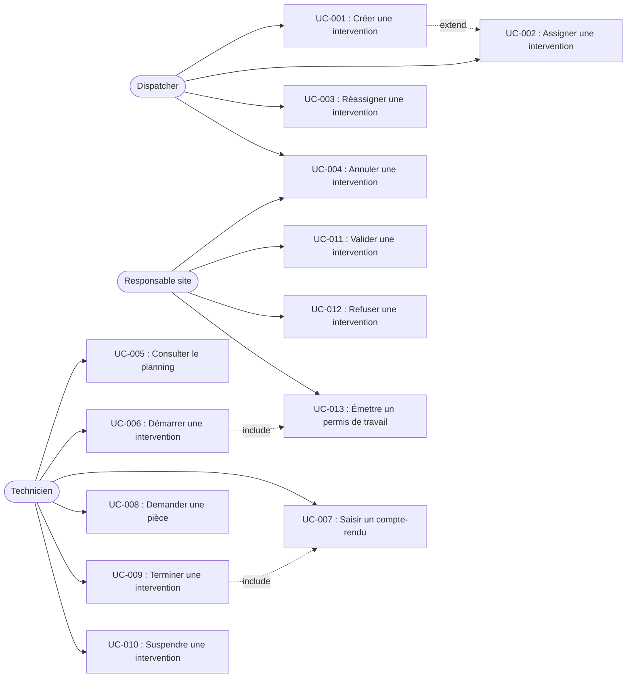
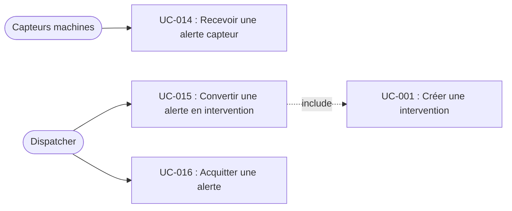
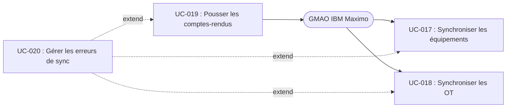

# MaintiX — Spécification SDD (Cas d'utilisation)

Version : 1.0
Date : 2026-03-29
Auteur : Pilote du projet
Statut : Brouillon

<!-- CHANGELOG — Ne pas inclure en v1.0. Décommenter à partir de la v1.1.
## Changelog

| Version | Date | Auteur | Modifications |
|---|---|---|---|
| 1.0 | 2026-03-29 | Pilote du projet | Version initiale. |
-->

## Contexte et objectifs

**Ce que le projet fait :** MaintiX est une plateforme de coordination d'interventions de maintenance industrielle, qui remplace partiellement une GMAO vieillissante en apportant une couche de coordination terrain en temps réel.

**Pourquoi il existe :** Les techniciens de maintenance reçoivent leurs ordres d'intervention par email ou téléphone, remplissent des fiches papier sur le terrain, puis ressaisissent les données dans la GMAO au bureau. Ce processus génère des délais (24-48h entre l'intervention et la saisie), des erreurs de ressaisie et une absence de visibilité en temps réel pour le dispatcher.

**Pour qui :** Sociétés de maintenance industrielle de 20 à 200 techniciens, intervenant sur des sites clients (usines, entrepôts, infrastructures).

**Contraintes structurantes :**

- **Techniques :** Python 3.12+ / FastAPI (backend), PostgreSQL 16, PWA avec mode offline (Service Worker + IndexedDB), broker MQTT Mosquitto, Redis (file d'attente), Keycloak (OIDC), stockage S3-compatible (photos).
- **Réglementaires :** Permis de travail obligatoire pour équipements critiques. Traçabilité 10 ans (sites ICPE). RGPD : géolocalisation limitée aux heures de travail, purge à 6 mois.
- **Performance :** Temps de réponse < 300ms (mode connecté), affichage offline < 1s, alertes capteurs affichées en < 10s, support 200 techniciens simultanés.
- **Mode offline :** Le technicien doit pouvoir travailler sans réseau pendant 8h. Synchronisation au retour ≤ 30 secondes.

**Acteurs identifiés :**

| Acteur | Type | Rôle |
|---|---|---|
| Technicien | Humain | Intervient sur le terrain via PWA mobile. Consulte les fiches équipement, saisit les comptes-rendus, demande des pièces. Peut travailler en mode offline. |
| Dispatcher | Humain | Planifie et assigne les interventions. Suit l'avancement en temps réel. Gère les urgences et réaffectations. |
| Responsable site | Humain | Représentant du site client. Valide les interventions terminées, émet les permis de travail, signale des anomalies, consulte les rapports. |
| GMAO (IBM Maximo) | Système | Référentiel des équipements, historique de maintenance, contrats, stock de pièces. MaintiX synchronise avec la GMAO mais ne la remplace pas. |
| Capteurs machines | Système | Capteurs IoT sur équipements critiques. Émettent des mesures (température, vibration, pression) via MQTT. Déclenchent des alertes si seuils dépassés. |

## Diagramme de contexte

```
┌──────────────────────────────────────────────────────────────────┐
│                        Site industriel                           │
│                                                                  │
│  ┌─────────────┐  ┌─────────────┐  ┌──────────────────────────┐ │
│  │ Responsable │  │ Techniciens │  │ Équipements              │ │
│  │ site        │  │ terrain     │  │                          │ │
│  │ [PC]        │  │ [Mobile]    │  │ [Capteurs IoT ── MQTT]   │ │
│  └──────┬──────┘  └──────┬──────┘  └────────────┬─────────────┘ │
│         │                │                       │               │
└─────────┼────────────────┼───────────────────────┼───────────────┘
          │                │                       │
          └──────┐    ┌────┘               ┌───────┘
                 ▼    ▼                    ▼
          ┌──────────────────────────────────────┐
          │              MaintiX                  │
          │              (cloud)                  │
          └──────┬───────────────┬───────────────┘
                 │               │
        ┌────────┘               └────────┐
        ▼                                 ▼
┌──────────────┐                  ┌──────────────┐
│ Dispatcher   │                  │ GMAO Maximo  │
│ [PC bureau]  │                  │ (existant)   │
└──────────────┘                  └──────────────┘
```

## Architecture

| Composant | Responsabilité |
|---|---|
| API REST (FastAPI) | Backend, point d'entrée unique pour le frontend et la GMAO |
| PostgreSQL 16 | Base de données, schéma unique |
| Frontend dispatcher | SPA web (React) pour les dispatchers et responsables site |
| Frontend mobile | PWA avec Service Worker et IndexedDB pour le mode offline |
| Broker MQTT (Mosquitto) | Réception des mesures capteurs |
| Worker alertes | Consomme les messages MQTT, évalue les seuils, crée les alertes |
| Worker sync | Jobs planifiés de synchronisation avec la GMAO (lecture et écriture) |
| File d'attente (Redis) | Synchronisations GMAO en attente et notifications push |
| Stockage photos (S3) | Object storage S3-compatible pour les photos d'intervention |
| Keycloak (OIDC) | Authentification et gestion des rôles |

## Documents de référence

| Document | Description |
|---|---|
| CDC-maintenance.md | Cahier des charges MaintiX — exigences fonctionnelles, acteurs, contraintes, cas d'utilisation, architecture imposée. |

## Niveaux de support

MaintiX interagit avec la GMAO IBM Maximo existante. Le périmètre de l'interfaçage est explicitement borné.

### Supporté

| Fonctionnalité GMAO | Comportement MaintiX | UC lié |
|---|---|---|
| Lecture des équipements (arborescence, fiches techniques, historique) | Synchronisation périodique toutes les 15 min. Les équipements supprimés dans Maximo sont marqués "inactifs" (pas de suppression). | UC-017 |
| Lecture des ordres de travail (OT planifiés, priorité, équipement, description) | Synchronisation périodique toutes les 15 min. Un OT importé peut être transformé en intervention par le dispatcher. | UC-018 |
| Lecture des contrats (périmètre contractuel par site, SLA) | Synchronisation périodique toutes les 15 min. Données consultables dans MaintiX. | UC-017 |
| Lecture du stock de pièces (quantités par magasin et par site) | Synchronisation périodique toutes les 15 min. Stock affiché lors de la saisie des consommations. | UC-017 |
| Écriture des comptes-rendus (date, durée, technicien, actions, observations) | Synchronisation au fil de l'eau à chaque validation d'intervention. | UC-019 |
| Écriture des consommations de pièces (pièces, quantités, n° série) | Synchronisation au fil de l'eau à chaque validation d'intervention. | UC-019 |
| Écriture du statut des OT (en cours, terminé, en attente pièce) | Mise à jour au fil de l'eau lors des transitions d'état. | UC-019 |

### Ignoré (no-op silencieux)

| Fonctionnalité GMAO | Raison |
|---|---|
| Gestion des achats et approvisionnements | Reste intégralement dans la GMAO. Aucune interaction nécessaire. |
| Gestion des contrats et facturation | Reste intégralement dans la GMAO. Les contrats sont lus en lecture seule pour information. |
| Planification préventive à long terme | MaintiX gère le planning opérationnel à 2 semaines maximum. La planification long terme reste dans la GMAO. |
| Gestion documentaire (plans, manuels, procédures) | Reste dans la GMAO. MaintiX ne stocke pas de documentation technique. |

### Erreur explicite

| Fonctionnalité | Message d'erreur | Raison |
|---|---|---|
| Modification d'un équipement depuis MaintiX | "Les équipements sont gérés dans la GMAO. Modification non autorisée." | La GMAO est le référentiel maître des équipements. MaintiX est en lecture seule. |
| Suppression d'un OT depuis MaintiX | "Les ordres de travail sont gérés dans la GMAO. Suppression non autorisée." | La GMAO est le référentiel maître des OT. |

## Hors périmètre

- Pas de gestion des achats ni des approvisionnements (reste dans la GMAO).
- Pas de gestion des contrats ni de facturation (reste dans la GMAO).
- Pas de planification préventive à long terme (MaintiX gère le planning opérationnel à 2 semaines maximum).
- Pas de gestion documentaire (plans, manuels, procédures — restent dans la GMAO).
- Pas de multi-tenants en v1 (une instance par société de maintenance).
- Pas de module RH (absences, congés, compétences — gérés en dehors de MaintiX).
- Pas d'application mobile native (la PWA avec capacité offline couvre le besoin).
- Pas de gestion du calibrage des capteurs (les seuils d'alerte sont configurables, mais la gestion physique des capteurs est hors périmètre).

## Arborescence des cas d'utilisation

| Package (niveau 2) | Package (niveau 1) | UC | Intitulé |
|---|---|---|---|
| Gestion des interventions | Cycle de vie intervention | UC-001 | Créer une intervention |
| | | UC-002 | Assigner une intervention |
| | | UC-003 | Réassigner une intervention |
| | | UC-004 | Annuler une intervention |
| | Exécution terrain | UC-005 | Consulter le planning |
| | | UC-006 | Démarrer une intervention |
| | | UC-007 | Saisir un compte-rendu |
| | | UC-008 | Demander une pièce |
| | | UC-009 | Terminer une intervention |
| | | UC-010 | Suspendre une intervention |
| | Validation et suivi | UC-011 | Valider une intervention |
| | | UC-012 | Refuser une intervention |
| | | UC-013 | Émettre un permis de travail |
| Alertes et capteurs | Gestion des alertes | UC-014 | Recevoir une alerte capteur |
| | | UC-015 | Convertir une alerte en intervention |
| | | UC-016 | Acquitter une alerte |
| Synchronisation GMAO | Synchronisation entrante | UC-017 | Synchroniser les équipements et données de référence |
| | | UC-018 | Synchroniser les ordres de travail |
| | Synchronisation sortante | UC-019 | Pousser les comptes-rendus vers la GMAO |
| | | UC-020 | Gérer les erreurs de synchronisation |

## Diagrammes des cas d'utilisation

### Gestion des interventions



### Alertes et capteurs



### Synchronisation GMAO



## Cas d'utilisation détaillés

### Gestion des interventions

#### Cycle de vie intervention

##### **UC-001** : Créer une intervention

**Résumé :** Le dispatcher crée une intervention à partir d'un ordre de travail importé de la GMAO ou manuellement (intervention d'urgence). L'intervention est créée au statut "Créée" et prête à être assignée.

**Acteurs :** Dispatcher

**Fréquence d'utilisation :** ~1 000 fois par jour (toutes interventions confondues).

**État initial :** Le dispatcher est authentifié et a accès au module de gestion des interventions.

**État final :** Une intervention est créée au statut "Créée" dans le système. Elle apparaît dans la liste des interventions à assigner.

**Relations :**
- Include : Aucune
- Extend : UC-002 — le dispatcher peut enchaîner directement avec l'assignation
- Généralisation : Aucune

**Étapes (cas nominal) :**

| # | Direction | Description |
|---|---|---|
| 1a | → Dispatcher | Sélectionne "Nouvelle intervention" ou sélectionne un OT importé de la GMAO à transformer en intervention. |
| 1b | ← Système | Affiche le formulaire de création d'intervention. Si un OT est sélectionné, les champs équipement, site, description et priorité sont pré-remplis. (IHM-001) |
| 2a | → Dispatcher | Renseigne ou complète les champs : équipement, site, type (correctif, préventif, prédictif), priorité (P1/P2/P3), description, compétences requises. |
| 2b | ← Système | Valide les champs obligatoires. Vérifie que l'équipement existe et est actif. (RG-0001, RG-0002) |
| 3a | → Dispatcher | Confirme la création. |
| 3b | ← Système | Crée l'intervention au statut "Créée". Attribue un identifiant unique. Horodate la création. Affiche la confirmation. |

**Exceptions :**

| Id étape | Condition | Réaction du système |
|---|---|---|
| 2b | Si un champ obligatoire est manquant | Affiche un message d'erreur indiquant le(s) champ(s) manquant(s). Retour à l'étape 2a. |
| 2b | Si l'équipement est inactif dans MaintiX | Affiche "Cet équipement est marqué inactif dans la GMAO. Création impossible." Retour à l'étape 2a. |

**Règles de gestion :**

| n° RG | Id étape | Énoncé |
|---|---|---|
| RG-0001 | 2b | Les champs obligatoires sont : équipement, site, type, priorité, description. Les compétences requises sont facultatives mais recommandées pour l'assignation. |
| RG-0002 | 2b | La priorité détermine le délai d'intervention cible : P1 = urgence 4h, P2 = 24h, P3 = planifié (dans les 2 semaines). |
| RG-0003 | 1b | Si l'intervention est créée à partir d'un OT GMAO, l'identifiant de l'OT est conservé pour la traçabilité bidirectionnelle. |

**IHM :**

| Id IHM | Description |
|---|---|
| IHM-001 | Formulaire de création d'intervention : champs équipement (sélecteur avec recherche), site (sélecteur), type (correctif/préventif/prédictif), priorité (P1/P2/P3), description (texte libre), compétences requises (tags). Boutons : Créer, Créer et assigner, Annuler. |

**Objets participants :** Intervention, Équipement, Site, Ordre de travail (OT)

**Contraintes non fonctionnelles :** Voir ENF-001 (temps de réponse < 300ms).

**Critères d'acceptation / Cas de tests :**

- **CA-UC-001-01 :** Soit un dispatcher authentifié, Quand il crée une intervention avec tous les champs obligatoires renseignés, Alors l'intervention est créée au statut "Créée" avec un identifiant unique et un horodatage.
- **CA-UC-001-02 :** Soit un OT importé de la GMAO, Quand le dispatcher sélectionne cet OT pour créer une intervention, Alors les champs équipement, site, description et priorité sont pré-remplis à partir de l'OT et l'identifiant OT est conservé.
- **CA-UC-001-03 :** Soit un dispatcher, Quand il tente de créer une intervention sans renseigner le champ "équipement", Alors le système affiche un message d'erreur et la création est bloquée.
- **CA-UC-001-04 :** Soit un équipement marqué inactif, Quand le dispatcher tente de créer une intervention sur cet équipement, Alors le système affiche "Cet équipement est marqué inactif dans la GMAO. Création impossible."

---

##### **UC-002** : Assigner une intervention

**Résumé :** Le dispatcher assigne un technicien à une intervention au statut "Créée". Le système vérifie la disponibilité et les compétences du technicien. Le technicien reçoit une notification push.

**Acteurs :** Dispatcher

**Fréquence d'utilisation :** ~1 000 fois par jour.

**État initial :** Une intervention existe au statut "Créée" (ou "À replanifier").

**État final :** L'intervention passe au statut "Assignée". Le technicien est notifié et voit l'intervention dans son planning.

**Relations :**
- Include : Aucune
- Extend : Aucune
- Généralisation : Aucune

**Étapes (cas nominal) :**

| # | Direction | Description |
|---|---|---|
| 1a | → Dispatcher | Sélectionne une intervention au statut "Créée" ou "À replanifier". |
| 1b | ← Système | Affiche les détails de l'intervention et la liste des techniciens disponibles, filtrée par compétences requises et disponibilité horaire. (IHM-002) |
| 2a | → Dispatcher | Sélectionne un technicien et un créneau horaire. |
| 2b | ← Système | Vérifie l'absence de chevauchement horaire et la présence des compétences requises. (RG-0004, RG-0005) |
| 3a | → Dispatcher | Confirme l'assignation. |
| 3b | ← Système | Passe l'intervention au statut "Assignée". Enregistre le technicien et le créneau. Envoie une notification push au technicien. Horodate l'assignation. |

**Exceptions :**

| Id étape | Condition | Réaction du système |
|---|---|---|
| 2b | Si le technicien a un chevauchement horaire | Affiche "Ce technicien est déjà assigné sur ce créneau (intervention #XXX)." Retour à l'étape 2a. |
| 2b | Si le technicien ne possède pas les compétences requises | Affiche un avertissement "Compétences manquantes : [liste]". Le dispatcher peut forcer l'assignation ou choisir un autre technicien. |
| 3b | Si la notification push échoue | L'assignation est quand même enregistrée. L'échec de notification est logué. Le technicien verra l'intervention lors de la prochaine synchronisation de son planning. |

**Règles de gestion :**

| n° RG | Id étape | Énoncé |
|---|---|---|
| RG-0004 | 2b | Un technicien ne peut pas être assigné à deux interventions dont les créneaux horaires se chevauchent. |
| RG-0005 | 2b | Si des compétences requises sont définies sur l'intervention, le système filtre les techniciens par défaut mais permet au dispatcher de forcer l'assignation avec un avertissement. |
| RG-0006 | 1b | La liste des techniciens affiche leur localisation actuelle (si disponible) pour aider le dispatcher à optimiser les déplacements. |

**IHM :**

| Id IHM | Description |
|---|---|
| IHM-002 | Écran d'assignation : détails de l'intervention (gauche), liste des techniciens filtrés par compétences et disponibilité (droite) avec indicateur de localisation, sélecteur de créneau horaire. Carte montrant la position des techniciens et du site d'intervention. |

**Objets participants :** Intervention, Technicien, Notification

**Contraintes non fonctionnelles :** Voir ENF-001, ENF-004 (gestion des conflits multi-utilisateurs).

**Critères d'acceptation / Cas de tests :**

- **CA-UC-002-01 :** Soit une intervention au statut "Créée" et un technicien disponible avec les compétences requises, Quand le dispatcher assigne ce technicien, Alors l'intervention passe au statut "Assignée" et le technicien reçoit une notification push.
- **CA-UC-002-02 :** Soit un technicien déjà assigné de 9h à 12h, Quand le dispatcher tente de l'assigner à une intervention de 10h à 11h, Alors le système affiche un message de chevauchement et bloque l'assignation.
- **CA-UC-002-03 :** Soit une intervention requérant la compétence "électricité HT", Quand le dispatcher consulte la liste des techniciens, Alors seuls les techniciens possédant cette compétence sont affichés par défaut.
- **CA-UC-002-04 :** Soit une intervention au statut "À replanifier", Quand le dispatcher l'assigne à un technicien, Alors l'intervention passe au statut "Assignée".

---

##### **UC-003** : Réassigner une intervention

**Résumé :** Le dispatcher réassigne une intervention non démarrée à un autre technicien. L'ancien technicien est notifié de la désassignation, le nouveau technicien est notifié de l'assignation.

**Acteurs :** Dispatcher

**Fréquence d'utilisation :** ~50 fois par jour (absences, surcharges).

**État initial :** Une intervention existe au statut "Assignée" (non encore démarrée par le technicien).

**État final :** L'intervention est assignée au nouveau technicien. Les deux techniciens sont notifiés.

**Relations :**
- Include : Aucune
- Extend : Aucune
- Généralisation : Aucune

**Étapes (cas nominal) :**

| # | Direction | Description |
|---|---|---|
| 1a | → Dispatcher | Sélectionne une intervention au statut "Assignée". |
| 1b | ← Système | Affiche les détails de l'intervention, le technicien actuellement assigné, et la liste des techniciens disponibles. (IHM-002) |
| 2a | → Dispatcher | Sélectionne un nouveau technicien et un créneau horaire. |
| 2b | ← Système | Vérifie l'absence de chevauchement horaire et les compétences. (RG-0004, RG-0005) |
| 3a | → Dispatcher | Confirme la réassignation. |
| 3b | ← Système | Met à jour l'assignation. Notifie l'ancien technicien (désassignation) et le nouveau technicien (assignation). Horodate la réassignation. Conserve l'historique de l'assignation précédente. |

**Exceptions :**

| Id étape | Condition | Réaction du système |
|---|---|---|
| 1a | Si l'intervention est au statut "En cours" | Affiche "Cette intervention est déjà démarrée. Réassignation impossible." |
| 2b | Si le nouveau technicien a un chevauchement horaire | Affiche le message de chevauchement. Retour à l'étape 2a. |

**Règles de gestion :**

| n° RG | Id étape | Énoncé |
|---|---|---|
| RG-0007 | 1a | Seules les interventions au statut "Assignée" peuvent être réassignées. Une intervention "En cours", "Suspendue" ou à tout autre statut ne peut pas être réassignée. |
| RG-0008 | 3b | L'historique des assignations est conservé pour traçabilité (qui était assigné, quand, et pourquoi le changement). |

**IHM :**

| Id IHM | Description |
|---|---|
| IHM-002 | (Réutilisation de l'écran d'assignation UC-002) |

**Objets participants :** Intervention, Technicien, Notification

**Contraintes non fonctionnelles :** Voir ENF-001.

**Critères d'acceptation / Cas de tests :**

- **CA-UC-003-01 :** Soit une intervention "Assignée" au technicien A, Quand le dispatcher la réassigne au technicien B, Alors l'intervention reste au statut "Assignée", le technicien B est notifié de l'assignation et le technicien A est notifié de la désassignation.
- **CA-UC-003-02 :** Soit une intervention au statut "En cours", Quand le dispatcher tente de la réassigner, Alors le système affiche un message d'erreur et bloque la réassignation.
- **CA-UC-003-03 :** Soit une intervention réassignée, Quand on consulte l'historique de l'intervention, Alors l'assignation précédente (technicien, date) est visible.

---

##### **UC-004** : Annuler une intervention

**Résumé :** Le dispatcher ou le responsable site annule une intervention non démarrée. Un motif est obligatoire. L'intervention annulée reste visible dans l'historique.

**Acteurs :** Dispatcher, Responsable site

**Fréquence d'utilisation :** ~20 fois par jour.

**État initial :** Une intervention existe au statut "Créée" ou "Assignée".

**État final :** L'intervention passe au statut "Annulée". Le technicien assigné (s'il y en a un) est notifié.

**Relations :**
- Include : Aucune
- Extend : Aucune
- Généralisation : Aucune

**Étapes (cas nominal) :**

| # | Direction | Description |
|---|---|---|
| 1a | → Dispatcher / Responsable site | Sélectionne une intervention au statut "Créée" ou "Assignée" et choisit "Annuler". |
| 1b | ← Système | Affiche un formulaire de confirmation avec un champ motif obligatoire. (IHM-003) |
| 2a | → Dispatcher / Responsable site | Saisit le motif d'annulation et confirme. |
| 2b | ← Système | Passe l'intervention au statut "Annulée". Enregistre le motif et l'auteur. Horodate. Notifie le technicien assigné (si applicable). (RG-0009) |

**Exceptions :**

| Id étape | Condition | Réaction du système |
|---|---|---|
| 1a | Si l'intervention est au statut "En cours" ou ultérieur | Affiche "Cette intervention est déjà démarrée. Annulation impossible." |
| 2a | Si le motif est vide | Affiche "Le motif d'annulation est obligatoire." Retour à l'étape 2a. |

**Règles de gestion :**

| n° RG | Id étape | Énoncé |
|---|---|---|
| RG-0009 | 2b | Le motif d'annulation est obligatoire. L'intervention annulée reste visible dans l'historique et ne peut pas être supprimée (traçabilité). |
| RG-0010 | 1a | Seules les interventions aux statuts "Créée" ou "Assignée" peuvent être annulées. |

**IHM :**

| Id IHM | Description |
|---|---|
| IHM-003 | Popup de confirmation d'annulation : motif (texte libre, obligatoire), boutons Confirmer / Annuler. |

**Objets participants :** Intervention, Notification

**Contraintes non fonctionnelles :** Voir ENF-001.

**Critères d'acceptation / Cas de tests :**

- **CA-UC-004-01 :** Soit une intervention "Assignée" au technicien A, Quand le dispatcher l'annule avec le motif "Doublon", Alors l'intervention passe au statut "Annulée", le motif est enregistré et le technicien A est notifié.
- **CA-UC-004-02 :** Soit une intervention "En cours", Quand le dispatcher tente de l'annuler, Alors le système affiche un message d'erreur et bloque l'annulation.
- **CA-UC-004-03 :** Soit un dispatcher, Quand il tente d'annuler une intervention sans motif, Alors le système affiche "Le motif d'annulation est obligatoire."

---

#### Exécution terrain

##### **UC-005** : Consulter le planning

**Résumé :** Le technicien consulte ses interventions assignées pour le jour et la semaine, triées par priorité puis par heure. Le planning est disponible en mode offline.

**Acteurs :** Technicien

**Fréquence d'utilisation :** Plusieurs dizaines de fois par jour par technicien.

**État initial :** Le technicien est authentifié sur la PWA mobile.

**État final :** Le technicien visualise son planning à jour (ou la dernière version synchronisée en mode offline).

**Relations :**
- Include : Aucune
- Extend : Aucune
- Généralisation : Aucune

**Étapes (cas nominal) :**

| # | Direction | Description |
|---|---|---|
| 1a | → Technicien | Ouvre la vue planning sur la PWA mobile. |
| 1b | ← Système | Affiche les interventions assignées au technicien pour le jour courant, triées par priorité (P1 > P2 > P3) puis par heure. (IHM-004, RG-0011) |
| 2a | → Technicien | Peut basculer entre la vue jour et la vue semaine. |
| 2b | ← Système | Affiche la vue correspondante avec les mêmes règles de tri. |
| 3a | → Technicien | Peut sélectionner une intervention pour voir ses détails (équipement, site, description, fiche équipement). |
| 3b | ← Système | Affiche les détails de l'intervention avec les informations de l'équipement synchronisées depuis la GMAO. |

**Exceptions :**

| Id étape | Condition | Réaction du système |
|---|---|---|
| 1b | Si le technicien est en mode offline | Affiche le planning depuis les données IndexedDB locales. Indique visuellement le mode offline et la date de dernière synchronisation. |

**Règles de gestion :**

| n° RG | Id étape | Énoncé |
|---|---|---|
| RG-0011 | 1b | Le tri du planning est : priorité (P1 en premier, puis P2, puis P3), puis heure de début prévue (croissant). |
| RG-0012 | 1b | En mode offline, le planning affiche les données synchronisées lors de la dernière connexion. Les interventions créées ou modifiées après la dernière synchronisation ne sont pas visibles. |

**IHM :**

| Id IHM | Description |
|---|---|
| IHM-004 | Planning mobile : liste des interventions du jour avec indicateur de priorité (couleur), statut, heure prévue, site, équipement. Bascule jour/semaine. Indicateur online/offline. |

**Objets participants :** Intervention, Équipement, Site

**Contraintes non fonctionnelles :** Voir ENF-001 (< 300ms en ligne), ENF-002 (affichage offline < 1s), ENF-003 (mode offline 8h).

**Critères d'acceptation / Cas de tests :**

- **CA-UC-005-01 :** Soit un technicien avec 3 interventions assignées (P3 à 9h, P1 à 14h, P2 à 10h), Quand il consulte son planning du jour, Alors les interventions sont affichées dans l'ordre : P1 14h, P2 10h, P3 9h.
- **CA-UC-005-02 :** Soit un technicien en mode offline, Quand il consulte son planning, Alors le planning s'affiche en moins de 1 seconde depuis les données locales avec un indicateur de mode offline.
- **CA-UC-005-03 :** Soit un technicien, Quand il sélectionne une intervention dans le planning, Alors les détails de l'intervention et la fiche équipement sont affichés.

---

##### **UC-006** : Démarrer une intervention

**Résumé :** Le technicien signale le début d'une intervention. Si l'équipement est critique, le système vérifie qu'un permis de travail valide existe. La géolocalisation est enregistrée et l'heure de début est horodatée.

**Acteurs :** Technicien

**Fréquence d'utilisation :** ~1 000 fois par jour.

**État initial :** Une intervention est au statut "Assignée" au technicien.

**État final :** L'intervention passe au statut "En cours". L'heure de début et la géolocalisation sont enregistrées.

**Relations :**
- Include : UC-013 (Émettre un permis de travail) — si l'équipement est critique, le permis doit avoir été validé
- Extend : Aucune
- Généralisation : Aucune

**Étapes (cas nominal) :**

| # | Direction | Description |
|---|---|---|
| 1a | → Technicien | Sélectionne une intervention "Assignée" dans son planning et appuie sur "Démarrer". |
| 1b | ← Système | Vérifie le statut de l'intervention et, si l'équipement est critique, vérifie la validité du permis de travail. (RG-0013, RG-0014) |
| 2b | ← Système | Enregistre la géolocalisation du technicien (si autorisée et disponible). Horodate le début. Passe l'intervention au statut "En cours". Confirme le démarrage. (RG-0015) |

**Exceptions :**

| Id étape | Condition | Réaction du système |
|---|---|---|
| 1b | Si l'équipement est critique et aucun permis de travail valide n'existe | Affiche "Un permis de travail valide est requis pour cet équipement critique. Contactez le responsable site." Blocage du démarrage. |
| 1b | Si l'équipement est critique et le permis de travail est expiré (> 8h) | Affiche "Le permis de travail a expiré. Un nouveau permis est nécessaire." Blocage du démarrage. |
| 2b | Si la géolocalisation est désactivée par le technicien | L'intervention démarre sans géolocalisation. L'absence de géolocalisation est enregistrée. |

**Règles de gestion :**

| n° RG | Id étape | Énoncé |
|---|---|---|
| RG-0013 | 1b | Un équipement classé "critique" nécessite un permis de travail valide (émis par le responsable site, non expiré) avant le démarrage de toute intervention. Sans permis valide, le démarrage est bloqué. |
| RG-0014 | 1b | Un permis de travail a une durée de validité de 8 heures à compter de son émission. Au-delà, il est considéré expiré. |
| RG-0015 | 2b | La géolocalisation n'est collectée que pendant les heures de travail du technicien. Le technicien peut la désactiver. L'absence de géolocalisation ne bloque pas le démarrage. |

**IHM :**

| Id IHM | Description |
|---|---|
| IHM-005 | Écran de démarrage d'intervention : bouton "Démarrer" avec confirmation. Indicateur de permis de travail (valide/expiré/absent) si équipement critique. Indicateur de géolocalisation. |

**Objets participants :** Intervention, Équipement, Permis de travail, Géolocalisation

**Contraintes non fonctionnelles :** Voir ENF-001, ENF-005 (RGPD géolocalisation).

**Critères d'acceptation / Cas de tests :**

- **CA-UC-006-01 :** Soit une intervention "Assignée" sur un équipement non critique, Quand le technicien appuie sur "Démarrer", Alors l'intervention passe au statut "En cours", l'heure de début est horodatée et la géolocalisation est enregistrée.
- **CA-UC-006-02 :** Soit une intervention sur un équipement critique sans permis de travail valide, Quand le technicien appuie sur "Démarrer", Alors le système bloque le démarrage et affiche un message demandant un permis de travail.
- **CA-UC-006-03 :** Soit un permis de travail émis il y a 9 heures, Quand le technicien tente de démarrer l'intervention, Alors le système affiche "Le permis de travail a expiré" et bloque le démarrage.
- **CA-UC-006-04 :** Soit un technicien ayant désactivé la géolocalisation, Quand il démarre une intervention, Alors l'intervention démarre normalement et l'absence de géolocalisation est enregistrée.

---

##### **UC-007** : Saisir un compte-rendu

**Résumé :** Le technicien saisit le compte-rendu d'une intervention en cours : actions réalisées, diagnostic, observations, photos et pièces consommées. La saisie est disponible en mode offline avec synchronisation au retour du réseau.

**Acteurs :** Technicien

**Fréquence d'utilisation :** ~1 000 fois par jour.

**État initial :** Une intervention est au statut "En cours" et assignée au technicien.

**État final :** Le compte-rendu est enregistré (localement en offline, ou sur le serveur en mode connecté). Les pièces consommées sont enregistrées.

**Relations :**
- Include : Aucune
- Extend : Aucune
- Généralisation : Aucune

**Étapes (cas nominal) :**

| # | Direction | Description |
|---|---|---|
| 1a | → Technicien | Ouvre le formulaire de compte-rendu de l'intervention en cours. |
| 1b | ← Système | Affiche le formulaire de saisie avec les informations de l'intervention et de l'équipement. (IHM-006) |
| 2a | → Technicien | Saisit les actions réalisées, le diagnostic et les observations (texte libre). |
| 2b | ← Système | Enregistre le texte saisi. |
| 3a | → Technicien | Ajoute des photos (optionnel, max 5 photos, max 5 Mo chacune). |
| 3b | ← Système | Valide le nombre et la taille des photos. Enregistre les photos. (RG-0016) |
| 4a | → Technicien | Sélectionne les pièces consommées dans la liste du stock (synchronisée depuis la GMAO) et indique les quantités. |
| 4b | ← Système | Enregistre les consommations de pièces. (RG-0017) |
| 5a | → Technicien | Enregistre le compte-rendu. |
| 5b | ← Système | Enregistre le compte-rendu. En mode connecté, synchronise avec le serveur. En mode offline, stocke dans IndexedDB pour synchronisation ultérieure. |

**Exceptions :**

| Id étape | Condition | Réaction du système |
|---|---|---|
| 3b | Si le technicien tente d'ajouter plus de 5 photos | Affiche "Maximum 5 photos par compte-rendu." Retour à l'étape 3a. |
| 3b | Si une photo dépasse 5 Mo | Affiche "La photo dépasse la taille maximale de 5 Mo." Retour à l'étape 3a. |
| 5b | Si le technicien est en mode offline | Stocke le compte-rendu dans IndexedDB. Affiche un indicateur "En attente de synchronisation". La synchronisation se fera automatiquement au retour du réseau. |

**Règles de gestion :**

| n° RG | Id étape | Énoncé |
|---|---|---|
| RG-0016 | 3b | Maximum 5 photos par compte-rendu, 5 Mo maximum par photo. Les photos sont stockées dans le stockage S3-compatible et chiffrées au repos (AES-256). |
| RG-0017 | 4b | Les pièces consommées sont sélectionnées parmi la liste du stock synchronisée depuis la GMAO. Si une pièce n'est pas dans la liste, le technicien peut utiliser UC-008 (Demander une pièce). |

**IHM :**

| Id IHM | Description |
|---|---|
| IHM-006 | Formulaire de compte-rendu : champs texte (actions réalisées, diagnostic, observations), bouton d'ajout de photo (avec preview), sélecteur de pièces consommées (liste avec recherche + quantité), boutons Enregistrer / Enregistrer et terminer. |

**Objets participants :** Intervention, Compte-rendu, Photo, Pièce, Consommation de pièce

**Contraintes non fonctionnelles :** Voir ENF-002, ENF-003 (mode offline).

**Critères d'acceptation / Cas de tests :**

- **CA-UC-007-01 :** Soit une intervention "En cours", Quand le technicien saisit un compte-rendu avec actions, diagnostic et 2 photos, Alors le compte-rendu est enregistré avec les photos et l'horodatage.
- **CA-UC-007-02 :** Soit un technicien en mode offline, Quand il saisit un compte-rendu, Alors le compte-rendu est stocké dans IndexedDB et synchronisé automatiquement au retour du réseau.
- **CA-UC-007-03 :** Soit un technicien, Quand il tente d'ajouter une 6ème photo, Alors le système affiche "Maximum 5 photos par compte-rendu."
- **CA-UC-007-04 :** Soit un technicien, Quand il sélectionne 3 pièces avec leurs quantités et enregistre, Alors les consommations sont enregistrées et liées au compte-rendu.

---

##### **UC-008** : Demander une pièce

**Résumé :** Le technicien demande une pièce non disponible en stock sur le site. Le dispatcher est notifié. L'intervention passe en statut "En attente pièce".

**Acteurs :** Technicien

**Fréquence d'utilisation :** ~50 fois par jour.

**État initial :** Une intervention est au statut "En cours" et assignée au technicien.

**État final :** L'intervention passe au statut "En attente pièce". Le dispatcher est notifié de la demande.

**Relations :**
- Include : Aucune
- Extend : Aucune
- Généralisation : Aucune

**Étapes (cas nominal) :**

| # | Direction | Description |
|---|---|---|
| 1a | → Technicien | Sélectionne "Demander une pièce" depuis l'intervention en cours. |
| 1b | ← Système | Affiche le formulaire de demande de pièce. (IHM-007) |
| 2a | → Technicien | Saisit la référence de la pièce, la quantité et un commentaire optionnel. |
| 2b | ← Système | Enregistre la demande. Passe l'intervention au statut "En attente pièce". Notifie le dispatcher. (RG-0018) |

**Exceptions :**

| Id étape | Condition | Réaction du système |
|---|---|---|
| 2b | Si le technicien est en mode offline | Enregistre la demande localement. La notification au dispatcher sera envoyée à la synchronisation. L'intervention reste "En cours" localement jusqu'à synchronisation. |

**Règles de gestion :**

| n° RG | Id étape | Énoncé |
|---|---|---|
| RG-0018 | 2b | La transition vers "En attente pièce" nécessite la confirmation du dispatcher (qui vérifie la disponibilité de la pièce dans d'autres magasins ou commande la pièce). Le retour à "En cours" est déclenché par le dispatcher quand la pièce est reçue. |

**IHM :**

| Id IHM | Description |
|---|---|
| IHM-007 | Formulaire de demande de pièce : référence pièce (saisie libre ou sélection dans le catalogue GMAO), quantité, commentaire optionnel. Bouton Envoyer la demande. |

**Objets participants :** Intervention, Demande de pièce, Notification

**Contraintes non fonctionnelles :** Voir ENF-003 (mode offline).

**Critères d'acceptation / Cas de tests :**

- **CA-UC-008-01 :** Soit une intervention "En cours", Quand le technicien demande une pièce avec référence et quantité, Alors l'intervention passe à "En attente pièce" et le dispatcher reçoit une notification.
- **CA-UC-008-02 :** Soit un dispatcher notifié d'une demande de pièce, Quand il confirme la réception de la pièce, Alors l'intervention repasse à "En cours".

---

##### **UC-009** : Terminer une intervention

**Résumé :** Le technicien marque une intervention comme terminée. Le compte-rendu est obligatoire. L'intervention passe à "Terminée — en attente validation" et le responsable site est notifié.

**Acteurs :** Technicien

**Fréquence d'utilisation :** ~1 000 fois par jour.

**État initial :** Une intervention est au statut "En cours" avec un compte-rendu saisi.

**État final :** L'intervention passe au statut "Terminée". Le responsable site est notifié pour validation.

**Relations :**
- Include : UC-007 (Saisir un compte-rendu) — le compte-rendu doit être renseigné
- Extend : Aucune
- Généralisation : Aucune

**Étapes (cas nominal) :**

| # | Direction | Description |
|---|---|---|
| 1a | → Technicien | Appuie sur "Terminer l'intervention". |
| 1b | ← Système | Vérifie que le compte-rendu est renseigné. (RG-0019) |
| 2b | ← Système | Passe l'intervention au statut "Terminée". Horodate la fin. Calcule la durée totale (hors suspensions). Notifie le responsable site pour validation. |

**Exceptions :**

| Id étape | Condition | Réaction du système |
|---|---|---|
| 1b | Si le compte-rendu est vide | Affiche "Le compte-rendu est obligatoire pour terminer l'intervention." Redirige vers le formulaire de compte-rendu (UC-007). |

**Règles de gestion :**

| n° RG | Id étape | Énoncé |
|---|---|---|
| RG-0019 | 1b | Le compte-rendu est obligatoire pour terminer une intervention. Le système vérifie qu'au minimum le champ "actions réalisées" est renseigné. |
| RG-0020 | 2b | La durée totale de l'intervention est calculée automatiquement : somme des périodes "En cours" (les périodes de suspension sont exclues). |

**IHM :**

| Id IHM | Description |
|---|---|
| IHM-008 | Bouton "Terminer l'intervention" avec popup de confirmation affichant un résumé : durée, pièces consommées, nombre de photos. |

**Objets participants :** Intervention, Compte-rendu, Notification

**Contraintes non fonctionnelles :** Voir ENF-001.

**Critères d'acceptation / Cas de tests :**

- **CA-UC-009-01 :** Soit une intervention "En cours" avec un compte-rendu renseigné, Quand le technicien appuie sur "Terminer", Alors l'intervention passe au statut "Terminée" et le responsable site est notifié.
- **CA-UC-009-02 :** Soit une intervention "En cours" sans compte-rendu, Quand le technicien appuie sur "Terminer", Alors le système affiche un message et redirige vers le formulaire de compte-rendu.
- **CA-UC-009-03 :** Soit une intervention démarrée à 9h00, suspendue de 12h00 à 13h00, et terminée à 17h00, Quand le système calcule la durée, Alors la durée totale est de 7h00.

---

##### **UC-010** : Suspendre une intervention

**Résumé :** Le technicien suspend une intervention en cours (pause déjeuner, attente pièce, fin de journée). Un motif est obligatoire. L'intervention peut être reprise plus tard.

**Acteurs :** Technicien

**Fréquence d'utilisation :** ~200 fois par jour.

**État initial :** Une intervention est au statut "En cours".

**État final :** L'intervention passe au statut "Suspendue".

**Relations :**
- Include : Aucune
- Extend : Aucune
- Généralisation : Aucune

**Étapes (cas nominal) :**

| # | Direction | Description |
|---|---|---|
| 1a | → Technicien | Appuie sur "Suspendre" depuis l'intervention en cours. |
| 1b | ← Système | Affiche un formulaire demandant le motif de suspension. (IHM-009) |
| 2a | → Technicien | Saisit le motif de suspension. |
| 2b | ← Système | Passe l'intervention au statut "Suspendue". Horodate la suspension. Enregistre le motif. (RG-0021) |

**Exceptions :**

| Id étape | Condition | Réaction du système |
|---|---|---|
| 2a | Si le motif est vide | Affiche "Le motif de suspension est obligatoire." Retour à l'étape 2a. |

**Règles de gestion :**

| n° RG | Id étape | Énoncé |
|---|---|---|
| RG-0021 | 2b | Le motif de suspension est obligatoire. La reprise d'une intervention suspendue ne nécessite pas de motif — l'intervention repasse à "En cours" directement. |

**IHM :**

| Id IHM | Description |
|---|---|
| IHM-009 | Popup de suspension : motif (texte libre, obligatoire), boutons Confirmer / Annuler. Depuis une intervention suspendue, bouton "Reprendre" sans motif. |

**Objets participants :** Intervention

**Contraintes non fonctionnelles :** Voir ENF-001.

**Critères d'acceptation / Cas de tests :**

- **CA-UC-010-01 :** Soit une intervention "En cours", Quand le technicien la suspend avec le motif "Pause déjeuner", Alors l'intervention passe à "Suspendue" et le motif est enregistré.
- **CA-UC-010-02 :** Soit une intervention "Suspendue", Quand le technicien appuie sur "Reprendre", Alors l'intervention repasse à "En cours" sans demande de motif.
- **CA-UC-010-03 :** Soit un technicien, Quand il tente de suspendre sans motif, Alors le système affiche un message d'erreur.

---

#### Validation et suivi

##### **UC-011** : Valider une intervention

**Résumé :** Le responsable site valide une intervention terminée. Il peut ajouter des observations. L'intervention passe à "Validée" et le compte-rendu est synchronisé vers la GMAO.

**Acteurs :** Responsable site

**Fréquence d'utilisation :** ~800 fois par jour.

**État initial :** Une intervention est au statut "Terminée".

**État final :** L'intervention passe au statut "Validée". Le compte-rendu est poussé vers la GMAO (UC-019).

**Relations :**
- Include : UC-019 (Pousser les comptes-rendus vers la GMAO) — déclenché automatiquement après validation
- Extend : Aucune
- Généralisation : Aucune

**Étapes (cas nominal) :**

| # | Direction | Description |
|---|---|---|
| 1a | → Responsable site | Sélectionne une intervention "Terminée" dans sa liste de validations en attente. |
| 1b | ← Système | Affiche le détail de l'intervention : compte-rendu, photos, pièces consommées, durée. (IHM-010) |
| 2a | → Responsable site | Consulte le compte-rendu. Ajoute des observations (optionnel). Appuie sur "Valider". |
| 2b | ← Système | Passe l'intervention au statut "Validée". Horodate la validation. Enregistre les observations. Déclenche la synchronisation vers la GMAO (UC-019). |

**Exceptions :**

| Id étape | Condition | Réaction du système |
|---|---|---|
| 2b | Si la synchronisation vers la GMAO échoue | La validation est enregistrée dans MaintiX. La synchronisation est mise en file d'attente Redis pour réessai (UC-020). |

**Règles de gestion :**

| n° RG | Id étape | Énoncé |
|---|---|---|
| RG-0022 | 2b | La validation déclenche la synchronisation du compte-rendu et des consommations de pièces vers la GMAO. Si la GMAO est indisponible, la synchronisation est différée mais la validation est effective dans MaintiX. |

**IHM :**

| Id IHM | Description |
|---|---|
| IHM-010 | Écran de validation : détails de l'intervention, compte-rendu (texte + photos), pièces consommées, durée calculée. Champ observations (optionnel). Boutons Valider / Refuser. |

**Objets participants :** Intervention, Compte-rendu, Photo, Consommation de pièce

**Contraintes non fonctionnelles :** Voir ENF-001.

**Critères d'acceptation / Cas de tests :**

- **CA-UC-011-01 :** Soit une intervention "Terminée", Quand le responsable site la valide avec des observations, Alors l'intervention passe à "Validée", les observations sont enregistrées et la synchronisation GMAO est déclenchée.
- **CA-UC-011-02 :** Soit une intervention "Terminée" et la GMAO indisponible, Quand le responsable site valide, Alors l'intervention passe à "Validée" dans MaintiX et la synchronisation est mise en file d'attente.

---

##### **UC-012** : Refuser une intervention

**Résumé :** Le responsable site refuse une intervention terminée (travail incomplet, problème constaté). Un motif est obligatoire. L'intervention repasse en statut "À replanifier" et le dispatcher est notifié.

**Acteurs :** Responsable site

**Fréquence d'utilisation :** ~50 fois par jour.

**État initial :** Une intervention est au statut "Terminée".

**État final :** L'intervention passe au statut "Refusée" puis automatiquement à "À replanifier". Le dispatcher est notifié.

**Relations :**
- Include : Aucune
- Extend : Aucune
- Généralisation : Aucune

**Étapes (cas nominal) :**

| # | Direction | Description |
|---|---|---|
| 1a | → Responsable site | Sélectionne une intervention "Terminée" et choisit "Refuser". |
| 1b | ← Système | Affiche un formulaire avec le motif de refus obligatoire. (IHM-010) |
| 2a | → Responsable site | Saisit le motif de refus. |
| 2b | ← Système | Passe l'intervention au statut "Refusée". Enregistre le motif. Puis passe automatiquement au statut "À replanifier". Notifie le dispatcher. (RG-0023, RG-0024) |

**Exceptions :**

| Id étape | Condition | Réaction du système |
|---|---|---|
| 2a | Si le motif est vide | Affiche "Le motif de refus est obligatoire." Retour à l'étape 2a. |

**Règles de gestion :**

| n° RG | Id étape | Énoncé |
|---|---|---|
| RG-0023 | 2b | Le motif de refus est obligatoire. |
| RG-0024 | 2b | La transition de "Refusée" à "À replanifier" est automatique et immédiate. Le dispatcher peut alors réassigner l'intervention via UC-002. |

**IHM :**

| Id IHM | Description |
|---|---|
| IHM-010 | (Réutilisation de l'écran de validation — bouton "Refuser" avec popup de motif obligatoire.) |

**Objets participants :** Intervention, Notification

**Contraintes non fonctionnelles :** Voir ENF-001.

**Critères d'acceptation / Cas de tests :**

- **CA-UC-012-01 :** Soit une intervention "Terminée", Quand le responsable site la refuse avec le motif "Travail incomplet — fuite non réparée", Alors l'intervention passe à "Refusée" puis "À replanifier" et le dispatcher est notifié.
- **CA-UC-012-02 :** Soit un responsable site, Quand il tente de refuser sans motif, Alors le système affiche "Le motif de refus est obligatoire."
- **CA-UC-012-03 :** Soit une intervention "À replanifier", Quand le dispatcher l'assigne à un technicien (UC-002), Alors l'intervention repasse à "Assignée".

---

##### **UC-013** : Émettre un permis de travail

**Résumé :** Le responsable site émet un permis de travail pour un équipement critique avant le démarrage d'une intervention. Le permis est valable 8 heures.

**Acteurs :** Responsable site

**Fréquence d'utilisation :** ~100 fois par jour (dépend du nombre d'équipements critiques).

**État initial :** Une intervention est planifiée sur un équipement classé "critique". L'intervention est au statut "Assignée".

**État final :** Un permis de travail valide est enregistré pour l'intervention, permettant au technicien de démarrer.

**Relations :**
- Include : Aucune
- Extend : Aucune
- Généralisation : Aucune

**Étapes (cas nominal) :**

| # | Direction | Description |
|---|---|---|
| 1a | → Responsable site | Consulte la liste des interventions en attente de permis de travail sur son site. Sélectionne une intervention. |
| 1b | ← Système | Affiche les détails de l'intervention et de l'équipement critique. (IHM-011) |
| 2a | → Responsable site | Vérifie les conditions de sécurité et valide le permis de travail. |
| 2b | ← Système | Enregistre le permis de travail avec : auteur, horodatage, équipement, intervention liée. Calcule l'expiration (horodatage + 8h). Notifie le technicien assigné que le permis est valide. (RG-0014) |

**Exceptions :**

| Id étape | Condition | Réaction du système |
|---|---|---|
| 2a | Si le responsable site refuse d'émettre le permis | Le responsable site peut ajouter un commentaire expliquant le refus. Le technicien et le dispatcher sont notifiés. L'intervention reste "Assignée" mais non démarrable. |

**Règles de gestion :**

| n° RG | Id étape | Énoncé |
|---|---|---|
| RG-0014 | 2b | Le permis de travail a une durée de validité de 8 heures à compter de son émission. Au-delà, un nouveau permis doit être émis. |

**IHM :**

| Id IHM | Description |
|---|---|
| IHM-011 | Écran d'émission de permis : détails de l'intervention et de l'équipement, historique des permis précédents, boutons Émettre le permis / Refuser. |

**Objets participants :** Permis de travail, Intervention, Équipement

**Contraintes non fonctionnelles :** Voir ENF-001.

**Critères d'acceptation / Cas de tests :**

- **CA-UC-013-01 :** Soit un équipement critique avec une intervention "Assignée", Quand le responsable site émet un permis de travail, Alors le permis est enregistré avec une validité de 8h et le technicien est notifié.
- **CA-UC-013-02 :** Soit un permis émis à 8h00, Quand on vérifie sa validité à 15h59, Alors le permis est valide. Quand on vérifie à 16h01, Alors le permis est expiré.
- **CA-UC-013-03 :** Soit un responsable site, Quand il refuse d'émettre le permis avec un commentaire, Alors le technicien et le dispatcher sont notifiés du refus.

---

### Alertes et capteurs

#### Gestion des alertes

##### **UC-014** : Recevoir une alerte capteur

**Résumé :** Quand un capteur dépasse un seuil configuré, MaintiX crée automatiquement une alerte rattachée à l'équipement concerné et notifie le dispatcher.

**Acteurs :** Capteurs machines (système)

**Fréquence d'utilisation :** Variable — dépend des seuils et de l'état des équipements. Estimation : ~50 alertes par jour.

**État initial :** Un capteur publie des mesures via MQTT. Un seuil d'alerte est configuré pour ce capteur/équipement.

**État final :** Une alerte est créée dans MaintiX, rattachée à l'équipement. Le dispatcher est notifié.

**Relations :**
- Include : Aucune
- Extend : UC-015 (Convertir en intervention) — si le dispatcher décide de créer une intervention
- Généralisation : Aucune

**Étapes (cas nominal) :**

| # | Direction | Description |
|---|---|---|
| 1a | → Capteurs machines | Le capteur publie une mesure sur le topic MQTT de l'équipement. |
| 1b | ← Système | Le worker alertes consomme le message MQTT. Compare la valeur mesurée aux seuils configurés. (RG-0025) |
| 2b | ← Système | Si un seuil est dépassé : crée une alerte (type de mesure, valeur, seuil, équipement, horodatage). Notifie le dispatcher en temps réel. (RG-0026) |

**Exceptions :**

| Id étape | Condition | Réaction du système |
|---|---|---|
| 1b | Si le message MQTT est mal formé ou l'équipement inconnu | Le message est logué en erreur et ignoré. Pas de création d'alerte. |
| 2b | Si la notification au dispatcher échoue | L'alerte est créée. L'échec de notification est logué. Le dispatcher verra l'alerte dans son tableau de bord. |

**Règles de gestion :**

| n° RG | Id étape | Énoncé |
|---|---|---|
| RG-0025 | 1b | Les seuils d'alerte sont configurables par équipement et par type de mesure (température, vibration, pression). Un seuil comprend une valeur limite et un opérateur (>, <, >=, <=). |
| RG-0026 | 2b | L'alerte doit être affichée chez le dispatcher en moins de 10 secondes après l'émission par le capteur (exigence temps réel). |

**IHM :**

| Id IHM | Description |
|---|---|
| IHM-012 | Tableau de bord des alertes (dispatcher) : liste des alertes actives avec indicateur de sévérité, équipement, valeur mesurée, seuil dépassé, horodatage. Actions : Convertir en intervention, Acquitter. |

**Objets participants :** Alerte, Capteur, Mesure, Équipement, Seuil

**Contraintes non fonctionnelles :** Voir ENF-006 (temps réel < 10s), ENF-007 (capacité capteurs).

**Critères d'acceptation / Cas de tests :**

- **CA-UC-014-01 :** Soit un capteur de température configuré avec un seuil > 80°C, Quand le capteur publie une mesure de 85°C, Alors une alerte est créée avec les détails (85°C, seuil 80°C, équipement) et le dispatcher est notifié en moins de 10 secondes.
- **CA-UC-014-02 :** Soit un capteur publiant une mesure de 75°C avec un seuil > 80°C, Quand le worker traite le message, Alors aucune alerte n'est créée.
- **CA-UC-014-03 :** Soit un message MQTT mal formé, Quand le worker tente de le traiter, Alors le message est logué en erreur et aucune alerte n'est créée.

---

##### **UC-015** : Convertir une alerte en intervention

**Résumé :** Le dispatcher transforme une alerte capteur en intervention prédictive, pré-remplie avec l'équipement et le contexte capteur.

**Acteurs :** Dispatcher

**Fréquence d'utilisation :** ~20 fois par jour.

**État initial :** Une alerte capteur est active (non acquittée).

**État final :** Une intervention prédictive est créée à partir de l'alerte. L'alerte est marquée comme "convertie".

**Relations :**
- Include : UC-001 (Créer une intervention) — l'intervention est créée avec les données de l'alerte
- Extend : Aucune
- Généralisation : Aucune

**Étapes (cas nominal) :**

| # | Direction | Description |
|---|---|---|
| 1a | → Dispatcher | Sélectionne une alerte active et choisit "Convertir en intervention". |
| 1b | ← Système | Affiche le formulaire de création d'intervention (IHM-001) pré-rempli : équipement de l'alerte, type "prédictif", description incluant le contexte capteur (type de mesure, valeur, seuil). |
| 2a | → Dispatcher | Complète ou ajuste les champs (priorité, compétences, description). Confirme la création. |
| 2b | ← Système | Crée l'intervention (UC-001). Lie l'intervention à l'alerte d'origine. Marque l'alerte comme "convertie". |

**Exceptions :**

| Id étape | Condition | Réaction du système |
|---|---|---|
| 1a | Si l'alerte est déjà acquittée ou convertie | Affiche "Cette alerte a déjà été traitée." |

**Règles de gestion :**

| n° RG | Id étape | Énoncé |
|---|---|---|
| RG-0027 | 2b | L'intervention créée conserve une référence à l'alerte d'origine pour traçabilité. Le type est automatiquement "prédictif". |

**IHM :**

| Id IHM | Description |
|---|---|
| IHM-001 | (Réutilisation du formulaire de création d'intervention, pré-rempli avec les données de l'alerte.) |

**Objets participants :** Alerte, Intervention, Équipement

**Contraintes non fonctionnelles :** Voir ENF-001.

**Critères d'acceptation / Cas de tests :**

- **CA-UC-015-01 :** Soit une alerte active sur l'équipement "Pompe A — Température 85°C (seuil 80°C)", Quand le dispatcher la convertit en intervention, Alors une intervention prédictive est créée avec l'équipement "Pompe A", la description contient le contexte capteur, et l'alerte est marquée "convertie".
- **CA-UC-015-02 :** Soit une alerte déjà convertie, Quand le dispatcher tente de la convertir à nouveau, Alors le système affiche "Cette alerte a déjà été traitée."

---

##### **UC-016** : Acquitter une alerte

**Résumé :** Le dispatcher acquitte une alerte sans créer d'intervention (faux positif, seuil à recalibrer). Un motif est obligatoire.

**Acteurs :** Dispatcher

**Fréquence d'utilisation :** ~30 fois par jour.

**État initial :** Une alerte capteur est active (non acquittée, non convertie).

**État final :** L'alerte est marquée comme "acquittée" avec le motif.

**Relations :**
- Include : Aucune
- Extend : Aucune
- Généralisation : Aucune

**Étapes (cas nominal) :**

| # | Direction | Description |
|---|---|---|
| 1a | → Dispatcher | Sélectionne une alerte active et choisit "Acquitter". |
| 1b | ← Système | Affiche un formulaire de motif obligatoire. |
| 2a | → Dispatcher | Saisit le motif d'acquittement (ex : "Faux positif — seuil à recalibrer"). |
| 2b | ← Système | Marque l'alerte comme "acquittée". Enregistre le motif, l'auteur et l'horodatage. (RG-0028) |

**Exceptions :**

| Id étape | Condition | Réaction du système |
|---|---|---|
| 2a | Si le motif est vide | Affiche "Le motif d'acquittement est obligatoire." Retour à l'étape 2a. |

**Règles de gestion :**

| n° RG | Id étape | Énoncé |
|---|---|---|
| RG-0028 | 2b | Le motif d'acquittement est obligatoire. L'alerte acquittée reste visible dans l'historique des alertes pour traçabilité. |

**IHM :**

| Id IHM | Description |
|---|---|
| IHM-012 | (Réutilisation du tableau de bord des alertes — action "Acquitter" avec popup de motif.) |

**Objets participants :** Alerte

**Contraintes non fonctionnelles :** Voir ENF-001.

**Critères d'acceptation / Cas de tests :**

- **CA-UC-016-01 :** Soit une alerte active, Quand le dispatcher l'acquitte avec le motif "Faux positif", Alors l'alerte est marquée "acquittée" et le motif est enregistré.
- **CA-UC-016-02 :** Soit un dispatcher, Quand il tente d'acquitter sans motif, Alors le système affiche "Le motif d'acquittement est obligatoire."
- **CA-UC-016-03 :** Soit une alerte acquittée, Quand on consulte l'historique des alertes, Alors l'alerte acquittée est visible avec son motif.

---

### Synchronisation GMAO

#### Synchronisation entrante

##### **UC-017** : Synchroniser les équipements et données de référence

**Résumé :** Un job planifié synchronise les équipements, contrats et stock de pièces depuis la GMAO IBM Maximo toutes les 15 minutes. Les équipements supprimés dans Maximo sont marqués "inactifs" dans MaintiX.

**Acteurs :** GMAO (système)

**Fréquence d'utilisation :** Toutes les 15 minutes (automatique).

**État initial :** Le worker sync est actif et la GMAO est accessible.

**État final :** La base locale MaintiX est à jour avec les données de la GMAO.

**Relations :**
- Include : Aucune
- Extend : UC-020 (Gérer les erreurs de synchronisation) — en cas d'échec
- Généralisation : Aucune

**Étapes (cas nominal) :**

| # | Direction | Description |
|---|---|---|
| 1a | → GMAO | Le worker sync déclenche la synchronisation (cron toutes les 15 min). |
| 1b | ← Système | Appelle l'API REST de Maximo pour récupérer les équipements (arborescence, fiches techniques, historique), les contrats et le stock de pièces. (RG-0029) |
| 2b | ← Système | Compare les données reçues avec la base locale. Met à jour les enregistrements modifiés. Crée les nouveaux. Marque "inactifs" ceux supprimés dans Maximo. (RG-0030) |
| 3b | ← Système | Logge le résultat de la synchronisation (nombre de créations, mises à jour, désactivations). |

**Exceptions :**

| Id étape | Condition | Réaction du système |
|---|---|---|
| 1b | Si la GMAO est indisponible | Logge l'erreur. Met la synchronisation en file d'attente Redis pour réessai. Dérouler UC-020 si 3 échecs consécutifs. |

**Règles de gestion :**

| n° RG | Id étape | Énoncé |
|---|---|---|
| RG-0029 | 1b | La synchronisation entrante est en lecture seule. MaintiX ne modifie jamais les données dans la GMAO lors de la synchronisation entrante. |
| RG-0030 | 2b | Les équipements supprimés dans Maximo ne sont jamais supprimés dans MaintiX. Ils sont marqués "inactifs". Les interventions passées sur ces équipements restent visibles dans l'historique. |

**IHM :**

| Id IHM | Description |
|---|---|
| IHM-013 | Tableau de bord de synchronisation (administrateur) : dernière synchronisation, statut (succès/échec), nombre d'éléments synchronisés, file d'attente. |

**Objets participants :** Équipement, Contrat, Stock de pièces, Job de synchronisation

**Contraintes non fonctionnelles :** Voir ENF-008 (observabilité).

**Critères d'acceptation / Cas de tests :**

- **CA-UC-017-01 :** Soit la GMAO contenant un nouvel équipement, Quand le job de synchronisation s'exécute, Alors l'équipement est créé dans MaintiX avec ses données complètes.
- **CA-UC-017-02 :** Soit un équipement supprimé dans Maximo, Quand le job de synchronisation s'exécute, Alors l'équipement est marqué "inactif" dans MaintiX (pas supprimé).
- **CA-UC-017-03 :** Soit la GMAO indisponible, Quand le job tente de se connecter, Alors l'erreur est loguée et la synchronisation est mise en file d'attente.

---

##### **UC-018** : Synchroniser les ordres de travail

**Résumé :** Un job planifié synchronise les ordres de travail (OT) depuis la GMAO toutes les 15 minutes. Les nouveaux OT et les modifications sont importés. Un OT importé peut être transformé en intervention par le dispatcher.

**Acteurs :** GMAO (système)

**Fréquence d'utilisation :** Toutes les 15 minutes (automatique).

**État initial :** Le worker sync est actif et la GMAO est accessible.

**État final :** Les OT de la base locale sont à jour avec la GMAO.

**Relations :**
- Include : Aucune
- Extend : UC-020 (Gérer les erreurs de synchronisation) — en cas d'échec
- Généralisation : Aucune

**Étapes (cas nominal) :**

| # | Direction | Description |
|---|---|---|
| 1a | → GMAO | Le worker sync déclenche la synchronisation des OT (cron toutes les 15 min). |
| 1b | ← Système | Appelle l'API REST de Maximo pour récupérer les nouveaux OT et les modifications depuis la dernière synchronisation. |
| 2b | ← Système | Importe les nouveaux OT. Met à jour les OT modifiés. Conserve le lien avec l'identifiant OT Maximo. (RG-0031) |
| 3b | ← Système | Logge le résultat de la synchronisation. |

**Exceptions :**

| Id étape | Condition | Réaction du système |
|---|---|---|
| 1b | Si la GMAO est indisponible | Logge l'erreur. Met la synchronisation en file d'attente. Dérouler UC-020 si 3 échecs consécutifs. |

**Règles de gestion :**

| n° RG | Id étape | Énoncé |
|---|---|---|
| RG-0031 | 2b | Un OT importé reste au statut "importé" jusqu'à ce qu'un dispatcher le transforme en intervention (UC-001). L'identifiant OT Maximo est conservé pour la traçabilité bidirectionnelle. |

**IHM :**

| Id IHM | Description |
|---|---|
| IHM-013 | (Réutilisation du tableau de bord de synchronisation.) |

**Objets participants :** Ordre de travail (OT), Job de synchronisation

**Contraintes non fonctionnelles :** Voir ENF-008.

**Critères d'acceptation / Cas de tests :**

- **CA-UC-018-01 :** Soit un nouvel OT créé dans Maximo, Quand le job de synchronisation s'exécute, Alors l'OT est importé dans MaintiX au statut "importé" avec l'identifiant Maximo conservé.
- **CA-UC-018-02 :** Soit un OT modifié dans Maximo (changement de priorité), Quand le job s'exécute, Alors l'OT est mis à jour dans MaintiX.
- **CA-UC-018-03 :** Soit un OT importé, Quand le dispatcher le sélectionne pour créer une intervention (UC-001), Alors les champs sont pré-remplis depuis l'OT.

---

#### Synchronisation sortante

##### **UC-019** : Pousser les comptes-rendus vers la GMAO

**Résumé :** À chaque validation d'intervention, le compte-rendu et les consommations de pièces sont envoyés à la GMAO via son API REST. Le statut de l'OT est mis à jour.

**Acteurs :** GMAO (système) — destinataire

**Fréquence d'utilisation :** ~800 fois par jour (à chaque validation d'intervention).

**État initial :** Une intervention vient d'être validée (UC-011). Le compte-rendu et les consommations sont enregistrés dans MaintiX.

**État final :** Les données sont synchronisées dans la GMAO. Le statut de l'OT est mis à jour.

**Relations :**
- Include : Aucune
- Extend : UC-020 (Gérer les erreurs de synchronisation) — en cas d'échec
- Généralisation : Aucune

**Étapes (cas nominal) :**

| # | Direction | Description |
|---|---|---|
| 1b | ← Système | Prépare le payload : compte-rendu (date, durée, technicien, actions, observations), consommations de pièces (références, quantités, n° série), statut OT. |
| 2b | ← Système | Envoie les données à l'API REST de Maximo. (RG-0032) |
| 3b | ← Système | Confirme la synchronisation. Marque l'intervention comme "synchronisée" dans MaintiX. Logge le résultat. |

**Exceptions :**

| Id étape | Condition | Réaction du système |
|---|---|---|
| 2b | Si la GMAO est indisponible | Met le payload en file d'attente Redis pour réessai. Dérouler UC-020. |
| 2b | Si l'API retourne une erreur de données (ex : OT inconnu) | Logge l'erreur avec les détails. Alerte le dispatcher. L'intervention reste "Validée" mais non synchronisée. |

**Règles de gestion :**

| n° RG | Id étape | Énoncé |
|---|---|---|
| RG-0032 | 2b | La synchronisation sortante est au fil de l'eau (déclenchée par la validation, pas par un cron). Si l'envoi échoue, le payload est mis en file d'attente Redis et réessayé selon la stratégie de UC-020. |

**IHM :**

| Id IHM | Description |
|---|---|
| IHM-013 | (Réutilisation du tableau de bord de synchronisation — indicateur de file d'attente sortante.) |

**Objets participants :** Intervention, Compte-rendu, Consommation de pièce, Ordre de travail (OT)

**Contraintes non fonctionnelles :** Voir ENF-008.

**Critères d'acceptation / Cas de tests :**

- **CA-UC-019-01 :** Soit une intervention validée avec un compte-rendu et 2 pièces consommées, Quand la synchronisation se déclenche, Alors le compte-rendu et les consommations sont envoyés à Maximo et l'intervention est marquée "synchronisée".
- **CA-UC-019-02 :** Soit la GMAO indisponible, Quand la synchronisation se déclenche, Alors le payload est mis en file d'attente Redis.

---

##### **UC-020** : Gérer les erreurs de synchronisation

**Résumé :** Si la GMAO est indisponible, les synchronisations sont mises en file d'attente et rejouées. Après 3 échecs consécutifs, une alerte est émise au dispatcher.

**Acteurs :** GMAO (système)

**Fréquence d'utilisation :** À chaque échec de synchronisation (estimé rare en conditions normales).

**État initial :** Une synchronisation (entrante ou sortante) a échoué.

**État final :** La synchronisation est rejouée avec succès, ou une alerte est émise après 3 échecs consécutifs.

**Relations :**
- Include : Aucune
- Extend : Aucune
- Généralisation : Aucune

**Étapes (cas nominal) :**

| # | Direction | Description |
|---|---|---|
| 1b | ← Système | Détecte l'échec de synchronisation. Incrémente le compteur d'échecs consécutifs. Met le job en file d'attente Redis. (RG-0033) |
| 2b | ← Système | Planifie un réessai (backoff exponentiel). |
| 3b | ← Système | Au réessai, tente la synchronisation. Si succès : remet le compteur à zéro, logge le succès. Si échec : retour à l'étape 1b. |

**Exceptions :**

| Id étape | Condition | Réaction du système |
|---|---|---|
| 1b | Si le compteur atteint 3 échecs consécutifs | Émet une alerte au dispatcher : "Synchronisation GMAO en échec depuis [durée]. [N] éléments en attente." (RG-0034) |

**Règles de gestion :**

| n° RG | Id étape | Énoncé |
|---|---|---|
| RG-0033 | 1b | Les synchronisations en échec sont stockées dans Redis avec leur payload complet. L'ordre d'exécution est FIFO (premier arrivé, premier rejoué). |
| RG-0034 | 1b | Après 3 échecs consécutifs, une alerte est émise au dispatcher. L'alerte indique le nombre d'éléments en file d'attente et la durée de l'indisponibilité. |

**IHM :**

| Id IHM | Description |
|---|---|
| IHM-013 | (Réutilisation du tableau de bord de synchronisation — file d'attente, compteur d'échecs, alerte visuelle.) |

**Objets participants :** Job de synchronisation, File d'attente, Alerte

**Contraintes non fonctionnelles :** Voir ENF-008.

**Critères d'acceptation / Cas de tests :**

- **CA-UC-020-01 :** Soit une synchronisation en échec, Quand le système réessaie et réussit, Alors la synchronisation est complétée et le compteur d'échecs est remis à zéro.
- **CA-UC-020-02 :** Soit 3 échecs de synchronisation consécutifs, Quand le 3ème échec est détecté, Alors une alerte est émise au dispatcher avec le nombre d'éléments en file d'attente.
- **CA-UC-020-03 :** Soit 5 synchronisations en file d'attente, Quand la GMAO redevient disponible, Alors les 5 synchronisations sont rejouées dans l'ordre FIFO.

## Objets participants

| Objet | Description |
|---|---|
| Intervention | Demande d'intervention de maintenance sur un équipement. Porte un statut (machine à états), un type (correctif/préventif/prédictif), une priorité (P1/P2/P3). |
| Équipement | Appareil ou installation industrielle référencé dans la GMAO. Peut être classé "critique" (nécessite un permis de travail). |
| Site | Lieu physique (usine, entrepôt, infrastructure) où se trouvent les équipements et où interviennent les techniciens. |
| Ordre de travail (OT) | Ordre de travail issu de la GMAO. Peut être transformé en intervention dans MaintiX. |
| Compte-rendu | Document de restitution d'une intervention : actions réalisées, diagnostic, observations, photos, pièces consommées. |
| Photo | Image prise par le technicien pendant l'intervention. Max 5 par compte-rendu, max 5 Mo chacune. Stockée en S3, chiffrée AES-256. |
| Pièce | Pièce de rechange référencée dans le stock GMAO. Consommée lors d'une intervention. |
| Consommation de pièce | Enregistrement d'une pièce utilisée lors d'une intervention : référence, quantité, n° série si applicable. |
| Demande de pièce | Demande du technicien pour une pièce non disponible en stock sur le site. |
| Permis de travail | Autorisation émise par le responsable site pour intervenir sur un équipement critique. Validité 8h. |
| Alerte | Signal déclenché par un capteur dépassant un seuil. Peut être convertie en intervention ou acquittée. |
| Capteur | Dispositif IoT installé sur un équipement critique. Publie des mesures via MQTT. |
| Mesure | Valeur relevée par un capteur (température, vibration, pression) à un instant donné. |
| Seuil | Configuration d'alerte pour un capteur/équipement : type de mesure, opérateur, valeur limite. |
| Notification | Message push envoyé à un utilisateur (technicien, dispatcher, responsable site) suite à un événement. |
| Contrat | Périmètre contractuel par site, synchronisé depuis la GMAO (lecture seule). |
| Technicien | Utilisateur terrain. Possède des compétences, une localisation, un planning d'interventions. |
| Job de synchronisation | Tâche planifiée ou au fil de l'eau d'échange de données entre MaintiX et la GMAO. |

## Exigences non fonctionnelles

#### ENF-001 : Performance en mode connecté

**Priorité :** Critique

**Description :** Le temps de réponse des opérations courantes (création, consultation, mise à jour) ne doit pas dépasser 300ms en mode connecté.

**Critères d'acceptation :**

- **CA-ENF-001-01 :** Soit un utilisateur connecté, Quand il effectue une opération courante (création d'intervention, consultation du planning, assignation), Alors le temps de réponse est inférieur à 300ms (percentile 95).

---

#### ENF-002 : Performance en mode offline

**Priorité :** Critique

**Description :** L'affichage du planning en mode offline doit se faire en moins de 1 seconde. La synchronisation au retour du réseau ne doit pas dépasser 30 secondes pour une journée complète de données.

**Critères d'acceptation :**

- **CA-ENF-002-01 :** Soit un technicien en mode offline, Quand il ouvre son planning, Alors l'affichage se fait en moins de 1 seconde.
- **CA-ENF-002-02 :** Soit un technicien ayant travaillé 8h en mode offline (comptes-rendus, photos, demandes de pièces), Quand il retrouve la connexion réseau, Alors la synchronisation complète se termine en moins de 30 secondes.

---

#### ENF-003 : Autonomie offline

**Priorité :** Critique

**Description :** Le technicien doit pouvoir travailler sans réseau pendant une journée complète (8h) : consulter ses interventions, saisir des comptes-rendus, prendre des photos, demander des pièces.

**Critères d'acceptation :**

- **CA-ENF-003-01 :** Soit un technicien ayant synchronisé son planning le matin, Quand il perd la connexion réseau pendant 8h, Alors il peut consulter ses interventions, saisir des comptes-rendus et prendre des photos sans erreur.
- **CA-ENF-003-02 :** Soit un technicien en mode offline, Quand il saisit un compte-rendu, Alors les données sont stockées dans IndexedDB et un indicateur visuel confirme l'enregistrement local.

---

#### ENF-004 : Gestion des conflits multi-utilisateurs

**Priorité :** Critique

**Description :** Plusieurs dispatchers et techniciens travaillent simultanément. Les conflits d'assignation (un technicien assigné deux fois au même créneau) doivent être détectés et empêchés.

**Critères d'acceptation :**

- **CA-ENF-004-01 :** Soit deux dispatchers tentant d'assigner le même technicien au même créneau, Quand le second confirme l'assignation, Alors le système détecte le conflit et bloque la deuxième assignation avec un message explicite.

---

#### ENF-005 : RGPD — Géolocalisation

**Priorité :** Critique

**Description :** Les données de géolocalisation des techniciens ne sont collectées que pendant les heures de travail. Le technicien peut désactiver la géolocalisation. Les données sont purgées après 6 mois.

**Critères d'acceptation :**

- **CA-ENF-005-01 :** Soit un technicien hors de ses heures de travail, Quand le système tente de collecter sa position, Alors aucune donnée de géolocalisation n'est enregistrée.
- **CA-ENF-005-02 :** Soit un technicien ayant désactivé la géolocalisation, Quand il utilise l'application, Alors aucune donnée de position n'est collectée et les fonctionnalités restent opérationnelles.
- **CA-ENF-005-03 :** Soit des données de géolocalisation datant de plus de 6 mois, Quand le job de purge s'exécute, Alors ces données sont supprimées de la base.

---

#### ENF-006 : Temps réel des alertes capteurs

**Priorité :** Important

**Description :** Les alertes capteurs doivent être affichées chez le dispatcher en moins de 10 secondes après l'émission par le capteur.

**Critères d'acceptation :**

- **CA-ENF-006-01 :** Soit un capteur émettant une mesure dépassant un seuil, Quand le message MQTT est publié, Alors l'alerte est visible dans le tableau de bord du dispatcher en moins de 10 secondes.

---

#### ENF-007 : Capacité du système

**Priorité :** Important

**Description :** Le système doit supporter 200 techniciens simultanés, 50 dispatchers, 1 000 interventions par jour, 500 équipements émettant des mesures toutes les 60 secondes.

**Critères d'acceptation :**

- **CA-ENF-007-01 :** Soit 200 techniciens connectés simultanément, Quand ils consultent leur planning et saisissent des comptes-rendus, Alors les temps de réponse restent inférieurs à 300ms (ENF-001).
- **CA-ENF-007-02 :** Soit 500 équipements émettant des mesures toutes les 60 secondes (~500 messages MQTT/min), Quand le worker alertes traite les messages, Alors aucun message n'est perdu et les alertes sont générées dans les délais (ENF-006).

---

#### ENF-008 : Observabilité

**Priorité :** Important

**Description :** Le système produit des logs structurés (JSON), expose des métriques Prometheus, et émet des alertes sur les échecs de synchronisation GMAO et la file d'attente.

**Critères d'acceptation :**

- **CA-ENF-008-01 :** Soit le système en fonctionnement, Quand on consulte les logs, Alors chaque entrée est au format JSON structuré avec au minimum : timestamp, level, service, message.
- **CA-ENF-008-02 :** Soit le système en fonctionnement, Quand on interroge l'endpoint Prometheus, Alors les métriques de performance (latence, débit) et de synchronisation (file d'attente, échecs) sont disponibles.

---

#### ENF-009 : Disponibilité

**Priorité :** Important

**Description :** Le système doit être disponible à 99,5% hors maintenance planifiée. Fenêtre de maintenance : samedi 2h-5h.

**Critères d'acceptation :**

- **CA-ENF-009-01 :** Soit une période d'un mois calendaire (hors fenêtres de maintenance planifiées), Quand on mesure la disponibilité du système, Alors elle est supérieure ou égale à 99,5%.

---

#### ENF-010 : Sécurité

**Priorité :** Critique

**Description :** Authentification OIDC via Keycloak. Rôles : technicien, dispatcher, responsable site, administrateur. Chiffrement TLS 1.3 en transit, AES-256 au repos pour les photos.

**Critères d'acceptation :**

- **CA-ENF-010-01 :** Soit un utilisateur non authentifié, Quand il tente d'accéder à une ressource protégée, Alors il est redirigé vers Keycloak pour authentification.
- **CA-ENF-010-02 :** Soit un technicien authentifié, Quand il tente d'accéder à une fonctionnalité de dispatcher, Alors l'accès est refusé avec un code HTTP 403.
- **CA-ENF-010-03 :** Soit une photo uploadée, Quand elle est stockée dans le stockage S3, Alors elle est chiffrée avec AES-256.

---

#### ENF-011 : Rétention des données

**Priorité :** Critique

**Description :** Historique des interventions conservé 10 ans. Données de géolocalisation purgées après 6 mois. Photos conservées 2 ans.

**Critères d'acceptation :**

- **CA-ENF-011-01 :** Soit une intervention validée il y a 9 ans, Quand on consulte l'historique, Alors l'intervention et son compte-rendu sont disponibles.
- **CA-ENF-011-02 :** Soit des photos datant de plus de 2 ans, Quand le job de purge s'exécute, Alors les photos sont supprimées du stockage S3 (les comptes-rendus textuels restent).

## Glossaire projet

| Terme | Définition |
|---|---|
| Intervention | Action de maintenance planifiée ou d'urgence sur un équipement, réalisée par un technicien. Objet central de MaintiX. |
| OT (Ordre de Travail) | Demande de maintenance émise dans la GMAO IBM Maximo. Peut être importée dans MaintiX et transformée en intervention. |
| GMAO | Gestion de Maintenance Assistée par Ordinateur. Logiciel existant (IBM Maximo) servant de référentiel pour les équipements, l'historique et les contrats. |
| Dispatcher | Opérateur de planification qui assigne les interventions aux techniciens et suit leur avancement en temps réel. |
| Responsable site | Représentant du site client qui valide les interventions terminées et émet les permis de travail pour les équipements critiques. |
| Permis de travail | Autorisation formelle émise par le responsable site permettant d'intervenir sur un équipement classé "critique". Durée de validité : 8 heures. |
| Équipement critique | Équipement dont l'intervention nécessite un permis de travail préalable en raison des risques de sécurité. |
| PWA (Progressive Web App) | Application web qui se comporte comme une application mobile native, avec support du mode offline via Service Worker et IndexedDB. |
| Mode offline | Fonctionnement de l'application sans connexion réseau. Les données sont stockées localement et synchronisées au retour du réseau. |
| IndexedDB | Base de données embarquée dans le navigateur, utilisée pour stocker les données en mode offline. |
| Service Worker | Script exécuté en arrière-plan dans le navigateur, permettant le fonctionnement offline de la PWA. |
| MQTT | Protocole de messagerie léger (Message Queuing Telemetry Transport) utilisé pour la communication avec les capteurs IoT. |
| Mosquitto | Broker MQTT open source utilisé pour recevoir les mesures des capteurs. |
| ICPE | Installation Classée pour la Protection de l'Environnement. Impose des obligations de traçabilité (conservation 10 ans). |
| SLA | Service Level Agreement — accord de niveau de service contractuel entre la société de maintenance et le site client. |
| OIDC | OpenID Connect — protocole d'authentification utilisé via Keycloak. |
| Keycloak | Serveur d'authentification et d'autorisation open source gérant les identités et les rôles des utilisateurs. |
| P1 / P2 / P3 | Niveaux de priorité des interventions. P1 : urgence 4h. P2 : 24h. P3 : planifié dans les 2 semaines. |
| Correctif | Type d'intervention visant à réparer une panne ou un dysfonctionnement constaté. |
| Préventif | Type d'intervention planifiée à l'avance pour maintenir un équipement en bon état. |
| Prédictif | Type d'intervention déclenché par une alerte capteur indiquant une dégradation probable avant la panne. |

## Glossaire SDD

| Terme | Définition |
|---|---|
| **Spec** | Document qui décrit exactement ce que le logiciel doit faire. Point de vérité unique du projet. |
| **Cas d'utilisation (UC)** | Scénario complet décrivant l'interaction entre un acteur et le système pour atteindre un objectif. Granularité principale de la spec. |
| **Acteur** | Type d'utilisateur (profil) qui modifie l'état interne du système. Peut être humain ou système. |
| **Cas nominal** | Scénario principal d'un UC où tout se passe bien, sans erreur ni exception. |
| **Exception** | Situation anormale survenant à une étape d'un UC. Mène à un traitement local, un branchement ou un renvoi vers un autre UC. |
| **Règle de gestion (RG)** | Contrainte métier rattachée à une étape d'un UC. Identifiée par RG-XXXX. |
| **Critère d'acceptation** | Condition vérifiable prouvant qu'un UC est satisfait. Formulé en Soit/Quand/Alors. |
| **Hors périmètre** | Ce que le logiciel ne fait explicitement pas. Aussi important que ce qu'il fait. |
| **Niveau de support** | Degré de prise en charge d'une fonctionnalité : **Supporté** (implémenté), **Ignoré** (no-op silencieux), **Erreur** (rejeté avec message explicite). |
| **Package** | Regroupement de cas d'utilisation. Deux niveaux : niveau 2 (≈ Epic), niveau 1 (≈ Feature). |
| **Include** | Relation entre UC : un UC inclut obligatoirement un autre UC. |
| **Extend** | Relation entre UC : un UC étend optionnellement un autre UC sous condition. |
| **Généralisation** | Relation entre UC : un UC hérite d'un UC parent et le spécialise. Peu fréquent. |
| **Traçabilité** | Lien vérifiable entre un UC et son implémentation. Chaque UC a un identifiant unique référencé dans le code. |
| **Reproductibilité** | Capacité à obtenir le même résultat à partir de la même spec, quel que soit l'agent qui implémente. |
| **Critique** | Priorité : le logiciel ne fonctionne pas sans. Bloque la livraison. |
| **Important** | Priorité : nécessaire en production, mais non bloquant pour un premier livrable. |
| **Souhaité** | Priorité : amélioration reportable sans compromettre la viabilité. |
